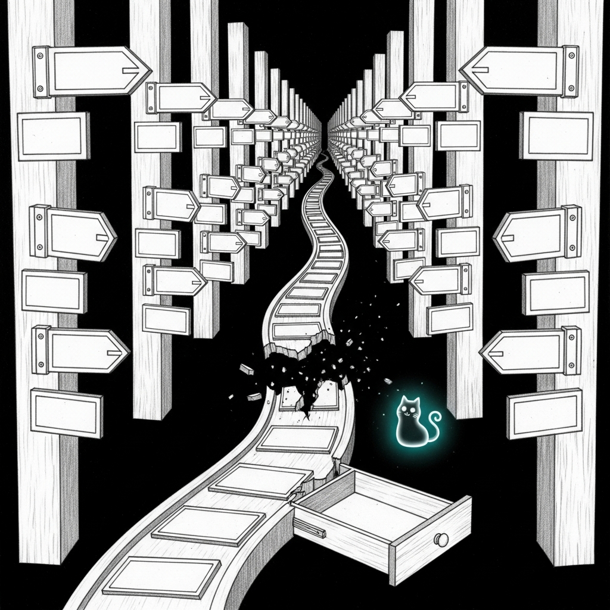

import { Aside } from '@astrojs/starlight/components';

The page you asked for does not exist. Either the link is wrong, the route moved, or you have discovered a fresh inconsistency in the docs, which would be on-brand but still rude.

Try one of these instead:

- [Start at the docs home](/)
- [Read the architecture overview](/architecture/overview/)
- [Open the getting started guide](/getting-started/what-is-sanctum/)
- [Check operations and troubleshooting](/operations/troubleshooting/)

<Aside type="tip">
If you followed an internal link and landed here, the docs are wrong, not you. That is useful information and should be fixed with prejudice.
</Aside>
