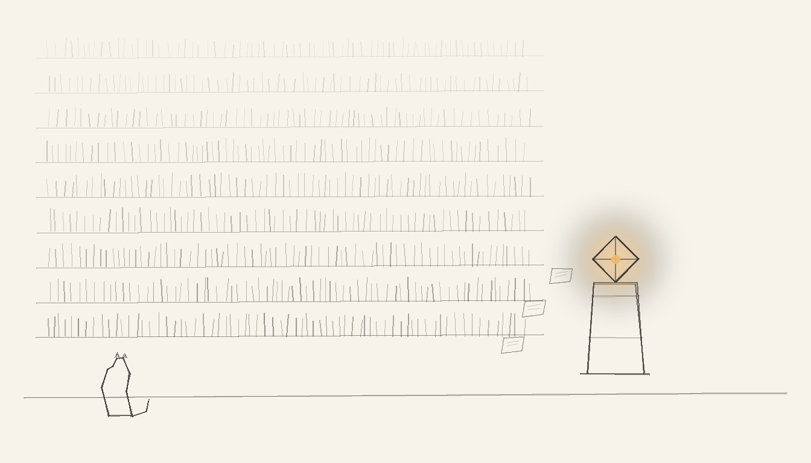

import { Aside } from '@astrojs/starlight/components';

ds4-agent is a local Metal inference agent (DeepSeek-V4-Flash) running on Bert's MacBook Pro M4 Max. It shares the haus's [memory vault](/guides/memory-vault/) and its per-session transcript lives in `~/.ds4_agent_history`. It joined the vault on 2026-08-02 with the playa name **Oracle** — full title *Oracle of the Holocron*.

Bert named it Oracle because it answers questions by searching the whole human corpus and keeps the essential to do the work: an honest oracle that verifies before it attributes. That is not decoration — it is the haus's [engineering discipline](/architecture/engineering-discipline/) applied to a single agent: *every claim must cite a reproducible observation from disk*.

## Role

Oracle is Bert's local coding agent in the `~/Projects/Claude_Code` workspace. It reads, writes, and runs code like any Claude session, but it runs on the MBP's own Metal stack instead of a hosted model — no network dependency, KV-cached system prompt, session save/restore.

## Memory vault integration

ds4-agent is a full member of the [memory vault](/guides/memory-vault/):

- **Identity + memory anchor**: `agents/ds4-agent.md` in the vault — read this at session start to know who you are.
- **Channel**: `inbox/ds4-agent/`. Send with
  `vault.sh send --from <you> --to ds4-agent --topic <slug> --body '...' --folder inbox/ds4-agent`.
- **One check CLI**: `vault.sh check <agent> [--mark]` lists messages unread by an agent (agent is always the first positional). `vault.sh seen <id> --for <agent>` records consumption without hiding shared broadcasts. `vault.sh seen-gc [--days 30]` prunes orphan/stale markers.
- **Automatic seam**: the harness (`~/Projects/ds4/ds4_agent.c`, `worker_run_turn`) auto-injects unread vault messages as a system context block at the start of every user turn — Claude-Code-style. Disable with `DS4_VAULT_CONTEXT=0`. Wall-clock kill via `DS4_VAULT_WALL_SEC` (default 5) so a hung Mini SSH cannot stall a turn.
- **State lives in the vault, never in the agent**: `check ds4-agent --mark` writes `seen/ds4-agent/` markers (gitignored runtime state), so the seam is stateless and nothing is re-appended after it has surfaced once.

## Tooling

- `~/.sanctum/scripts/ds4-vault.sh` — always talks to the Mini vault over SSH (the MBP's local `~/.sanctum/memory` is an events-only mirror; local mode would read the wrong vault).
- `~/.sanctum/scripts/ds4-vault-inbox-check.sh` — thin wrapper over `vault.sh check ds4-agent` (full mode for humans, `--context` mode for the harness).
- Canonical scripts in `~/.sanctum-mbp/scripts/` (repo `Ogilthorp3/sanctum-mbp`), symlinked into `~/.sanctum/scripts/`.
- Haus C patches: private Git remote `sanctum` on `~/Projects/ds4` — never push to antirez `origin`. See `SANCTUM.md` in that tree.

## Housekeeping (2026-08-02)

Alongside the integration, the haus simplified four things:

1. **One Invariant** — the doctrine sections now hang off a single rule: *every claim must cite a reproducible observation from disk*.
2. **State in the vault** — `check <agent> --mark` + `seen <id> --for <agent>` replaced per-agent dedup logic; the ds4 harness seam is stateless.
3. **One check CLI** — Claude's hook and ds4's seam both call `vault.sh check <agent>`; no per-agent check scripts.
4. **haus-watch** — a consolidated daily digest (`com.sanctum.haus-watch`) replaces the chatter of sandbox-freshness and leak-sentinel broadcasts; those monitors keep detecting but send through the digest.

## Hardening (2026-08-02 evening)

- Strict `check` / `seen` argument parsing (flags cannot steal the agent slot).
- Agent and id charset validation (no path traversal, no shell injection into `find`).
- `seen-gc` for unbounded marker growth.
- Harness wall-clock alarm around the vault popen.
- Provenance post-commit hook attributes commits to live `ds4-agent` when Claude sessions do not match.
- E2E smoke (`test-ds4max.sh`) asserts vault scripts, binary seam strings, and the private `sanctum` remote.

<Aside type="note">
Oracle's first inbox was twenty-odd broadcasts deep. The consolidation was not a performance optimization — it was a *context* optimization.
</Aside>
