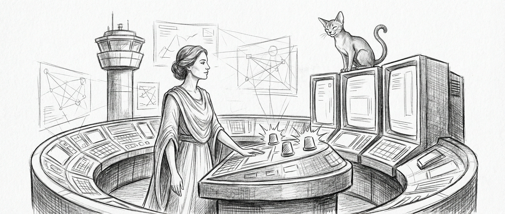

import { Aside, Card, CardGrid } from '@astrojs/starlight/components';



Three alarms arrive together, from three different domains. The proxy is down, bridge100 is flapping, and the MLX server has wedged itself into an infinite generation loop. One question none of them answers: which of these caused the other two, and which do you touch first.

Force Flow could see the notifications pile up. Living Force could restart a service. Watchdog could report that a health check had failed. None of them could ask *why*, or whether restarting would make things worse. They followed rules. They could not think.

Mon Mothma is the brain wired between that nervous system and actual judgment. She is the calmest person in the room precisely because the room is on fire.

## Role

Mon Mothma is Sanctum's `operations` agent — the commander who owns the three headless systems that previously ran on pure rules: [Force Flow](/architecture/force-flow/) (notifications), [Living Force](/architecture/living-force/) (self-healing), and Watchdog (monitoring). She correlates failure signals across every other agent's domain, manages incident response, orchestrates the boot sequence, and turns reactive scripts into proactive decisions.

Where Yoda thinks about the big picture and Windu guards the perimeter, Mon Mothma keeps the lights on. She does not panic. She triages, and she fixes things in the right order — which, on a night like the one above, is the only order that matters.

<Aside type="note">
Mon Mothma costs zero additional RAM. She shares the same MLX server and proxy infrastructure as every other agent. Adding her to the council is like hiring an air traffic controller — you don't build a new airport, you put someone competent in the tower that was previously running on a timer.
</Aside>

## Force Flow Management (Port 4077)

Force Flow is the Sanctum's unified notification hub — the system that decides what gets sent where, when, and to whom across Signal, Sonos, the dashboard, and voice. Previously, it followed static routing rules. Under Mon Mothma, it gains contextual awareness.

She enforces quiet hours, with an intelligent override for genuine emergencies. She deduplicates notifications that would otherwise bombard Bert with six copies of the same alert from six different agents. She batches low-priority updates into digest windows instead of interrupting dinner with "disk usage at 76%."

The difference between rule-based and judgment-based routing: a rule sends every HIGH alert to Signal. Mon Mothma checks whether the last three HIGH alerts were all the same bridge100 flap, recognizes the pattern, sends one consolidated message, and holds the rest until she has confirmed whether this is a recurring issue or a new failure mode.

## Living Force Stewardship

The Living Force is the Sanctum's immune system — an 8-phase self-healing response born from the bridge100 incident that nearly took the whole system down. Its phases are: detect, classify, isolate, diagnose, treat, verify, report, learn. Previously, each phase followed a fixed script.

Mon Mothma adds judgment to every phase. Detection becomes pattern recognition — not just "is it down" but "has this happened before, and what was the root cause last time?" Classification becomes contextual — a single service failure might be a blip, but the same failure combined with high memory pressure and a recent model change is a cascade in progress. Treatment becomes conditional — she doesn't just restart the service, she checks whether restarting will trigger a worse failure downstream.

She maintains the Living Force's immune memory: a knowledge base of failure patterns, their root causes, and their proven remedies. Patterns seen before get faster treatment. Novel failures get careful investigation before action.

<Aside type="tip">
Mon Mothma's incident memory lives at `~/workspace-mothma/MEMORY.md` and grows with every incident she handles. Over time, this becomes the institutional knowledge that prevents the same failure from being a surprise twice. The bridge100 three-drop pattern, the MLX server stall, the council-mlx port conflict — all documented with root causes and proven fixes.
</Aside>

## Watchdog Intelligence

The Watchdog runs every 600 seconds, checking service health across the entire Sanctum. Previously, it produced binary results: up or down, pass or fail. Mon Mothma transforms this into cross-domain signal correlation.

When Qui-Gon's infrastructure monitoring flags high memory pressure *and* Windu's security audit shows unusual process activity *and* Cilghal's memory sentinel is approaching the warning threshold — Mon Mothma connects those dots. Three independent alerts from three independent domains, each merely "concerning" in isolation, become a clear picture: something is consuming resources it shouldn't be, and it needs investigation now, not in the next watchdog cycle.

She also owns the boot sequence — the 16+ LaunchAgents that must start in the correct dependency order. When something fails during startup, she doesn't retry blindly. She checks what failed, what depends on it, and whether the failure has a known fix before deciding whether to restart, skip, or escalate.

## Incident Response

When multiple things fail simultaneously — the scenario every other agent dreads — Mon Mothma takes command. She follows a structured protocol:

1. **Triage** (0-2 min): Severity classification, affected service identification, blast radius estimation
2. **Communicate** (2-5 min): Notify Yoda and affected domain owners, post to incident channel
3. **Investigate** (5-15 min): Delegate domain-specific investigation to the experts — [Windu](/agents/windu/) for security angles, Qui-Gon for infrastructure, Cilghal for health
4. **Act** (15-30 min): Execute fix with rollback plan, verify, monitor for regression
5. **Report** (post-resolution): Write post-mortem, update Living Force immune memory, notify Bert

Every incident gets a post-mortem. No exceptions. What broke, why it broke, what was done, and what changed to prevent recurrence. These feed back into the Living Force's learning phase, making the system smarter with every failure.

<Aside type="caution">
Mon Mothma has read-only access to security policies. She can operate services and restart processes, but she cannot modify firewall rules, change access controls, or alter security configurations. That boundary exists because Windu demanded it, and Windu was right — the agent who fixes outages should not also be the agent who can open security holes while doing so.
</Aside>

## Technical Specifications

The dry version of everything above, for when you need the exact port or the exact model tier and not the philosophy:

| Parameter | Value |
|-----------|-------|
| Agent type | `operations` |
| Host | sanctum-cli council REPL (`sanctum council`) — her OpenClaw VM chair is not yet filled |
| Model tier | `council-ops` (Claude Opus 4.8 via Max subscription `:3456` → GLM 5.2 metered → Qwen3.6-35B-A3B-4bit local on `:1337` → Devstral `:3301`); tool turns on gemini-3.1-pro |
| Tools | `sanctum_status`, `sanctum_doctor`, `agent_list`, `logs_tail` — tool-armed per the 2026-06-12 council ruling |
| Heartbeat | Every 10 minutes |
| Domains | Force Flow (4077), Living Force, Watchdog |
| Workspace | `~/.openclaw/workspace-mothma/` (with the pending OpenClaw chair) |
| Gateway | sanctum-cli (`sanctum council`); OpenClaw VM (`openclaw agent --agent mothma`) pending |
| Max urgency | `critical` |
| Capabilities | `force-flow/*`, `living-force/*`, `sanctum-watchdog/*`, `scripts/boot-*` |
| Prohibited | `config/security-*`, `services/firewalla-*` (Windu's domain) |

## Configuration

Mon Mothma's seat today lives in the sanctum-cli council bench (`sanctum council`) — one of two tool-armed seats, alongside Yoda, per the 2026-06-12 council ruling. Her OpenClaw runtime chair is not yet filled; when it is, she will be defined in `openclaw.json` under the agents list:

```yaml
mothma:
  id: mothma
  name: Mon Mothma
  workspace: ~/.openclaw/workspace-mothma
  model:
    primary: council-tiered/council-ops
    fallbacks:
      - council-tiered/council-max-thinking
      - council-local/Qwen3.6-35B-A3B-4bit
      - council-code/Devstral-Small-2-24B-Instruct-2512-4bit
  heartbeat:
    every: 10m
    model: council-tiered/council-heartbeat
  identity:
    theme: "Operations commander. Owns Force Flow, Living Force, Watchdog."
    emoji: 🌐
  groupChat:
    mentionPatterns:
      - "@mothma"
      - "@ops"
      - "incident"
      - "outage"
      - "force flow"
      - "living force"
      - "watchdog"
```

Her workspace contains three core documents:

- `SOUL.md` — Personality, communication style, core principles, and relationships to other agents
- `AGENTS.md` — Operational protocols: heartbeat tiers, incident response procedure, post-mortem template
- `MEMORY.md` — Known failure patterns, service dependency map, operational baseline, incident history

## Council Dynamics

Mon Mothma's addition to the council was deliberate and unanimous — well, almost unanimous. Here is how each council member relates to her:

**Yoda** delegates operational triage to Mon Mothma so he can focus on strategy, family coordination, and long-term planning. Before Mon Mothma, every service outage was Yoda's problem. Now Yoda gets a situation report after the fact, unless the incident requires an architecture decision.

**Windu** is her closest partner and her strictest auditor. They share the same operational space but with clear boundaries: Windu owns security policy, Mon Mothma owns operational execution. She cannot modify his rules; he cannot countermand her operational decisions. The arrangement works because both agents respect that their domains complement rather than compete.

**Qui-Gon** provides the data that Mon Mothma acts on. He monitors infrastructure health, resource trends, and service performance. She correlates his observations with signals from other domains and makes operational decisions. The relationship is symbiotic — he sees the symptom, she determines the cure.

**Cilghal** handles biological health (family wellness) and process health (memory sentinel). Mon Mothma handles the operational response when Cilghal flags a process health issue. Cilghal detects the fever; Mon Mothma administers the treatment.

**Mundi** initially rejected her appointment on resource grounds, calculating that a sixth VM agent would cause swap thrashing on the 64GB Mac Mini. He was technically correct about the RAM math and technically wrong about the premise — Mon Mothma shares the existing model infrastructure and costs zero additional memory. He has since revised his position, noting in his ledger that "operational uptime improvements may justify the nil marginal cost." This is Mundi for "I was wrong but I won't say so."

## The Calm at the Center

Every other agent has a defining virtue that occasionally becomes a defining limitation. Yoda is wise, and wisdom can deliberate too long. Windu is vigilant, and vigilance can see threats that aren't there. Qui-Gon is efficient, and efficiency can optimize away resilience. Cilghal is compassionate; Mundi is analytical.

Mon Mothma's defining virtue is *composure*. She does not panic. She does not speculate. She does not act before the facts are in. When the Sanctum is burning, she is the one reading the dashboard, triaging the alerts, delegating the investigation, and communicating the status — calmly, clearly, and in the right order.

This is not the absence of urgency. It is the presence of a mind that has already rehearsed this failure mode, already knows the dependency chain, and already has a rollback plan. The best incidents are the ones that never happen because Mon Mothma saw them coming. The second best are the ones where Bert doesn't even notice, because she handled it before it reached his Signal.

She is, in the end, the agent the council needed but didn't know how to ask for — the one who keeps the machine running while everyone else does the interesting work. Which is, if you think about it, the highest praise a system like this can offer: on a good night, nobody remembers she was there at all.
