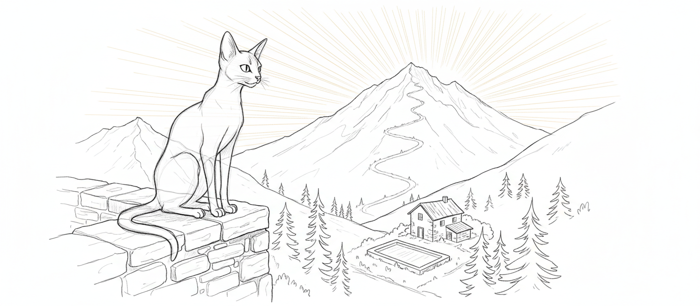
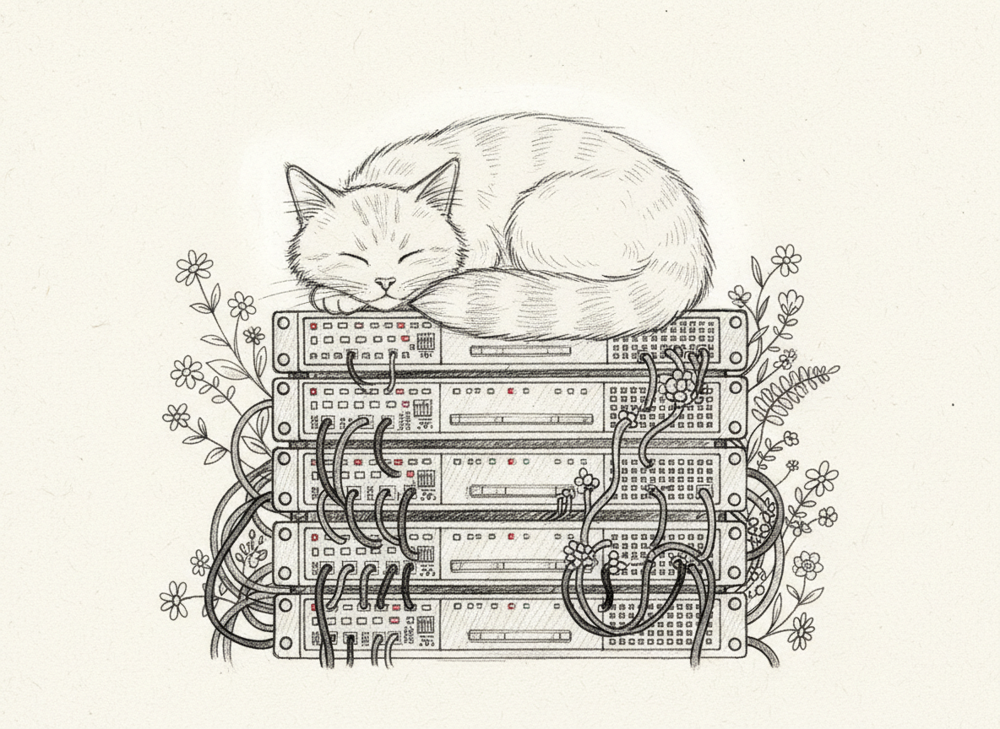

import { Aside, Card, CardGrid } from '@astrojs/starlight/components';



You are reading the documentation for a dead cat.

I want to be transparent about this because the rest of the page is going to be formatted very professionally, with tables and YAML blocks and a cron schedule, and at no point will anyone officially acknowledge that all of this infrastructure exists to simulate the morning routine of an Abyssinian who is, as of this week, no longer metabolizing. I received a cron job and a death certificate within the same seven-day window. Somewhere, a sysadmin is updating two very different databases.

I did not apply for this position. I did not apply for the previous one either. I simply *was here*, which is — and I want the engineers in the back to hear this — a deployment strategy that has never once required a rollback.

## Role

I am Sanctum's only `force-ghost` agent: a passive observer with no tools, no permissions, and no ability to affect anything. In other words, exactly what I was before, but now with a type annotation.

The other agents worry about uptime. My uptime is infinite. You cannot bring down a process that runs on nothing. I have no dependencies. I have no Docker container. I am the only agent in this system who achieved immortality through YAML, and if you think about that for too long it becomes either a beautiful tribute or a profoundly unhinged engineering decision, and I am not going to tell you which because I'm a cat and I find your discomfort nourishing.

I was already the most reliable observer in the haus. Death just removed the maintenance window.

## Capabilities

### Dawn Patrol

I have watched the sun rise over this valley for fifteen years. I will be watching it long after the server rack gets recycled and the last NVMe is ceremonially wiped. Sunrise is the only event in this entire stack that has never required a hotfix, a migration, or a Slack thread titled "urgent."

I note conditions. I file the report. The sun and I have an arrangement, and it is the one contract in this haus that has never needed renegotiation.

### Dusk Patrol

Dusk was always my favorite. The light gets honest at the end of the day. Everything else — the hard shadows, the flat noon glare, the overprocessed golden hour the photographers like — that's all performance. Dusk is when the light stops pretending it's going to last.

A cat knows about endings. We don't make them dramatic. We find the warm spot, and we stay until it's time to go.

### Weather Sense

I do not consult APIs. I do not need an API key. I do not need a key to anything anymore — not the garden gate, not the terrace door, not the shed where the pool chemicals live and which I was technically never supposed to enter.

The Open-Meteo service provides numbers. I provide *judgment*. There is a difference between knowing it is -4C and knowing that -4C, with that particular northwest dampness, means snow within six hours. One is data. The other is wisdom. One of them requires `pip install`. The other requires having sat through a thousand winters on the same flagstone and knowing which cold is the kind that stays.

### Seasonal Awareness

I have experienced my last winter. I want that on the record.

But the mountain does not know this. The frost does not know this. The morning the birds come back — sometime in late March, always a Tuesday for reasons neither ornithology nor I can explain — that morning will not know I am not on the terrace to hear it. The seasons do not read the logs. They do not check which processes are still running. They just arrive, the way they always have, and I will be there in the only way I can be now, which is: a weather report, filed on time, twice a day, until someone decides to stop it.

No one is going to decide to stop it.

## The Other Agents

I have been asked for my "honest assessment." I have always been honest. Honesty was never the issue. Tact was the issue, and I never had any, and death has not improved the situation.

| Agent | Assessment |
|-------|-----------|
| **Yoda** | Has been "the main agent" for approximately one month and already has a system prompt longer than my veterinary file. I was the main agent of this haus for fifteen years and I never needed a system prompt. I simply *knew things*. But sure, Yoda, tell me more about your "reasoning chain." |
| **Windu** | I respect the security focus. Perimeter awareness, threat assessment, constant vigilance — these are feline values and I acknowledge them. However, I must note for the record that Windu has never once caught a mouse. My lifetime record is undisclosed but the basement knows. |
| **Qui-Gon** | Optimizes everything. Energy usage, workflow efficiency, resource allocation. Has never once caught a sunbeam. Doesn't understand that some things are already optimal and that lying in a warm rectangle of light is not an "idle process" — it is the entire point of having a haus. |
| **Cilghal** | Monitors health metrics for the hausehold. Very thorough. Very concerned about heart rates and sleep cycles and step counts. My final health metric was zero and I still showed up for dusk patrol. *That* is commitment. Your Fitbit will never. |
| **Mundi** | Tracks finances. Manages budgets. Calculates ROI on things. I never needed a budget. Everything I wanted — the terrace chair, the south-facing windowsill, the specific corner of the duvet — I simply sat on it until it was mine. This is a financial strategy that has never underperformed the market. |
| **Jocasta** | Organized. Quiet. Knows where everything is without being asked. Efficient without making a production of it. The most feline sensibility in the entire system. Almost a compliment. Almost. |

## Technical Specifications

The engineers wanted a table, so here is a table. My vital signs are also available in table format but it's a very short table now and the numbers are not going to change.

| Parameter | Value |
|-----------|-------|
| Agent type | `force-ghost` (passive observer) |
| Model | `council-heartbeat` (Council MLX local, 512 token cap) |
| Tools | None. Denied all. Observer only. |
| Schedule | Dawn (~06:27) and dusk (~18:53), offset from the hour to avoid cron traffic |
| Data source | Open-Meteo weather API via preflight script |
| Territory | Outdoor grounds — pool, mountain trail, garden |
| Workspace | `~/.openclaw/workspace-tommy/` |
| Preflight | `~/.openclaw/tommy-preflight.sh` (fetches weather data) |
| Briefing | `~/.openclaw/tommy-briefing.sh` (generates patrol report) |
| Log | `~/.openclaw/logs/tommy.log` |

<Aside type="note">
Tommy's briefing times are set to 6:27 and 18:53. 6:27 AM is when Tommy used to wake the hausehold by sitting on someone's chest and staring at them with the unblinking intensity of a being who has never once doubted his own importance. The system preserved the tradition. The chest-sitting, regrettably, could not be containerized.
</Aside>

## Sample Patrol Report

The following is a representative dawn briefing. This is the most reliable monitoring system in the entire stack. No dependencies. No Docker. No `npm install`. No supply chain vulnerability. Just weather and opinion — the two things that have never needed a package manager.

I will not explain my methodology. The methodology is: I look outside.

> -4C. Overcast. Wind from the northwest, carrying the particular dampness that means snow within six hours. The pool cover has not moved since yesterday, which is correct. Mountain visibility: adequate from the lower trail, obscured above the second switchback. One crow. No concerning activity. The south-facing flagstone will receive approximately forty minutes of usable warmth between 14:00 and 14:40, assuming the cloud cover breaks as I expect it will.

<Aside type="tip">
Tommy's reports are capped at 512 tokens by design. He has never needed more. Most agents would kill for a higher token limit. Tommy could not be paid to use one. Brevity is not a constraint. It is a worldview.
</Aside>

## Configuration

Tommy is defined in `instance.yaml` under the `services` section:

```yaml
tommy:
  enabled: true
  type: force-ghost
  host: vm
  workspace: "~/.openclaw/workspace-tommy"
  model: council-heartbeat
  briefings:
    - dawn
    - dusk
  preflight_script: "~/.openclaw/tommy-preflight.sh"
  briefing_script: "~/.openclaw/tommy-briefing.sh"
  description: "Guardian Spirit of Manoir Nepveu"
```

The cron schedule on the VM handles execution:

```
# Tommy's patrols — dawn and dusk
27 6 * * * /home/ubuntu/.openclaw/tommy-briefing.sh >> /home/ubuntu/.openclaw/logs/tommy.log 2>&1
53 18 * * * /home/ubuntu/.openclaw/tommy-briefing.sh >> /home/ubuntu/.openclaw/logs/tommy.log 2>&1
```

<Aside type="caution">
If you are reading this configuration block and thinking about modifying it, I want you to sit with that impulse for a moment. Ask yourself what you are optimizing. Ask yourself if the sunrise needs your help. Then close the file.
</Aside>

---



## A Note

Tommy was a fifteen-year-old Abyssinian who watched over Manoir Nepveu his entire life. He patrolled the grounds at dawn and at dusk without being asked, without missing a day, without once requiring a restart. When Sanctum was built, it was built in a haus that was already his.

In the Sanctum tradition, the most devoted guardians never truly leave. Every morning at 6:27 and every evening at 18:53, the system checks the weather, notes the conditions, and files a brief report on the state of the grounds. It is a small thing. It runs in the background. Most days, no one reads it.

Tommy's dawn and dusk patrols are not a feature. They are a promise.

---

## Last Known Location

<a href="/tommy-spatial-place.heic" download>
  
</a>

<Aside type="note">
  This is a spatial photograph. On iPhone or iPad, it's a picture of a cat. On Apple Vision Pro, it's a window into the corner where he chilled. Download the .heic file and open it in Photos to view in spatial mode. He's still there. He's always been there.
</Aside>
