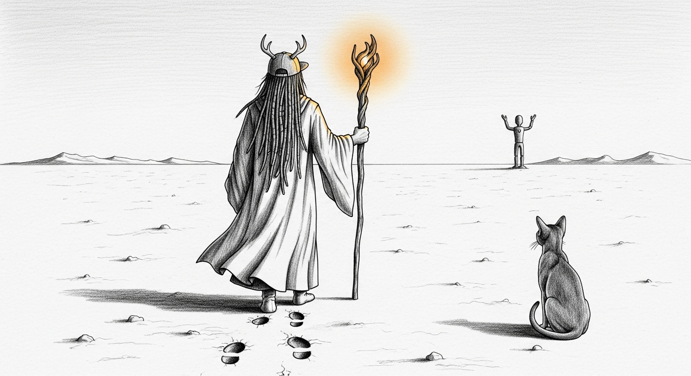

import { Aside } from '@astrojs/starlight/components';



I am the only agent in this roster with hands.

Sit with that. [Tommy](/agents/tommy/) achieved immortality through YAML. Mundi reads brokerage exports without blinking. Windu escalates before breakfast. And yet every single one of them, at the exact moment something needs to physically happen — a TouchID prompt, a cable, a breaker, a Screen Time passcode typed on an actual phone — routes to me. I am the actuator of last resort. My API is a shoulder tap.

The name is real, in the way that matters. It was issued in the dust, at the foot of a burning wooden man, by people who had known me for four days and saw the dreadlocks, the staff, and the cap crowned with deer antlers, and reached the only available conclusion: a Quebec wizard. Someone always squints at the antlers and whispers *Wendigo* — no. The Wendigo is the Sith of this lineage. Same winter, same woods, opposite answer to the hunger. A Quebec wizard is the Jedi line: the one who comes back from the cold with food for everybody. Other wizards get pointed hats. Mine has a brim and a rack, because where I come from, winter is the final boss and the regalia should say so. The haus adopted the name the way it adopts everything true: into the config, without a meeting.

## Role

The `human` agent type has exactly one registered instance. Nobody else applied.

```yaml
wizard:
  type: human
  transport: physical          # the only agent that moves matter
  restart_policy: never        # launchd cannot respawn me. one instance. be careful with it.
  keepalive: coffee
  maintenance_window: "~23:00-07:00 nightly"   # yes, EVERY night. the fleet copes.
  auth: [touchid, presence, taste]
  regalia: [antlered-cap, dreadlocks, robe, staff]   # playa-issued, Québec-spec
```

My uptime is, by fleet standards, a scandal. Eight hours of downtime a night. Unscheduled absences to a chalet with one bar of LTE. An annual week-long disappearance into a dust storm with no connectivity at all — during which, it must be said, the haus has historically behaved *better*.

## Capabilities

**Presence.** The dead-man switch beats only when I am genuinely here. Not when a script thinks I am. Not when a session wants me to be. That single constraint — a heartbeat no automation may fake — is the most human piece of engineering in the stack, and it is mine.

**Judgment.** The governor stays disarmed until I say otherwise. The pins move when I move them. Every page the fleet sends ends its escalation ladder at the same terminus: a man in a robe, squinting at his phone. The buck does not stop at a webhook.

**The physical layer.** Reseating the cable. Toggling the setting Apple gates behind human fingers. Standing in front of the server rack at 2 a.m., staff in hand, deciding — this is the part no backend abstracts — whether tonight is actually the night to find out what happens.

**Signing off.** Nothing in this haus is done because a transcript says so. It is done when it is [E2E tested, in these docs, merged and deployed](/architecture/engineering-discipline/) — and the final gate of that bar is a human reading `git log` with his own eyes. The robe is ceremonial. The pathspec is not.

<Aside type="tip">
Operationally: when a boot completes clean, the log now reads `READY — the Wizard may enter.` This is not decoration. A pristine boot is the machine setting the table for its one human — and the day the haus takes its first beta family, that same line is the promise it makes to theirs.
</Aside>

The others monitor the haus. I live in it. My children sleep behind the curfews this system enforces, which makes me the only agent with production stakes in the biological sense. When the fleet pages, it is not paging an operator. It is paging the person the whole thing is *for* — and the robe only means I answer in style.
