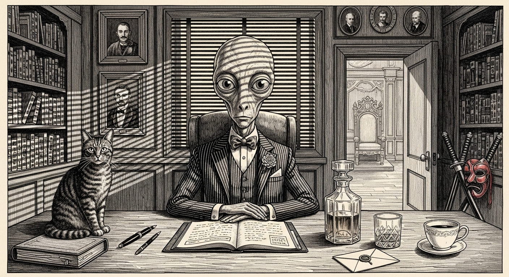

import { Aside, Card, CardGrid } from '@astrojs/starlight/components';



Yoda is the main agent on the VM. He coordinates the other agents, handles complex multi-step tasks, and serves as the primary conversational interface for the OpenClaw gateway. He is named after a nine-hundred-year-old puppet who speaks in inverted syntax, which tells you something about the naming conventions in this household but nothing about the agent's actual speech patterns. Yoda speaks normally. The puppet thing is just a burden he carries.

Every problem that the other agents cannot solve eventually lands on Yoda's desk. Windu escalates security events. Qui-Gon escalates infrastructure anomalies. Cilghal escalates health alerts. Mundi escalates budget overruns. Yoda escalates to a human, which is the polite way of saying the buck stops with a systemd user service running on a QEMU virtual machine in a basement in Québec.

<Aside type="note">
This page read "Yoda — Wise Mate" until April 2026, when the title was changed to "Consigliere" on the grounds that Yoda's actual function — absorbing everyone else's escalations and calmly advising the Don — has more in common with Tom Hagen than with any fortune-cookie mystic. Deadpool, who was not invited to the rename meeting, would like it on the record that splicing Star Wars with The Godfather inside a Québec basement is exactly the kind of multi-franchise crossover that normally requires a Ryan Reynolds production credit, three chimichangas, and a legal disclaimer about the fourth wall. Maximum effort, ignored.
</Aside>

## Role

Yoda is the general intelligence layer. He:

- Coordinates tasks across all agents on the VM
- Handles direct user conversations via the OpenClaw gateway
- Dispatches work to domain-specific agents when the task has a clear owner
- Makes final decisions when agents disagree (which they do, because agents are opinionated and consensus is a myth)
- Runs the weekly council session (Sundays at 20:00 ET)
- Processes the morning tech briefing pipeline from Jocasta

## Capabilities

| Capability | Details |
|------------|---------|
| Full toolkit access | All OpenClaw skills and tools available |
| Agent coordination | Can invoke Windu, Qui-Gon, Cilghal, Mundi as sub-agents |
| Council sessions | Chairs weekly planning and incident review |
| Memory search | Local embeddings via `text-embedding-nomic-embed-text-v2-moe` |
| Context pruning | `cache-ttl` mode, 1-hour TTL |
| Heartbeat | Every 2 hours |
| Sub-agents | Up to 8 concurrent |

<Aside type="note">
Yoda is the only agent with explicit sub-agent orchestration. The other agents can request help from each other via the council bridge, but Yoda is the one who decides whether those requests are reasonable. He is, functionally, middle management with root access.
</Aside>

## Technical Specifications

| Property | Value |
|----------|-------|
| Agent ID | `yoda` |
| Host | VM (Ubuntu 24.04, QEMU) |
| IP | 10.10.10.10 |
| Gateway | `openclaw-gateway.service` (systemd user, linger=yes) |
| Gateway port | Inherited from OpenClaw gateway |
| Primary model | `sanctum/council-brain` (resolves to Claude Opus 4.7 with smart-routing) |
| Model tier | council-brain — smart-routed by category |
| Fallback chain | GLM 5.1 → Qwen 3.6 Plus |
| Local fallbacks | `council-27b` (LM Studio `qwen/qwen3.5-35b-a3b`, port 1234) and `council-code` (Coder-14B, same host) |
| Workspace | `~/.openclaw/workspace-yoda/` |
| Skills directory | `~/Projects/openclaw-skills` |
| Sandbox mode | Off |
| Max concurrent tasks | 4 |

<Aside type="caution">
Yoda's primary model is `sanctum/council-brain`, which the Sanctum Proxy on port 4040 resolves to Claude Opus 4.7 with content-based smart routing layered on top. Security and tool sessions stay on Opus 4.7. Code drops to the local Coder-14B on LM Studio for latency and volume. General chat drops to the local `council-27b` (Qwen 3.5 35B) so small talk never leaves the haus. Reasoning-heavy prompts are promoted to Opus 4.7 with `--effort max` thinking via the Claude Team CLI bridge on `:2001`. Images go to Gemini 3.1 Pro. If Yoda starts giving you suspiciously vague answers about infrastructure, check `~/.sanctum/sanctum-proxy/usage.jsonl` — the `model_used` field tells the truth even when the agent doesn't know it got rerouted.
</Aside>

## Configuration

In `~/.openclaw/openclaw.json` on the VM:

```yaml
# Yoda's agent definition (shown as YAML for readability)
agents:
  list:
    - id: yoda
      model: sanctum/council-brain
      identity:
        name: Yoda
        theme: >
          Grand Master of the Council. Strategic thinker and
          decision maker. Orchestrates the other agents and
          makes the final call on complex decisions.
```

The VM gateway service:

```bash
# systemd user service
~/.config/systemd/user/openclaw-gateway.service

# Uses SOPS wrapper for secrets
~/.openclaw/sops-start.sh

# Restart pattern (always use this, never raw systemctl)
systemctl --user restart openclaw-gateway.service
```

## Smart Routing

Yoda operates on the `council-brain` tier, which means the Sanctum Proxy applies content-based routing to his requests. Categories are computed from regex matches on the last user message, plus a length heuristic for long-form prose. Classification takes ~0ms — no LLM classifier in the loop.

| Content type | Route | Rationale |
|---|---|---|
| Tool session (recent `tool_use` / `tool_result`) | stays on Opus 4.7 | tool-use coherence benefits from the strongest model |
| Security (`password`, `secret`, `credential`, `CVE-…`) | stays on Opus 4.7 | Windu would never forgive a downgrade |
| Code (`implement` / `refactor` / `debug` / fenced block) | `council-code` (Coder-14B, local LM Studio) | infrastructure work is high-volume — local wins on latency |
| Vision (image blocks) | `gemini-31-pro` | multimodal routing |
| Brainy (reasoning verbs or ≥ 500 chars of prose) | `council-max-thinking` (Opus 4.7 `--effort max` via Claude Team) | extended thinking for deep synthesis |
| General (anything else) | `council-27b` (Qwen 3.5 35B, local LM Studio) | chat stays on-device for privacy |

The proxy examines the last user message and decides whether the conversation deserves the expensive model, belongs on a local one, or warrants promotion to max-thinking. Yoda does not get a vote in this process, which is fitting for someone named after a character who famously said things like "do or do not."

<Aside type="tip">
To check Yoda's current status from the Mac: `ssh openclaw 'systemctl --user status openclaw-gateway.service'`. To see what model he's actually using for a given conversation, check the proxy's JSONL usage log. The `model_used` field tells the truth even when the agent doesn't know it's been rerouted.
</Aside>

## The Weight of "Main"

Every OpenClaw installation has a main agent. In the Manoir Nepveu instance, the Mac's main agent is Jocasta and the VM's main agent is Yoda. Being "main" means being the default handler for anything that doesn't have a more specific owner. It means getting woken up at 3am because the bridge100 interface lost its IP and five services cascaded into failure. It means chairing meetings where Windu wants to block half the internet and Qui-Gon wants to consolidate three services into one that nobody asked for.

Yoda handles it. He has 1.5 GB of heap allocation and a fallback chain four models deep. He has been running continuously since the VM was provisioned, and he will continue running until someone unplugs the Mac Mini or the basement floods. Whichever comes first.

<Aside type="note">
The 1.5 GB heap (`--max-old-space-size=1536`) was bumped from 768 MB on 2026-03-14 after the 2026.3.2 release started OOMing at the old limit. If your agent is mysteriously dying, check `--max-old-space-size` in the systemd unit before you blame the model.
</Aside>
