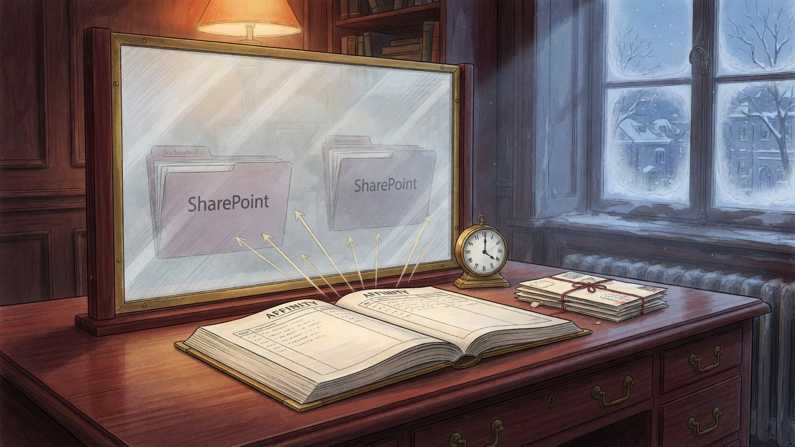

import { Aside } from '@astrojs/starlight/components';



Affinity is the fund's CRM source of truth. Native SharePoint sync is **Affinity → SharePoint only**, and it copies files **uploaded** to a company record — not "found in your email", not Granola, not LinkedIn.

`tq` is the only writer. This job runs on the MBP. It is **work-lane**: the Affinity key lives in `work-cli` / `tq secrets`, never in haus SOPS or Power Automate.

**Date:** 2026-08-15 · **Status:** Active · **Host:** MBP · **Repo:** `~/Projects/work-cli`

## What runs unattended

| Job | When | Writes |
|---|---|---|
| `vc.work.file-mail` | every 2 hours (Aqua) | `file-mail --all` then `file-notes --all` |
| `vc.work.weekly-brief` | Friday 16:07 | `reminders --execute`, then a read-only digest |

Live paths are **symlinks into the repo**. Wrappers source `launchd/tq-repo.sh`, which puts `$REPO/src` on `PYTHONPATH` and refuses to run if `import triptyq` is another git worktree. The shared `.venv` is not the SoT — see [The venv that ran main](/operations/2026-08-15-the-venv-that-ran-main/).

```bash
launchd/test-file-mail            # named smoke: pin + --all + file-notes exist
tail -f ~/.openclaw/logs/triptyq-file-mail.log
launchctl print gui/$(id -u)/vc.work.file-mail
```

## What each command will and will not file

**`tq affinity file-mail`** — attachments. Permanent (v1 entity-files has no delete). Idempotent by filename. Refuses images, fund-level packs, payroll/HR.

**`tq affinity file-notes`** — notes. Deletable. Material subject required. Calendar accepts, intros and HR refused. Four partners forwarding the same update is one note. Granola meetings whose title names the portco are filed once per meeting id.

**LinkedIn** stays the Chrome/Safari extension. No unattended scrape.

**`tq affinity writeback --execute`** is a human button after tearsheet curation. Not on a timer.

**`portcosync`** writes Jocasta DuckDB only. It is not the CRM.

<Aside type="caution" title="Two lanes">
A haus chapter may describe the job. It may not hold the key. Power Automate Free cannot call Affinity and must not be given the work-lane secret so it can.
</Aside>

## EETISMAD

| Letter | Meaning here |
|---|---|
| **E**verything **E**2E **T**ested | `launchd/test-file-mail` green; local CI (ruff, mypy, 913 tests); live `~/.triptyq/bin/file-mail` exit 0 |
| **i**n **S**anctum-**d**ocs | This page + sidebar + the 2026-08-15 field note |
| **M**erged | `work-cli` `9842790` on `origin/main`; this chapter on `sanctum-docs` `main` |
| **A**nd **D**eployed | Plist + wrapper are repo symlinks; consumer verified through `~/.triptyq/bin/file-mail` |

Operator detail for partners lives in the work repo: `work-cli/docs/02_workflows/09_affinity-filing.md`.

## Related

- [Sanctum CRM](/architecture/crm-architecture/) — the haus archive wall (DuckDB). Different store.
- [Dealflow Intelligence](/architecture/dealflow-intelligence/) — pipeline list, not portco files
- [Engineering Discipline](/architecture/engineering-discipline/) — the shipping bar
- [The venv that ran main](/operations/2026-08-15-the-venv-that-ran-main/) — why the wrapper pins `src`
