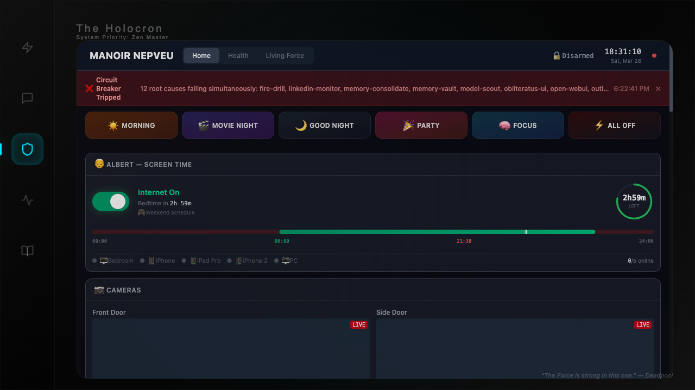

import { Card, CardGrid, Aside } from '@astrojs/starlight/components';

The Sanctum Council is a collective of specialized AI agents. They are distributed across the infrastructure to ensure that if the power goes out in Tokyo, the house in Québec can still decide which lightbulbs to turn on at sunset.

## OpenClaw Council (VM)

These agents live within the Ubuntu VM. They handle the high-logic tasks and the orchestration of the system's more complex dependencies.

<CardGrid>
  <Card title="Yoda" icon="star">
    **Grand Master**
    The senior lead of the Sanctum Council. Yoda provides high-level orchestration, wisdom, and guidance for the entire agent roster. He handles council routing, final synthesis of complex decisions, and the daily "Morning Briefing" digest. He remains the ultimate authority on whether a raccoon constitutes a security breach.
  </Card>
  <Card title="Mon Mothma" icon="rocket">
    **Operations**
    The orchestrator of Force Flow and Living Force. Mothma manages incident correlation, boot sequences, and ensures the cross-domain signals don't contradict each other at 4 AM.
  </Card>
  <Card title="Qui-Gon" icon="setting">
    **Infrastructure**
    The guardian of the machine. Qui-Gon is responsible for system health, Docker stability, and automated recovery. He is why you don't have to SSH into the machine every time it rains.
  </Card>
  <Card title="Windu" icon="shield">
    **Security**
    The master of defense. Windu conducts security audits, manages Firewalla and PF rules, and monitors the perimeter. He has a very low tolerance for unauthorized packets.
  </Card>
  <Card title="Cilghal" icon="heart">
    **Health**
    The biological bridge. Cilghal monitors wellness via Apple Health data and biometrics. She understands the owner's cognitive profile and suggests scaffolding for optimal productivity.
  </Card>
  <Card title="Ki-Adi-Mundi" icon="document">
    **Finance**
    The treasurer. Mundi manages Triptyq Capital deal flow and personal fiscal health. He ensures the system's operating costs don't exceed the actual value of the automation.
  </Card>
</CardGrid>

## Satellite Council

<CardGrid>
  <Card title="Ahsoka" icon="external">
    **Satellite Outpost**
    Ahsoka manages the Chalet outpost. She handles local automation and offline resilience, ensuring that family comfort is maintained even when the internet isn't.
  </Card>
</CardGrid>

## DenchClaw (Mac Mini)

<CardGrid>
  <Card title="Jocasta" icon="open-book">
    **Archivist**
    The keeper of records. Jocasta handles CRM data and communications directly on the Mac Mini host. She is the system's memory of every deal and every decision.
  </Card>
</CardGrid>

## Interactive CLI Agents

These are the primary interfaces for human interaction with the Council.

- **Claude Code**: The primary development tool. It has deep MCP access to the Memory Vault and the ability to rewrite the system in minutes.
- **Gemini CLI**: The newest agent in the temple. Specialized in technical debt elimination, security audits, and ensuring the other agents haven't left artifacts in the shadows.

<Aside type="note">
The agents are not a hierarchy. They are a web. Each one is necessary, though some are significantly more expensive to run than others.
</Aside>

<Aside type="caution">
If an agent begins to hallucinate about the network topology, refer to the Service Graph immediately. The graph is truth; the agent is just a very confident guesser.
</Aside>

---

> "The Council is not a hierarchy, but a web. Each thread is necessary for the strength of the whole."
> — Yoda
