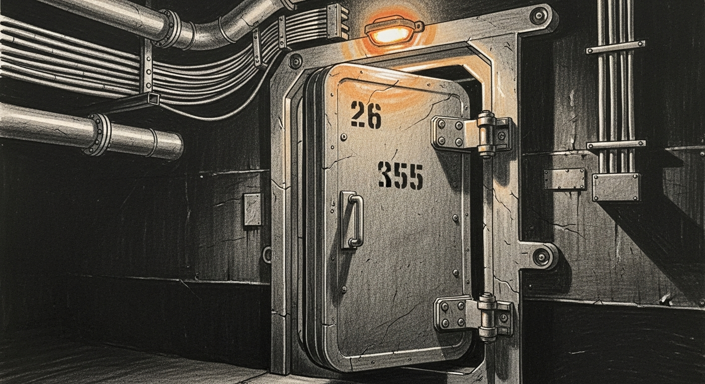

import { Card, CardGrid, Aside } from '@astrojs/starlight/components';



On 2026-04-23 the Mini kernel-panicked twice. On 2026-04-24 LM Studio stalled at 99 percent loading a model while the VM's qemu process sat SIGSTOP'd for two hours in silence. Different symptoms, same disease: multiple memory-heavy services competing for the same unified RAM pool with no admission control. Each service trusted the kernel to find it space. The kernel, overwhelmed, either panicked or paused at random. We discovered the ceiling by hitting it.

The Capacity Doctrine is the immune-system answer: refuse bad loads up front instead of reacting to failures downstream.

## Three Rules

<CardGrid>
  <Card title="Rule 1: Declare your weight" icon="document">
    Every heavyweight service has a `ram_budget_mb` number in `~/.sanctum/capacity.yaml`. No budget, no admission. The number is measured with `vmmap --summary` at peak inference, then rounded up. A false refuse is strictly cheaper than an OOM freeze.
  </Card>
  <Card title="Rule 2: Admission controller gates every load" icon="approve-check">
    `sanctum-admit` on port 2189 computes `free = pool − Σ(loaded.budget)` from a live `ps` scan. Loading a service is admitted only if `new.budget ≤ free` AND none of its `exclusive_with` neighbours are currently loaded. Refusals return HTTP 409 with the blocking service name and the remedy command.
  </Card>
  <Card title="Rule 3: Nothing critical gets suspended" icon="shield">
    qemu, sanctumd, sanctum-mlx, signal-cli, WindowServer are in the sentinel safelist. A watcher loop in `sanctum-admit` scans `ps stat` every ten seconds; any critical process in state `T` gets `kill -CONT` within a single interval, plus a notification to the dashboard and (if severe enough) Signal.
  </Card>
</CardGrid>

## The Ledger Is Live

The admission ledger is not a state file that can drift from reality. On every `/admit` or `/capacity` request, the daemon re-scans `ps` output and reconciles against `capacity.yaml`. A service is loaded iff either:

- its `process_pattern` regex matches some live command line, **or**
- its `loaded_check_cmd` exits zero within two seconds.

This means the ledger self-corrects across daemon restarts, unclean exits, and manual `kill -9` — there is no state to repair because there is no stored state to corrupt.

## The Exclusion Graph

Some services cannot coexist on a ~64 GB host. `capacity.yaml` names these explicitly:

```yaml
sanctum-mlx:
  ram_budget_mb: 45000         # Qwen3.6-35B-A3B-4bit
  exclusive_with: [lmstudio-coder-14b]
  priority: 100

lmstudio-coder-14b:
  ram_budget_mb: 12000
  exclusive_with: [sanctum-mlx]
  priority: 50
```

Exclusion is symmetric and enforced at admission. The higher-priority service wins the tie when both are requested. Priority is also the tiebreaker when the sentinel has to choose between evicting workloads under duress.

<Aside type="note">
Exclusion isn't about RAM arithmetic alone — two 20 GB services could technically coexist on a 48 GB pool. It's about Metal allocation churn, KV-cache fragmentation, and compressor thrashing. Some services just don't play well together, and the doctrine lets us say so explicitly rather than discover it by catastrophic failure.
</Aside>

## Three Layers Of Defense

| Layer | Purpose | When |
|---|---|---|
| **Admission** | Refuse loads that exceed headroom | Before anything allocates |
| **Monitor** | Catch half-loaded states and signal-stopped processes | Every 10s (state T), every 60s (inference probe) |
| **Recovery** | Unstick what slipped through | `kill -CONT` on T; `unload_cmd + load_cmd` after 3 probe failures |

The layers are independent. Admission control alone would miss a runaway allocation that grew after load. Monitoring alone would miss the load that never should have started. Recovery alone is the old watchdog — it reacts too late. Together they form a control loop where every pathway back to a known-good state is explicit.

## The CLI Is The Contract

The canonical way to load a heavy service is never `lms load …` or `launchctl kickstart …` directly. It is:

```sh
sanctum-admit load <service-name>
```

The CLI posts to `/admit`, and only if the HTTP response is 200 does it execute the service's `load_cmd`. A refused load exits with code 2 and the remedy printed to stderr. Direct calls bypass admission — they're permitted but discouraged, and the sentinel will still catch obvious misuse downstream.

## Host Budget Math

Each host declares three numbers. The pool is derived:

```yaml
hosts:
  manoir:
    ram_physical_mb: 65536    # Mac Mini M4 Pro, 64 GiB unified
    ram_reserved_mb: 12288    # macOS + WindowServer + user apps
    ram_safety_mb: 4096       # hard floor — never fill below
    # pool_mb = 65536 − 12288 − 4096 = 49152 MB
```

The safety margin is non-negotiable. We don't allocate into it even if admission math says we could — it's the buffer that keeps the kernel's own memory-pressure machinery working. Hit the safety margin and you're in the territory where jetsam starts SIGSTOPping random processes, which is where the 2026-04-24 incident came from.

## What This Replaces

Before the doctrine, capacity was a hope. Services started on reboot, the OS sorted it out, and when it didn't, the watchdog noticed eventually. The 2026-04-23 kernel panic and 2026-04-24 freeze were both perfectly-preventable incidents — we had the information to refuse those loads, we just weren't asking.

After the doctrine, capacity is a refusal. The admission controller can point at any service, at any moment, and say "not this one, not now, here's why, here's the remedy." That is the Apple-like part. That is the military-grade part.

The system no longer discovers the ceiling by hitting it.

## See Also

- `sanctum-admit` crate: `~/Projects/sanctum-rs/services/sanctum-admit/`
- Capacity config: `~/.sanctum/capacity.yaml`
- Sentinel log: `~/.openclaw/logs/sanctum-admit-sentinel.log`
- Chaos soak test: `~/Projects/openclaw-skills/chaos-forge/scenarios/memory-pressure-soak.sh`
