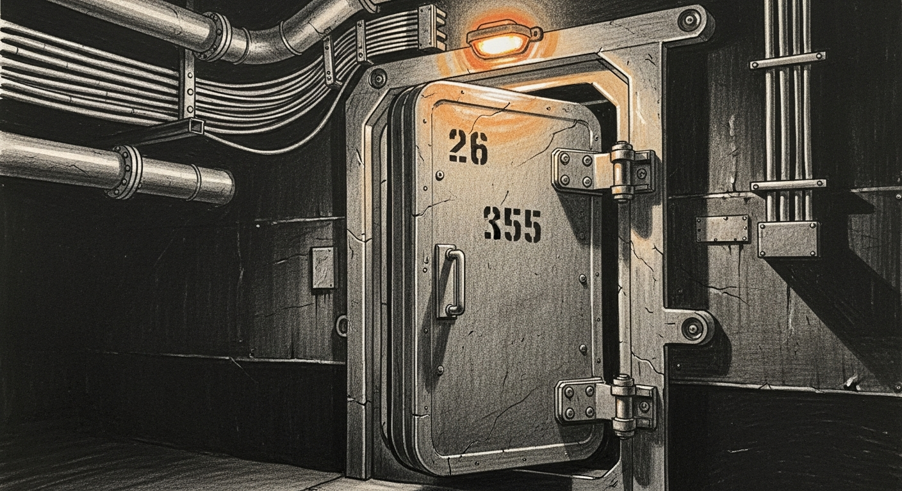

import { Card, CardGrid, Aside } from '@astrojs/starlight/components';



On 2026-04-23 the Mini kernel-panicked twice. On 2026-04-24 LM Studio stalled at 99 percent loading a model while the VM's qemu process sat SIGSTOP'd for two hours in silence. Different symptoms, same disease: multiple memory-heavy services competing for the same unified RAM pool with no admission control. Each service trusted the kernel to find it space. The kernel, overwhelmed, either panicked or paused at random. We discovered the ceiling by hitting it.

The Capacity Doctrine is the immune-system answer: refuse bad loads up front instead of reacting to failures downstream.

## Three Rules

<CardGrid>
  <Card title="Rule 1: Declare your weight" icon="document">
    Every heavyweight service has a `ram_budget_mb` number in `~/.sanctum/capacity.yaml`. No budget, no admission. The number is measured with `vmmap --summary` at peak inference, then rounded up. A false refuse is strictly cheaper than an OOM freeze.
  </Card>
  <Card title="Rule 2: Admission gates every load on live memory" icon="approve-check">
    `castellan` on port 2189 gates every evictable load against three live kernel signals, never a static budget sum. First, the droppable pool — `free + speculative + purgeable` pages straight from `host_statistics64` — which excludes the council's file-backed `mmap`'d weights, so a new load can never reclaim them off disk. Second, a swap tripwire: free swap must cover the load plus a floor, because the kernel reports pressure NORMAL straight through near-full swap. Third, the kernel pressure level, used as a one-way STOP veto. The pinned council is always admitted and is never a shed candidate. A shortfall returns HTTP 503 with the shed order, lowest-priority evictable first; an `exclusive_with` clash returns HTTP 409 with the blocking service name.
  </Card>
  <Card title="Rule 3: Nothing critical gets suspended" icon="shield">
    The council VM, sanctumd, sanctum-mlx, signal-cli, WindowServer are pinned via `evictable: false` in `capacity.yaml`. Castellan programs the kernel's own arbiter: pinned services get jetsam band `critical` (190) and stay there. The active loop will never `SIGSTOP` them; the kernel itself spares them when memory pressure crests.
  </Card>
</CardGrid>

## The Ledger Is Live

The admission ledger is not a state file that can drift from reality. On every `/status` or `/services` request — and before any `/load/{svc}` — the daemon re-scans `ps` output and reconciles against `capacity.yaml`. A service is loaded iff either:

- its `process_pattern` regex matches some live command line, **or**
- its `loaded_check_cmd` exits zero within two seconds.

This means the ledger self-corrects across daemon restarts, unclean exits, and manual `kill -9` — there is no state to repair because there is no stored state to corrupt.

## Pinned, Evictable, Exclusive

The council seat is pinned and resident; the coder seat is evictable and loads on demand around it. They coexist — the council always wins the box, the secondary borrows what is left:

```yaml
sanctum-mlx:
  ram_budget_mb: 45000         # Qwen3.6-35B-A3B-4bit council, :1337
  evictable: false             # pinned — always resident, never shed
  priority: 100

sanctum-mlx-devstral:
  ram_budget_mb: 14000         # Devstral-Small-2-24B coder, :3301
  evictable: true              # on-demand; first to shed under pressure
  priority: 85
```

`exclusive_with` is still enforced at admission, but it is now reserved for genuine incompatibilities — a second resident 35B, say, that would OOM the box even when the arithmetic looks fine. Priority is the tiebreaker when the sentinel must choose a victim, and the pinned council is never one.

<Aside type="note">
Exclusion isn't about RAM arithmetic alone — two 20 GB services could technically coexist on a 48 GB pool. It's about Metal allocation churn, KV-cache fragmentation, and compressor thrashing. Some services just don't play well together, and the doctrine lets us say so explicitly rather than discover it by catastrophic failure.
</Aside>

## Four Layers Of Defense

| Layer | Purpose | When |
|---|---|---|
| **Kernel-as-arbiter** | Program jetsam priority bands per-PID so the kernel itself shelters the pinned council and sheds the evictable coder | Every 2s via `memorystatus_control`; birth-floor via plist `JetsamPriority` |
| **Admission** | Refuse loads that exceed headroom | Before anything allocates |
| **Monitor** | Catch half-loaded states and signal-stopped processes | Every 2s tick — pinned-service probe, drift check, SIGSTOP scan |
| **Recovery** | Unstick what slipped through | `kill -CONT` on a stopped service; `unload_cmd + load_cmd` on a failed probe, rate-limited to one rescue per service per 30 min with backoff after two failures in an hour; deadman SIGCONT if the keeper himself dies |

The layers are independent. The kernel arbitration alone would miss admission cases where everything fits but the wrong thing got loaded. Admission alone would miss a runaway allocation that grew after load. Monitoring alone would miss the load that never should have started. Recovery alone is the old watchdog — it reacts too late. Together they form a control loop where every pathway back to a known-good state is explicit. The Castellan implements all four — see [The Castellan](./the-castellan.mdx) for the daemon's anatomy.

## The CLI Is The Contract

The canonical way to load a heavy service is never `launchctl kickstart …` directly. It is:

```sh
castellan load <service-name>
```

The CLI posts to `/load/{svc}`. The daemon runs admission first and only then executes the service's `load_cmd`, synchronously, returning `200` once the seat probes healthy. A refusal never reaches `load_cmd`: the CLI exits non-zero on the `503` or `409`, remedy printed to stderr. Direct `launchctl` calls bypass admission — they're permitted but discouraged, and the kernel-band layer will still steer jetsam toward the right victim if pressure crests.

## Host Budget Math

Each host declares three numbers. The pool is derived:

```yaml
hosts:
  cabane:                        # slug for the home-server role
    hostname: manoir.local       # the actual machine on that slug
    ram_physical_mb: 65536       # Mac Mini M4 Pro, 64 GiB unified
    ram_reserved_mb: 10240       # macOS + WindowServer + user apps
    ram_safety_mb: 4096          # hard floor — never fill below
    # pool_mb = 65536 − 10240 − 4096 = 51200 MB
```

The safety margin is non-negotiable. We don't allocate into it even if admission math says we could — it's the buffer that keeps the kernel's own memory-pressure machinery working. Hit the safety margin and you're in the territory where jetsam starts SIGSTOPping random processes, which is where the 2026-04-24 incident came from.

## From Budgets To Live Memory

The first cut summed every service's budget against the pool. On a healthy box that read deeply negative — a 40 GB council plus its peak reserve double-counted itself — and refused every legitimate load. The fix moved the gate onto the kernel's own page counts. One rule was learned the hard way: the council's weights are `mmap`'d from disk and look like reclaimable file cache; count them as free and a new load reclaims them off disk mid-inference, then the box thrashes and freezes. So admission only ever spends the droppable pool — never the council's resident pages, and never memory that can only be freed by writing to an already-full swap.

## What This Replaces

Before the doctrine, capacity was a hope. Services started on reboot, the OS sorted it out, and when it didn't, the watchdog noticed eventually. The 2026-04-23 kernel panic and 2026-04-24 freeze were both perfectly-preventable incidents — we had the information to refuse those loads, we just weren't asking.

After the doctrine, capacity is a refusal. The admission controller can point at any service, at any moment, and say "not this one, not now, here's why, here's the remedy." That is the Apple-like part. That is the military-grade part.

The system no longer discovers the ceiling by hitting it.

## See Also

- [The Castellan](./the-castellan.mdx) — the in-haus keeper that implements this doctrine plus the kernel-as-arbiter layer
- `sanctum-castellan` crate: `~/Projects/sanctum-rs/services/sanctum-castellan/`
- Capacity config: `~/.sanctum/capacity.yaml`
- Castellan log: `/var/log/sanctum/castellan.log` (system LaunchDaemon)
- Chaos scenario: `~/Projects/openclaw-skills/chaos-forge/scenarios/admission-refusal.sh` — drives a load past headroom and asserts the refusal
