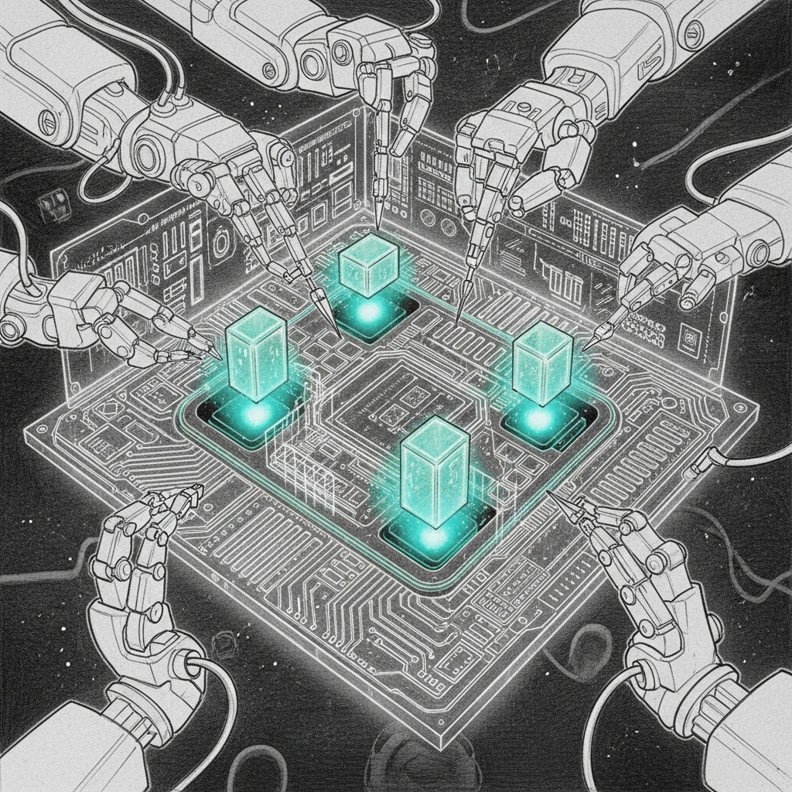

import { Aside } from '@astrojs/starlight/components';



Apple's way of telling you the GPU has given up on you as a person is a terse `Broken Pipe` from `MTLCompilerService`. Not "out of memory" — nothing that civilized. We saw that message a great deal in the spring of 2026, training a 27-billion-parameter model on a laptop. Which is either visionary or reckless. For a while, it was both.

**Date:** 2026-04-02
**Status:** Implemented (history); pipeline re-pointed at a 7B coder since

The story below is the **Council distillation run** — `Qwen3.5-27B`, distilled from Claude Opus, trained on the Mac through March and April 2026 (the benchmark JSONs still sit in `coding-llm-bench/results/`). That run is retired. The same `mlx-finetune` plumbing is alive today, re-pointed at `Qwen2.5-Coder-7B-Instruct-4bit` — a smaller model with a calmer appetite. Where the live 7B config differs from the 27B war stories, this page says so, because a reader who opens `lora_config.yaml` expecting 32 layers and finds 28 will conclude the whole page is fiction. It isn't. It's just older than the config. (The wider arc of what these runs taught us lives in [Training Lessons](/architecture/training-lessons/).)

The 27B pipeline crashed mid-training with Metal GPU errors that read like resignation letters from the shader compiler. Inspired by John Carmack's line — "if you don't understand the hardware, you don't understand the problem" — we stopped guessing and profiled everything. Four failure modes fell out. Each one only appears when you push consumer silicon past the edge of what Apple probably imagined anyone would do with it.

## Sequence length discipline

**The Issue:** Variable-length training examples make MLX compile a fresh Metal shader for every unique sequence length it sees. A few hundred distinct lengths means a few hundred graph shapes means a few hundred shader compilations, and `MTLCompilerService` eventually throws its `Broken Pipe` — Apple's polite way of saying "I give up."

**The Fix (live):** The 7B config pins a single ceiling — `max_seq_length: 1024` — and MLX truncates anything longer. The training log is honest about it: `Some sequences are longer than 1024 tokens. The longest sentence 4254 will be truncated to 1024.` One length cap collapses the shape explosion to a handful of variants and the compiler stops panicking. The difference between "crashes after 200 steps" and "runs to completion" was, embarrassingly, mostly about sequence length.

<Aside type="tip">
This is the single highest-impact optimization in the entire pipeline. If your MLX training crashes with "Broken Pipe" errors, look at your sequence lengths first. Everything else is optimization. This is survival. (We truncate today; padding every example up to the nearest of {512, 1024, 2048} would beat truncation — it keeps the long tails instead of guillotining them — but that bucketing pass isn't built yet. See the escalation note.)
</Aside>

## Graph stability

**The Issue:** Deep LoRA layers with high gradient accumulation created an explosion of tiny memory allocations. The GPU spent more time managing memory than doing math — like a librarian who spends all day organizing the card catalog and never actually shelves a book.

**The Fix:** Once the length cap stabilized the graph shapes, the allocation pattern stopped thrashing. The live 7B config trains all **28 layers** at **1024 context** with `grad_accumulate: 2` (effective batch of 4) and never goes near the wall — `Trainable parameters: 0.303% (23.069M / 7,615.617M)`, runs to completion in one to two hours on the M4 Pro. The computation graph went from a Jackson Pollock painting to a circuit diagram. (The original 27B run pushed deeper and wider before this settled; the surviving config is the calm one.)

## The dataset is smaller than the legend

**The Issue:** Early plans imagined a huge synthetic corpus — every agent generating hundreds of examples. The build that actually shipped is humbler and better: `build_training_data.py` walks real code on disk (openclaw-skills bash, `~/.sanctum` infra scripts, the firewalla bridge JS, runner Python, icloud-organizer TypeScript, LaunchAgent plists) and turns each file into an instruction/response pair. The result is **459 training + 52 validation** examples — two orders of magnitude under the legend, and every line of it is code that already runs in the haus.

**The Reality:** The generator is single-threaded today, which is fine: globbing a few hundred files and templating prompts takes seconds, not coffee breaks. The embarrassingly-parallel `collect_files()` / `create_chunk_pairs()` loop *could* be wrapped in a `multiprocessing.Pool(os.cpu_count())` to leave the GIL watching from the sidelines — but at 511 examples there is nothing to optimize yet. We earned the right not to.

## Hardware profiling

**The Issue:** Configuration changes were vibes-based. "This crashed, so reduce rank. That didn't crash, so increase context. Repeat until the model converges or you lose patience." This is not engineering. This is dowsing.

**The Fix:** Stop arguing with the GPU and ask Apple Instruments what it's actually doing. `xctrace` and the Metal System Trace template ship with the Xcode tools already on the box, so the profiling run is one line wrapped around the real training invocation:

```bash
xcrun xctrace record --template 'Metal System Trace' \
  --output finetune/train.trace \
  -- python -m mlx_lm.lora --config finetune/lora_config.yaml
```

Real-time ALU occupancy, shader compilation time, unified memory bandwidth. The profiler doesn't care about your intuition — it cares about what the silicon is actually doing. Carmack would approve.

<Aside type="note">
A committed `profile_training.sh` that bakes this in next to `train.sh` is on the list, not yet on disk — see the escalation note. Until then the command above is the canonical recipe; it runs as-is. The broader lesson held across every model we benchmarked here (`Qwen3.5-27B`, `gemma-4-31B`, the live 7B coder): architecture shapes the memory curve more than raw parameter count does, and you only learn that by measuring instead of guessing.
</Aside>

## How we know it works

Today the proof is the artifacts on disk, not a test harness — `finetune/train.sh` runs end to end, `training.log` records the loss curve and the truncation warnings, and the adapter lands in `finetune/adapters/`. To confirm the trained adapter actually speaks, serve it and ask:

```bash
python -m mlx_lm.server \
  --model /Users/neo/Projects/mlx-finetune/models/Qwen2.5-Coder-7B-Instruct-4bit \
  --adapter-path /Users/neo/Documents/Claude_Code/coding-llm-bench/finetune/adapters
# then POST a /v1/chat/completions payload to 127.0.0.1:8080 and watch it stream
```

That is where an adapter stops being a training artifact and starts auditioning for a seat — the crown itself is decided elsewhere, at [the champion gate](/architecture/champion-gate/). A committed `tests/test_e2e_pipeline.py` that pins each failure mode dead — data generation, the length cap, and live inference against a real `mlx_lm.server` — is the honest next step, not a thing that exists yet. See the escalation note. Because the only thing worse than a crash at 3 AM is a crash at 3 AM that you thought you'd tested against. Bugs that expensive shouldn't get to come back — but a test can't keep a bug dead until somebody writes the test.
