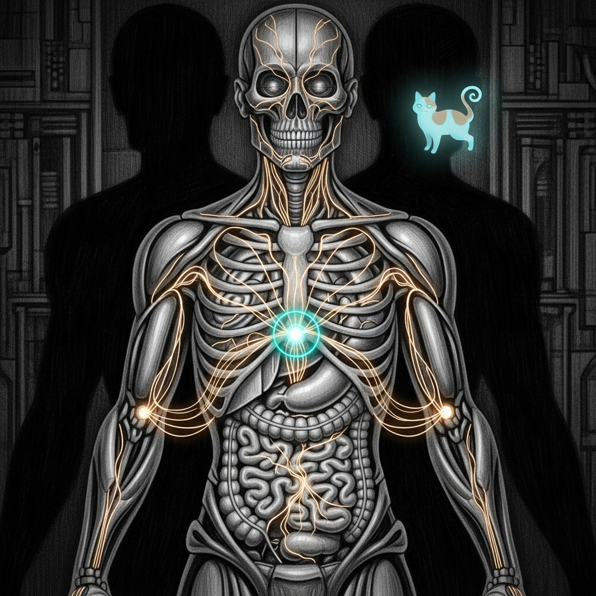

The body has organs for substance (bones, flesh), for signaling (nerves, the endocrine system), for defense (the immune system), for awareness (chitti), and for governance (the Council). None of them own the *energy itself* — what is burned, whether it flows, whether the body is rested, whether an action is still willed.

**Chi is that energy, made legible.** It is not an eighth organ. It is a read-only, fail-soft **field** that flows *through* the organs that already exist, reading them and asking the one question none of them answers whole: **is the haus's living energy being well spent?**

The ruling that it is a field, not an organ, came from the Council by a six-to-one margin, and three doctrines hold it there. *One metaphor per layer*: an eighth organ that "unifies fuel and flow and vitality and intent" would only re-implement the castellan's admission math and the gland's headroom gate under a mystical new name. *Polarity*: a field that reads many organs and writes only advice has a clean opposite — the breakers, the 503s, the castellan's refusals that catch it the moment its cheap anticipatory read lies. An organ with authority would instead become a second source of truth. *Capacity doctrine*: each host answers for its own air supply, and the moment chi could write routing across the two machines it would become a central scheduler, and a single point of failure for the whole circulation.

## What it reads

Chi normalizes four fuels into one scarcity-weighted unit — the *binding axis*, the nearest wall — attributed per service and per agent-turn:

- **RAM** from the castellan's `/status` (it never re-meters or admits — that stays the castellan's door).
- **Tokens and dollars** from the proxy's usage ledger.
- **Thermal** from `pmset -g therm` — the genuinely new meter, and on a flat-rate, two-box haus often the *true* ceiling. (Watts proper need a privileged helper and are deferred.)
- **GPU concurrency** from the count of loaded local seats.

From the unit it derives a **runway** (hours of ambition left before the nearest of those walls), a chronic **allostatic-load** integral (rested, or running catabolic — the long-term cost of repeated stress, distinct from the gland's acute cortisol), and a **meridian** reading of where work pools and starves across the hosts.

It carries one more thing the other organs cannot: an **intent-thread**. Every unit of work can be stamped with a provenance handle back to the live decision that animates it, so the body can ask *"is this still willed?"* and name the dead-intent reflex — the phantom-heal on a healthy service, the stale lock mistaken for an active sweep, the orphaned overnight job. Live reflex, dead will. Nothing else catches it.

## What it will not do

Chi **feeds, it never doses.** It emits a single burn-rate/runway scalar where the endocrine gland can read it; the existing homeostat — and only it — gates the haus's ambition. Chi stands up no second regulator that can panic.

It stays **ambient.** Burnout is a trend, not an incident; chi opens no new alert path and never pages.

It is **fail-soft by construction.** With no chi published, every consumer behaves byte-identical to today — a fresh install and a dead chi daemon look exactly like the present. The dead-intent detector is **observe-only**: it logs, it never kills. Enforcement is a later, supervised flip.

Its named opposite — the force that catches it when it is wrong — is the post-failure ground truth: the breakers, the 503s, the refusals. If chi cannot be paired with that opposite, it has become an authority, and the design is wrong.

## Where it lives

A read-only sentinel on each host (`chi-sentinel`, port `:7777`, loopback and tailnet) gathers the fuels, computes the readings, publishes the field, and emits the one hormone. It holds no door of its own.

One door was argued for and deferred: an inviolable energy reserve for the immune and enforcement path, because subscription-flat billing has removed the dollar circuit-breaker that used to stop an energy-exhaustion attack. That is a real actuator with a real attack surface, so it is earned, not assumed — it ships only once the read-only ledger proves an un-metered exhaustion draw. The dissent is kept on the record, not lost.

> Chi ships as a verb — *does fuel, flow, and will move and live?* — never a noun. A field, not a fist.
