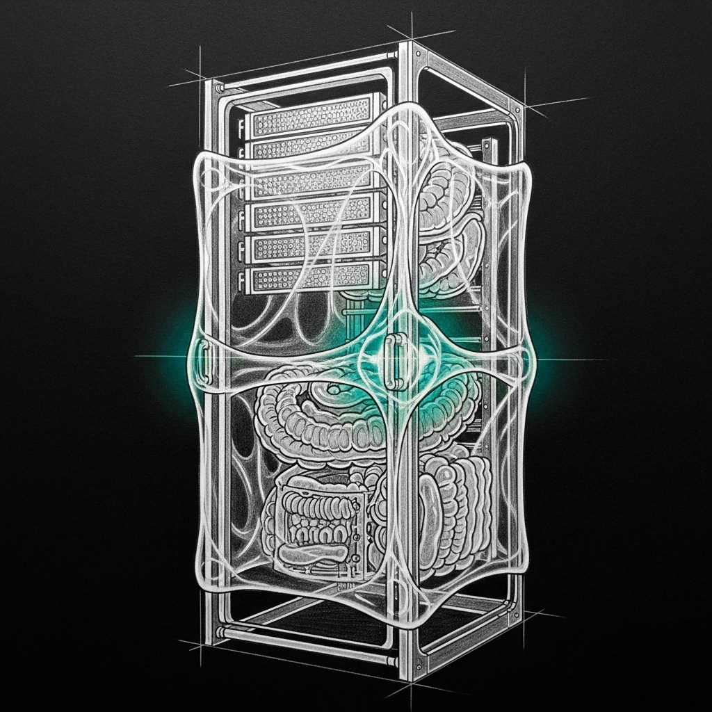

import { Aside, Card, CardGrid } from '@astrojs/starlight/components';



## The Idea, From Two Angles

**From yogic philosophy.** *Chitti-shakti* is the pure consciousness that modulates embodied function under pressure. It's not the mind (the observer), not the body (the vehicle), but the ever-changing awareness-of-state that lets the two coordinate. It is global and local at once.

**From biotensegrity research.** The fascia is the continuous fluid-infused connective matrix that runs through every tissue in the body. It is both the medium signals travel through and the tissue that rearranges itself in response to load. Bones don't push on muscles directly — they push through fascia. The immune system doesn't deliver cells through empty space — the fluid matrix carries them. *Ground fluid, fluid ground.*

Both traditions converge on the same insight: in a living system under load, the coordinating layer is not a controller. It is a medium. One that modulates (slow, learned). The other that regulates (fast, reflexive). Immune system optimization happens when regulation reads the modulation and vice versa.

**In sanctum terms**, that layer doesn't exist yet. There are fragments — but no membrane.

## What Sanctum Has Now

<CardGrid>
  <Card title="Memory sentinel" icon="information">
    Kills the top memory offender when the machine is critical. Runs at the start of each watchdog tick. Fast, narrow, pressure-aware — but only on the memory axis, and only at tick boundaries.
  </Card>
  <Card title="Pressure valve" icon="warning">
    Rust daemon (`sanctum-pressure-valve`) born from the April 20 kernel panic. Explicit pre-panic relief. Knows memory pressure deeply — nothing else.
  </Card>
  <Card title="Memory-gated loaders" icon="approve-check">
    Individual actions that check pressure before firing. The coder-14b auto-loader added April 24 refuses to run under 12 GB free. Local membranes, not global.
  </Card>
  <Card title="Sanctum-presence" icon="puzzle">
    Cross-session lock registry on `:1949`. The closest thing to a shared-awareness field — but it only knows who holds which lock, nothing about pressure, attention, or history.
  </Card>
  <Card title="Force Flow" icon="rocket">
    The notification bus (`:4077`) every subsystem writes to. A courier, not a fluid — delivers messages, doesn't aggregate state.
  </Card>
  <Card title="Watchdog's five gates" icon="setting">
    Memory sentinel, circuit breaker, restart budget, dedup, the new memory gate. Five ad-hoc membranes, each asking a narrow version of the same question: *should this action fire right now?*
  </Card>
</CardGrid>

Each fragment is a correct instinct. None of them talk to each other. A watchdog tick can pass the memory sentinel, pass the circuit breaker, pass the restart budget — and still fire a remediation that collides with an MLX model mid-load or a Jocasta scraper mid-iteration, because no gate knows about those.

## The Gap, Precisely

A chitti layer is **a continuous ambient state field** that every agent and every automated remediation reads before acting, and writes to after acting. Not a daemon that makes decisions. A fluid that carries them.

Four axes the field aggregates:

1. **Pressure** — memory (free, inactive, compressor, swap), thermal, disk, network, GPU. Not one scalar; a vector the reader interprets for their own context.
2. **Mid-flight work** — which processes are actively using which shared resource (GPU, disk I/O, the 1234 port queue, the Mail database). Not locks — *presence signals* that decay after inactivity.
3. **Attention** — which agent has the floor right now, which service is in an experimental or quiesced state, whether the human is actively using the machine.
4. **Recent history** — a short-horizon log of what fired, succeeded, failed, was throttled. So we don't re-hit the same pattern twice in one hour.

The field is not authoritative. It is a *read of the ground* at a point in time, with known staleness bounds. Subsystems decide what to do with what they read. The field's job is to make the reading cheap and universal.

<Aside type="note" title="Why not make the watchdog consult it directly?">
It already does, implicitly, through the five ad-hoc gates. The refactor is to replace those gates with a single read against the fluid. The watchdog becomes *smaller* — not smarter. Intelligence moves into the field and into the readers.
</Aside>

## Shape of an MVP

The minimum viable membrane is smaller than it sounds. Three pieces:

### 1. The collector

A lightweight Rust daemon (`sanctum-fluid`? `chittid`?) that:

- Polls kernel metrics on a fast cadence (1–5 s): `vm_stat`, `sysctl`, `iostat`, GPU telemetry.
- Receives presence signals via a local socket — any process can write "I'm using X until Y."
- Maintains a short ring buffer of recent action events (service restarts, remediations, notifications).
- Exposes a read API over HTTP on a Tailscale-reachable port, with JSON shaped so every axis is optional — callers consume what they care about.

Not a big daemon. A few hundred lines of Rust, probably less memory than the watchdog itself. The whole point is the fluid is cheap to read from every subsystem.

### 2. The presence protocol

A one-line write interface every subsystem already uses through a shared helper:

```text
POST /presence
{"actor": "sanctum-mlx", "resource": "gpu", "until": "2026-04-24T15:30:00Z", "note": "loading qwen3.6-35b"}
```

Presence entries auto-expire. The collector never evicts on its own — it trusts `until` and accepts a `DELETE /presence/<id>` for early release. No locks, no owners. Just signals.

### 3. The read helper

A tiny library every Rust service and every Python skill imports:

```rust
let fluid = chitti::read().await?;
if fluid.memory.available_gb < 12.0 { return Deferred::PressureTooHigh; }
if fluid.presence.any(|p| p.resource == "gpu") { return Deferred::GpuBusy; }
if fluid.history.recent(|e| e.action == "mlx.reload").count() > 2 { return Deferred::RecentStorm; }
act()
```

Every gate currently hardcoded in the watchdog becomes one of those reads. New subsystems get the same behavior for free — they don't need to re-derive "am I in a bad moment to act?"

## What It Replaces, What It Enables

Replaces the five ad-hoc gates inside `sanctum-watchdog`, the memory gate in `lm_studio::ensure_coder14b_loaded`, and the scattered pressure checks across scripts and LaunchAgent pre-flights. One fluid read, one answer, everywhere.

Enables:

- **Cross-axis awareness.** The watchdog refuses to restart `council-mlx` because a roll-call is mid-flight (presence). Jocasta defers the hourly mail scrape because memory is tight (pressure). Neither knows about the other.
- **Attention routing.** Reply-to-Bert sets `attention.active_agent = yoda`; background services quiet their chattier channels. The membrane notices focus and softens the periphery.
- **Learning.** *Under what fluid state did this failure occur?* becomes a queryable question — richer than log grepping.
- **Graceful degradation.** Every subsystem backs off under pressure because they all read the same loud fluid. No central throttle. The tissue regulates.

## What It Is Not

Not a new agent (no reasoning — only aggregation). Not a replacement for service-graph.py or the watchdog (those stay, they get *smaller*). Not mandatory (adoption is gradient). Not authoritative (readers choose how much to trust). Not yet shipped — this page is a direction marker; when the membrane exists, this page becomes its reference.

## Related

- [The Living Force](/architecture/living-force/) — the immune system the fascia would wrap
- [Pressure Valve Trilogy](/operations/2026-04-20-the-pressure-valve-trilogy/) — memory pressure as the first organ of the not-yet-membrane
- [Every Jedi Answers to Their Name](/operations/2026-04-24-council-roll-call/) — the feature whose memory gate made the absence of a membrane visible
- [Sanctum-presence](/guides/memory/) — the narrow cross-session awareness field chitti would generalize

<Aside type="tip" title="The phrase that started this page">
"For the muscle, bones, and immune system to interact, it needs the intelligence of the crystal-fluid pure consciousness that is ever-changing under pressure." — Bert, 2026-04-24, on waking.
</Aside>
