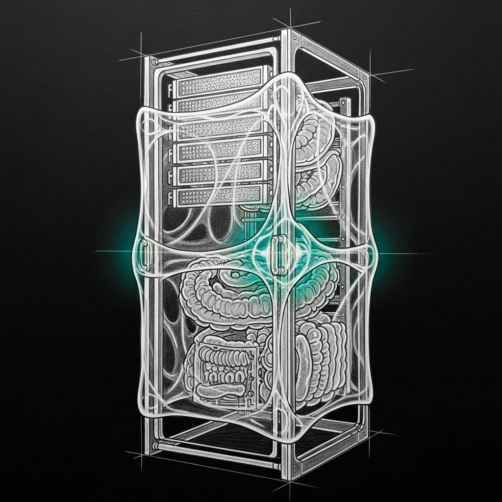

import { Aside, Card, CardGrid } from '@astrojs/starlight/components';



At 18:30 on a Tuesday, sanctum-watchdog stared at a dead Home Assistant and, before it touched a single reflex, asked one question: which way is the body leaning right now? Sanctum already had bones (services), muscles (agents), and an immune system — the [watchdog, sentinel, and pressure-valve of the Living Force](/architecture/living-force/). What we never had was the **fascia**: the connective tissue that lets bones, muscles, and immune system coordinate in real time, under load, everywhere at once. That layer is what `chitti` ships — and it is the reason the watchdog had somewhere to look.

## Two roots

We named it after two traditions that arrived at the same answer from opposite ends.

**Yogic.** *Chitti-shakti* is the pure consciousness that modulates embodied function. Not the mind (the observer), not the body (the vehicle), but the ever-changing awareness-of-state that lets the two coordinate. The five **koshas** — annamaya, pranamaya, manomaya, vijnanamaya, anandamaya — are sheaths wrapping the Self, dense to subtle. Each modulates the next.

**Biotensegrity.** The fascia is a continuous fluid-infused matrix running through every tissue. It is both the *medium* signals travel through and the *tissue* that rearranges itself in response to load. Bones don't push on muscles directly; they push *through* fascia. *Ground fluid, fluid ground.*

Both traditions converge on the same insight, and it is the one you should carry into the rest of this page: in a living system under load, the coordinating layer is not a controller. It is a **medium**.

## The five koshas, named in code

`sanctum-chitti` is a Rust daemon on `127.0.0.1:2188`. The body it hosts has five sheaths:

<CardGrid>
  <Card title="Annamaya — physical body" icon="information">
    Memory available, memory free, swap used, page size, thermal pressure. The hardest, most material truth: what the silicon actually has to give.
  </Card>
  <Card title="Pranamaya — energy body" icon="puzzle">
    Active presence entries — TTL-bounded signals that say "I'm using GPU until 15:30, loading the Codestral-22B coder seat". Mid-flight work, the system's vital flow.
  </Card>
  <Card title="Manomaya — mental body" icon="heart">
    Mood + posture. Six postures (Poised · Cautious ~ Conserving ⌣ Healing ↺ Alert ! Fever ^) with 30-second hysteresis so the body holds its lean against tick noise.
  </Card>
  <Card title="Vijnanamaya — wisdom body" icon="star">
    Samskara — learned grooves. (service, pattern, action, success) records that let future reflexes ride past success rather than re-discover it.
  </Card>
  <Card title="Anandamaya — bliss/intent body" icon="rocket">
    Attention — what the human is doing right now. "recording-bert-reference", "on-call", "asleep". The highest kosha; can override every reading below it.
  </Card>
</CardGrid>

Each kosha is read by whichever subsystem needs it. `GET /fluid` returns all five in one snapshot; `/mood`, `/attention`, `/presence`, `/samskara` serve the individual sheaths.

## Modulation as direction, not gain

A scalar can only say *"more reflex or less reflex"*. A direction can say *"which way the body is leaning"* — and that distinction matters. The same `pressure_15min=0.7` reading is **Alert** (act narrowly, fast) when action density is low, and **Healing** (observe, settle) when action density is high. The body just did a lot vs the body is fresh under load are different states; a scalar collapses them, a posture distinguishes them.

The watchdog reads `chitti.mood.posture` at the top of each remediation pass and follows a per-posture plan:

| Posture | Glyph | Tilt |
|---|---|---|
| Poised | · | act crisply, normal cadence |
| Cautious | ~ | act, but watch closer; widen breaker by 1 |
| Alert | ! | act narrowly, fast; widen breaker by 2 (don't suspend mid-rescue) |
| Healing | ↺ | observe, settle; tighten budget by 2 |
| Conserving | ⌣ | minimum action, defer non-critical |
| Fever | ^ | body in shock — halt non-high reflexes, breaker and budget both to 1, escalate to the cortex |

**Fever** is the one posture that skips hysteresis. When `pressure_15min ≥ 0.95`, or action density saturates (`≥12` remediations while `pressure_15min ≥ 0.7`), `classify_posture` returns it before any other branch. The watchdog's answer isn't to try harder — it's to stop: breaker and budget both clamp to 1, non-high reflexes halt, and the cortex (a human) is paged. A body that thrashes under saturation digs the hole deeper; this one names the shock and hands back the shovel.

**Direction loops** — once the body enters a posture, it holds it. A different signal must sustain for ≥30s before the body flips. Brief contradictions don't oscillate the system; structural shifts within minutes still register. The body's lean is itself a state, not just a moment.

## Wisdom informs reflex

`vijnanamaya` records every remediation outcome under `(service, pattern, action_name)`. The watchdog's action picker reads the index before each remediation and:

1. If the primary action has been failing confidently (≥5 attempts, `<20%` success), try the next declared alternative that hasn't *also* been failing.
2. If a non-primary action has earned itself (≥3 attempts, ≥50% success, beats the primary's observed rate), promote it.
3. Otherwise, declared order, primary first.

The runtime catalog declares ordered `actions:` per service. HA and outline both have `compose-up` as primary and `colima-restart-then-up` as the fallback. That name is a fossil: Colima was retired for OrbStack on 2026-04-27, but the script kept the old key even though it now restarts the right runtime. The picker doesn't care what an action is called — only whether its groove succeeds — so the stale name is cosmetic. The trace below is the 2026-04-26 deploy, the day the picker first rotated within minutes:

```
[18:30:35] Action picker: home-assistant/port-closed —
           primary compose-up failing (0%, 0/6)
           → trying untested colima-restart-then-up
[18:30:35] Remediating: home-assistant via 'colima-restart-then-up'
[18:33:11] HA :8123 OPEN
```

Wisdom flowed back into reflex. The body chose to switch hands. The OrbStack migration the next day swapped what the fallback *does*, not what it's *called* — the picker logic and the groove it carved are unchanged.

## Vajrayogini — visible without ambiguity

The architecture's deepest property is honesty. When outline's `colima-restart-then-up` failed (this was pre-OrbStack-migration), the watchdog log read `Image redis:7-alpine Pulling` — naming the real cause (Colima VM had no outbound network) rather than masking it as a watchdog error. That's vajrayogini's discipline: clear seeing with discernment, no flinching, no contraction. The body that names its own broken state without shame is the body that can be addressed.

> Heart broken open. The system's discernment is not armor; it is openness that doesn't soften the diagnosis.

## API

| Endpoint | Returns |
|---|---|
| `GET /fluid` | All five koshas in one snapshot, plus the legacy flat fields |
| `GET /mood` | Manomaya only — posture, hysteresis state, raw signals |
| `GET /attention` | Anandamaya — current focus (explicit or clock-derived) |
| `POST /attention` | Set focus + optional quiet flag + TTL |
| `DELETE /attention` | Clear; falls back to clock-default |
| `GET /samskara?service=&pattern=` | Vijnanamaya — ranked actions for that groove |
| `POST /samskara/expire` | Drop grooves older than `older_than_days` (default 7) |
| `POST /action` | Record an outcome (writes vijnanamaya) |
| `POST /presence` | Register TTL-bounded mid-flight work |
| `DELETE /presence/{id}` | Early release |
| `GET /health` | Liveness + record counts |

There is no `GET /presence` — pranamaya is read through `/fluid`. Asking directly earns a clean `405`: the body won't serve a door it never built.

## What's whole

The chapter closes here. The body has all five sheaths and each one carries weight on its own:

- **Annamaya** — pressure + thermal. `classify_posture` reads both; a hot chip can move the body to Alert or Conserving on its own, no memory pressure required.
- **Pranamaya** — TTL-bounded presence. sanctum-tts writes its own entries around `/speak`; sanctum-watchdog writes around an MLX seat load. The body sees what's in flight without anyone teaching it.
- **Manomaya** — six postures with 30 s hysteresis (Fever skips the wait). The watchdog reads them before every reflex.
- **Vijnanamaya** — persistent JSONL log at `~/.sanctum/chitti/samskara.jsonl`. The body remembers across restarts. Corrupt lines from a partial-write crash are tolerated; the rest of the memory still loads.
- **Anandamaya** — explicit POST always wins. When nothing is set, a 30 s poller reads the macOS frontmost app and translates it (Zoom → on-call, Logic Pro → recording, loginwindow → asleep, otherwise `app-<name>`). The body's intent breathes on its own.

## What honest gaps remain

A handful of cross-system integrations are out of chitti's scope and live in their own future sessions:

- **Jocasta, council-mlx, pressure-valve, jocasta-mcp** are not yet readers of `/attention`. They could quiet themselves without re-deriving quiet hours; today they don't.
- **LiveKit's voice-agent** could write its own presence entries when a call is active; today the macOS focus poller catches Zoom-class app names but not the LiveKit phone path.
- **Per-axis mood history** for thermal — chitti only EWMA's memory pressure. Thermal is read fresh each tick, not folded into a 15-min average.

These are real gaps, but the body works without them. They're invitations, not blockers.

## Related

- [The Living Force](/architecture/living-force/) — the immune system this body wraps
- [2026-04-24 — Five Locks on the Voice Door](/operations/2026-04-24-sanctum-tts-hardening/) — the night chitti's MVP shipped
- [2026-04-26 — Wisdom Informs Reflex](/operations/2026-04-26-wisdom-informs-reflex/) — the day samskara closed the loop
