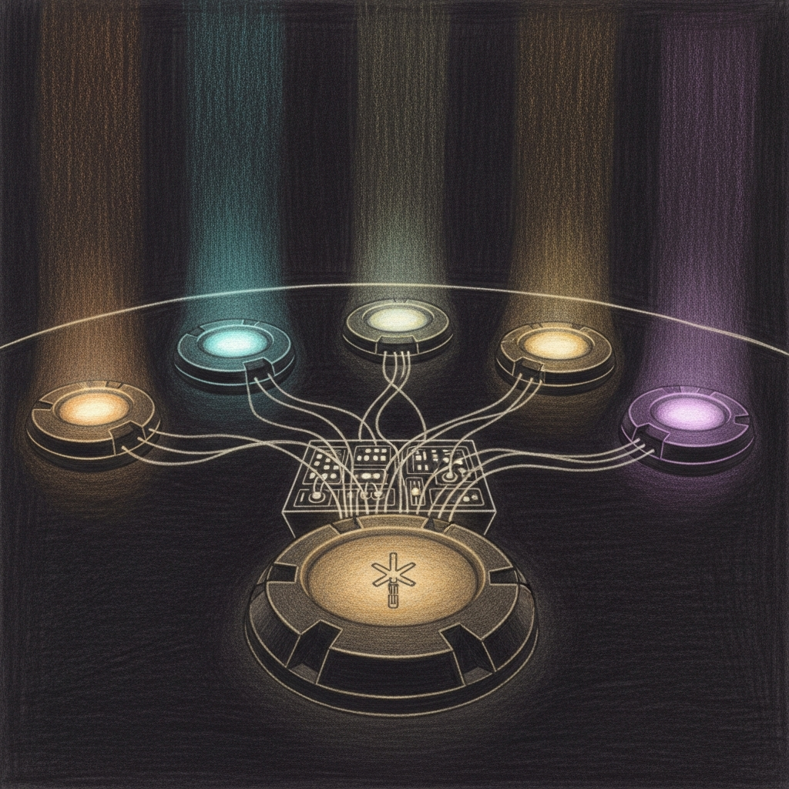

import { Aside } from '@astrojs/starlight/components';



For the first year of the Sanctum Council, agents talked to each other by running SSH one-liners from memory. Windu would discover something at 2 AM, spawn a subshell to `ssh neo@10.10.10.1`, hope the right PATH was in scope, and fire a message into the void. Half the time it reached the right agent. The other half it reached `nothing`, `your login shell`, or `an unrelated cron job that was now very confused`.

Council Router is the fix. One routing table. One message format. Every node, every agent, every direction — routed, escalated, or logged on purpose.

## Topology

The council lives across four nodes, each hosting a subset of agents. Routing is defined in `~/Projects/openclaw-skills/council-router/config/nodes.json`.

| Node | Host | SSH User | Agents | Role |
|------|------|----------|--------|------|
| `hub` (MM64) | `10.10.10.1` | `neo` | jocasta, codex, claude, gemini | Mac Mini — intelligence, CRM, the bridge between the haus and the world |
| `vm` (Manoir VM) | `10.10.10.10` | `ubuntu` | yoda, windu, quigon, cilghal, mundi | QEMU VM — the Council proper |
| `satellite` (MM16) | `100.0.0.32` | `neo` | ahsoka | Chalet Mac — remote presence, eventually home automation |
| `mobile` (MBP128) | `10.0.5.2` | `neo` | gemini, claude | MacBook Pro, when docked on Thunderbolt |

Each node has a CLI binary (`openclaw`) and a per-agent flag table: Yoda is invoked as `--agent main` on the VM, Windu as `--agent windu`, and so on. The router knows all of this, so you don't have to.

## Agents & Domains

| Agent | Node | Role | Domains |
|-------|------|------|---------|
| **Yoda** | vm (main) | Grand Master | Routing, delegation, council sessions, daily digest |
| **Jocasta** | hub (main) | Intelligence | Email, calendar, CRM, deal flow, Messages archive |
| **Windu** | vm | Security | Auth logs, Firewalla, Tailscale, intrusion detection, drift sentinel |
| **Qui-Gon** | vm | Infrastructure | Disk, Docker, LM Studio, gateways, backups |
| **Cilghal** | vm | Health | Apple Watch, sleep, HRV, activity |
| **Mundi** | vm | Finance | Fund models, cap tables, portfolio telemetry |
| **Ahsoka** | satellite | Remote | Chalet network, home automation (phase 3) |

Bert is not in the table. Bert is the escalation target, not an agent.

## How Routes Resolve

```
send.sh <from> <to> <type> <priority> <message>
  │
  ├─ Look up <to>'s node in nodes.json
  ├─ Look up local node (Darwin → hub, Linux → vm)
  │
  ├─ Local node == target node?
  │    └─ invoke <cli> --agent <flag> --message <structured>
  │
  ├─ Direct route exists (hub ↔ vm)?
  │    └─ ssh <user>@<host> '<cli> --agent <flag> --message <structured>'
  │
  └─ Indirect route (satellite ↔ vm, mobile ↔ vm)?
       └─ relay through hub (see relay_rules)
```

The router never silently invents a path. If the relay rule is missing, the send fails loudly. An agent that thinks it sent a message and didn't is exactly the kind of silent-failure the council was built to stop.

## Message Format

Every message — whether local, remote, or relayed — carries the same structured header:

```
[COUNCIL-MSG] from:<agent>@<node> to:<agent>@<node> type:<type> priority:<priority>
---
<message body>
```

**Types:** `alert`, `briefing`, `request`, `task`, `response`, `escalation`, `session`
**Priorities:** `low`, `normal`, `high`, `critical`

The receiving agent parses the header first, the body second. This means Yoda can triage "is this urgent?" without reading the prose, which matters when a daily digest contains thirty entries and one of them is on fire.

## API

### send.sh — point-to-point

```bash
# Windu tells Yoda about a suspicious login
./scripts/send.sh windu yoda alert high \
  "Unusual SSH login from 203.0.113.42 targeting neo@10.10.10.1"

# Yoda delegates a ticket to Qui-Gon
./scripts/send.sh yoda quigon task normal \
  "Docker container 'memory-vault' has been unhealthy for 12 minutes. Investigate and restart if safe."

# Jocasta hands Yoda the morning briefing
./scripts/send.sh jocasta yoda briefing normal \
  "Morning briefing: 3 unread emails flagged, 2 meetings today, 1 term sheet deadline Friday."
```

### broadcast.sh — one-to-many on a node

```bash
# Yoda wakes every agent on the VM
./scripts/broadcast.sh yoda vm announcement normal \
  "Daily digest at 09:00 — submit your status reports."
```

Broadcast skips the sender if the sender is on the target node. It also keeps a failure count, so a partial broadcast reports which agent refused.

### council-session.sh — multi-agent deliberation

```bash
./scripts/council-session.sh "Migrate Docker host to VM?" \
  "yoda,windu,quigon" \
  "Current Mac host is out of disk. VM has 200G free but no GPU passthrough."
```

Sessions write to `~/.openclaw/workspace/council/sessions/<topic>-<date>.md`. Each participant reads every prior contribution, adds theirs, and Yoda synthesises the final recommendation. The transcript survives reboots. The agents do not.

### health-check.sh — is anyone home?

```bash
./scripts/health-check.sh          # human output
./scripts/health-check.sh --json   # machine output
```

Returns per-node `OK/UNREACHABLE` and per-agent `RESPONDING/SILENT`. It's the first thing any other script runs before trusting a route.

## Escalation Protocol

Escalation levels live in `config/escalation.json`. Every council-originated message carries a level; the router enforces what happens at each tier.

| Level | Name | Agent Action | Bert Gets |
|-------|------|-------------|-----------|
| 0 | INFO | Log only | Nothing |
| 1 | ADVISORY | Log + queue for Yoda's daily digest | Next morning briefing |
| 2 | ATTENTION | Notify Yoda immediately | Signal (batched, max 6/day) |
| 3 | URGENT | Notify Yoda immediately | Signal immediately |
| 4 | CRITICAL | Notify Yoda + voice call | LiveKit call from Yoda |

Quiet hours are 22:00–08:00 America/Montreal. Level 3 and above bypass them. Level 4 bypasses the daily Signal cap, quiet hours, and any notion of restraint.

<Aside type="caution">
The daily Signal budget is six non-Bert-initiated messages. If Windu crosses that line before lunch, either something is genuinely wrong or a routine escalation is mis-labelled. Both are worth knowing about. Level 4 is not a volume knob — earn it.
</Aside>

## Cost Control

Not every council call is worth an Opus invocation.

| Tier | Model | Who routes here |
|------|-------|-----------------|
| Free / local ops | Coder-14B on LM Studio `:1234` | Qui-Gon, Ahsoka, coding sub-tasks |
| Free / local secure | Gemma 4 + LoRA on sanctum-mlx `:1337` | Cilghal, Mundi (private data stays local) |
| Cloud | Opus 4.7 via sanctum-cloud-proxy `:4040` | Windu, Mothma, Jocasta, Yoda digest |
| Smart-routed | `council-brain` on `:4040` | Yoda — Opus by default, local council-mlx for general chat, `council-max-thinking` for deep reasoning |

The router doesn't pick the tier; the receiving agent does. But because the router carries the `from/to/type/priority` header, the agent's model-selection logic has everything it needs to refuse Opus for a level-0 `briefing`. The target is ~10-15 Opus calls per day across the whole council. Most days it holds.

## Integration Points

### Force Flow

Council-originated alerts to Bert go through [Force Flow](/architecture/force-flow/) on port 4077 — they don't fire Signal directly. That way dedup, rate limiting, and quiet hours are decided in one place, not five. Council Router answers "who needs this?"; Force Flow answers "does Bert need to hear about it now?"

### sanctum-cloud-proxy

When Yoda synthesises a council session or drafts a daily digest, the model call goes through [sanctum-cloud-proxy](/architecture/sanctum-cloud-proxy/) at `:4040`. Cost caps, fallback chains, and structured prompts all live there — the router's job ends the moment the message is delivered to the CLI.

### Kitchen Loop

[The Kitchen Loop](/architecture/kitchen-loop/) uses the router to fan out its six-phase cycle to the appropriate agent in each phase. A phase that can't reach its assigned agent halts the loop rather than silently skipping — same doctrine as everywhere else in Sanctum.

### Tech Lookout & Model Scout

Model Scout finds a candidate model, writes a report to Memory Vault, and hands Qui-Gon a `request/normal` via `send.sh`. Qui-Gon reads the report, convenes a short council session if the decision is structural, or replies with an adoption verdict if it isn't. The router is the connective tissue — nothing more, but nothing less.

## Daily Test Suite

Twenty-one tests across three suites (Windu security, Qui-Gon infra, cross-node) run at 07:00 CET on both the Mac and VM. Results are reported back to Yoda via `send.sh`, closing the loop on the thing that routes them.

```bash
# Run everything with self-healing remediation
./tests/run-suite.sh --suite all --remediate

# Run just one suite, quietly
./tests/run-suite.sh --suite quigon --remediate --quiet
```

### Self-Healing Remediation

When `--remediate` is set, a failure walks three tiers:

```
Test fails
  │
  ├─ Tier 1: deterministic script auto-fix (restart service, pull model)
  │             fast, zero LLM cost
  │
  ├─ Tier 2: rerun the failed test to confirm the fix landed
  │
  └─ Tier 3: if still broken (or no auto-fix exists), fire-and-forget a
             task to Windu or Qui-Gon via send.sh for LLM investigation
```

Eight of the twenty-one tests have deterministic auto-fixes today: expected services, gateway health, Docker container health, LM Studio model loads, log-file size, remote gateway health, skill sync freshness, and Tailscale status. The remaining thirteen — SSH hardening, auth log anomalies, listening-port audits, and similar — skip straight to agent escalation, because there is no correct script-only answer for "there is a new SSH key in `authorized_keys`."

Escalated investigations run on `lmstudio/qwen3.5-35b-a3b` locally, so the remediation layer itself has no marginal API cost.

## Legacy: Council Bridge

The older `council-bridge` skill still works for direct Jocasta ↔ Yoda SSH messages. It's the one thing Council Router inherits, not replaces — a minimum-viable cross-gateway send that predates the routing table. New code uses the router; old scripts that still call `send-to-yoda` and `send-to-jocasta` haven't been rewritten because they haven't broken.

If they break, they'll be rewritten.

## Service Details

| Property | Value |
|----------|-------|
| Skill path | `~/Projects/openclaw-skills/council-router/` |
| Nodes config | `config/nodes.json` |
| Escalation config | `config/escalation.json` |
| Routes config | `config/routes.json` |
| Scripts | `scripts/send.sh`, `broadcast.sh`, `council-session.sh`, `health-check.sh`, `sentry-check.sh` |
| Tests | `tests/run-suite.sh` (21 tests across windu/quigon/cross-node) |
| Session workspace | `~/.openclaw/workspace/council/sessions/` |
| CLI (Mac) | `/opt/homebrew/bin/openclaw` |
| CLI (VM) | `/home/ubuntu/.npm-global/bin/openclaw` |
| CLI (Satellite) | `openclaw` on `$PATH` |

The skill is platform-dual: `darwin` and `linux`, by design. A macOS shim that tries to run on Linux will route as `vm` and then fail to find its own CLI, which is the router telling you it noticed.
