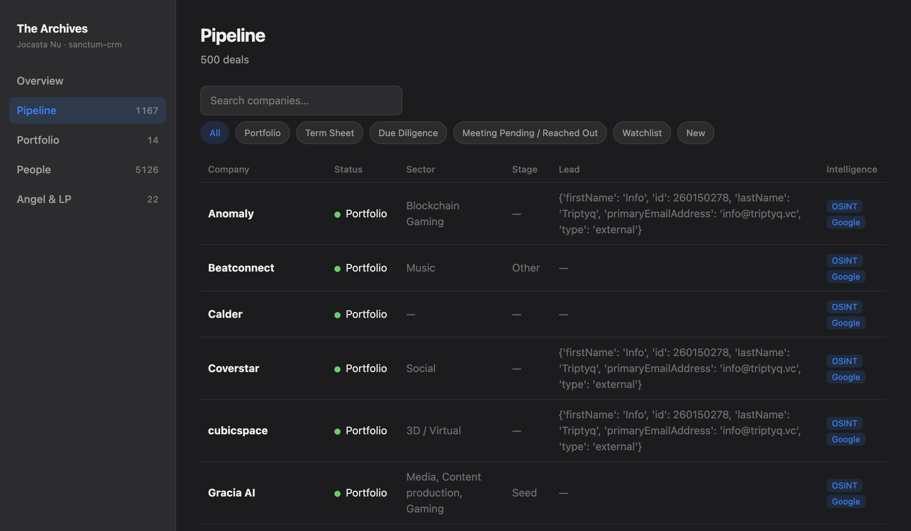

import { Aside, Card, CardGrid } from '@astrojs/starlight/components';



A partner sits down at the fund laptop and opens the deal timeline. In the same haus, on the same Mac, lives every text you have sent your spouse, every note from your kid's school, the angel cheque you would rather nobody priced. The partner sees none of it. That gap — full archive for you, work graph for them — is the entire job of Sanctum CRM.

[Jocasta](/agents/jocasta/) keeps the archive. This page is about the wall she runs down the middle of it.

Every conversation that lands on the Mac — mail, iMessage, SMS, Signal, WhatsApp, Telegram, LinkedIn — is ingested into one local DuckDB store. Affinity deal flow and a personal angel ledger sit beside it. The Archives UI is a thin, read-only window on that store: if the UI burns down, zero bytes of intelligence burn with it.

What matters for a human operator is not the pipeline diagram. It is **who can see what**.

## Two surfaces

| Surface | Who | What they see |
|---------|-----|----------------|
| **Personal** | You | Full timeline, family threads, Angel & LP |
| **Work** | Partners / fund session | Work-graph only — Affinity people, deal domains, firm addresses |

There is no LLM reading your texts to decide “sounds professional.” Classification is **who the counterparty is**, not what they said.

- **Work** = already on the work graph (Affinity contact, [deal](/architecture/dealflow-intelligence/) website domain, `@triptyq.vc`).
- **Personal** = household roster (instance family + Firewalla/[screen-time](/architecture/screen-time/) devices) plus phones and emails that show up in family threads.
- **Unknown** = treated as personal for partners. Fail-closed.

Personal always wins when both match (spouse at a portfolio company stays personal).

```
ingest (hourly) ──▶ workspace.duckdb ──▶ v_timeline          (you)
                         │
                         ├── contact_silo + work_allowed_handles
                         │
                         └──▶ v_timeline_work                 (partners)
                              workspace-work.duckdb          (export)
```

## Where you open it

| Role | UI | Data |
|------|----|------|
| You | Archives **`:3346`** | `~/.openclaw/workspace/workspace.duckdb` |
| Partners | Archives **`:3347`** (`CRM_SESSION=work`) | Prefer **`workspace-work.duckdb`** — personal rows never copied |

The partner export is physical isolation, not a filter you hope nobody bypasses. Raw channel tables, the full timeline, and Angel & LP are simply not in that file.

## CLI that matters

```bash
# Health of the dual surface
sanctum-crm status
sanctum-crm silo-status
sanctum-crm doctor              # must be all-critical green before a partner session

# Your full archive
sanctum-crm who "François Rioux"
sanctum-crm timeline "demute"
sanctum-crm needs-reply

# Partner-safe (same commands, work graph only)
sanctum-crm timeline "demute" --work
CRM_SESSION=work sanctum-crm needs-reply

# After Affinity sync or family roster changes
sanctum-crm silo-seed
sanctum-crm work-export         # → workspace-work.duckdb
```

Affinity sync re-seeds the work graph automatically on success. Family identity is reloaded from `instance.yaml` and Firewalla-backed `devices.yaml` on every seed — you do not hand-maintain household members in a side file unless someone is missing.

## What lands in the store

| Channel | How | Table |
|---------|-----|--------|
| Email | Mail.app / Graph | `email_history` |
| iMessage / SMS | Signed FDA reader → dump | `imessage_history` |
| Signal | Desktop SQLCipher + Keychain | `signal_history` |
| WhatsApp | `ChatStorage.sqlite` (busy-timeout hardened) | `whatsapp_history` |
| Telegram | MTProto session | `telegram_history` |
| LinkedIn | Voyager / harvest | `linkedin_history` |
| Deals | Affinity v2 → `v_deal` | dealflow |
| Angel & LP | Curated ledger | `angel_investments` (you only) |

Unified view: **`v_timeline`**. Partner view: **`v_timeline_work`**. Cross-channel “ball in your court”: **`v_needs_reply`** / **`v_needs_reply_work`**.

<Aside type="caution" title="Single-writer DuckDB">
`workspace.duckdb` allows one writer at a time. Ingest holds the lock for **seconds**, not minutes — fetch first, then one short transaction. A failure pages Force Flow; empty results are never a silent success.
</Aside>

## Partner session checklist

1. `sanctum-crm doctor` — all critical checks green  
2. `sanctum-crm work-export` — fresh partner DB  
3. Open **`:3347`** or hand partners **only** `workspace-work.duckdb`  
4. Never share `workspace.duckdb` or the personal Archives on `:3346`

Work access is audited at `~/.openclaw/logs/crm-work-access.log`.

The wall is physical, not aspirational. A partner can read every deal in the room and never learn the family was ever in the building — which is how one Mac in a Quebec haus holds both a fund and a household without either one leaking into the other.

## Related

- [Jocasta — CRM Agent](/agents/jocasta/) — who runs the archive  
- [Dealflow Intelligence](/architecture/dealflow-intelligence/) — Affinity → Mundi briefs  
- [Screen Time](/architecture/screen-time/) — Firewalla family roster that seeds personal silo  
- Repo: `~/Projects/sanctum-crm/`
