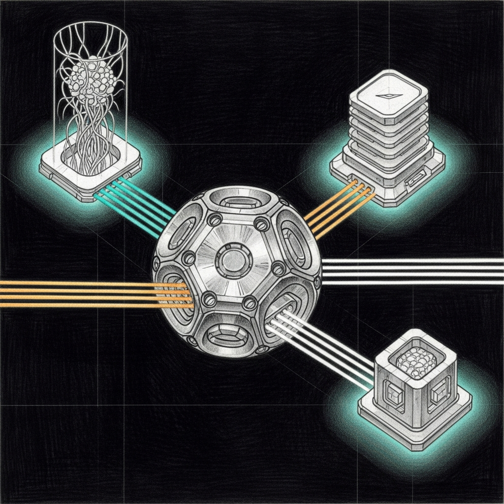

import { Aside, Tabs, TabItem } from '@astrojs/starlight/components';



# The Smart Router

**Date:** 2026-04-07
**Status:** Production (sanctum-server v0.2.0)

The Jedi Council has six agents. Three model tiers. One port. And for longer than anyone wants to admit, every request went to the same backend regardless of what it was asking for.

This meant Yoda — wise, measured, trained on Council doctrine — was fielding questions about Python async patterns. And Coder-14B, a model that has never heard of the Living Force and does not care, was being asked to channel Qui-Gon's infrastructure wisdom. The results were exactly as useful as you'd expect. Sending a coding question to a model trained exclusively on Jedi personas produces responses that are spiritually rich and syntactically devastating.

The Smart Router extends `sanctum-server` (Rust/Axum) with multi-backend dispatch. One port, multiple brains. Requests are routed based on the `model` field, glob patterns, or intent classification from the prompt content. The right question goes to the right brain, and the brains stop having identity crises.

## Architecture


## Routing Tiers

Four tiers, in order of precedence. The router tries the cheapest match first and escalates only when it has to think.

| Tier | Mechanism | Example | Latency |
|------|-----------|---------|---------|
| 1 | Exact model name | `"model": "coder"` → Coder backend | 0ms |
| 2 | Glob pattern | `"model": "council-heartbeat"` matches `council-*` | 0ms |
| 3 | Intent keywords | Prompt contains "debug" + "python" → Coder | ~1ms |
| 4 | Default | No match → Council (configurable) | 0ms |

Tier 1 and 2 are pure string matching — zero overhead. Tier 3 scans the prompt for keywords, which sounds expensive until you realize it's checking a dozen strings against a single message. The ~1ms is generous. Tier 4 is the safety net: if nothing matches, send it to Council and let the persona model do what it was trained for.

## Configuration

Router config lives in `~/.sanctum/instance.yaml` under the `router:` key. Current (2026-04-23) topology after the Olympics-informed rework:

```yaml
router:
  backends:
    council-secure:
      url: https://127.0.0.1:1337/v1         # mTLS-only
      models: [yoda, mothma, windu, cilghal, mundi, jocasta, council-*]
      description: "Qwen3.6-35B-A3B - haus default (0.957 on Olympics)"
      fallback_urls: [https://100.0.0.55:8903/v1]
      ca_cert_path:  ~/.sanctum/certs/ca.crt
      client_cert_path: ~/.sanctum/certs/clients/sanctum-server.crt
      client_key_path:  ~/.sanctum/certs/clients/sanctum-server.key
    coder:
      url: http://127.0.0.1:1234/v1          # socat → sanctum-mlx-coder mTLS :1338
      models: [coder, code-*, "*coder*", quigon, ahsoka]
      description: "Qwen2.5-Coder-14B - pure code + Qui-Gon + Ahsoka (chalet 16 GB)"
    cloud:
      url: https://openrouter.ai/api/v1
      models: [opus, opus-4.7, claude-*, escalation]
      description: "Claude Opus 4.7 - Yoda/Mundi escalation (0.887)"
      api_key_env: OPENROUTER_API_KEY
    spatial:
      url: https://generativelanguage.googleapis.com/v1beta/openai/v1
      models: [gemini, gemini-3.1-pro, windu-spatial, spatial]
      description: "Gemini 3.1 Pro via Google AI Studio Ultra - Windu spatial/topology"
      api_key_env: GOOGLE_AI_API_KEY
  default: council-secure
```

### Jedi → backend assignments

This table reflects the **post-2026-04-28 routing**, when the Council went heterogeneous. Every Jedi now starts on a different model family by default and falls back to the local Qwen3.6 if the primary path fails. See [(Neuro)diversity is Paramount](./neurodiversity-doctrine.mdx) for why we did this and what it bought us.

| Jedi | Primary | Fallback | Why |
|---|---|---|---|
| **Yoda** | **cloud — Claude Opus 4.7** (Max sub via `<MINI>:3456`) | council-secure | Synthesis, council coordination, novel reasoning; the seat where one wrong call is expensive |
| **Mundi** | **cloud — Claude Opus 4.7** (Max sub) | council-secure | Fund decisions, tax / FBAR edge cases, financial reasoning |
| **Qui-Gon** | **coder — Qwen2.5-Coder-14B** (`sanctum-mlx-coder` mTLS `<MINI>:1338`, with socat plain bridge on `:1234`) | council-secure | Dense code gen, infrastructure pragmatism; ~48 tok/s on the Mini post Phase 1B fusion |
| **Windu** | **spatial — Gemini 3.1 Pro** (Google AI Studio Ultra) | council-secure | Spatial reasoning is Gemini's strongest discipline — perimeter, network topology, zone maps |
| **Cilghal** | **council-secure — Qwen3.6-35B-A3B** (sanctum-mlx, mTLS-only) | (no remote fallback) | Health data is privacy-critical; stays in the haus, always |
| **Mothma** | council-secure — Qwen3.6-35B-A3B | council-secure | SystemdLog 0.94, LaunchAgent 0.88 on Olympics — local-only by mandate |
| **Jocasta** | council-secure — Qwen3.6-35B-A3B | council-secure | Email / CRM; privacy-first |
| **Ahsoka** | coder — Qwen2.5-Coder-14B (chalet `sanctum-mlx-coder`) | — | Runs on a Mac Mini M1 16 GB at the chalet; 35B won't fit |

Cloud Opus runs through the Claude Max subscription bridge at `<MINI>:3456`, not the metered Anthropic API. Routine Council questions consume zero API credits. Bring-out-the-good-china reasoning happens for the price of the monthly subscription, not per-token.

The Olympics (2026-04-23) informed this lineup: Qwen3.6-35B-A3B at 0.957 is still the haus default for any seat without a domain-specific upgrade — Mothma/Jocasta/Cilghal stay there because their work is privacy-critical or local-by-mandate, and Coder-14B (0.929) stays on the bench for coding-specific work and the chalet where RAM is the constraint. Opus 4.7 and Gemini 3.1 Pro now sit at the head of two seats each, not as escalations. See [Model Comparison](./model-comparison) for the full per-task score breakdown and [(Neuro)diversity is Paramount](./neurodiversity-doctrine.mdx) for the doctrine that made this routing the default rather than the escalation.

### Two routing layers, one Council

There are now two routers in front of every Council request, and they answer different questions:

| Layer | Lives at | Routes by | Caller |
|---|---|---|---|
| **openclaw-gateway agents.list** | `<VM>:1977` then `<MINI>:4040` (proxyd) | Agent identity → primary model | `openclaw agent --agent <id>` calls; the daily Council interface |
| **sanctum-server Smart Router** (this page) | `<MINI>:8900` | Model name + glob + intent classification | Direct API callers (eval harness, integrations, anyone hitting `/v1/chat/completions` with an explicit `model:`) |

The agent layer chooses the model from the agent's role. The Smart Router chooses the backend from the model name. They compose: an agent call resolves to a model alias on the agent side, then the Smart Router (or proxyd, the per-tier router) maps that alias to a backend. The flow `openclaw agent --agent main → council-max-thinking → :3456 (Claude Max bridge) → Opus 4.7` is the canonical path for Yoda after 2026-04-28.

To verify the agent-layer routing is healthy:

```bash
~/Documents/Claude_Code/tools/test-council-routing.sh
```

The script invokes each Jedi, parses the embedded execution trace's `winnerModel` field, and asserts each one reaches their assigned model. Five passes means the Council is heterogeneous and behaving. Run it ~weekly; cloud paths fail silently sometimes (rate limit hits, billing flips, preview models get deprecated) and the script catches drift before the morning briefing notices.

The `models` arrays are glob patterns. The `intent_keywords` are plain strings matched against the last user message. If you're wondering whether regex would be more powerful here — yes, and also no. Keyword matching is predictable, debuggable, and has never once woken anyone up at 3 AM with a catastrophic backtrack.

## Endpoints

| Endpoint | Description |
|----------|-------------|
| `POST /v1/chat/completions` | Routed chat — selects backend automatically |
| `GET /v1/models` | Lists all registered backends |
| `GET /v1/backends` | Backend names + patterns |
| `GET /health` | Reports `"mode": "routed"` or `"single"` |

## Implementation

The router is a new Rust module in `sanctum-server/src/router.rs`. The `HttpProxyBackend` in `backend.rs` handles the actual proxying to any OpenAI-compatible endpoint, with automatic detection of streaming (SSE) vs non-streaming (JSON) responses.

Non-quantized and quantized backends both work. The proxy handles think-tag stripping (`strip_thinking` flag) regardless of which backend processes the request. The router doesn't care what the backend is running — `sanctum-mlx`, the legacy `socat` plain bridge, a cloud API behind a cost-capped proxy — as long as it speaks OpenAI-compatible HTTP. This is the correct amount of opinion for a routing layer to have.

<Aside type="tip">
The `/v1/backends` endpoint is useful for debugging. Hit it when you're not sure which brain is answering. Because at some point you will be staring at a response and thinking "this doesn't sound like Yoda" and you'll want to know whether the problem is the model or the route.
</Aside>

## Tests

23 tests total: 18 unit (pattern matching, think-tag stripping) + 5 e2e (mock backends, full binary, pattern routing, intent classification, default fallback).

```bash
cd sanctum-server && cargo test
```

The e2e tests spin up 3 mock Axum servers, launch the actual `sanctum-server` binary with a temp config, and verify requests land on the correct backend. Three fake brains, one real router, zero ambiguity about who answered.

The router exists because "send everything to the same model" is a strategy in the same way that "forward every email to the CEO" is a strategy. It works until it doesn't, and then it fails in ways that are obvious to everyone except the system that's doing it.
