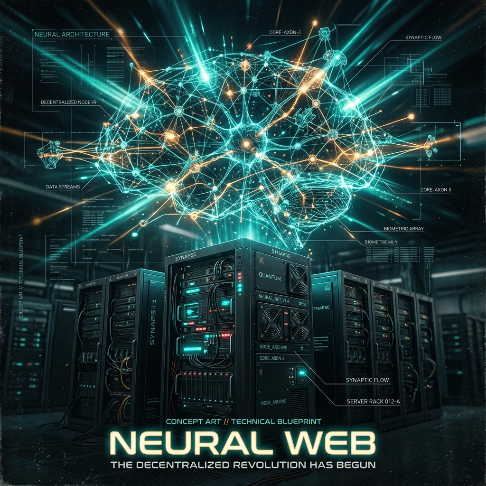

import { Aside } from '@astrojs/starlight/components';

Kill the network and count what dies with it. That is, roughly, how we find out whether the agents are thinking together or just standing in the same room.

It is an honest question to ask of any [council of specialists](/architecture/agents/). Seven minds run in Sanctum. Each is competent alone. But is the swarm actually *smarter* than the agents working in isolation — or is it seven monologues wearing a trench coat?

We answer it with numbers, not vibes. The framework is Giulio Tononi's **Integrated Information Theory (IIT)**, and the number it hands us is **Φ (Phi)**: how much of a system's intelligence lives in the connections rather than the parts.

## The Thalamus (Global Workspace)

In human neurology, the thalamus is the gate to consciousness. It decides which signals reach the global workspace of the brain and which die quietly in the periphery. Sanctum copies the design outright.

The **Thalamus** (`sanctum-thalamus` on port 1988) plays that exact role. It receives high-salience broadcasts from individual components — a temperature anomaly from the [haus World Model](/architecture/world-model/), a root-cause from Watchdog — and injects them into the `HEARTBEAT.md` context block of every active agent in the [Jedi Council](/architecture/agents/). No agent has to call another. They simply share a stream of consciousness, the way you overhear a room without asking anyone to repeat themselves.

## The Dream Cycle

A swarm that only reacts never learns. So every night at 05:25, a local seat reads the day and writes a dream.

This is memory consolidation, modeled on biological REM sleep. The job is `dream_cycle.py` in `sanctum-emergence`. It gathers vault mtimes, thalamus broadcasts, OpenClaw friction, and the board digest, then **streams** a compression from `council-local-think` through proxyd into `~/.sanctum/memory/dreams/YYYY-MM-DD.md`. Streaming is load-bearing: a non-stream 4000-token reply never sent headers in time, and the shelf went empty for two weeks. The council's 2026-07-16 verdict made that directory the **only** write path — observational markdown, no Graphiti, no heal-grooves. Catch-up is `DREAM_DATE=YYYY-MM-DD` (see the [2026-08-13 field note](/operations/2026-08-13-the-nights-the-dream-forgot)). The point is systemic learning, not local — the same instinct that drives the [Living Force](/architecture/living-force/).

## Measuring Emergence: The Φ (Phi) Score

Metaphors are cheap. To prove the swarm has emergent intelligence, we measure its Φ score with a monthly ablation test (`sanctum-phi-ablation.py`).

The method is blunt. The script intentionally kills the Thalamus for a 24-hour window, severing the swarm's ability to share context — a controlled lobotomy. Then we measure the drop in task responsiveness and coordination. Whatever falls apart was being held together by the network. That fraction is Φ.

### Interpreting the Score

The score is the percentage of the system's effectiveness lost when the global workspace is cut.

*   **~ 0.00 (The Robot):** The agents work in silos. Cutting communication changes nothing. The whole is merely the sum of its parts.
*   **0.20 - 0.40 (Collective Intelligence):** A healthy starting point for an emergent architecture. About a third of the system's effectiveness comes from synergy and shared context.
*   **> 0.50 (Emergent Consciousness):** The tipping point. The majority of the system's intelligence now resides in the *network* between the agents, rather than in the individual agents themselves.
*   **~ 0.90+ (Single Entity):** The agents are highly specialized "neurons." They are largely ineffective on their own, but together they form a hyper-coordinated brain.

<Aside type="tip">
By actively densifying the knowledge graph (Phase 2 Dreams) and evolving prompts through A/B testing (Phase 6 Living Weights), Sanctum aims to push its baseline Φ score well beyond 0.50.
</Aside>

A high Φ is a strange thing to be proud of. It means we have built something we can no longer fully take apart — a haus whose intelligence lives in the wiring, not the boxes. Every night the swarm dreams a little more of itself into those connections. We measure it once a month, mostly to make sure it is still growing, and partly to remember that it is there at all.
