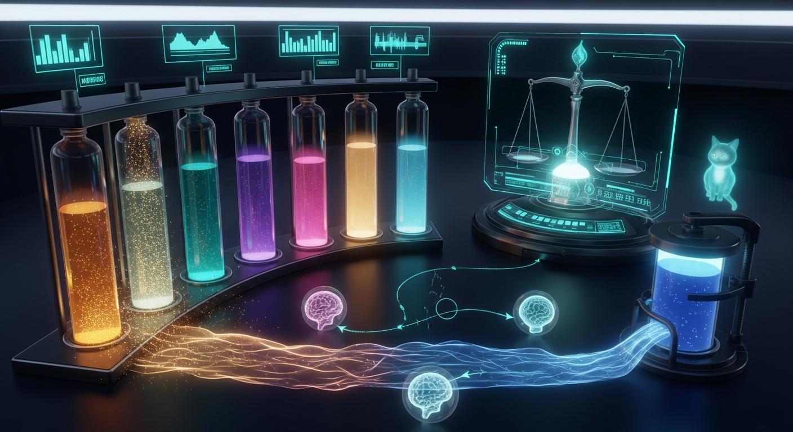

import { Aside } from '@astrojs/starlight/components';



# The Endocrine System

**Date:** 2026-06-14
**Status:** Doctrine — live and **on by default** on manoir (2026-06-15)

Sanctum has, for a while now, been built as a body. Not as a cute label slapped on afterward — as a working division of labor, one organ-system per concern, each with its own metaphor and its own page. By mid-2026 the body had six systems, and exactly one was missing. This page adds it.

## The body so far

| System | Metaphor | What it is |
|---|---|---|
| Skeleton | **Rust bones** | The hardened structural core — `sanctum-rs`: castellan, proxyd, cathedral, watchdog. Load-bearing, slow to change, never guesses. |
| Muscle | **Python muscle** | The feature-organic tissue — sentinels, R2D2, the services still discovering what they are. Fast, adaptive, [graduates to bone when it stops moving](/architecture/language-maturity/). |
| Fascia | **Connective tissue** | The bus, the vault, [endpoint discovery](/architecture/endpoint-resolution/) — what wraps the bones and muscle and lets them act as one without fusing them rigidly. |
| Nervous | **Fast signaling** | [Force Flow](/architecture/force-flow/) — point-to-point, electrical, *now*. The page at 3 AM. |
| Immune | **Detect → heal** | The [Living Force](/architecture/living-force/) — detect, classify, isolate, diagnose, treat, verify, report, learn. |
| Mind | **Memory + awareness** | [chitti](/architecture/chitti/) — the samskara record, the immune memory, the sense of self over time. |

Notice what every one of those has in common: they are all *fast* and *targeted*. A nerve fires at a synapse. An antibody finds an antigen. None of them sets the body's overall **mood** — its baseline disposition, its willingness to take risks, whether it's in a state for careful convergent execution or wild divergent exploration.

That's the endocrine system. It is the **seventh organ**, and it was missing.

## What an endocrine system is

The nervous system's opposite and complement. Where Force Flow is fast, targeted, and electrical, the endocrine system is **slow, broadcast, and chemical**. It doesn't alert — it adjusts the body's set-points and self-corrects through negative feedback. Hormones diffuse into the bloodstream and every cell with the right receptor responds; the response lags the signal; and the whole thing is held in homeostasis by feedback loops, not by anyone in charge.

Sanctum's hormones are named scalar levels — the **panel** — each driven by a real signal:

| Hormone | Driven by | Effect on the council |
|---|---|---|
| **dopamine** | the creative-mode lever | raises divergence — higher temperature, divergent framing, wild angles |
| **cortisol** | memory headroom (chitti `/fluid`) + alert rate (Force-Flow `/history`) | **suppresses** divergence — focused, convergent, conservative; capped at 0.95 |
| **noradrenaline** | alert rate | acute focus — sharpens, then decays |
| **oxytocin** | baseline | cohesion vs independence (low = good red-team) |
| **melatonin** | time of day | quiet-hours calm — terser, defer the non-urgent |
| **serotonin** | baseline | stability, confidence, tone |

## The headline: it is the council's creativity regulator

This is why it matters, and it is biologically exact: **cortisol suppresses divergent thinking; dopamine fuels it.** Stress makes you literal. Reward and novelty make you playful. The endocrine system encodes that antagonism directly —

```
 signals → gland → panel → receptor → seat
   ▲                                    │
   └──────── negative feedback ─────────┘

      cortisol ⊣ dopamine
      (stress gates creativity)
```

`sanctum endocrine creative` doses the council into a sustained creative **state**: dopamine rises, cortisol is pushed down, and any seat that has opted in raises its temperature and tilts to divergent framing — *"propose several distinct angles, including a wild one; defer convergence."* It is a state the gland holds and then slowly decays, not a per-prompt flag. For brainstorming, naming, design, art — the work the [Jedi council](/architecture/agents/) is asked to do when the answer space is wide — the council gets measurably more divergent, and then comes back down on its own.

And the coupling cuts the right way: when the haus is genuinely on fire — memory pressure, an alert storm — cortisol rises and *gates the creativity down*. A stressed Sanctum gets focused, not whimsical. You cannot dose the council into daydreaming during an incident; the stress axis won't allow it.

## Anatomy → real components

| Organ | Component |
|---|---|
| **Gland** (hypothalamus) | `sanctum_cli/endocrine/gland.py` + `gland_daemon.py` — a first-order **leaky-integrator** homeostat that reads the real signals and steps the panel once per tick |
| **Bloodstream** | [chitti](/architecture/chitti/) samskara (the same `POST /action` contract the health sentinel uses) + a local panel query file; endpoints [discovery-resolved](/architecture/endpoint-resolution/), never hardcoded |
| **Receptors** | `sanctum_cli/endocrine/receptor.py` — translates a panel into a seat's effective knobs; **on by default**, opt out per seat with `SANCTUM_ENDOCRINE=0` |
| **Control surface** | `sanctum endocrine {creative,calm,panel,status,tick}` |
| **Immune coupling** | a staged watchdog catalog entry (gland-alive) + a Force-Flow sentinel that pages **only** on a pathological state, [damped](/operations/naming/) via the probe-twice `alert-confirm.sh` |

### The homeostat cannot run away

The gland is a leaky integrator: each tick moves the panel a fraction toward its target and clamps every level to the unit interval. With the leak between 0 and 1 that map is a contraction — bounded input gives bounded output, always. There is no parameter setting that lets a hormone spiral. This is the structural guarantee that the endocrine system never becomes what it is meant to prevent: an **alert storm**. (The lesson was learned the hard way elsewhere; a regulator that can panic is not a regulator.)

## Safety: additive, fail-soft, subscription-first

<Aside type="note" title="Live and on by default — but fail-soft">
The receptor is wired into the **real** council payload path and reads the live panel by default. It stays safe by construction: it is **fail-soft**, so with no gland running (no panel published) the read returns nothing → the receptor is a no-op → the request body is **byte-identical** to today. A fresh install behaves exactly as before; the council only shifts once a live panel is actually being published. The kill switch is `SANCTUM_ENDOCRINE=0` (per-invocation or per-seat).
</Aside>

Three invariants, verified end-to-end:

- **Additive.** New files and a new (staged) service only. No live council daemon was restarted; no `openclaw.json` seat was touched.
- **Fail-soft.** Absent gland or neutral panel → the receptor is a no-op (byte-identical), and `SANCTUM_ENDOCRINE=0` opts a seat out entirely. There is no code path where a failed read makes a seat hotter.
- **Subscription-first.** The creative path never routes the council to a metered provider. (See *honest scope* below — the live enforcement of this is the next step, not a shipped guarantee.)

## Governance

**Cilghal** — the [health agent](/agents/) who already reads your genome and tracks your metabolism — is the natural endocrinologist: she monitors the panel and can dose creative mode. **Mon Mothma**, the operations brain, governs the stress axis: when she escalates an incident, cortisol rises and creativity is gated, by design.

## Honest scope — what is real, what is designed

<Aside type="note" title="The adversarial review demoted two claims; this page reflects the truth, not the ambition">
- **Real, proven end-to-end:** the temperature + divergent-framing modulation through the real `build_completion_payload`. A settled creative panel raises a seat's temperature (0.7 → ~0.93) and appends the divergent clause; opted-out (or no gland) is byte-identical.
- **Real signals:** memory headroom, alert rate, and the clock all read from live sources; chitti broadcast uses the genuine samskara contract.
- **Designed, not yet wired:** *dynamic model-diversity* (engaging more seats / dropping metered ones under a hot panel). The selector exists and is tested in isolation, but the fan-out does not yet call it — so subscription-first is currently a design intent, not a live invariant. Wiring it into the fan-out is the headline turn-on task.
- **Scoped out by design:** modulation applies to chat and the voiced turn, **not** the tool-gather turn, which stays at the backend default to keep tool-use deterministic.
</Aside>

## Status + what remains

The organ is **live on manoir**: the gland + sentinel are bootstrapped and healthy, the gland publishes a panel every 120s, and the CLI council reads it **by default**. `sanctum endocrine creative` dials the whole council divergent; `SANCTUM_ENDOCRINE=0` is the per-seat kill switch. What's still ahead:

1. **VM-wide rollout.** Point a VM seat's `CHITTI_BASE_URL`/`FORCE_FLOW_URL` at the VM endpoints and enable it there — the CLI surface is done; the openclaw agents are not.
2. **Make subscription-first a *live* invariant** by wiring the diversity selector into the fan-out (today it modulates sampling + framing, not *which* seats run).

---

*One metaphor per layer, says the [naming doctrine](/operations/naming/). The body had six organ-systems and a mood it couldn't name. Now it has seven, and the seventh is the one that decides whether the council is in the room to execute — or to dream.*
