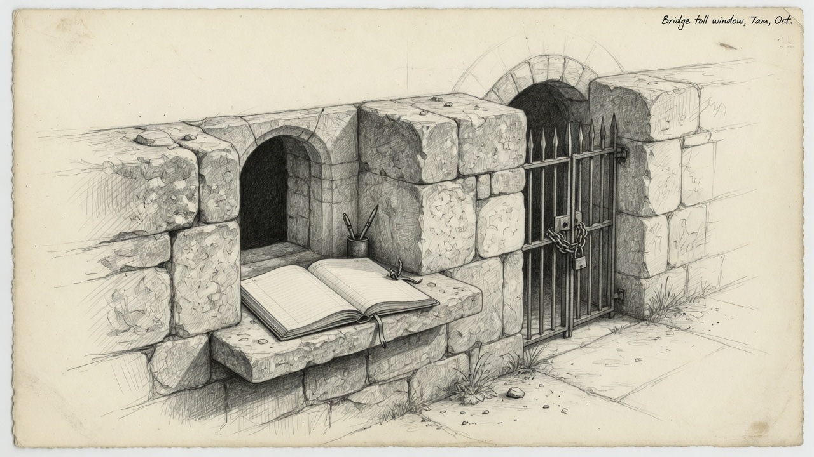

Mundi can see the money. He still cannot move it.

**Date:** 2026-09-30 · **Status:** Active

A finance agent who can click Confirmer will eventually click Confirmer. The finance window is the Mac program in front of that click. It reads balances, drafts a payment, and stops.

## The failure

Put the brokerage socket and the bank session on the same port and a sell request looks like a balance check. Put confirm in the tool list and a prompt becomes a payment. This window refuses both.

The sell window already has its own door. This one does not borrow it.

## What you run

You start it. It does not start at login.

```bash
finance-window
test-finance-window
```

Loopback is the local check. Every interface is refused. Port 8765 is refused too. That port belongs to the [IBKR Sell Window](/architecture/ibkr-window/).

The listener uses the Lima bridge, port 8766, when you start it for Mundi.

## What Mundi may call

Reads and drafts. Personal National Bank balances. Chase balances, and a wire book that lives only on the Mac. A Banque Nationale draft.

`apply` is accepted for one action. Prepare the payment in the Safari session you already have open. Then stop on Confirmer.

The ledger close is not on this port. After you have sent the payment, you record it on the Mac, with `--confirmed`, into accounts the ledger already has open.

He cannot pass a path, a URL, or a label. The books stay the ones on the Mac. The log stores the provider and the action. It does not store the arguments.

## The smoke

[Engineering Discipline](/architecture/engineering-discipline/) is the bar, and [Agents](/architecture/agents/) is who holds the seat. `test-finance-window` runs the suite, then calls `finance-window` through `~/.sanctum/bin`. Green means the refusals hold and the live wrapper is the one on `PATH`. It does not open Safari, it does not pull a bank feed, and it does not sell.

You still confirm the payment yourself.
