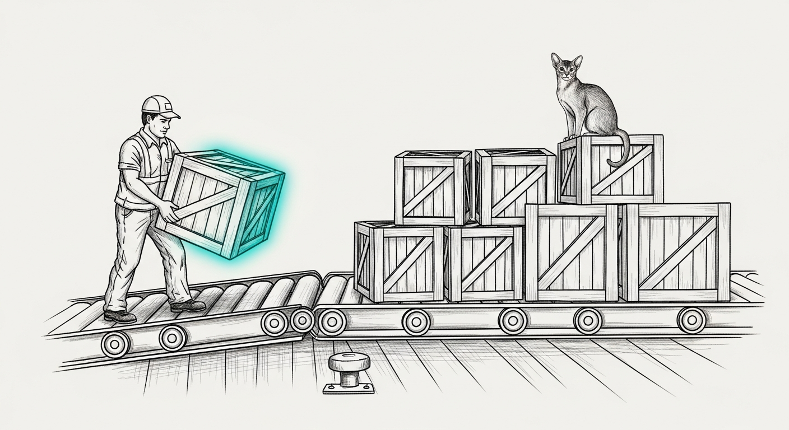

import { Aside, Steps } from '@astrojs/starlight/components';



Several machines and several agent sessions commit to the same `main`. Nothing about `git` stops two of them from landing at once, and the failure is never loud — it looks like a successful push that quietly took someone else's work with it, or dropped it. `gitsync` is the Durability Doctrine compiled into a script, so nobody has to remember it at 2am.

```bash
gitsync -m "message" <path>...   # commit those paths, rebase onto origin, push
gitsync --init                   # apply the safe git config to this clone
gitsync --status                 # show divergence and dirty state, change nothing
```

## The three failures it prevents

**The ride-along.** `git add -A` in a shared working tree commits whatever another session happened to leave on disk. `gitsync` refuses to run without an explicit path list, and commits with `git commit -o`, so a file you did not name cannot ride along even if it is staged.

**Merge spaghetti.** Every integration is a rebase onto `origin/<branch>`, with `rebase.autostash` so another session's uncommitted work is set aside and restored around it. Shared `main` stays linear.

**The silently-dropped submodule.** A submodule-pointer conflict is the one case `gitsync` will not resolve for you. Both sides look like a one-line change to the same file, so "take mine" is a coin flip that discards a real commit. It stops, prints the fix, and leaves your commit safe on your branch. `rerere` records whatever you decide and replays it next time.

<Aside type="note">
`--init` applies `rerere.enabled`, `rerere.autoupdate`, `pull.rebase`, `rebase.autostash`, and `submodule.recurse false` to a clone. Running `gitsync -m` applies the same config first, so a fresh clone is safe on its first landing.
</Aside>

## Installation

The script lives in the machine's config repo and is reached through a symlink on `PATH`, so the tracked file *is* the live file and there is no copy to drift:

| Machine | Tracked at | Reached via |
|---|---|---|
| The Mini | `~/.sanctum/bin/gitsync` | already on `PATH` |
| The MacBook | `~/.sanctum-mbp/bin/gitsync` | `~/.local/bin/gitsync` symlink |

Both copies must stay byte-identical — same tool, two machines, one behaviour:

```bash
shasum -a256 ~/.sanctum-mbp/bin/gitsync
ssh neo@manoir.local 'shasum -a256 ~/.sanctum/bin/gitsync'
```

If those differ, one machine has been patched and the other has not. Fix the drift rather than living with two dialects of the same tool.

<Aside type="caution">
The MacBook had no `gitsync` until 2026-07-27. "Land work with `gitsync`" was doctrine that machine could not follow, so work there was landed with hand-rolled `git` — and that is exactly how the `Claude_Code` submodule pointer ended up diverged that same day. A rule only one machine can obey is a rule that is not enforced.
</Aside>

## Using it inside a submodule

`gitsync` requires a real branch and stops on a detached HEAD. Submodules are detached by default after `git submodule update`, so it appears broken in exactly the repo you most want it in. Attach the submodule to its branch first:

<Steps>

1. Fetch the branch you intend to work on.

   ```bash
   cd ~/Projects/Claude_Code/sanctum-docs
   git fetch origin main
   ```

2. Check out the branch.

   ```bash
   git checkout main
   ```

3. **Fast-forward it.** This step is not optional.

   ```bash
   git merge --ff-only origin/main
   ```

</Steps>

<Aside type="danger">
A local `main` ref can be far behind `origin/main` — on 2026-07-27 it was 28 commits behind — and checking it out **silently rewinds the working tree**, reverting already-committed work in the checkout with no error and no conflict. The files simply change under you.

Confirming that `HEAD` matches `origin/main` does **not** catch this. A detached HEAD can sit exactly on `origin/main` while the branch ref you are about to check out is stale. Compare the branch you are switching *to*, not the commit you are standing *on*:

```bash
git rev-parse main origin/main   # these are the two that must agree
```
</Aside>

## What it does not do

It does not resolve conflicts, force-push, or touch anything you did not name. On a conflict it aborts the rebase and leaves your commit intact on your branch — the recovery is always "resolve by hand, re-run `gitsync`", never "run it again harder".
