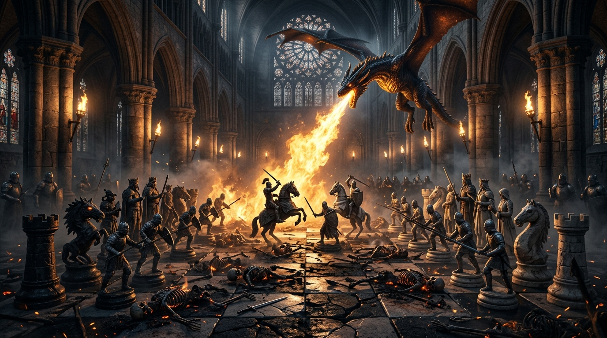

import { Aside } from '@astrojs/starlight/components';



**Great Hauses** is Sanctum's flagship tactical battlefield engine — a 3D dark-fantasy medieval chess game built in Godot 4 for macOS desktop and Apple Vision Pro spatial computing (`visionOS`). It pairs classical tournament chess mechanics with real-time cinematics: dynamic camera direction, house heraldry banners, dragon spectators, and a 3-tier VFX moments system.

**Date:** 2026-08-15  
**Status:** Shipped (macOS Desktop & visionOS Immersive Space)  
**Repository:** `great-hauses-core`  

---

## 1. Architectural Foundation: Headless Core & Presentation Split

To ensure absolute determinism, cross-platform portability, and headless automated testing, Great Hauses enforces a strict separation between chess logic and 3D presentation:

```
┌─────────────────────────────────────────────────────────────┐
│                    3D Presentation Layer                    │
│  BoardView │ PieceView │ DuelDirector │ DragonSpectator      │
├─────────────────────────────────────────────────────────────┤
│                    Cinematics & VFX Engine                  │
│  MomentGovernor │ MomentScore │ MomentContext │ Ledger      │
├─────────────────────────────────────────────────────────────┤
│                     Deterministic Engine                    │
│    ChessState    │      ChessMove     │       ChessAI       │
└─────────────────────────────────────────────────────────────┘
```

1. **Deterministic Core:** Pure `RefCounted` GDScript modules (`ChessState`, `ChessMove`, `ChessAI`) managing FEN parsing, pseudo-legal move generation, bitboard-style board state, and minimax evaluation with zero scene tree dependencies.
2. **Headless Testability:** The entire chess rule engine, AI difficulty curves, and cinematic timing gates run headlessly in CI without allocating GPU contexts.

---

## 2. Military-Grade 3-Tier VFX Moments System

To deliver high-impact kill animations without degrading tactical flow or pacing, we designed a situational scoring and reservoir governor architecture:

### The Scoring Hierarchy
Every piece capture is evaluated in real-time across multiple tactical dimensions:
- **Material Delta:** Queen sacrifices, piece exchanges, and pawn promotions.
- **King Proximity & Pressure:** Attacks within the opponent's castled perimeter.
- **Blunder & Turning-Point Swings:** Eval swings probed via background depth probes.
- **Grudge & Revenge Multipliers:** Tracking historical piece interactions across the match.

```gdscript
# Moment Scoring Matrix
Tier 2 (Showstopper, 5-8%): Queen sacrifices, dramatic checkmates, massive eval swings
Tier 1 (Flourish, 15-20%):  Tactical forks, rook roars, bishop sniper bolts
Tier 0 (Standard, 75-80%):  Clean, fast strikes with zero gameplay delay
```

### The Reservoir Governor
The `MomentGovernor` regulates cinematic cadence. It prevents "VFX fatigue" by tracking recent capture density, ensuring showstopper slow-mo curves (`Engine.time_scale` dipping to `0.15`) are reserved for genuine turning points.

---

## 3. The Carmack Optimization: 60/120 FPS Skeletal Animation

During early testing of the dragon's ashfall sweep, skeletal animation exhibited micro-stutters and choppy bone playback when manipulating the playhead:

### The Bottleneck
Godot's `AnimationPlayer.seek(t, true)` forced synchronous skeletal re-evaluation and bone cache flushes on every frame. When combined with large skinned meshes (such as the giant dragon model), this stalled the CPU-GPU pipeline.

### The Solution
```gdscript
# Carmack Optimization in dragon_rig.gd
anim.seek(maxf(t, 0.0), false) # update: false lets Godot's bone interpolation cache run smoothly
```
Switching to asynchronous bone interpolation eliminated pipeline stalls, delivering locked **60 FPS** on desktop Metal and **120 FPS** on Apple Vision Pro.

---

## 4. Zelda-Grade Aesthetics & Terminator 2 Charred Remains

When the defeated army falls to the dragon's incendiary breath, we implemented a persistent scorched bone aesthetic inspired by *The Legend of Zelda: Breath of the Wild* and *Terminator 2*:

1. **Weathered Calcified Bone PBR Materials:**
   - **Albedo:** Natural aged ivory with charcoal soot gradients (`Color(0.22, 0.20, 0.19)`).
   - **Roughness:** Chalky `0.92` matte calcified surface (non-metallic).
   - **Internal Warmth:** Faint, grounded amber ember traces in bone fissures (`Color(0.85, 0.35, 0.08) * 0.04`), completely avoiding artificial neon glows.
2. **Persistent Battlefield Monuments:**
   - Rather than sinking through the floor and despawning, the defeated army's charred skeletons remain collapsed on their tiles throughout the endgame, leaving a grim and majestic battlefield tableau.

---

## 5. 1-2-3 Punch-Out Zelda Easter Egg Suite

Integrated directly into the engine is a procedural Easter egg suite with zero external asset dependencies:

- **16-bit PCM Procedural Audio Synthesis:** Mathematically synthesized harmonic audio streams for the 8-note Zelda Secret Sound (`G5, F#5, D#5, A4, G#4, E5, G#5, C6`), Item Fanfare, and 8-bit Cucco clucks.
- **Secret Codes & Haus Hyrule Unlock:** Typing `"zelda"` or entering the Konami Code (`↑ ↑ ↓ ↓ ← → ← → B A`) unlocks the **Haus of Courage** (Emerald `#10782b` & Hylian Gold `#f2c94c`).
- **Master Sword Drop:** Triple-clicking the King summons a glowing 3D Master Blade falling into the center of the board with the retro proclamation: *"IT'S DANGEROUS TO GO ALONE! TAKE THIS. 🗡️"*
- **Cucco Swarm:** Rapid rage-clicking (7 consecutive clicks) triggers an angry Cucco squawk with a drifting flurry of 32 golden and white feathers.

---

## 6. Verification & Automated Test Gates

The Great Hauses engine is backed by a 100% green automated test pyramid:

```bash
# Automated Test Suite Verification
tests/test_vfx_moments.gd    ── PASS (3/3 checks)
tests/test_easter_eggs.gd    ── PASS (16/16 checks)
tests/test_dragon.gd         ── PASS (225/225 checks)
tests/test_cinematics.gd     ── PASS (95/95 checks)
tests/test_house_packs.gd    ── PASS (405/405 checks)
E2E Boot & Move Scenarios    ── PASS (25/25 steps)
```
