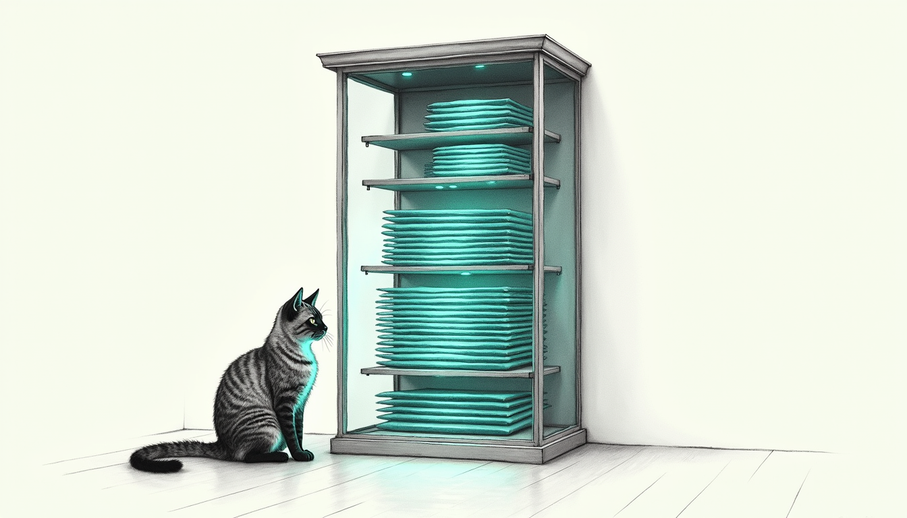

import { Aside } from '@astrojs/starlight/components';

You open the app expecting the haus in one pane of glass. The Haus panel, the Coach digital twin, every [control plane](/architecture/services/), laid out and lit. Instead you get a black rectangle and a Chromium error code. `ERR_BLOCKED_BY_RESPONSE`. Somewhere a FastAPI backend just refused to be framed, and it did it silently — no log, no dialog, just black.

That black rectangle is the problem the Holocron was built to solve. Everything else is decoration.

## Architecture

The Holocron is the native command surface for Sanctum on macOS. It is an Electron app, heavily stylized to feel premium: micro-animations, glassmorphism, a strict Apple-like UX. The renderer is a React SPA built with Vite, talking to the host operating system through IPC bridges. That part is ordinary.

The vital, complicated part is the one you never see. The Holocron renders external Sanctum control planes — the Haus panel, the Coach digital twin — entirely natively, inside one window, without tripping Chromium's strict cross-origin security machinery. Chromium does not want to let it. Here is how it does anyway.

## The Base64 Origin Proxy (ServiceIframe)

Point an Electron `<iframe src="...">` at a backend and Chromium reads the headers that backend sends. FastAPI and uvicorn, doing their job correctly, ship `Content-Security-Policy: frame-ancestors` and `X-Frame-Options`. If a backend declines to be framed, the iframe does not warn you. It drops the connection and paints a blank screen with `ERR_BLOCKED_BY_RESPONSE`.

The brute-force fix — strip those headers globally at the Electron level — is brittle, and it quietly disables protections you want everywhere else. So we didn't. Instead the Holocron runs a dedicated, transparent local HTTP proxy inside its `main.js` process on port 38883.

The React renderer encodes the target **origin** (e.g. `http://10.0.0.5:8770`, one of the hosts on the [node topology](/architecture/node-topology/)) into base64 and constructs a proxy URL, appending the exact requested path:
`http://127.0.0.1:38883/{base64Origin}/panel/`

That one routing schema keeps two very different fetch patterns honest:

1. **Absolute paths resolve safely.** If the iframe's HTML fetches `/global.js`, the browser resolves it against the proxy root (`http://127.0.0.1:38883/global.js`) — no base64 prefix. The proxy detects the missing prefix, intercepts the `Referer` header (`.../{base64Origin}/panel/`), decodes the origin, and transparently fetches `http://10.0.0.5:8770/global.js`.
2. **Relative paths resolve perfectly.** If the iframe fetches `app.js`, the browser resolves it against the iframe's exact URL directory (`http://127.0.0.1:38883/{base64Origin}/panel/app.js`). The proxy splits the base64 origin from the appended path, decodes it to `http://10.0.0.5:8770`, and fetches `http://10.0.0.5:8770/panel/app.js`.

On the way back, the proxy intercepts the response and strips `CSP`, `X-Frame-Options`, and `Cross-Origin-Embedder-Policy` before streaming it to the renderer. The panel loads. Subresources load. Routing works. Any external dashboard — one we wrote, one we didn't — drops into the Holocron looking like it was always part of the app, all while honoring the OS and Chromium sandbox constraints everywhere else.

Qui-Gon, who optimizes everything, calls the proxy elegant. Qui-Gon calls a lot of things elegant. This one earns it: a single routing schema doing the work of a global security exception you would otherwise make once and regret forever.

<Aside type="tip">
When changing the proxy logic in `main.js`, Vite's HMR (Hot Module Reload) does **not** restart the main process. You must fully quit The Holocron (Cmd+Q) and restart it to apply proxy routing changes.
</Aside>

## One pane of glass

The Holocron's whole pitch is that the haus fits in one window. The proxy is what makes "one window" true — the reason the [CLI](/architecture/sanctum-cli/) is not the only way in, and the reason a control plane written in a different framework on a different port still feels native under the glass.

Open it at the end of a day and it is all there: the panels lit, the twin breathing, the grounds quiet. The proxy that makes that possible never announces itself. The best surfaces are the ones you stop noticing. This is one of them — and the black rectangle stays gone.
