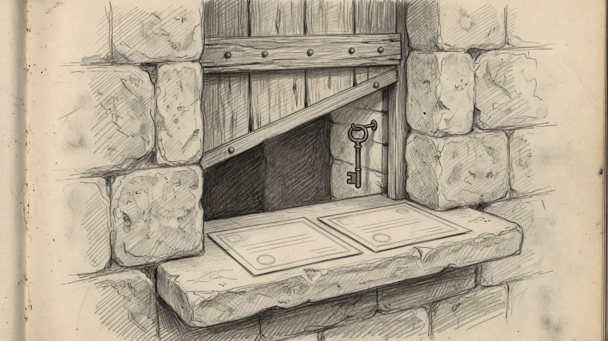

import { Aside } from '@astrojs/starlight/components';



An agent with a brokerage login can sell the wrong name in the wrong account. The sell window is the opposite of that login. Mundi may ask for Meta or Unity only after you write an arm file, and the order that leaves is a day limit.

**Date:** 2026-09-23 · **Status:** Active

Interactive Brokers will not hand you a key that sells two symbols and nothing else. A trading session can trade whatever the account is allowed to trade. The limit has to sit on the Mac, in front of Gateway.

## The failure

Give Mundi the Gateway socket and a prompt injection becomes a market order. Give him a general trading CLI and a missing account id hits the first account on the login. The window refuses both. You arm it. He can only ask.

## What you run

Paper is the default. Gateway listens on `127.0.0.1:4002`. `--live` is port `4001`, and both commands must agree or the sell is refused.

```bash
ibkr-window
ibkr-arm --account U1234567 --sell META,U
ibkr-arm --show
ibkr-arm --disarm
test-ibkr-window
```

`ibkr-arm` prints the contract id and the share count, then asks for a limit floor. That floor is the lowest price you will take. The file lasts until 23:59:59 America/New_York the day you write it. Sells go out only on weekdays, from 09:30 to 16:00 in that zone.

Socket clients on. Localhost only. Read-Only API off for this Gateway session. If an order sits at `PendingSubmit`, it is waiting in Gateway until you press Transmit.

## What the window will send

One shape. Sell, limit, day, regular hours. Symbol `META` or `U`. Quantity at least 1, and no greater than the remaining armed size or the live long position. Limit at or above the floor. Account id explicit, never "the first one."

A working order spends the armed size before it fills. Cancelling it in Trader Workstation does not put the size back. Quitting the window, `ibkr-arm --disarm`, or quitting Gateway each stops the next order.

The arm file is `~/.sanctum/run/ibkr-window/arm.json`. The log is `~/.sanctum/logs/ibkr-window.jsonl`.

## What Mundi may call

The process listens on the Lima bridge. Mundi gets four paths and no others: `/health`, `/accounts`, `/positions`, and `POST /sell`. The body of a sell is the account, the symbol, the quantity, and the limit. He cannot arm, disarm, or open port 4001.

His skill text is not the control. The checks live in the Mac program. Other agents on that VM share the machine, so an unarmed window is the lock.

## The smoke

[Engineering Discipline](/architecture/engineering-discipline/) is the bar, and [Agents](/architecture/agents/) is who holds the seat. `test-ibkr-window` runs the suite, then calls `ibkr-arm` and `ibkr-window` through `~/.sanctum/bin`. Green means the policy holds and the live wrappers are the ones on `PATH`. It does not log into Gateway and it does not send an order.

You still owe the paper fill yourself, with Gateway logged in and a floor you would actually accept.
