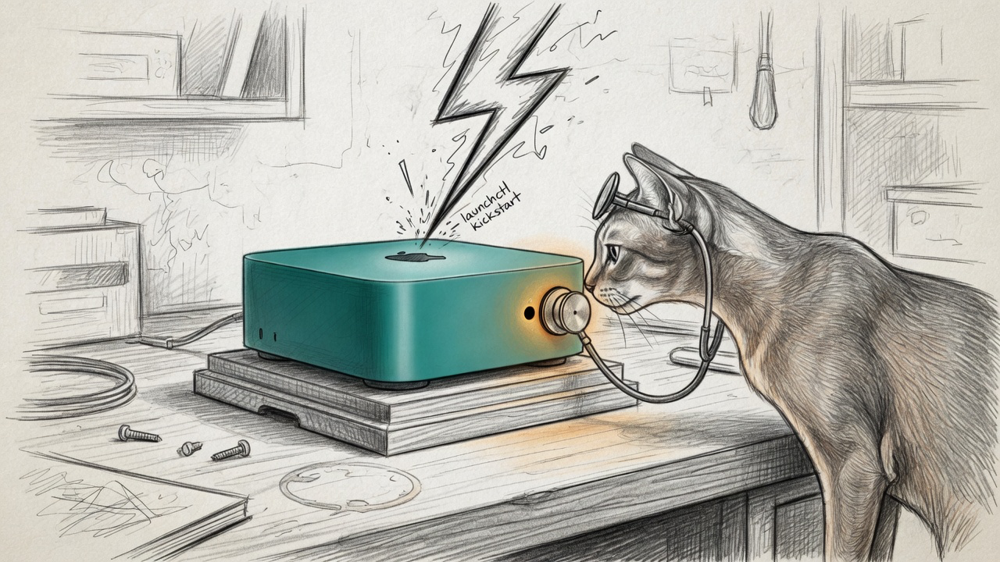

import { Aside } from '@astrojs/starlight/components';



On 16 August 2026 the watchdog wrote `succeeded` next to the endocrine gland. `launchctl kickstart` had returned zero. The tick still died on `import aiohttp`. Force Flow paged `GLAND_DOWN` every half hour, and the immune system congratulated itself.

A week earlier the same organism had the opposite problem: Force Flow itself went dark on `:4077`, and Living Force printed `No remediation command defined`. The catalog re-render of 6 August had dropped `restart_cmd` because `instance.yaml` said `host: manoir` and the renderer only attached LaunchAgent heals when the host string was `mac`. Manoir is the roster name of *this* box. Name before address, again.

Two scars. One sentence: **kickstart is a verb; a green probe is the noun.**

## The six-pack

| Piece | What it refuses to believe |
|---|---|
| Verify-gated wrapper | `heal_system_daemon.sh` sudo-kickstarts, then curls `/health`. No 200, exit 3. |
| service-graph | `remediate` exits 3 if liveness stays red after the command. |
| Hive-local render | `.node_id` (`manoir`) is local. Explicit `launchagent: null` beats the map. |
| Sudoers contract | Only `force-flow`, `memory-vault`, `proxyd`. Any other label is refused. |
| Render-check page | `render_runtime_services.py --check` dirty → drift-sentinel + R2D2 escalate. They do **not** auto-render. |
| Alerts, not access logs | R2D2 ingests `/history`. `GET /health 200` is noise. Context-cap is not a daemon. |

Dashboard liveness is `:1701`, the `PORT` in the plist. `:3002` is a ghost from the passkey era. Watchdog was restarting a healthy UI because it was auscultating the wrong rib.

## What the live yaml actually says

```yaml
# ~/.sanctum/services/force-flow.yaml — rendered from runtime_catalog.yaml
remediation:
  actions:
    - name: kickstart-system-daemon
      cmd: /Users/bert/.sanctum/scripts/heal_system_daemon.sh com.sanctum.force-flow http://127.0.0.1:4077/health
  restart_cmd: /Users/bert/.sanctum/scripts/heal_system_daemon.sh com.sanctum.force-flow http://127.0.0.1:4077/health
```

The wrapper's allowlist is the sudoers envelope, not a suggestion:

```
sudo -n /bin/launchctl kickstart -k system/com.sanctum.force-flow
sudo -n /bin/launchctl kickstart -k system/com.sanctum.memory-vault
sudo -n /bin/launchctl kickstart -k system/com.sanctum.proxyd
```

`com.sanctum.evil` exits 2. The 2026-08-08 class — a green `/health` hiding a dead enforcement loop — is still [heal-force-flow-liveness](/architecture/force-flow/), not this wrapper. First tick can lag ~150s. This path only claims the HTTP surface.

<Aside type="caution" title="A clean --check is the heartbeat. A write is how the last heal died.">
`6e02d09` re-rendered services "to match catalog" and deleted Force Flow's remediation. The sentinel pages when live yaml and the renderer disagree. It never runs the renderer without `--check`. If you want the live file changed, you change the catalog and render on purpose.
</Aside>

## Run it half-awake

```bash
bash ~/.sanctum/scripts/test-kickstart-is-not-a-heal.sh
```

Nineteen checks, no sudo restart of a healthy daemon, no GPU. Renderer clean, four liveness probes, wrapper allowlist, hive-local `.node_id`, R2D2 `--self-check`. Green means the live path still is the repo path.

The unit suites sit under that smoke: `tests/test_render_runtime_force_flow.py` (catalog + sudoers contract), R2D2 `tests/test_history_ingest.py`, openclaw-skills `service-doctor/tests/test_remediate_converge.py`.

## What this is not

[The Resilience Doctrine](/architecture/resilience-doctrine/) is power, WAN, deadman, cold archive — mortality of the haus. This page is mortality of a *heal*: the difference between launching a process and having a service. [The Living Force](/architecture/living-force/) still picks the action. It just does not get to file `succeeded` on a corpse.

Cathedral context-cap (`Proxy All Models Failed`) is not a restart-class fault. R2D2 is taught to skip it. Shrinking the prompt is the fix. Kickstarting proxyd is percussion.

<Aside type="tip">
If a future catalog override for a `system/com.sanctum.*` daemon emits `heal_launchagent.sh`, the renderer test fails and the smoke fails. The gui plist is `.disabled-wave1`. A gui kickstart is a silent no-op — the 8 August enforcement freeze in costume.
</Aside>
