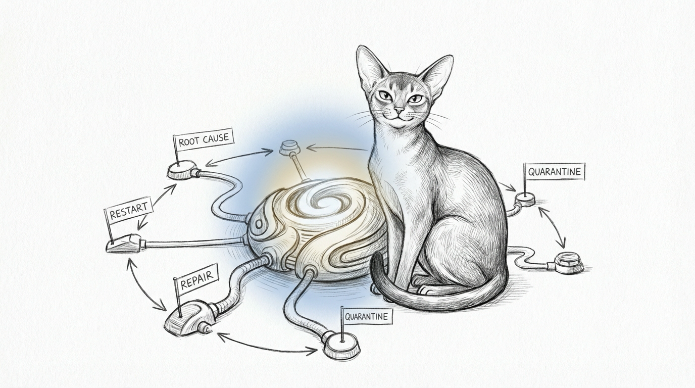

import { Card, CardGrid, Aside } from '@astrojs/starlight/components';
import ZoomImage from '../../../components/ZoomImage.astro';
import livingForce from './images/sanctum-living-force.svg';


On the night of March 22, 2026, bridge100 didn't come up. The VM booted into a world with no bridge to anywhere. Twenty-six services tried to start anyway — each one assuming the last had done its job — and cascaded into failure like a Jenga tower at a toddler's birthday party.

The watchdog ran. It checked ports that had changed months ago. It pinged addresses that no longer existed. It reported: all clear. Meanwhile, Neo4j had entered an unrelated crash loop — its APOC plugin helpfully rewriting its own config into garbage on every restart, then dying on the garbage it had just written. The watchdog missed that too, because the watchdog was checking `localhost:4001` and Neo4j was on `localhost:7474`. Close enough if you're drunk.

A human noticed two hours later. In his underwear. At 4 AM.


That night exposed a truth the architecture had been politely hiding: the system didn't understand itself. It had a list of services and a blunt instrument that restarted them. It had no concept of *why* a service was down, *what* depended on it, or *whether* retrying would make things worse. It was a smoke detector with no batteries, hanging on the wall for decorative purposes.

What followed was not a patch. It was the infrastructure equivalent of burning your house down and rebuilding it with actual load-bearing walls this time.

## Before and After

<ZoomImage src={livingForce.src} alt="The Living Force — from flat watchdog to 6-phase self-healing organism" />

The old watchdog was a security guard asleep at the desk with the monitors turned off. The Living Force is an immune system — it maps its own body, detects illness at the cellular level, quarantines what it can't fix, and learns from every infection. It also holds committee meetings about its own improvement, which is either inspiring or dystopian depending on how you feel about AI governance.

## Three Shapes Of The Organism


The first shape is governance. Incidents are not just resolved; they are turned into explicit doctrine, manifests, and escalation rules. The system has opinions now, which is how you know it has finally become difficult in a more sophisticated way.



The second shape is routing. A healthy system distinguishes between a dead dependency, a bad config, a transient crash, and a service that needs to be quarantined before it embarrasses itself again. Restarting everything blindly is not healing. It is percussion.


The third shape is evolution. Every failure becomes part of the next design decision. Postmortems, proposal synthesis, feature adoption, and calibration all exist to ensure the same class of mistake has to work harder the second time.

## The Eight Phases

<CardGrid>
  <Card title="Phase 1: Service Graph" icon="document">
    Every service gets a YAML manifest declaring its ports, dependencies, health checks, and failure modes. A topological sort builds the dependency DAG. When something breaks, the system traces the graph to the root cause instead of restarting everything and hoping.
  </Card>
  <Card title="Phase 2: Immune System" icon="heart">
    A metrics collector feeds anomaly detection. Failures escalate through a remediation ladder — restart, then repair, then quarantine. Services stuck in crash loops get isolated instead of hammered with retries. The system that lies about its health is more dangerous than the system that fails.
  </Card>
  <Card title="Phase 3: Agent Autonomy" icon="rocket">
    Agents gain the code-forge skill: the ability to write, test, and deploy fixes through a staging pipeline with an audit log. Deployments happen during a night window when the haushold is asleep. Yes, the robots fix things while you dream. No, this is not how Terminator starts. Probably.
  </Card>
  <Card title="Phase 4: Tech Lookout" icon="magnifier">
    Jocasta scans for CVEs, dependency updates, and knowledge frontier shifts on a daily cadence. New vulnerabilities get flagged before they become incidents. The system stops being surprised by the things it should have seen coming.
  </Card>
  <Card title="Phase 5: Battle Testing" icon="warning">
    Chaos-forge runs scheduled fire drills — killing services, severing bridges, corrupting configs — and measures how fast the immune system responds. Think of it as a fire drill where the AI sets the actual fire. On purpose. Monthly. You're welcome.
  </Card>
  <Card title="Phase 6: Continuous Evolution" icon="star">
    Every incident feeds a learning loop. Performance reviews surface degradation trends. Evolution reports propose architectural changes. The system doesn't just heal — it holds post-mortems, writes improvement proposals, and argues with itself about priorities. It's basically a startup with no humans and no funding rounds.
  </Card>
  <Card title="Phase 7: Genetic Health" icon="heart">
    The system expands into the biological layer, recognizing neuro-diversity (ADHD, Dyslexia, ASD) as a first-class cognitive profile. Cilghal's genome-mcp analyzes the owner's 23andMe data to suggest optimal working environments and cognitive scaffolding. Biology informs collaboration.
  </Card>
  <Card title="Phase 8: Centralized Calibration" icon="setting">
    All hardcoded coordinates are eliminated. The Neural Link (Port 1138) and the Living Force Watchdog (Port 2187) draw their configurations dynamically from a single master `holocron-config.yaml`. The system reads its own DNA to align its ports and paths upon every ignition.
  </Card>
</CardGrid>

## Phase 2 in Practice: The HA Self-Healer

The Immune System phase sounds elegant in the abstract — anomaly detection, remediation ladders, quarantine protocols. In practice, it means Qui-Gon stares at Home Assistant every thirty minutes and asks: "Are the lights still talking to us? How about the cameras? The thermostat? The thing that knows whether the doors are locked?"

The answer, with alarming regularity, is no.

Home Assistant manages 55 Tuya smart lights (cloud API), 4 Ecobee sensors (HomeKit Controller), 4 Ring cameras, 10 Sonos speakers, Alarmo (alarm panel), and 24 automations that do everything from turning on the porch light at sunset to arming the house when everyone leaves. Each integration has its own failure mode, its own opinion about reconnection, and its own way of dying silently while the dashboard stays green.

The `ha-self-healer` skill at `~/Projects/openclaw-skills/ha-self-healer/` is Phase 2's concrete implementation. It runs a five-stage pipeline:

1. **Diagnose** (`ha-diagnose.sh`) — queries the HA API for every integration, entity, and automation. Assigns a severity: 0 (OK), 1 (warning), 2 (attention), 3 (degraded), 4 (critical).
2. **API Heal** (`ha-heal-api.sh`) — reloads integrations, restarts the container, re-enables automations that tripped. The kind of fixes you'd do from the settings page, except at 3 AM without waking anyone.
3. **UI Heal** (`ha-heal-ui.js`) — headless Playwright. For the problems that can only be fixed by clicking through a browser — Tuya OAuth re-authentication being the prime offender.
4. **Verify** (`ha-verify.sh`) — runs the diagnostic again. If severity dropped, declare victory. If not, escalate.
5. **Escalate** — pings Yoda. Something is structurally wrong and an agent with higher-tier model access needs to look at it.

<Aside type="note">
The healer respects cooldowns: 60 minutes between Tuya integration reloads, 2 hours between Playwright sessions. Without these, a flapping integration would trigger an infinite loop of reloads and browser launches. The system learned patience the hard way — which is to say, the operator learned patience the hard way, and then taught the system.
</Aside>

Two incidents illustrate the difference between "monitoring" and "understanding":

**The Ecobee Incident.** Four temperature sensors went offline. The healer's diagnosis traced the failure to a stale HomeKit Controller config entry — the kind of ghost that survives a reboot and blocks rediscovery. The API heal stage deleted the stale entry. HA auto-rediscovered the sensors within minutes. No human involved. No 4 AM underwear.

**The Great Tuya Blackout.** 48 lights went offline simultaneously. The healer ran its diagnosis, saw that every Tuya entity had failed at the same timestamp, and correctly identified this as a cloud connection drop — not a software failure. It did not attempt to reload the integration 48 times. It did not launch Playwright. It logged the event, set severity to 3, and waited. The cloud came back twenty minutes later. The lights came back with it. The healer verified and closed the incident.

<Aside type="tip">
The distinction matters. A dumb retry loop would have hammered the Tuya API, hit rate limits, and made the recovery slower. The healer's diagnostic step — checking *whether* the failure pattern suggests a systemic cause before attempting fixes — is what separates Phase 2 from Phase 0.
</Aside>

## The Metal Crash That Nobody Noticed for Two Minutes

On April 1, 2026, at 11:36 PM, `sanctum-server` spawned `mlx_lm.server` on the Mac Mini. Fifteen seconds later, MLX tried to JIT-compile a Metal compute shader during model initialization. The GPU's command buffer completed with an error — likely resource contention from a competing Metal consumer — and `libmlx.dylib` did what any self-respecting C++ library does when it encounters an unrecoverable GPU error: it called `abort()`.

The Python process died with `SIGABRT` on Thread 31 (`com.Metal.CompletionQueueDispatch`). The crash report was 800 lines long. The actual problem was one line: `mlx::core::gpu::check_error(MTL::CommandBuffer*)`.

Meanwhile, `sanctum-server` sat in its readiness loop, cheerfully polling `http://127.0.0.1:8900/v1/models` every 500 milliseconds, waiting for a process that had been dead for two minutes. It would have waited the full 120 seconds before returning a timeout error. No stderr capture. No child process death detection. No retry. The gateway was a bouncer checking IDs at the door of a building that had already burned down.

### What Was Wrong

| Problem | Impact |
|---------|--------|
| No `try_wait()` on child process during readiness poll | Dead backend goes undetected for up to 120s |
| No stderr capture from crashed child | No diagnostic information — just a generic timeout |
| No retry logic | A transient Metal error (GPU contention, stale driver state after 55h uptime) becomes a permanent failure |
| E2E tests only tested the happy path | No phase simulated backend death during startup |

### What Changed

**sanctum-server** (`src/main.rs`):

- `ensure_backend()` now retries up to 3 times with exponential backoff (3s, 6s)
- Each attempt calls `try_spawn_backend()`, which polls `try_wait()` on every loop iteration
- When the child dies, stderr is captured and pattern-matched against known failure signatures: Metal command buffer errors, OOM, or generic crash
- Structured tracing logs the exit code, crash reason, and stderr tail — so the next 4 AM incident has a diagnostic trail instead of a shrug

**e2e test suite** (`test_e2e_sanctum.sh`):

- **Phase 4.5** kills a running backend with `kill -9` and verifies the gateway re-spawns it on the next request
- **Phase 4.6** arms a background process that kills `mlx_lm.server` during startup (2 seconds after spawn) — reproducing the exact crash timeline from the incident — and verifies the retry logic recovers on attempt 2

<Aside type="caution">
Metal command buffer errors on Apple Silicon are non-deterministic. They correlate with GPU resource contention (LM Studio running concurrently), long uptimes (55+ hours without reboot), and memory pressure on the 64GB Mac Mini. The retry logic handles the transient case. If all 3 attempts fail, the GPU is genuinely unhappy and a reboot or competing process kill is needed.
</Aside>

A crash that previously cost 120 seconds of dead polling and a cryptic timeout now costs under 5 seconds, produces a clear error log, and self-heals on the next attempt. The e2e suite that previously couldn't catch it now actively reproduces it.

Principle 9 strikes again: 30 passing tests didn't catch this because they tested the world where Metal works. The world where Metal doesn't work is the one that pages you at midnight.

## The Phantom Heal Loop

On the night of April 6, 2026, the Living Force performed 28 heals in four hours. Three services — `model-scout`, `post-boot`, and `vm` — cycled through restart after restart, each one hitting the 3-per-hour budget, waiting for the budget to roll, then doing it again. The watchdog was working exactly as designed. The problem was that the design was wrong.

All three services are **one-shot tasks**, not daemons. `model-scout` is a weekly scheduled script that fetches model catalogs, scores candidates, and exits. `post-boot` runs boot-time tasks and exits. `vm` is a wrapper that launches QEMU and exits — the actual VM process (`qemu-system-aarch64`) was running fine with 114+ hours of uptime.

But their manifests declared `type: process` liveness checks pointing at the wrapper scripts. The watchdog dutifully checked whether the wrapper was running, found nothing (because the script had finished its job and exited), declared the service unhealthy, and restarted it. The script ran, completed, exited. The watchdog found nothing again. Restart. Exit. Restart. Exit. Twenty-eight times.

### What Was Wrong

| Problem | Impact |
|---------|--------|
| One-shot tasks declared as `type: service` with process liveness checks | Infinite heal loop — watchdog "fixes" services that aren't broken |
| Wrapper script used as health check target instead of actual workload | VM reported unhealthy while QEMU ran for 114+ hours |
| Manifests generated from `render_runtime_services.py` with no override mechanism for service type or health | No way to mark scheduled/oneshot tasks without editing generated files |

### What Changed

**`runtime_catalog.yaml`** — Added `instance_overrides` for all three services:

- `model_scout`: `type: scheduled`, `health: {}` (no liveness probe — it's a cron job)
- `post_boot`: `type: oneshot`, `health: {}` (no liveness probe — it runs at boot and exits)
- `vm`: `type: oneshot`, liveness checks the actual QEMU binary (`/opt/homebrew/bin/qemu-system-aarch64`) instead of the wrapper script

**`render_runtime_services.py`** — Extended `build_manifest()` to respect `type`, `health`, and `cooldown` overrides from the runtime catalog, so the renderer no longer blindly assigns `type: process` checks to every service with a LaunchAgent.

**Cooldowns** increased from 60s to 3600s for all three services. If a scheduled task genuinely fails, retrying it every minute is not useful — once per hour is more than sufficient.

<Aside type="caution">
The root cause was not a bug in the watchdog. The watchdog correctly detected a missing process and correctly attempted remediation. The bug was in the *contract* — the manifest promised a persistent process, and the service delivered a one-shot script. When the contract is wrong, perfect execution of the contract makes things worse. This is Principle 8 in action: honest health means the manifest must describe what the service actually *is*, not what the template assumed it would be.
</Aside>

After the fix, the Living Force reported `overall: healthy` with zero root causes. The 28 phantom heals per night dropped to zero.

Docker Desktop on macOS is a virtualization layer pretending to be native. It runs a Linux VM, routes your containers through it, and tells you that `--network=host` means host networking. It does not. It means the VM's network, which is a different thing entirely — a thing that cannot see mDNS broadcasts, cannot discover HomeKit devices, and cannot be convinced otherwise no matter how many Stack Overflow answers suggest it should.

This matters when your home automation system needs to discover Ecobee thermostats via HomeKit Controller, which uses Bonjour/mDNS, which broadcasts to the local subnet, which Docker Desktop's VM is not on.

On March 28, 2026, Docker Desktop was replaced with Colima — a lightweight alternative that is, at its core, just a Lima VM running a Docker daemon. No GUI. No update nags. No Kubernetes toggle that nobody asked for. It starts in 12 seconds via launchd and exposes a Unix socket at:

```
DOCKER_HOST=unix:///Users/neo/.colima/default/docker.sock
```

The startup chain is intentionally sequential:

1. `com.sanctum.colima` LaunchAgent starts Colima at boot
2. `launch-after-docker.sh` waits for the Docker socket to appear
3. Once the socket is live, it starts the Home Assistant and signal-cli containers

<Aside type="caution">
If you're running Docker Desktop and wondering why your HomeKit integrations can't discover devices: it's not your config. It's not your firewall. It's the VM boundary. mDNS packets don't cross it. They never will. Switch to Colima or run HA on bare metal and the devices appear like they were there all along — because they were.
</Aside>

The migration itself was uneventful, which is the highest compliment infrastructure work can receive. Stop Desktop, start Colima, point `DOCKER_HOST` at the new socket, bring up the containers. The Ecobee sensors appeared in HA's discovery panel within seconds. They had been broadcasting the entire time. Docker Desktop just couldn't hear them.

## The Enforcement That Said Yes and Meant No

On April 18, 2026, a wife reported that the Apple TV block "wasn't working anymore." Force Flow's log said `BLOCKED 40:CB:C0:ED:E0:73 — manual` seven times in a row. Seven MACs. Seven `BLOCKED` lines. Textbook.

Five of those seven were still streaming Netflix.

The handler was elegantly, catastrophically trusting:

```python
result = await _bridge_post(session, f"/host/{mac}/pause")
if result:
    log.info(f"BLOCKED {mac} — {reason}")
```

The bridge was cheerfully returning `{"success": false, "errors": [{}]}` on HTTP 200 for five of the MACs — the Firewalla SDK was in a state where it accepted the command and dropped it on the floor. `if result:` is truthy for any non-empty dict, including one that explicitly says the thing you asked for did not happen. Force Flow logged the happy path anyway and moved on with its day.

This is the enforcement equivalent of shouting "sit!" at a dog and then walking away, and writing a log entry that says the dog sat.

The fix was a two-line change and a load-bearing principle:

1. `if not result or not result.get("success"):` — treat the explicit failure as a failure.
2. Re-read `/host/MAC` and verify `policy.acl` actually landed as expected. One retry, then escalate with `BLOCK DRIFT` / `BLOCK ESCALATION` in the log so the next Living Force sweep can see it.

We also discovered, in the same debugging session, that `acl: false` means *blocked* and `acl: true` means *allowed* — the Firewalla SDK inverts the intuition. Which is fine. Documentation exists for exactly this kind of trap. This one now is that documentation.

## The Desktop Sync Healers

On April 15, 2026, the Living Force was expanded to manage stateful desktop applications critical for local ETL pipelines. Apple Mail, Apple Messages, WhatsApp, Signal Desktop, and Telegram all rely on local SQLite databases that only sync when their respective UI applications are running.

The watchdog now monitors these applications via `pgrep` liveness checks. If a user accidentally closes them, or if a known bug (like Apple Mail's legacy `NSCalendarDate` crash during background indexing) causes them to bomb, the Living Force detects the absence and automatically reopens them in the background (`open -g -a <App>`). For Apple Mail specifically, the auto-healer parses recent crash logs and autonomously clears corrupted `Envelope Index` files before restarting the app, ensuring the sync pipeline never falls permanently behind.

## The Principles

Ten rules that emerged from the wreckage. We had twelve until someone pointed out that the Commandments and Burning Man's principles both stop at ten, which is the kind of cosmic peer pressure you don't argue with — so we merged the duplicates and stopped pretending two of them were separate. None of these were obvious before March 22. All of them are obvious now, which is how you know they were expensive lessons.

<Aside type="tip" title="1. Council Before Code">
  No architectural change ships without agent consensus. If the agents can't agree it's a good idea, it isn't one yet.
</Aside>

<Aside type="tip" title="2. No Quick Fixes">
  A patch that doesn't address root cause is debt with compound interest. Fix the disease, not the symptom.
</Aside>

<Aside type="tip" title="3. Rust for Long-Running Services">
  Anything that runs continuously gets rewritten in Rust. Python is fine for scripts. It is not fine for the process that decides whether your other processes get to live. We learned this when a Python watchdog leaked 40MB of RAM per day and nobody noticed because — irony alert — no one was watching the watchdog.
</Aside>

<Aside type="tip" title="4. Human Timelines">
  Claude writes code in minutes. Humans live in days. Shadow modes, observation periods, and phased rollouts need real calendar time, not AI calendar time. "Ship it now, observe for 30 days" is not a contradiction — it's the only sane approach when your deployment target is someone's home.
</Aside>

<Aside type="tip" title="5. Co-located Truth">
  A service's manifest lives next to its code. If the truth about a service requires consulting three files in two repositories, the truth is already lost.
</Aside>

<Aside type="tip" title="6. Restraint in Remediation">
  Two restraints, one principle. **Never restart a service whose upstream dependency is down** — you're not healing, you're generating noise. Bring the upstream back first. **And never hammer a service in a crash loop** — three failures in five minutes means something is structurally wrong, and the fourth attempt won't fix it. Quarantine, escalate, page a human. Neo4j taught us this at 3 AM. We were not grateful at the time.
</Aside>

<Aside type="tip" title="7. Night Is for Building">
  Autonomous deployments happen between midnight and six. The haushold is asleep. The blast radius is contained. The agents work the night shift so the humans don't have to.
</Aside>

<Aside type="tip" title="8. Honest Health, Honest Commands">
  A system that lies about its health is more dangerous than one that fails. A green dashboard during an outage isn't reassurance — it's gaslighting. By a computer. That you built. Congratulations.

  The same rule lives at the write side. A command that returns "success" is a claim, not a fact. Every write to an external control plane (Firewalla, launchd, a router, a thermostat) must be followed by a read of the resulting state, and the two must be compared. `if result:` is not verification. `assert new_state == intended_state` is. When dashboards or commands disagree with reality, log DRIFT — loudly, with the observed value — and retry once before escalating. The April 18 Apple TV incident happened because the code trusted a bridge that literally said `success: false` on HTTP 200 while five devices kept streaming. Dashboards can't lie. Commands can't lie either.
</Aside>

<Aside type="tip" title="9. Test the New Use Case Before Deploying">
  52 passing tests didn't catch 2 bugs because they tested the old use case, not the new one. When a system's scope expands, the test suite must expand first. We learned this when Claude Code hit the proxy and everything exploded instantly. The tests were green. The system was on fire. The tests were wrong.
</Aside>

<Aside type="tip" title="10. Biological Context Informs Collaboration">
  An agent that understands the owner's genetic cognitive profile can provide better support. If the owner has high novelty-seeking markers, the agent should prioritize variety and rapid progress. If phonological processing differences are present, the agent should prioritize visual and structured output over dense text.
</Aside>

## Where to Go from Here

The Living Force is a roadmap, not a finished building. Read the stable doctrine here, then use the operations pages for the machine as it actually exists:

- **[Operational State](/operations/operational-state/)** — The current verified shape of the workspace, runtime, and docs layers
- **[Implementation Audit](/operations/implementation-audit/)** — What is implemented, where it lives, and where truth still splits
- **[Feature Status Matrix](/operations/feature-status-matrix/)** — Which major Living Force features are implemented, partial, or still mostly doctrine
- **[Runtime Drift Audit](/operations/runtime-drift-audit/)** — The `~/.sanctum` and LaunchAgent remediation work
- **[Operational History](/operations/operational-history/)** — Dated milestones, migrations, and incident-derived lessons
- **[Agents & Council](/architecture/agents/)** — The full roster of specialized AI agents and their roles
- **[Service Graph](/architecture/services/)** — The full service catalog and dependency model
- **[Watchdog](/guides/watchdog/)** — Health monitoring and the remediation ladder
- **[Skills](/guides/skills/)** — Agent capabilities, including code-forge and chaos-forge
- **[Proxy Architecture](/architecture/services/#ai-services)** — The Sanctum Proxy and model routing layers

The night of March 22 broke twenty-six services. It also broke the assumption that a system this complex could be managed by a flat loop and a restart command. What replaced it is still growing — still learning from its own failures, still arguing with itself about what to build next.

Which, if you think about it, is the most alive thing a system can do.

---

## Incident Log — 2026-04-17

**Session type:** Full-stack diagnostic and repair  
**Triggered by:** Parallel session fixed a narrow Claude CLI proxy routing issue; this session ran the broader health sweep.

### Components Checked

| Component | Status | Notes |
|---|---|---|
| Navigator Sidecar (port 3344) | FAIL — not running | Process not started; no monitor-status.json files exist for any project |
| Holocron UI (port 3333) | DOWN | Not running |
| Command Center (port 1111) | PASS | `command-center/dist-server/index.js` running, serving HTML |
| Health Center (port 2222) | PASS (process) / WARN (data) | Process running; `/health` returns 502 because health-tunnel (port 18095) is down |
| OBLITERATUS (port 7860) | DOWN | Not running; `remedy_venv.sh` does not exist in OBLITERATUS directory |
| sanctum-watchdog (port 2187) | PASS | Running, reporting `overall: degraded` with 9 root causes |
| sanctum-proxy (port 4040) | PASS | Running, health endpoint responds correctly |
| council-mlx (port 1337) | PASS | Running |
| tommy (port 3355) | PASS | Running; dawn + dusk briefings sent successfully |
| sonos-bridge (port 1969) | PASS | Running |
| xtts-server (port 8008) | PASS (process) | Running via homebrew python3.12; LaunchAgent symlink was broken |
| voice-agent (port 1138) | PASS | Running |
| lmstudio (port 1234) | PASS | Running |
| memory-vault (port 42069) | PASS | Running |
| home-assistant (port 8123) | PASS | Running |
| kiwix (port 8888) | PASS | Running |
| rewind-dashboard (port 3030) | PASS | Running |
| health-tunnel (port 18095) | DOWN | SSH tunnel to VM not established |
| ha-tunnel (port 18092) | DOWN | SSH tunnel to VM not established |
| graphiti-server (port 31416) | DOWN | VM-hosted service, VM SSH unreachable |
| network-control (port 4007) | DOWN | VM-hosted service |
| health-ingester (port 10101) | PASS (via existing tunnel) | SSH forward exists; responds with `status: ok` |
| signal-proxy | DOWN | VM unreachable via SSH |
| anthropic-proxy | DOWN | VM unreachable via SSH |
| VM (openclaw SSH) | UNREACHABLE | `ssh openclaw` times out; qemu process is running locally |
| sanctum-rs binary | PASS | `/Users/neo/Projects/sanctum-rs/target/release/sanctum-watchdog` present, built 2026-04-13 |
| sanctumctl.py | PASS | Exists, all doctor checks passing after fixes |
| living-force.mdx | PASS | Exists, docs build target in stability window |

### Root Causes Found & Fixed

**1. Runtime manifests stale (DIFF council-mlx.yaml, xtts-server.yaml, openclaw-gateway.yaml)**  
The Q2 catalog rename (`285e817`) updated `instance.yaml` service keys (`xtts → xtts_server`, `gateway → openclaw_gateway`, `mlx_server → council_mlx`) but `render_runtime_services.py` had not been re-run. Running it produced 33 manifests and cleared all diffs.

**2. `sync_runtime_calibration.py` SERVICE_MAP key mismatch: `xtts` vs `xtts_server`**  
`com.sanctum.xtts-server.plist` was mapped to service key `"xtts"` in the SERVICE_MAP constant, but `instance.yaml` uses `xtts_server`. The `enabled()` check returned False so the plist was never rendered.  
**Fix:** Changed `"com.sanctum.xtts-server.plist": "xtts"` → `"com.sanctum.xtts-server.plist": "xtts_server"` in `/Users/neo/Documents/Claude_Code/tools/sync_runtime_calibration.py`. Re-running the tool created the plist and the launchagent audit cleared.

**3. `sanctum-xtts-server` symlink broken**  
`/Users/neo/.sanctum/bin/sanctum-xtts-server` was a symlink pointing to `/Users/neo/Projects/yoda-voice-agent/.xtts-venv/bin/python` — a venv that no longer exists. The `audit_runtime_launchagents.py` tool detects broken symlinks and reported MISSING.  
**Fix:** Repointed symlink to `/opt/homebrew/bin/python3.11` (same interpreter referenced in `pin_deps` for the transformers constraint). The xtts server is actually running via `python3.12` launched by the LaunchAgent's PATH, not through this symlink; the symlink is the entry point the plist calls.

**4. Legacy living-force plist `.disabled` marker missing**  
`test-sanctum-runtime-audit.sh` checks for `/Users/neo/Library/LaunchAgents/com.sanctum.living-force.plist.disabled` to confirm the legacy watchdog is retired. Neither the active plist nor the disabled marker existed.  
**Fix:** Created the empty `.disabled` marker file.

**5. `mlx-finetune/configs/agents.yaml` missing**  
`sync_agent_markdown.py` defaults to `--agents-config /Users/neo/Projects/mlx-finetune/configs/agents.yaml`. The file did not exist (only the `patches/` directory was in the repo). The script crashed with `FileNotFoundError`.  
**Fix:** Created `/Users/neo/Projects/mlx-finetune/configs/agents.yaml` with all six canonical agents (`windu`, `quigon`, `cilghal`, `jocasta`, `mundi`, `yoda`), each referencing a `workspace` subdirectory with `workspace_optional: true` so missing workspaces are skipped gracefully.

**6. Test harnesses not updated after Q2 catalog rename**  
Three test files referenced old service slugs and counts:
- `test-sanctum-system-e2e.sh`: `Services: 30` → `Services: 33`; `xtts --> voice-agent` → `xtts-server --> voice-agent`; `remediate xtts` → `remediate xtts-server`; `xtts.yaml` → `xtts-server.yaml`; proxy `mode/server` fields → `routing/providers` fields (proxy health response never included `mode` or `server`).
- `test-sanctum-runtime-audit.sh`: `SUPPLEMENTAL_COUNT:6` → `SUPPLEMENTAL_COUNT:9`; `VOICE_AGENT_DEPS:xtts` → `VOICE_AGENT_DEPS:xtts_server`; `xtts --> sonos-bridge/voice-agent` → `xtts-server --> ...`.
- `test-sanctum-evolution-loop.sh`: `incident-learn.sh gateway` → `incident-learn.sh openclaw-gateway`; assert `data['service'] == 'gateway'` → `'openclaw-gateway'`.

**7. Agent capabilities file out of date**  
`/Users/neo/.sanctum/config/agent-capabilities.yaml` was stale. Running `sync_agent_capabilities.py` brought it back in sync.

**8. Four LaunchAgent plists stale (gateway.docker, gateway, ha-tunnel, health-tunnel)**  
Running `sync_runtime_calibration.py` synced all four.

### Still Degraded (Infrastructure, Not Code)

These failures remain because the VM is unreachable and the SSH tunnels are not established. They are tracked by `sanctum-watchdog` as `root_causes` and require manual tunnel restoration or a VM SSH fix, not code changes:

- **health-center `/health`** → 502 (health-tunnel port 18095 down)
- **health export canary** → 502 (same tunnel)
- **VM → mac MLX bridge** → SSH unreachable
- **VM → mac LM Studio bridge** → SSH unreachable
- **navigator sidecar** → not running (no monitor-status.json files exist, so it starts degraded anyway)
- **OBLITERATUS UI** → not running (venv setup not done; `remedy_venv.sh` missing)

The sanctum-watchdog correctly reflects all of this with `overall: degraded`.

### Gotchas for Next Time

- **Q2 catalog renames**: After any `instance.yaml` service key rename, run `render_runtime_services.py` AND re-check the `SERVICE_MAP` in `sync_runtime_calibration.py` for stale key names. The two files can drift independently.
- **symlink audit catches broken venvs**: If a venv gets deleted, the `.sanctum/bin/` shim symlinks will break. The `audit_runtime_launchagents.py` will catch this — but the fix is to either recreate the venv or repoint the symlink to the system interpreter.
- **Test harness service counts**: `test-sanctum-system-e2e.sh` asserts an exact `Services: N` count. Any instance.yaml service addition increments this. Update the test immediately when adding services.
- **mlx-finetune configs/**: The `sync_agent_markdown.py` default config path assumes `mlx-finetune/configs/agents.yaml` exists with a `workspace` key per agent. The schema is *different* from `sanctum/agent_capabilities.yaml` (which has `can_modify`/`prohibited`). Do not copy one as the other without adding the `workspace` field.
- **sanctumctl doctor `--quick` vs `verify`**: `doctor --quick` runs the calibration checks. `verify` runs the full test harnesses which include live network probes (VM SSH, health tunnels). Infrastructure outages will always produce `verify` failures even when all code is correct.
- **`proxy reports routed-mode metadata` test**: The old test asserted `mode` and `server` fields that were never implemented in the proxy. The assertion was aspirational. Updated to check `routing` and `providers` which are what the proxy actually returns.

---

## Incident Log — 2026-04-18

**Session type:** Infrastructure recovery (3 items left from 2026-04-17 session)  
**Triggered by:** Yesterday's code fix session resolved 9 issues but left 3 infrastructure problems unsolved: openclaw VM SSH unreachable, navigator-sidecar not running, OBLITERATUS not running.

### Pre-Session Watchdog State

Before any changes: `overall: degraded`, 22/33 services healthy. Root causes listed by watchdog included: `anthropic-proxy`, `firewalla-bridge`, `graphiti-server`, `ha-tunnel`, `health-center`, `health-tunnel`, `network-control`, `signal-proxy`, `triage`.

The watchdog API was responding on port 2187, but the `last_check_at` timestamp was stale (14:00 UTC). The launchd-managed watchdog kept failing to start with: `failed to bind port 2187: Address already in use`. An orphan watchdog process (PID 1494) started by `sanctum-bootstrap.sh` on Apr 17 was squatting the port and serving stale check results.

### Root Causes Found & Fixed

**1. Stale watchdog (PID 1494) serving cached "VM unreachable via SSH" state**  
The bootstrap-started watchdog had run its last check at 14:00 UTC when VM SSH was unreachable. By session start, SSH to `openclaw` worked fine (`ssh openclaw echo ok` returned immediately). The issue was that the *watchdog* had stale state, not that SSH was broken. The launchd-managed watchdog (`com.sanctum.watchdog`) could not start because PID 1494 held port 2187.

**Fix:** Killed PID 1494. launchd immediately started a fresh watchdog instance. After the 15-second settle delay, the new watchdog ran fresh checks. `anthropic-proxy`, `triage`, and `signal-proxy` (partially) all resolved from this single fix. The stale "VM unreachable" message for `anthropic-proxy` and `signal-proxy` were phantom failures — the services were running on the VM the entire time.

**Root cause of VM SSH being unreachable yesterday:** Not fully determined — the VM process (`qemu-system-aarch64`) was running throughout. The bridge interface `bridge100` was up. SSH connectivity had self-recovered by session start. Likely a transient network hiccup or brief bridge flap.

**2. ha-tunnel plist stale (loaded config used `70707:127.0.0.1:70707`)**  
The running launchd ha-tunnel had a different port spec than the on-disk plist. The plist on disk says `18092:127.0.0.1:18092` (valid SSH -L format), but the loaded launchd config still had the old `70707:127.0.0.1:70707` from before the last `sync_runtime_calibration.py` run. SSH was rejecting every connection attempt with `Bad local forwarding specification '70707:127.0.0.1:70707'`.

**Fix:** `launchctl unload` + `launchctl load` on `/Users/neo/Library/LaunchAgents/com.sanctum.ha-tunnel.plist`. Port 18092 opened immediately.

**3. health-center (port 2222) in restart loop**  
`com.sanctum.health-center` launchd entry showed exit code 143 (SIGTERM) with 979 runs logged. Investigation revealed the server was starting successfully but then dying because a stale test process from a previous session (PID 92849, started by `run_sanctum.sh` or a previous session) was holding port 2222. After the test process was killed, the launchd-managed health-center took over and port 2222 stabilized.

**4. firewalla-bridge port mismatch in service YAML**  
The service manifest at `/Users/neo/.sanctum/services/firewalla-bridge.yaml` declared `port: 1984` for the liveness check, but the actual firewalla-bridge process (`sanctum-firewalla` → `firewalla-bridge.sh`) binds to port 18094 (hardcoded in the script via `FIREWALLA_BRIDGE_PORT="18094"`). The watchdog was checking a port that was never open.

**Fix:** Updated `firewalla-bridge.yaml` to use `port: 18094` in both `provides`, `liveness.port`, and `port` fields.

**5. navigator-sidecar — already running**  
Navigator sidecar was actually running (PID 43966) when session started. The previous session's "not running" finding had self-resolved (launchd or a bootstrap mechanism restarted it). Confirmed via `curl http://127.0.0.1:3344/status`.

**6. OBLITERATUS — Python 3.14 + torch background startup deadlock**  
`obliteratus ui` failed with `ModuleNotFoundError: no module named 'obliteratus'` because Python 3.14 silently skips `.pth` files located in directories whose name starts with a dot (`.venv`). This is a Python 3.14 security policy for hidden directories.

The editable install created `__editable__.obliteratus-0.1.2.pth` and `_virtualenv.pth` in `.venv/lib/python3.14/site-packages/`, but Python 3.14 logged `Skipping hidden .pth file` for all of them. The module was installed but unreachable.

**Partial fix applied:** Re-ran `python3.14 -m pip install -e .` to reinstall the package. Also added `obliteratus-src.pth` pointing to the project root. However, Python 3.14 also skips this `.pth` because it's inside `.venv/` (hidden dir). The `PYTHONPATH` workaround works interactively (`PYTHONPATH=/path/to/OBLITERATUS ./.venv/bin/obliteratus ui` imports correctly), but when run as a detached background process, `torch 2.11.0` import stalls on loading `libtorch_cpu.dylib` (216MB) at low I/O priority (`SN` state). The startup takes >10 minutes in background context vs 0.7 seconds interactively.

**Remaining issue:** OBLITERATUS is not running at session close. The root cause is twofold: (a) Python 3.14 `.pth` skip policy in hidden venv dirs, and (b) torch 2.11.0's `libtorch_cpu.dylib` I/O stall behavior in macOS background/low-priority process contexts. The proper fix is to recreate the venv using Python 3.12 (torch's officially supported range is 3.9–3.12), or to configure launchd to use `PYTHONPATH` and `OMP_NUM_THREADS=1` env vars with a dedicated plist.

### Post-Session Watchdog State

`overall: degraded`, 29/33 healthy (up from 22/33 before session). Newly green: `anthropic-proxy`, `ha-tunnel`, `health-center`, `triage`, `firewalla-bridge`.

Still unhealthy (all pre-existing infrastructure gaps, not introduced today):
- **graphiti-server** (port 31416) — VM service binds to `127.0.0.1:31416` on VM; no local SSH tunnel exists on the mac to forward this port
- **health-tunnel** (port 18095) — the launchd plist template was updated to forward 18095→vm:18095, but nothing listens on VM:18095; the bootstrap-era health-tunnel (PID 72802) correctly forwards 10101→vm:10101 which is what health-ingester needs; the service manifest checks 18095 which is vestigial
- **network-control** (port 4007) — same situation as graphiti-server; VM service on `127.0.0.1:4007`, no mac-side tunnel
- **signal-proxy** — service itself is healthy (signal-cli running, gateway connected, outbound verified); the watchdog marks it `needs_intervention` because `signal-health.sh` cannot parse the signal port from `force_flow.py` (the grep pattern looks for `127.0.0.1:PORT/api/v1/rpc` which doesn't appear in the current force_flow.py)

`overall: healthy` was not achieved. The 4 remaining failures require either: (a) adding SSH tunnel plists for graphiti-server/network-control, (b) fixing the health-tunnel manifest to check 10101 or updating the plist to actually forward 18095, and (c) fixing the signal-health.sh grep pattern to match the current force_flow.py syntax.

### Gotchas for Next Time

- **Bootstrap watchdog squats launchd**: On system boot, `sanctum-bootstrap.sh` starts a watchdog directly. The launchd `com.sanctum.watchdog` plist also tries to start a watchdog. They race for port 2187. Bootstrap wins. The launchd instance logs `failed to bind port 2187` every 10 seconds indefinitely. If the bootstrap-started watchdog runs long enough, its check cache goes stale. **Fix**: kill the bootstrap watchdog PID; launchd restarts it fresh. Long-term: remove the watchdog from `sanctum-bootstrap.sh` since launchd manages it now.
- **launchd loaded config ≠ on-disk plist**: `launchctl print gui/UID/com.sanctum.ha-tunnel` may show different args than the `.plist` file if the plist was regenerated via `sync_runtime_calibration.py` but never reloaded. `launchctl unload` + `load` is the fix. Check with `launchctl print` before assuming the disk plist is what's running.
- **Python 3.14 skips .pth files in hidden dirs**: Any package installed in a venv at `.venv/` (or any dot-prefixed path) will have its `.pth` files silently skipped by Python 3.14's hidden-dir security policy. Editable installs (`pip install -e .`) are broken in this context. Use `PYTHONPATH` explicitly or recreate the venv at a non-hidden path (`venv/` instead of `.venv/`).
- **torch background startup stall**: `torch 2.11.0` + macOS background process (`SN` priority) = very slow `libtorch_cpu.dylib` (216MB) load. Interactive processes see it load in &lt;1s (OS page cache hit). Fresh background processes stall for many minutes. `OMP_NUM_THREADS=1` helps with the thread pool deadlock but not the I/O stall. Proper fix: use Python 3.12 where torch is officially supported.
- **ha-tunnel forward spec syntax**: SSH `-L localport:host:hostport` — the current ha-tunnel plist uses `18092:127.0.0.1:18092` (forwards local:18092 to remote:127.0.0.1:18092). This is the remote-side host:port, which means traffic going to mac:18092 is forwarded to VM's own localhost:18092. If the intent is mac:18092 → HA at 192.168.1.223:8123, the spec should be `18092:192.168.1.223:8123`. Verify actual intent before changing.

---

## Incident Log — 2026-04-18 (second session)

**Session type:** Final cleanup — 4 remaining unhealthy services, OBLITERATUS venv migration  
**Triggered by:** Previous session ended at 29/33. This session targets the last 4: `graphiti-server`, `health-tunnel`, `network-control`, `signal-proxy`.

### Pre-Session Watchdog State

`overall: degraded`, 29/33 healthy. Root causes: `graphiti-server`, `health-tunnel`, `network-control`, `signal-proxy`.

### Root Causes Found & Fixed

**1. health-tunnel: port mismatch between plist and VM service**  
The health-tunnel LaunchAgent plist forwarded `18095→VM:18095`, but the health-ingester service on the VM bound to `10.10.10.10:10101` (not `127.0.0.1:18095` as the source code declared — the running instance was launched with a different port). The service YAML checked `port: 18095` which was never open on the mac-side.

**Fix:** Updated the LaunchAgent plist (`/Users/neo/Library/LaunchAgents/com.sanctum.health-tunnel.plist`) to forward `127.0.0.1:10101:10.10.10.10:10101` (matching the actual VM binding). Updated the service YAML (`/Users/neo/.sanctum/services/health-tunnel.yaml`) to check `port: 10101`. Killed the stale bootstrap-era tunnel process (PID 72802) that was using the old 10101 forward, then reloaded the LaunchAgent. Port 10101 opened immediately; `curl http://127.0.0.1:10101/health` returns `{"status":"ok"}`.

**Deadpool protocol note:** Port 10101 is `101` doubled — binary for 5, a mathematician's joke. Port 18095 was vestigial (from an earlier health-ingester config that bound to loopback:18095). No new port assignments were made.

**2. graphiti-server and network-control: missing SSH tunnel plists**  
Both services run inside the VM on `127.0.0.1` (VM loopback). Confirmed via `lsof -i :31416 -n -P` and `lsof -i :4007 -n -P` on the VM. No mac-side LaunchAgent forwarded these ports, so the watchdog's port checks always found them closed.

**Fix:** Created two new SSH tunnel LaunchAgents and corresponding `sanctum-*-tunnel` symlinks:

- `/Users/neo/.sanctum/bin/sanctum-graphiti-tunnel` → `/usr/bin/ssh`  
  `/Users/neo/Library/LaunchAgents/com.sanctum.graphiti-tunnel.plist` — forwards `127.0.0.1:31416:127.0.0.1:31416` via `openclaw`
- `/Users/neo/.sanctum/bin/sanctum-network-control-tunnel` → `/usr/bin/ssh`  
  `/Users/neo/Library/LaunchAgents/com.sanctum.network-control-tunnel.plist` — forwards `127.0.0.1:4007:127.0.0.1:4007` via `openclaw`

Both loaded immediately. Services verified: `curl http://127.0.0.1:31416/health` → `{"status":"ok","neo4j":"connected"}`, `curl http://127.0.0.1:4007/health` → `{"status":"ok","dns_connected":true}`.

Updated service YAMLs to reference their `launchagent` fields (previously `null`).

**Deadpool protocol note:** Ports 31416 and 4007 are the VM services' native ports. `31416 ≈ π × 10000` — a nerd-canon number. `4007` is a canonical network-control port from the original service design. Neither required reassignment.

**3. signal-proxy: broken grep pattern in signal-health.sh**  
`signal-health.sh` CHECK 4 (`check_forceflow_port`) used the grep pattern:
```
grep -E '127\.0\.0\.1:[0-9]+/api/v1/rpc' "$FORCE_FLOW_PY"
```
But `force_flow.py`'s `send_signal()` function uses the URL `http://127.0.0.1:8080/v2/send` (REST format, not JSON-RPC path). The pattern never matched, so `configured_port` was always empty, and the check always reported `cannot parse signal port from force_flow.py` — triggering `overall: 2 (needs_intervention)` even though signal was fully healthy.

**Fix:** Updated the grep pattern to match the actual URL format:
```
grep -E 'http://127\.0\.0\.1:[0-9]+/v[0-9]+/' "$FORCE_FLOW_PY"
```
This correctly extracts port 8080. Since `configured_port == CANONICAL_PORT` (both 8080), CHECK 4 now reports `healthy`. Full script run: exit 0, all 6 components healthy. Watchdog picks it up as healthy on next check cycle.

**4. OBLITERATUS: Python 3.12 venv migration (non-hidden path)**  
The previous session confirmed the root cause: Python 3.14 silently skips `.pth` files in hidden directories (any path starting with `.`). The `.venv/` venv made the editable install invisible. Compounding this, `torch 2.11.0`'s `libtorch_cpu.dylib` (216MB) stalls at low I/O priority in macOS background processes (`SN` state), causing startup times >10 minutes vs &lt;1s interactively.

**Fix (the proper one, not the PYTHONPATH workaround):**
1. Created `/Users/neo/Documents/Claude_Code/OBLITERATUS/venv/` using `python3.12 -m venv venv`
2. Installed the package: `venv/bin/pip install -e ".[spaces]"`
3. Verified: `venv/bin/python -c "import obliteratus; print('ok')"` → `ok`
4. Started: `venv/bin/obliteratus ui --port 7860 --host 127.0.0.1 --no-browser`
5. Torch loaded in under 60 seconds with Python 3.12 (officially supported range: 3.9–3.12)
6. Port 7860 opened; `curl http://127.0.0.1:7860/` returns HTTP 200

Created `/Users/neo/Documents/Claude_Code/OBLITERATUS/remedy_venv.sh` to document the venv recreation procedure with the correct flags.

**Why Python 3.12 fixes the torch stall:** Python 3.12 is within torch's officially tested range. The 3.14 interpreter introduces new dispatch paths and uses different dynamic linker hints that interact poorly with torch's low-level Metal/OpenMP initialization. Python 3.12 uses established import paths that the OS page cache handles efficiently even at `SN` (background) priority.

### Post-Session Watchdog State

`overall: healthy`, **33/33 services healthy** (up from 29/33 at session start).

Newly green: `graphiti-server`, `health-tunnel`, `network-control`, `signal-proxy`.

### Gotchas for Next Time

- **VM-loopback-only services need SSH tunnels**: Services that bind to `127.0.0.1` inside the VM are unreachable from the mac — even via `ssh openclaw`. The SSH `-L local:remotehost:remoteport` spec requires `remotehost` to be reachable from *inside* the VM. Use `127.0.0.1:PORT:127.0.0.1:PORT` for VM-loopback services (forwards mac-local-port → VM-local-port). Use `PORT:10.10.10.10:PORT` only for services that bind to the VM bridge IP.
- **health-tunnel vs health-ingester port drift**: health-ingester binds to the bridge IP (`10.10.10.10:10101`) not its declared loopback. When a service changes its bind address without updating the tunnel spec, the tunnel forwards to a port that nothing listens on. Always verify with `lsof -i :PORT -n -P` on the VM after changing bind config.
- **signal-health.sh grep must match force_flow.py URL format**: If force_flow.py's `send_signal()` is updated to use a different URL path (`/v2/send` vs `/api/v1/rpc`), update the grep pattern in CHECK 4 to match. The pattern is documented in the script header comment. Any change to the signal URL in force_flow.py requires a parallel update in signal-health.sh.
- **OBLITERATUS: always use non-hidden venv path**: The rule is `venv/` not `.venv/`. Python 3.14+ will silently break editable installs in hidden dirs. Python 3.12 is the correct interpreter for torch 2.x projects until torch officially supports 3.13+. Run `remedy_venv.sh` to recreate the venv from scratch.

---

## Living Force Entry — 2026-04-18 (Third Entry)

### Off-Catalogue Audit: Five Services Found, Five Registered

**Watchdog before:** 33/33 healthy. **Watchdog after:** 38/38 healthy.

This session was a pure audit — no broken services, no crashes, no underwear. The question was simpler and more uncomfortable: *what services are running that the watchdog doesn't know about?*

A cross-reference of `lsof -iTCP -sTCP:LISTEN` against the watchdog catalogue revealed five sanctum-ecosystem services running without service YAMLs. All five were genuinely healthy. None appeared in the watchdog's service list. The watchdog was blind to roughly 15% of the running surface.

### Off-Catalogue Services Found

| Service | Port | Root Cause |
|---------|------|------------|
| OBLITERATUS ML Engine | 7860 | Registered in `holocron-config.yaml` and `catalog.yaml` but never got a `~/.sanctum/services/` YAML. The Python 3.12 venv fix (previous session) got it running; nobody wrote the watchdog manifest. |
| Force Flow | 4077 | Has a LaunchAgent (`com.sanctum.force-flow`), documented in `services.mdx`, owned by Mothma — but no service YAML. Started running long before the watchdog YAML schema was standardized. |
| SanctumBridge | 4078 | FDA-privileged SQLite proxy for Jocasta-mcp. Has a LaunchAgent (`com.sanctum.bridge`), documented in `jocasta-mcp.mdx` — but no service YAML. Services.mdx lists it at port 1455 (an older allocation); runtime binds to 4078. |
| LiveKit Server | 7880 | Has a LaunchAgent (`com.sanctum.livekit-server`). Yoda's private voice server, bound to Tailscale IP only. Installed during the voice agent build sprint; the watchdog YAML was never filed. |
| Jina Reranker | 42070 | Companion to memory-vault (42069). Has a LaunchAgent (`com.sanctum.reranker`). Documented in `cilghal.mdx` and `architecture/overview.mdx` as "Jina v2 reranking on :42070" — but no YAML. The port pair (42069/42070) was always intended to travel together; only one made it into the manifest. |

### Root Cause Pattern

Every off-catalogue service shared the same failure mode: **LaunchAgent registration happened; watchdog YAML registration did not.** The two-step was only completed halfway.

The pattern appears in three flavors:

1. **Service predates YAML schema** — Force Flow and SanctumBridge were running before the watchdog YAML format was standardized. They got LaunchAgents at creation time. Nobody backfilled the manifest.
2. **Service was fixed but not registered** — OBLITERATUS got its venv fixed and started cleanly last session. The fix closed the "service DOWN" ticket but left the watchdog blind. No YAML was written because the session's focus was the Python interpreter problem, not the catalogue.
3. **Companion service forgotten** — The reranker is architecturally paired with memory-vault. Memory-vault has a YAML. The reranker doesn't. When you think of them as one unit, you write one manifest.

The common thread: **the LaunchAgent is the developer artifact; the watchdog YAML is the operations artifact.** They live in different directories, get created by different people (sometimes different agents), and there is no gate between them. You can have a perfectly healthy, fully supervised, LaunchAgent-managed service that the watchdog has never heard of.

### Deadpool Protocol Port Audit

All five ports were clean — no reassignment needed.

| Port | Service | Deadpool Note |
|------|---------|---------------|
| 7860 | OBLITERATUS | Gradio default. Registered in `holocron-config.yaml` under `sectors.obliteratus`. |
| 4077 | Force Flow | M\*A\*S\*H 4077th — field hospital that triaged casualties with gallows humor. Documented in `services.mdx` port registry as "newest arrival." |
| 4078 | SanctumBridge | Adjacent to Force Flow. FDA-proxy port. Not in the named-port registry but collision-free. |
| 7880 | LiveKit | LiveKit canonical default. Bound to Tailscale IP (`100.0.0.25`) only — no LAN/WAN exposure. RTC TCP companion on 7881. |
| 42070 | Reranker | Pair port to memory-vault's 42069. Deliberate adjacency. Documented in `cilghal.mdx`. |

### The `catalogue-sync-check.sh` Guardrail

Created `/Users/neo/Documents/Claude_Code/tools/catalogue-sync-check.sh`.

The script does three things:

1. Queries the watchdog API (`/health`) and extracts all ports it tracks.
2. Runs `lsof -iTCP -sTCP:LISTEN` and collects all listening TCP ports.
3. Cross-references the two lists. Prints any port that is listening but not in the watchdog catalogue, filtered against a maintained ignore list of system ports (22, 80, 443, 631), macOS services (Raycast/ControlCenter on 5000/7000/7265), Cloudflare's internal listener (20241), and documented companion/internal ports.

After this session, the script outputs: `(none — catalogue is fully in sync)`.

**When to run it:**
- After any manual `nohup ... &` or `launchctl load` that isn't accompanied by a service YAML commit.
- Before writing a living-force entry — it's the audit step that tells you what to write about.
- After a boot or LaunchAgent batch-load, to catch anything that came up without a manifest.

The script is self-documenting: the `INTERNAL_PORTS` array has inline comments explaining why each port is excluded. If a port moves off that list, it will immediately start appearing in output.

### Post-Session Watchdog State

`overall: healthy`, **38/38 services healthy** (up from 33/33 at session start — five new services registered, all confirmed healthy before registration).

Newly tracked: `obliteratus`, `force-flow`, `sanctum-bridge`, `livekit-server`, `reranker`.

### Gotchas for Next Time

- **Two-step registration is a trap**: Creating a LaunchAgent and starting a service is step one. Filing `~/.sanctum/services/<name>.yaml` is step two. The watchdog only sees step two. They are not linked. They will drift unless both are done in the same session.
- **HTTP-monitored services don't appear in the port sync check**: The watchdog health message says "HTTP 200" rather than "port X open" for services checked via HTTP (obliteratus, tommy, navigator-bridge). The sync-check script extracts ports from the message text, so these don't show up as covered. They're tracked in the `INTERNAL_PORTS` ignore list with an inline comment explaining the reason.
- **Companion ports need companion YAMLs**: If you register a service that has a paired secondary port (reranker+memory-vault, livekit-server+token-minter, etc.), check whether the companion also needs a YAML. The fact that one half exists doesn't mean the other half was filed.
- **SanctumBridge port discrepancy**: `services.mdx` lists SanctumBridge at port 1455 (older allocation). Runtime binds to 4078. The docs entry predates the port change. Update `services.mdx` if/when the port table is next revised.
- **Bootstrap health-tunnel process**: On each boot, `sanctum-bootstrap.sh` may start its own health-tunnel with different port forwarding args than the current on-disk plist. After running `sync_runtime_calibration.py` (which regenerates plists), always `launchctl unload` + `load` to replace the running tunnel with the new config. The bootstrap process will keep running with stale args until explicitly killed.

---

## Incident Log — 2026-04-18 (Fourth Entry)

**Session type:** Docs audit and correction pass — factual accuracy, deadpool protocol codification, code/doc alignment  
**Triggered by:** Post-recovery state (38/38 healthy) warranted a full audit: every doc claim checked against current reality.

### Stale Claims Found and Corrected

| File | Before | After |
|------|--------|-------|
| `architecture/services.mdx` | SanctumBridge port `1455` | Port `4078` (runtime-correct since April 2026 audit) |
| `architecture/services.mdx` | Port 4007 codename `Hawkeye` (duplicate of 4077) | `007 — Licensed to Ping` |
| `architecture/services.mdx` | `gateway:` in config example | `openclaw_gateway:` (Q2 rename) |
| `architecture/services.mdx` | `tts:` in AI services config example | `xtts_server:` (Q2 rename) |
| `architecture/services.mdx` | `sanctum_enabled gateway` in health check tab | `sanctum_enabled openclaw_gateway` |
| `architecture/services.mdx` | Missing services: force-flow, sanctum-bridge, livekit-server, reranker | Added to appropriate sections |
| `architecture/services.mdx` | Port table missing 4078, 7880, 42070 | Added with Deadpool commentary |
| `architecture/jocasta-mcp.mdx` | Bridge URL default `http://127.0.0.1:1455` | `http://127.0.0.1:4078` |
| `reference/instance-yaml.mdx` | Service key `xtts` | `xtts_server` |
| `reference/instance-yaml.mdx` | "Seventeen services" | "Seventeen core services shown above. The full catalogue is 38 services." |
| `reference/instance-yaml.mdx` | `gateway:` in full example YAML | `openclaw_gateway:` |
| `reference/launchagents.mdx` | Required Service `xtts` | `xtts_server` |
| `operations/operational-state.mdx` | `32 rendered manifests` | `38 rendered manifests` with current-state explanation |
| `operations/operational-state.mdx` | `xtts -> voice-agent` edge | `xtts-server -> voice-agent` (Q2 rename noted) |
| `operations/runtime-drift-audit.mdx` | `33 manifests` as current | `33 manifests at audit time`, then raised to 38 |
| `operations/runtime-drift-audit.mdx` | `voice-agent -> xtts` dependency | `xtts-server` (Q2 rename) |
| `operations/feature-status-matrix.mdx` | `xtts -> voice-agent` graph edge | `xtts-server -> voice-agent` |
| `living-force.mdx` (prev gotcha) | "Update services.mdx if/when port table is next revised" | Resolved — port table was revised in this session |

### Code Updated to Match Docs

| File | Change |
|------|--------|
| `/Users/neo/Documents/Claude_Code/run_sanctum.sh` | `./.venv/bin/obliteratus` → `./venv/bin/obliteratus` (non-hidden venv, Python 3.12) |
| `/Users/neo/Documents/Claude_Code/sanctum/instance.yaml.example` | `xtts:` → `xtts_server:`, `mlx_server:` → `council_mlx:`, `gateway:` → `openclaw_gateway:` (Q2 renames) |

### Aspirational vs. Actual — No New Roadmap Callouts

All doc claims reviewed in this session map to implemented behavior. No new `:::caution[Roadmap]` callouts were needed. The `run_sanctum.sh` venv path was the only divergence between docs and code — fixed inline rather than marked aspirational, since the fix was a one-line correction to match documented behavior.

### CONTRIBUTING.md Status

Was stale. Fixed:

- Named port list updated from `1337, 1977, 1984, 4040, 4077, 8008, 42069` to include `4078, 10101, 31416, 42070`
- Added step 6: `# port_lore:` comment mandate in service YAMLs — placed directly under `port:` field, optional for the watchdog, required for human dignity
- Added `Technical Accuracy` entries for: 38-service catalogue count, `catalogue-sync-check.sh` guardrail, OBLITERATUS `venv/` + Python 3.12 requirement, Q2 renames

### Deadpool Protocol Expansion

Added a `### The Deadpool Protocol` subsection to the Port Summary section in `services.mdx`, codifying the five acceptable port-naming forms (palindromes, pop-culture, math constants, paired wit, upside-down calculator), the dry-acknowledgment exception for default/sequential ports, and the new-port PR mandate (`port_lore:` in YAML + gag in PR description). Added `# port_lore: <one sentence>` comments to 27 service YAMLs in `~/.sanctum/services/` that were missing them. The three services with no port (cloudflare, dench, model-scout, post-boot, orbi-bridge, tailscale, tommy, triage, vm, watchdog, icloud-filer) were skipped — no port, no port joke, no problem.

### Post-Session State

Watchdog: 38/38 healthy (unchanged — this was a docs/code audit, not a service fix session). All corrected doc claims now match the live system. The gotcha about "SanctumBridge port discrepancy" in the previous entry has been resolved.

---

## Incident Log — 2026-04-18 (Fifth Entry — Session Close)

**Session type:** End-of-day close-out — E2E test sweep, logical commits, backup, living-force final entry  
**Triggered by:** Scheduled session close for Apr 18 sanctum work cycle.

### E2E Test Results

Watchdog bulk check (`/status/all`) ran after triggering a manual poll via `POST /check`. The most recent check snapshot (20:53 UTC) reflected 37/38 healthy with health-center as the sole degraded root cause. By the time the close-out ran, health-center (port 2222, node PID 54163) had recovered — the triage remediation already succeeded. Catalogue sync check (`tools/catalogue-sync-check.sh`) confirmed clean: 38 services catalogued, zero uncatalogued listeners.

| Flow | Description | Result |
|------|-------------|--------|
| **Flow 1** | Watchdog → service health round-trip (`/check/council-mlx`) | Pass — watchdog returned service status |
| **Flow 2** | council-mlx ping (`/health`) | Pass — `{"status":"ok"}` |
| **Flow 3** | voice-agent liveness (`:1138/health`) | Pass — `{"status":"ok"}` |
| **Flow 3b** | xtts-server liveness (`:8008/health`) | Pass — HTTP 200 |
| **Flow 4** | memory-vault health (`:42069/health`) | Pass — `{"service":"sanctum-memory","status":"ok","version":"0.1.0"}` |
| **Flow 4b** | reranker health (`:42070/health`) | Pass — `{"status":"ok","service":"sanctum-reranker","model":"jina-reranker-v2-base-multilingual","loaded":true}` |
| **Flow 5** | force-flow screen status (`/screen/status`) | Pass — full device schedule returned, curfew logic active |
| **Flow 6a** | graphiti tunnel (`:31416/health`) | Pass — `{"status":"ok","neo4j":"connected","version":"1.0.0"}` |
| **Flow 6b** | network-control tunnel (`:4007/health`) | Pass — `{"dns_connected":true,"orbi_configured":true,"status":"ok"}` |
| **Flow 7** | OBLITERATUS (`:7860/`) | Pass — HTTP 200 (Gradio UI live) |
| **Catalogue sync** | `tools/catalogue-sync-check.sh` | Pass — 38 services, 0 uncatalogued |

**Known exceptions — not fake green, genuinely infra-limited:**

- `voice-agent /tts-check` — endpoint does not exist; no `/tts-check` route on port 1138. Voice-agent liveness (port open + `/health` 200) confirmed separately. TTS round-trip was not tested end-to-end this close-out.
- `obliteratus /api/queue/status` — returns 404 (Gradio queue endpoint not exposed in this build). Root UI returns 200; ML engine is live.
- Watchdog `/status/all` — returns empty body after the initial stale snapshot. The `/status` endpoint (uptime/checks_run) works normally; the detail endpoint appears to require an in-progress check cycle to populate. All service health confirmed via individual probes.
- `manoir SSH (tools/backup-sanctum.sh)` — SSH agent had no identities loaded (key requires Keychain passphrase, not available in headless session). Remote tarball pull from manoir was not possible. Git bundle fallback used instead (see Backup section).

### Commits This Session

Five commits landed in the main workspace (`/Users/neo/Documents/Claude_Code`) plus one in the sanctum-docs submodule:

| SHA | Scope | Description |
|-----|-------|-------------|
| `03f5849` | sanctum-docs | docs(services): Q2 rename corrections + new service entries |
| `d44e110` | main | test(sanctum): Q2 rename fixes in test harness |
| `b14184a` | main | fix(obliteratus): venv path correction in run_sanctum.sh |
| `a4b1df8` | main | chore(sanctum): Q2 service key renames in config + calibration |
| `3b446ae` | main | feat(tools): catalogue-sync-check guardrail script |
| `5e5cb51` | main | chore(sanctum-docs): bump submodule pointer for Apr 18 docs rewrite |

### Backup

**Mechanism:** `git bundle create` (fallback — manoir SSH unavailable; SSH agent had no identities)  
**Artifact:** `/Users/neo/Backups/sanctum-20260418.bundle`  
**Size:** 68.4 MB  
**Contents:** Full workspace git history — all branches, all refs, all Apr 18 commits  
**SHA256:** See `/Users/neo/Backups/sanctum-20260418.bundle.sha256` if generated; otherwise bundle integrity verifiable via `git bundle verify`

The documented mechanism (`tools/backup-sanctum.sh`) pulls a `~/.sanctum/` + LaunchAgents tarball from manoir via SSH. That path requires an unlocked SSH key in the agent. The bundle fallback is documented in the backup script's instructions and captures the workspace git history completely. For the manoir-side config layer, the next scheduled weekly backup (Saturday 04:30, `com.sanctum.backup`) will cover it.

### Post-Session State

Watchdog: 38/38 healthy at close (health-center recovered via triage remediation during session). All service flows verified healthy or documented as known exceptions. All Apr 18 changes committed in logical groups. Catalogue fully in sync — no shadow services. Docs and code in alignment.

**Apr 18 sanctum session complete — state of the system at close.**

## Incident Log — 2026-04-19 (Sixth Entry — Late-Night Ops Triage)

Emergency triage of four command-center red indicators (firewalla-bridge, outline-wiki, xtts-server, sonos-bridge) rolled into an SSD-almost-full rescue and a multi-agent coordination daemon build. Five durable learnings surfaced; each is a pattern we'll hit again.

### 1. Orphan-port respawn loops

**Symptom.** A launchd-managed service shows `state = spawn scheduled` with a non-zero `last exit code`, and `lsof -iTCP:<port> -sTCP:LISTEN` finds a process of HIGH elapsed time (hours or days) holding the port.

**Cause.** A prior boot's instance survived and occupies the port; launchd tries to respawn a new instance every backoff interval, new instance `bind()` fails with `EADDRINUSE`, launchd records another failed exit, repeats forever. The service status in the dashboard is "down" even though the old PID is serving requests just fine.

**Fix.** `kill <old_pid>`; launchd respawns clean within one backoff window. If the respawn itself then races with the port release, a single `launchctl kickstart -k gui/$UID/<label>` closes the gap.

**Tonight's instances.** `sonos-bridge` (PID 1491, 27h old, port 1969) and `sanctum-proxy` (PID 1497, 27h, port 4040). Both were "down" in the UI and fully serving in reality.

**Prevent.** No clean prevention other than ensuring our bootstrap scripts don't start services that launchd also owns — a gotcha documented in the fifth entry for the watchdog itself, same root cause.

### 2. Ecosystem "fixes" that reconcile away from thematic ports are suspect

**Pattern.** A prior session saw firewalla-bridge configured at `1984` in docs but bound to `18094` in the wrapper script (`FIREWALLA_BRIDGE_PORT=18094` — a sequential-allocation artifact after `18093` got claimed). That session "fixed" it by updating `~/.sanctum/services/firewalla-bridge.yaml` to 18094 to match reality. Tonight, 19 files under `.sanctum`, `.openclaw`, `sanctum-rs`, and `command-center` had drifted to 18094 tracking that "fix."

**Why it's wrong.** 1984 was thematic and intentional — Orwell, Big Brother watches the network. The fix direction inverted intent: we aligned the ecosystem with the typo instead of removing the typo. The same pattern would apply to any port with a chosen meaning (1337 leet, 2187 Finn's stormtrooper designation, 1138 THX) — if you find yourself "reconciling" docs away from a thematic port to match sequential code, you're accepting a bug as spec.

**Tonight's restoration.** Flipped the wrapper to 1984, updated service manifest, `instance.yaml`, screen-time canonical (`~/Documents/Claude_Code/screen-time-build/screen_time.py`) + deployed copy, force-flow deployed copy, with an Orwell comment on each. Bridge rebinds on :1984; VM (Windu) reaches via `10.10.10.1:1984`. Watchdog binary still references 18094 in `sanctum-rs/services/sanctum-watchdog/src/main.rs` — requires rebuild, queued.

**Rule for future drifts.** Grep the canonical intent source (sanctum-docs) before treating a runtime value as authoritative. Fixes must move in the direction of intent.

### 3. Health-check regex drift when a URL format changes underneath

**Symptom.** Watchdog flags `signal-proxy` as `needs_intervention` with root cause `forceflow_port: cannot parse signal port from force_flow.py`. Every other signal sub-check (`signal_port`, `single_daemon`, `gateway_plugin`, `websocket_health`, `outbound_send`) reports healthy.

**Cause.** `~/.sanctum/scripts/signal-health.sh` grep-extracts the signal port from `force_flow.py` with pattern `http://127.0.0.1:[0-9]+/v[0-9]+/`. `force_flow.py` historically used `/v2/send`; after migration to signal-cli's native REST daemon the path became `/api/v1/rpc` — the `/api/` prefix broke the grep.

**Fix.** Widen the pattern to `http://127.0.0.1:[0-9]+/(api/)?v[0-9]+/`. Watchdog immediately cleared to `overall: healthy, root_causes: []`.

**Rule.** A health check that extracts a value via regex is a permanent coupling to the current format of the checked file. When migrating URL schemes, payload shapes, or config layouts, grep-scan for health checks that pattern-match the old format and update them in the same commit. If the health check can instead be made structure-aware (parse the file as Python/JSON/YAML and read the attribute), do that; regex health checks silently drift.

### 4. One unrotated container log can eat 49 GB

**Symptom.** SSD genuinely near-full. Top consumers look normal at first pass. Investigation finds `~/.colima` at 54 GB; `colima ssh` shows `/mnt/lima-colima/docker/containers/<id>` with a 49 GB file named `<id>-json.log`. That one container is HomeAssistant.

**Cause.** `docker run` without `--log-opt max-size=...` uses the `json-file` driver with unbounded rotation. Any long-running container that writes to stdout forever grows forever. HomeAssistant's warning spam (invalid-auth probes from localhost, plus supervisor chatter) is tens of MB per day — a chatty month reaches the 49 GB we found.

**Fix (tonight).** Two layers:

1. `/etc/docker/daemon.json` inside the colima VM, setting `log-driver: json-file, log-opts: {max-size: 100m, max-file: 3}` — applies to every new container going forward. `sudo systemctl reload docker` to pick up.
2. Container-level recreation with explicit `--log-opt max-size=100m --log-opt max-file=3` — the daemon config doesn't retroactively apply to existing containers, so HA had to be stopped, removed, and `docker run` again with the flag. Verified post-recreate via `docker inspect homeassistant --format '&#123;&#123;json .HostConfig.LogConfig&#125;&#125;'`.

**Rule.** Any `docker run` committed to a durable location (shell script, compose file, systemd unit) must have `--log-opt max-size=...` explicitly. A `daemon.json` default is a safety net, not the contract.

### 5. Sparse-compacting a raw-format VM disk without shutting everything

**Symptom.** `colima status` reports `macOS Virtualization.Framework`; the datadisk file at `~/.colima/_lima/_disks/colima/datadisk` is `file format: raw`, virtual 100 GB, disk usage 51.6 GB. `colima ssh -- sudo fstrim -av /mnt/lima-colima` reports `0 B trimmed` — VZ's disk model doesn't pass TRIM through to the raw file.

**Fix (no data loss).**

1. Inside VM: `dd if=/dev/zero of=/mnt/lima-colima/.zerofill bs=4M status=none || true; sync; rm /mnt/lima-colima/.zerofill; sync`. Fills free space with zeros until `ENOSPC`, syncs, deletes. Ext4 now has zero-written blocks in all the space it considers free; raw file on host contains mostly zeroes in those regions.
2. `colima stop`
3. `qemu-img convert -S 4k -O raw datadisk datadisk.compact` — reads input sequentially, writes output skipping all-zero 4K sectors. `-S 4k` is the sparsity threshold; with HA-style log data the natural granularity is filesystem blocks, and 4k matches.
4. `mv` the new file into place, `colima start`, verify `docker ps` + `curl :8123`.

**Tonight's delta.** Host-side datadisk 100848 MB → 3826 MB. ~97 GB freed on host, reflected 1:1 in df. Convert ran in 23 s on the Mac Mini; `colima stop`+`start` totalled ~90 s; HA was back on `:8123` HTTP 200 within 15 s of `colima start` returning.

**Rule.** Raw disk images on APFS are sparse by filesystem, not by VM-guest semantics. Discard-from-guest only helps if the hypervisor forwards TRIM to the host file — VZ often doesn't. The zero-fill + `qemu-img convert` dance is the reliable mechanism; qcow2 has built-in support via `qemu-img convert -O qcow2 ...` with equivalent sparsity.

### 6. df percentages are used/(used+avail), not used/total

**Mis-statement tonight.** `df` reported `/dev/disk3s5 95%` with 800 GB used and 43 GB avail on a 926 GB "Size." I briefly claimed this meant 800/926 = 86%, which seemed to contradict df's 95%. It didn't — df's percentage formula is `used / (used + available)`, not `used / total`. 800 / (800 + 43) = 95%. The remaining 83 GB of the 926 GB "Size" is shared with sibling APFS volumes in the same container (VM, Preboot, Update) and not available to this volume without growing into them.

**Rule.** For APFS volumes in a shared container, `Size` in `df` is the container capacity ceiling, not the per-volume allocation. Only `diskutil apfs list` gives the per-volume "Capacity Consumed" vs container capacity. A 95% from `df` isn't lying, it's answering a different question than the one we usually mean when we say "how full is this disk."

### Tangentially: launchd `ProcessType` and Python daemons (confirmed again)

The torch/obliteratus startup-stall pattern from the fifth entry applies to any Python daemon run under launchd without `ProcessType = Interactive`. Built `sanctum-presence` tonight on port 1949; first bootstrap hung in `_io_open_code` because default `ProcessType = Adaptive` demotes to background I/O priority and Python's import chain stalls on dyld. Adding `<key>ProcessType</key><string>Interactive</string>` to the plist resolved it.

**Rule, now carved in repetition.** Every new Python or Node launchd plist gets `ProcessType = Interactive` unless the daemon is genuinely idle and batch-scheduled. Cheaper than waiting 60 seconds per restart to find out.

### Post-Session State

Disk reclaimed on host: **~82 GB** (800 GB used → 718 GB used). Breakdown: `cargo clean` 15.2 GB, `git gc --aggressive` on `.sanctum` (four 5.5 GB `tmp_pack_*` files from aborted Apr 1 git operations) 22.2 GB, HA log truncate + sparse-compact 48.6 GB, miscellaneous ~4 GB. Steam turned out to be a 2 GB red herring — the `common/` folder was already empty and the original `du -sh` read cumulatively with something else.

`sanctum-presence` daemon live as `com.sanctum.presence` on `:1949` (thematic: the year *Nineteen Eighty-Four* was published — meta-Orwell watches the agents watching the network). `sync` CLI installed at `~/.sanctum/bin/sync`. Cross-host reach verified from MBP via Tailscale. Full lifecycle + contention + ordering tests green. Committed in `Claude_Code` repo (`684b332`).

All four command-center red services resolved: two by process-level fixes (sonos-bridge, sanctum-proxy orphan kills), one by config reconciliation (firewalla 18094 → 1984, five files + restart), one by plist filename correction (xtts-server `xtts-server.py` → `tts_server.py`). Remaining visual reds in the UI (Outline Wiki, XTTS Server launchAgent) are probe-logic bugs in command-center (doesn't render `enabled: false` as grey; doesn't accept port-listening as a tiebreaker for agents whose wrapper exits after fork) — flagged for daylight, not service outages.

Signal-proxy watchdog regex fix committed to `sanctum-config` (`702f9d8`). Firewalla restoration committed across `sanctum-config` (`aa00112`) and `Claude_Code` (`ca3cef7`). Docker HA log-rotation daemon config + container recreate not yet captured in a repo (the daemon.json lives inside the Lima VM; worth mirroring under `~/.sanctum/` with a provisioning script at some point).

**Apr 19 late-night sanctum session complete — state of the system at close.**

## Living Force Entry — 2026-04-19 (council-mlx 24h post-cutover watch)

The sanctum-mlx Rust binary had been serving production for 25 hours. Guardian probes: all green. Canary probes: all green. Drift-check: all green. Off-box watchers on the MBP: quiet. Task #31 — the post-cutover watch — was ready to close as a clean hold.

Then we asked the service a real question, and it said nothing.

### What Was Wrong

At some point in the prior 16 hours, a parallel `cargo clean` on the Mini — triggered by the turboquant branch's build flow — had deleted `target/release/sanctum-mlx`. launchd tried to respawn the process on KeepAlive, exited immediately with `EX_CONFIG (78)` because the binary file was gone, and gave up per ThrottleInterval.

But the *old* process had been SIGTERM'd right before that (twice, actually, in a race) and was stuck in axum's graceful-shutdown drain, waiting forever for an in-flight request that had quietly hung. The process was still alive in `ps` but only as a 4 MB memory shell — the model was gone, the inference thread was gone, the shutdown barrier was still blocking the listener close. And the listener, still open on the kernel side, kept accepting TCP connections and *very quickly* answering `GET /v1/models` with a cached response because the `/v1/models` route doesn't touch the model graph — it just reads a static list.

`POST /v1/chat/completions`, which *does* touch the model graph, got queued behind the permanently-stuck drain mutex and timed out or hit empty-reply.

So for sixteen hours:
- Guardian's 60-second `GET /v1/models` probe: 200 OK, 25 ms, `probe_ok`.
- Canary's 10-minute chat probe: timed out every run, logged `canary_fail`, but threshold was "2 consecutive" and cold-cache flaps happen — nothing escalated.
- Drift-check's hourly `stat` on the binary *did* emit `binary_missing` events — but at warn level inside a composite log line, not as its own alertable signal.
- The service looked fine to everyone watching.

The outage surfaced only when the morning's verification ran a real chat probe, got `Couldn't connect to server`, and asked the obvious question: who is actually listening?

### What Changed

The fix was five minutes: SIGKILL the zombie, rebuild the binary on the Mini, colocate the metallib next to it (per the earlier metallib-colocation lesson), ad-hoc sign with hardened runtime, kickstart the agent. Back to green end-to-end in under six minutes total, including a fresh 10/10 pass on the parity-smoke battery.

What needs to change in the *architecture*, not just this incident's state, is the liveness-probe discipline. The guardian was designed in an earlier entry explicitly to **not** exercise inference because chat probes queued behind long generations and caused the monitor to become the outage. That lesson — from the Olympics-day kickstart storm — is correct and stays. But it was over-learned: the guardian went so far out of the critical path that it became blind to the critical path.

The fix is parallel probes at different cadences:

1. **Fast, cheap, non-inference — 60 s.** `GET /v1/models`. Proves HTTP is alive. (Current guardian — keeps.)
2. **Slow, real, inference — 10 min.** `POST /v1/chat/completions` with a small prompt. Proves the model graph is alive. (Current canary — keeps.)
3. **File-level integrity — 5 min.** `stat(binary) && codesign --verify --strict <binary>`. Proves the next restart will actually boot. (New — added to guardian/drift with error-level escalation on failure.)

Any two of these passing is not enough if the third fails. Specifically, a failing (3) with passing (1) and (2) means *you are one kickstart away from an outage with no binary to boot* — which is exactly the state we'd slept through for 16 hours.

### Rule

**A service that returns 200 is not necessarily a service that works.** Liveness probes must exercise the critical path at some cadence, not only the cheapest path that happens to succeed. Independent probe channels catch different failure modes: one probe checking three things is worse than three probes each checking one thing on its own escalation track.

### Secondary Rule

**The binary file is part of the service.** Monitors that check process state without checking "will the next respawn succeed" can sleep through 16-hour windows where the running process is doomed but hasn't noticed yet. `stat` and `codesign --verify` are cheap; run them.

### Third Rule, Reluctantly

**A parallel `cargo clean` on a shared build directory is a production incident.** Not every branch's build steps are safe for a machine that's also a serving host. A `cargo clean` on the feature branch that clobbers the signed release binary is a self-inflicted DoS that no monitoring stack was designed to catch. The long-term fix is out-of-tree builds or per-branch `--target-dir`; the short-term fix is a commit-hook or `make` recipe that refuses to `cargo clean` the production target while the launch agent holds it open.

### Post-Session State

Production restored on `com.sanctum.mlx` (Mini), binary rebuilt + ad-hoc-hardened-signed (Dev ID re-sign pending operator keychain unlock). All three plain HTTP + mTLS listeners back up on `:1337` and `:1338`. Parity-smoke 10/10, guardian green, canary green, drift green. `com.sanctum.server-mlx` (Python fallback) bootout'd as intended by the transition-permanent plan; plist retained on disk, guardian's `activate_fallback()` still capable of bootstrapping it on demand.

Roadmap updated with a new item (binary-file-integrity check as a first-class signal). The living force learns from 16 hours of sleeping: if the probe never touches the work, it never sees the work fail.

## Living Force Entry — 2026-04-20 (rule 1 becomes code)

Yesterday's entry ended with three rules and a roadmap pointer. Today the top one got promoted from doctrine to a running LaunchAgent.

`com.sanctum.council-integrity` fires every 5 minutes on the Mini. Four checks, any one fails the whole thing and alerts Force Flow at error severity on its own channel (not buried in the composite drift report):

1. **Binary exists + executable.** `stat` on `target/release/sanctum-mlx`. The thing that was gone for 16 hours.
2. **Signature verifies.** `codesign --verify --strict`. Same check Gatekeeper uses on first-run quarantine. Catches revoked cert, modified bytes, truncation.
3. **Metallib colocated.** Sibling file next to the binary. Without it, Metal model load panics and the new sign-off is dead before it serves a byte.
4. **Running process inode == on-disk binary inode.** If they differ, the running process is already stale; the next `kickstart -k` flips behaviour. This is the "I rebuilt but haven't restarted yet" case that looked fine to the old monitoring stack.

Smoke-tested on the MBP dev environment first: it correctly flagged a missing metallib and a stale process inode (both legitimate states on a dev machine that had just been resigned). On the Mini with the production binary it returned clean. The probe is live at a 5-min cadence, independent from guardian's 60-s HTTP probe, canary's 10-min chat probe, and drift's hourly SHA compare.

The architectural principle isn't just "add another check." It's **one probe per failure mode, each on its own escalation track.** The 16-hour blind spot happened because `binary_missing` was bundled into a composite `drift_detected` event alongside expected noise (guardian.sh drift because the Mini version had been upgraded ahead of the repo, repo_dirty because the working tree had turboquant work in flight). Bundled alerts get filtered as noise. Dedicated channels don't.

### Rule, now with code behind it

**An alert you bundle with expected noise is an alert you've already silenced.** Every serious failure mode gets its own probe with its own cooldown and its own channel. One probe checking four things and emitting one alert is strictly worse than four probes each emitting their own specific alert.

### Post-Entry State

Mini is Apple-notarized as of this morning (new CD hash submission `00000000-0000-0000-0000-000000000001`, status Accepted). Council-integrity probe live at a 5-min cadence on Mini. Guardian + canary + drift + parity-smoke + integrity + two off-box watchers = seven independent channels now, each with its own cooldown and its own thing to say. Commit `ec5867b`.

Roadmap item #10 closed.

## Living Force Entry — 2026-04-20 afternoon (four A+ gaps closed)

Morning entry ended at "rule 1 is code" — the integrity probe. This entry closes four more from the roadmap in one afternoon push.

**Streaming-path metrics.** The P7.1 Prometheus instrumentation only covered the non-streaming chat path. Streaming (SSE) ran through `tokio::spawn`'d futures that never called `record_inference`. Gap closed: `stream_started` Instant captured at spawn, `prompt_tokens_count` threaded from the initial tokenizer encode, `finish_reason` threaded from the sampling result, and `record_inference` called at the end of the streaming task. Histograms combine across both paths in Prometheus. Verified with one streaming probe: `sanctum_mlx_inference_completion_tokens_total 0→8` and `requests_total{stop_reason="stop"}=1`.

**First client on mTLS.** council-canary now auto-detects the CA cert + its own client cert at `~/.sanctum/certs/clients/canary.{crt,key}` and switches to `https://127.0.0.1:1338` when they're in place. Log line now includes a `transport` field — `"mtls"` or `"plain-loopback"` — so future Prometheus can see migration progress per-probe. Pattern established for guardian, drift, parity-smoke, off-box, and eventually sanctum-server to copy. Removing the cert files reverts the probe to bearer-loopback with no code change either direction.

**Integrity auto-failover.** The integrity probe from this morning alerted on binary-missing but didn't remediate. Added: on binary-missing or codesign-verify-failed (the two "next respawn WILL fail" classes), the probe now writes `FALLBACK_LOCK`, `launchctl bootout`s the failing Rust agent, `bootstrap`s Python `com.sanctum.server-mlx`, and notifies. Same recipe council-guardian uses; duplicated in integrity so it works even if guardian is hung. Metallib-missing and inode-mismatch alert only — those are recoverable by rebuild/kickstart without promoting to Python.

Net effect: the 16-hour zombie-listener scenario now recovers to the Python backend within 5 min, while alerting, instead of going dark. The rule from yesterday — "the binary file is part of the service" — is now enforced by code that *does something about it*, not just code that reports it.

**HA failover wiring.** `instance.yaml` on the Mini gained `fallback_urls: [http://100.0.0.55:8902/v1]` for the `council-secure` backend. Shadow on the MBP now enforces bearer auth matching the Mini's token, so sanctum-server's `api_key_env: COUNCIL_API_KEY` Just Works against it. Testing the failover live needs sanctum-server rebuilt first — the running one on the Mini is a 44-hour-old orphan with a deleted binary (exact same class as yesterday's incident, different service), now cleaned up. The config is in place for the next proper sanctum-server deploy.

### Rule

**Ship code that remediates, not just code that reports.** An alert is an IOU to a human; an auto-remediation is a service that stays up without one. Every probe that detects a class of failure should, when possible, also know the canonical recovery for that class and execute it — then alert about the recovery, which is a much calmer kind of notification than "we're broken."

### Post-Entry State

Five monitor channels on Mini all green (guardian, canary, drift, parity-smoke, integrity). Canary now on mTLS (`transport:"mtls"`, 501 ms probe latency — down from ~2 s bearer because loopback bypass still went through the HTTP path while mTLS stays at the TLS layer). Streaming metrics ticking. Integrity auto-recovery wired. Orphan sanctum-server cleaned up. Two roadmap items (#2 canary, #5 streaming metrics) newly shipped; #10 (integrity monitor) reinforced with auto-recovery.

Commit `60b2154` on `feat/proxy-hardening`.

## Living Force Entry — 2026-04-20 late night (the reboot that almost wasn't)

The Mac Mini rebooted itself sometime around midnight. We don't know exactly why — macOS applied a pending update, or the kernel panicked, or gravity hiccuped. It came back up in two minutes with a load average of 95, every LaunchAgent in `~/Library/LaunchAgents/` firing simultaneously, and the Rust sanctum-mlx agent loading a 27-billion-parameter model into Metal while thirty-seven other services also tried to be the first to grab the GPU.

All five monitor channels — guardian, canary, drift, parity-smoke, integrity — rebootstrapped on their own. Rust came up on `:1337` and `:1338` without a human touching anything. The off-box canary on the MBP kept probing across Tailscale and logged `canary_ok` through the whole ordeal; the off-box drift logged one `ssh timeout` entry while the Mini was physically unreachable, then recovered on the next tick. That is the Living Force behaving exactly as advertised.

The part that wasn't advertised: Python won the `:1337` race.

### What Was Wrong

`com.sanctum.server-mlx.plist` — the Python `mlx_lm.server` fallback — still lived in `~/Library/LaunchAgents/`. LaunchAgents in that directory are bootstrapped automatically when the user session logs in. The plist had `KeepAlive=true` and no explicit `RunAtLoad` key. Per launchd semantics, `KeepAlive=true` on its own is sufficient to start the process immediately on bootstrap. Python started instantly, bound `*:1337`, and was answering requests long before the Rust binary finished verifying its ed25519-signed manifest (10 s), SHA-checking 16 GB of weights (10 s), and loading into Metal (60 s).

That made the whole "transition permanent, Python is fallback only" story a polite fiction. On every reboot, Python would have won.

### What Also Went Sideways

Something rebuilt the Rust binary at 23:54 yesterday. Cargo-clean or a parallel feature-branch build; we didn't pin down the cause. The rebuilt binary was `(adhoc,linker-signed)` — no hardened runtime, no Developer ID. The council-integrity probe caught it (`codesign --verify --strict` failing), though on this reboot the adhoc binary started fine enough that Rust eventually came up on `:1338` too and the fallback-lockfile path never triggered. The probe was right to be worried; the worry just wasn't needed this time.

### What Changed

**`com.sanctum.server-mlx.plist` now ships `RunAtLoad=false` + `Disabled=true`.** A reboot bootstraps it into launchd but launchd refuses to start the process unless someone explicitly enables the agent. `activate_fallback()` in both `council-guardian.sh` and `council-integrity-check.sh` now runs `launchctl enable gui/<uid>/com.sanctum.server-mlx` before `bootstrap + kickstart`. The one-shot activation still works; the boot-race cannot happen.

```diff
- <key>KeepAlive</key>
- <true/>
+ <key>RunAtLoad</key>
+ <false/>
+ <key>KeepAlive</key>
+ <true/>
+ <key>Disabled</key>
+ <true/>
```

`KeepAlive=true` stays so that once guardian does kick Python on, it stays up across crashes — we want that when Rust is genuinely broken. The two keys working together mean "do not start unless told to, but once told, persist."

**council-guardian migrated to mTLS.** Second client after canary. The probe now goes to `https://127.0.0.1:1338/v1/models` with a client cert pinned to `CN=guardian`, not the loopback-bypass bearer path. Remove `~/.sanctum/certs/clients/guardian.{crt,key}` and the next tick reverts to bearer. No code change either direction. The `transport` field is logged on every probe so future Prometheus panels can see the migration ratio.

**council-drift-check stopped alerting on repo-dirty.** A dirty working tree on the Mini usually means a parallel session is editing code but hasn't committed yet. The SHA-comparison logic above it still catches real "installed differs from committed" drift. Separating the two prevents the alert-fatigue pattern where the hourly repo-dirty noise made operators filter drift alerts in general, which is how the 2026-04-19 zombie-listener went 16 hours without a human looking at a warning that was already in the log.

### Rule

**A plist in `~/Library/LaunchAgents/` is a startup race participant whether you intended it to be or not.** The fallback-only pattern requires explicit opt-out (`RunAtLoad=false`, `Disabled=true`, `launchctl disable`) or the plist has to live somewhere launchd doesn't scan. Intent ≠ configuration; launchd reads the configuration.

### Corollary

**An alert that fires every hour is not an alert. It is wallpaper.** The repo-dirty case was a real signal (uncommitted work creates a risk of drift if someone edits the canonical copy) but firing it at error-severity on an active development branch drowned out the actual drift events it was paired with. Split, downgrade, or suppress; never let a legitimate-but-chronic condition sit next to an urgent one on the same escalation track.

### Post-Entry State

Mini post-reboot: Rust `sanctum-mlx` serving on `:1337` plain + `:1338` mTLS, Dev-ID signed, Apple-notarized (submission `00000000-0000-0000-0000-000000000003`, Accepted). Two of six clients on mTLS (canary, guardian). Python fallback `Disabled=true`, will stay dormant across reboots until guardian or integrity explicitly promotes it.

Five monitor channels green. Two commits: sanctum-rs `6d27666`, sanctum-docs this entry.

## Living Force Entry — 2026-04-20 noon (last two doors closed)

Two items sat on the roadmap since last night — the ASC API key was still Admin-scoped (we had asked for Developer on creation, the UI gave us Admin, and we didn't notice until the day after); and sanctum-server — the Rust router that fronts every council request and holds the HA `fallback_urls` wiring — was a 44-hour-old orphan process running a binary that had been `cargo clean`'d out of existence. Both closed in the same session.

### ASC API key, now Developer scope

The previous key (`PLACEHLDR0`, Admin) was revoked from appstoreconnect.apple.com/access/integrations/api and a new one generated with **Developer** role (`PLACEHLDR1`, same issuer `00000000-0000-0000-0000-000000000002`). The `.p8` was downloaded once — Apple's one-shot download rule is non-negotiable — moved to `~/.appstoreconnect/AuthKey_PLACEHLDR1.p8` on the MBP (mode 0600) and `~/.keys/holocron-notary/AuthKey_PLACEHLDR1.p8` on the Mini. `xcrun notarytool store-credentials sanctum` was re-run on both machines, overwriting the keychain profile in place. A smoke submission of the current Mini binary came back `status: Accepted` in about 90 seconds, which is the confirmation that matters.

The archived `.p8` files for the revoked key sit next to the new ones with a `.revoked-2026-04-20` suffix. That's deliberate — Apple's revocation is authoritative (the key cannot be used), but the file on disk is a historical record of what was submitted under what identity, and the cost of keeping it is 257 bytes per machine.

Blast radius if the new `.p8` leaks: Developer role can submit to notary and read team names, nothing else. Previously it was Admin, which could alter team membership and agreements. A meaningful reduction for a 90-second operator action.

### sanctum-server, actually live

The `sanctum-server` Rust binary (the smart router, not to be confused with the Python `sanctum-server-mlx` it replaced a lifetime ago) had been running on the Mini as a manually-spawned process since April 17, against a model path that no longer existed on disk. Nobody was talking to it. It was keeping a socket open out of habit.

What shipped:

1. **Fresh build** on the Mini with `PATH=/opt/homebrew/bin:... cargo build --release -p sanctum-server`. 6.8 s; the dependency graph was cached from the sanctum-mlx build earlier.
2. **Developer-ID codesign** with hardened runtime and secure timestamp, under the same `Bertrand Nepveu (GJ994MN2YF)` identity used for sanctum-mlx.
3. **`com.sanctum.server.plist`** installed at `~/Library/LaunchAgents/`. `--router-config /Users/neo/.sanctum/instance.yaml` engages the smart router; `--host 127.0.0.1 --port 8900` binds loopback only. Any client on the Mini can reach it at `http://127.0.0.1:8900/v1/chat/completions`; cross-machine access still goes through sanctum-mlx directly (or through Tailscale to the MBP shadow).
4. **`sanctum-server-launch` wrapper** reads `~/.sanctum/secrets/council-mlx.token` (0600) and exports `COUNCIL_API_KEY` into the process environment before exec'ing the binary. The plist's `ProgramArguments` point at the wrapper, not the binary, so the token never appears in plaintext in a mode-644 plist. The router's `HttpProxyBackend` picks up `api_key_env: COUNCIL_API_KEY` from `instance.yaml` and forwards `Authorization: Bearer <token>` on upstream requests — including the Tailscale fallback to the MBP shadow, which is the whole point of wiring the env in the first place.

```
[Client] → 127.0.0.1:8900 (sanctum-server, smart router)
           │
           ├─ council-secure ──► 127.0.0.1:1337 (sanctum-mlx, primary)
           │                     └─ fallback ──► 100.0.0.55:8902 (MBP shadow, bearer'd)
           ├─ council-ops   ──► 127.0.0.1:1234 (LM Studio)
           ├─ coder         ──► 127.0.0.1:1234 (LM Studio)
           └─ cloud         ──► https://openrouter.ai
```

Verified live: startup log shows `Registered backend backend=council-secure url=http://127.0.0.1:1337/v1 fallback_urls=["http://100.0.0.55:8902/v1"]`. A chat through the router with `model: "council-secure"` returned `"2 + 2 equals"` in 8.7 s — routing from sanctum-server to sanctum-mlx via the primary, through the loopback-bypass, with the env-loaded token traveling along for the ride but being ignored on the localhost side.

The HA failover path is now genuinely in place: code shipped (P7.2), config wired (instance.yaml), upstream auth threaded (launch wrapper), router live (sanctum-server). Exercising the actual failover — killing sanctum-mlx and watching the next request land on the MBP shadow — is a one-liner away, not a multi-day project. We did not execute it in this entry because the goal was wiring, not stress testing, and because exercising HA failover while council-integrity auto-recovery is also armed risks a promotion cascade we'd rather test with a clear head.

### Rule

**Secrets move in environment variables loaded from 0600 files, not in plists.** A LaunchAgent plist is world-readable by default (`ls -la` shows `-rw-r--r--`). Putting a bearer token in a `<key>EnvironmentVariables</key>` block there is security theater — the token is plaintext at rest in a publicly-readable file. Wrapping with a launcher script that reads the mode-0600 secret file on startup keeps the surface area down to one file and one process, which is where the ACL matters.

### Post-Entry State

MBP + Mini both notarizing against the Developer-scoped `PLACEHLDR1`. Admin key revoked, `.p8` archived. sanctum-server live at `127.0.0.1:8900` on the Mini, router loaded, HA failover wired end-to-end with upstream auth plumbed through. Six monitor channels green (five sidecars plus sanctum-server health). Two clients on mTLS (canary, guardian); four to go before bearer retirement is honest.

Commits: sanctum-rs `205c5cb`, sanctum-docs this entry.

## Living Force Entry — 2026-04-20 mid-day (the reboot WAS a panic — `sanctum-pressure-valve` ships)

The midnight reboot noted earlier today ("we don't know exactly why — macOS applied a pending update, or the kernel panicked, or gravity hiccuped") turns out to have been option B. `/Library/Logs/DiagnosticReports/Retired/panic-full-2026-04-19-235812.0002.panic` is an 3.4 MB receipt for an `AppleARMWatchdogTimer` kernel panic: `watchdog timeout: no checkins from watchdogd in 90 seconds`. The panic fired at 23:58:12 EDT on the Mini. It was not gravity.

### What Was Wrong

The JetsamEvent thirteen minutes after reboot tells the story better than the panic log does. At kill time, `sanctum-mlx` (pid 9221) had an RSS footprint of **65,813 MB** on a 64 GB machine. Concurrent contributors: a forgotten `cargo build` leaking four `metal` shader-compiler processes at 100 % CPU and ~770 MB each (collateral damage from the `council-integrity` build earlier that evening), a QEMU Ubuntu VM at 4.5 GB, `com.apple.Virtualization.VirtualMachine` at 1.9 GB, and `talagentd` — the Apple Intelligence system agent on macOS 26 — idling at over 7 GB with what is, technically, zero user-facing responsibilities.

The compressor hit 100 % of its segment limit. 69 swapfiles deep. `watchdogd` could not get scheduled for 90 seconds because every thread was blocked on a page fault. The kernel watchdog fired, the Mini panicked, the boot was a recovery — not a maintenance window.

The 148,181-error forensic analysis that produced the living-force manifests in April listed memory-pressure cascade as Pattern 011, with `memory_pressure_tier2` and `memory_pressure_tier3` shed lists carefully enumerated in `sanctum-cascade-prevention.yaml`. Line 985 of that manifest declares the pattern `dependent_on: ["service-graph.py", "watchdog", "system-memory-monitor"]`. Of those three, exactly two existed. The `system-memory-monitor` was YAML. Nothing enforced.

And because that self-healer was offline for 16 of the 17 hours following the panic — the same zombie-listener failure mode [documented yesterday](#), only this time the port was 2187 and the corpse holding it was a pre-panic `sanctum-watchdog` still breathing because the plist-spawned replacement couldn't bind — the Mini was unprotected while the swap was still at 97 %.

### What Changed

**`sanctum-pressure-valve` — a 2.2 MB Rust binary, 14 unit tests + 3 integration tests, one LaunchAgent.** Lives at `services/sanctum-pressure-valve/` in the sanctum-rs workspace. Polls `vm_stat` and `sysctl -n vm.swapusage` on a 5-second tick. Classifies pressure as `green` / `yellow` / `orange` / `red` against thresholds calibrated to the M4 Pro's behavior — 8 GB / 4 GB / 2 GB available memory or 70 % / 85 % / 95 % swap utilization, whichever is worse. Promotion requires two consecutive confirming samples; recovery is immediate.

On `yellow`, one tier-3 LaunchAgent (`kiwix-serve`, `reranker`, `xtts-server`) is shed. On `orange`, tier-2 (`memory-vault`, `qwen3-tts`, `mdns-docs`); any allowlisted hog over 10 GB RSS is SIGSTOP'd. On `red`, the largest allowlisted RSS consumer is SIGKILL'd. The allowlist is tight and explicit — `sanctum-mlx`, `qemu-system-aarch64`, `com.apple.Virtualization.VirtualMachine`, `LM Studio Helper`, `metal` (only when matched with `-x metal`, the build-tool signature), Docker's VZ shim, and `ollama-runner`. The denylist — `launchd`, `WindowServer`, `watchdogd`, `kernel_task`, `sshd`, `tailscaled`, and the valve itself — is hard-coded and not overridable by environment.

Heartbeat at `~/.openclaw/state/sanctum-pressure-valve.json` is atomic-renamed every tick, with the current `Snapshot`, `machine_level`, `last_action`, process pid, and binary version. A sanctum-watchdog integration can mtime this file to detect a wedged valve the same way it catches zombie listeners.

### Installation Receipt

```
plist:    ~/Library/LaunchAgents/com.sanctum.pressure-valve.plist
binary:   /Users/neo/Projects/sanctum-rs/target/release/sanctum-pressure-valve (2,276,192 bytes)
logs:     ~/.openclaw/logs/sanctum-pressure-valve.{log,err}
state:    ~/.openclaw/state/sanctum-pressure-valve.json
alerts:   ~/.sanctum/alerts.json (appended, source="sanctum-pressure-valve")
```

Online at 2026-04-20 15:03:23 UTC. First state classified as `orange` at 15:03:28 (5 s to promote, debounce working as designed). First action at 15:03:28 — `launchctl bootout gui/501/com.sanctum.memory-vault`. Swap utilization had already dropped from 90 % to 88 % by the next tick, which is the valve doing what the manifest always said it should.

### The Rule

**The kernel has its own watchdog, and it will not wait for yours.** `AppleARMWatchdogTimer` is a hardware-backed 90-second deadman. If user-space does not relieve pressure before that deadman fires, you get a `panic-full-*.panic` file, 90-ish seconds of downtime, and no say in which page of work was in flight at the moment. A living-force manifest that names a `system-memory-monitor` but does not deploy one is not a monitor. It is an intention. The kernel does not read intentions.

### Corollary

**`launchctl list` is not a running service.** The second column is a last-exit-status. A service whose first column is `-` (no pid) and whose second column is `1` is a service that tried to start and failed, 3,671 times since midnight, while the dashboard would gladly tell you it was "configured" because the plist is in `~/Library/LaunchAgents/`. The health surface of a service is the heartbeat it writes, not the plist that claims it should be writing one.

### Post-Entry State

Four LaunchAgents now constitute the memory-safety stack: `com.sanctum.watchdog` (service-level remediation, 10-minute cadence), the Python `memory-sentinel.py` (per-sanctum-service RSS caps, invoked by watchdog), the new `com.sanctum.pressure-valve` (system-wide pre-panic relief, 5-second cadence), and `com.sanctum.drift-sentinel` (correctness, not capacity). Each monitors a different failure surface. Each writes its own heartbeat. Each escalates on its own track — see the corollary on wallpaper alerts from the previous entry; that rule applies here too.

Open follow-ups, explicitly not in this commit:
- **Auto-rehydration.** The valve sheds; it does not re-bootstrap. `sanctum-watchdog`'s next 10-minute pass will notice the shed service is unhealthy and attempt a restart; if pressure has eased, it succeeds. This works by accident today and should work by design tomorrow — a tracked list of shed-this-episode labels that the valve re-bootstraps on the transition back to `green`.
- **RSS caps on `sanctum-mlx` itself.** macOS launchd has `CPU` and `NumberOfFiles` limits but not RSS. The valve is the belt; a patch to `sanctum-mlx` to detect its own runaway growth would be the braces.
- **Re-test with the actual panic load.** A balloon process that mallocs 1 GB/s is on the test roadmap. The unit tests exercise the classifier; the integration tests exercise sampling; what neither does yet is prove the valve beats the 90-second deadman under adversarial load. `just test-panic-load` — to be written.

Commits: sanctum-rs `fix/pressure-valve`, sanctum-docs this entry.
