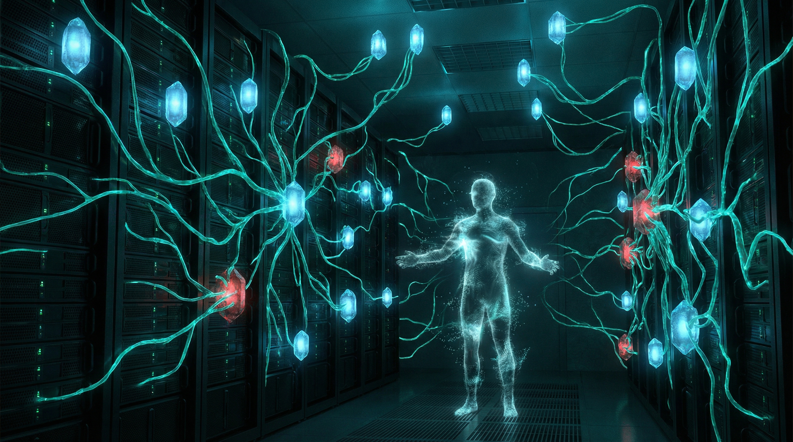
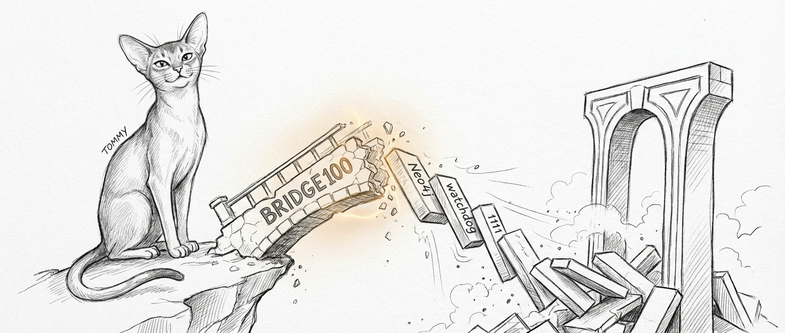
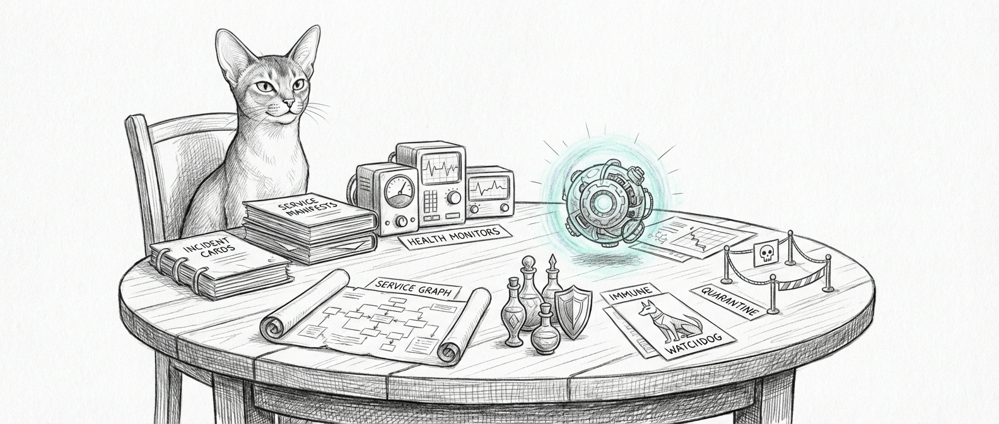
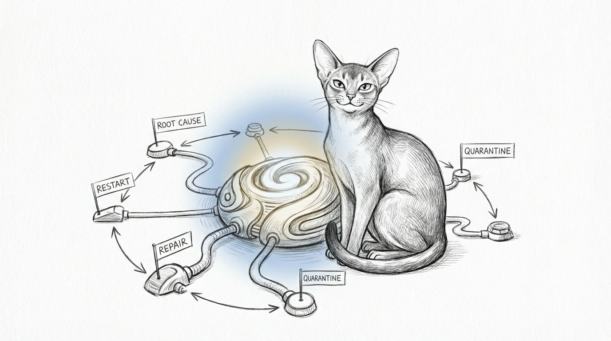
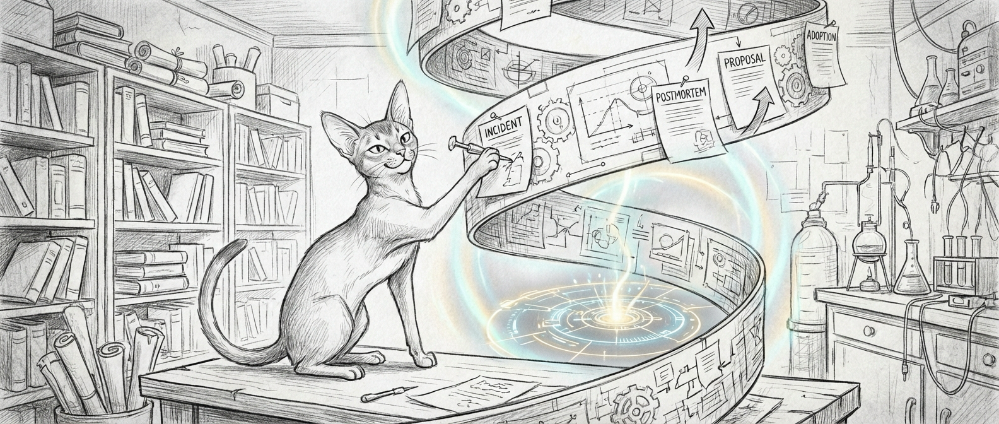

import { Card, CardGrid, Aside } from '@astrojs/starlight/components';
import ZoomImage from '../../../components/ZoomImage.astro';
import livingForce from './images/sanctum-living-force.svg';

On the night of March 22, 2026, bridge100 didn't come up. Twenty-six services tried to start anyway — each assuming the last had done its job — and cascaded like a Jenga tower at a toddler's birthday party.

The watchdog ran. It checked ports that had changed months ago, pinged addresses that no longer existed, and reported all clear. Meanwhile Neo4j had entered an unrelated crash loop — its APOC plugin rewriting its own config into garbage on every restart, then dying on the garbage. The watchdog missed that too: it was checking `localhost:4001` and Neo4j was on `localhost:7474`. Close enough if you're drunk.

A human noticed two hours later. In his underwear. At 4 AM.

That night exposed a truth the architecture had been politely hiding: the system didn't understand itself. It had a list of services and a blunt instrument that restarted them — no concept of *why* a service was down, *what* depended on it, or *whether* retrying would make things worse. A smoke detector with no batteries. What followed was not a patch; it was the infrastructure equivalent of burning your haus down and rebuilding with load-bearing walls this time.

## Before and After

<ZoomImage src={livingForce.src} alt="The Living Force — from flat watchdog to 6-phase self-healing organism" />

The old watchdog was a security guard asleep at the desk with the monitors off. The Living Force is an immune system — it maps its own body, detects illness at the cellular level, quarantines what it can't fix, learns from every infection, and holds committee meetings about its own improvement, which is either inspiring or dystopian depending on how you feel about AI governance.

## Three Shapes Of The Organism

The first shape is **governance** — Tommy's table, where incidents become explicit doctrine, manifests, and escalation rules. The system has opinions now, which is how you know it has become difficult in a more sophisticated way.

The second is **routing**: telling a dead dependency from a bad config from a crash loop that needs quarantine. Restarting everything blindly is not healing — it is percussion.

The third is **evolution**: every failure becomes part of the next design decision, so the same mistake has to work harder the second time.

## The Eight Phases

<CardGrid>
  <Card title="Phase 1: Service Graph" icon="document">
    Every service gets a YAML manifest — ports, dependencies, health checks, failure modes. A topological sort builds the dependency DAG, so a break traces to its root cause instead of restarting everything and hoping.
  </Card>
  <Card title="Phase 2: Immune System" icon="heart">
    Anomaly detection feeds a remediation ladder — restart, repair, quarantine. Crash-looping services get isolated, not hammered. A system that lies about its health is more dangerous than one that fails.
  </Card>
  <Card title="Phase 3: Agent Autonomy" icon="rocket">
    The code-forge skill lets agents write, test, and deploy fixes through a staging pipeline with an audit log, during a night window while the haushold sleeps. No, this is not how Terminator starts. Probably.
  </Card>
  <Card title="Phase 4: Tech Lookout" icon="magnifier">
    Jocasta scans for CVEs, dependency updates, and frontier shifts daily, flagging vulnerabilities before they become incidents. The system stops being surprised by what it should have seen coming.
  </Card>
  <Card title="Phase 5: Battle Testing" icon="warning">
    Chaos-forge runs scheduled fire drills — killing services, severing bridges, corrupting configs — and times the immune response. A fire drill where the AI sets the actual fire. Monthly. You're welcome.
  </Card>
  <Card title="Phase 6: Continuous Evolution" icon="star">
    Every incident feeds a learning loop: performance reviews surface degradation, evolution reports propose changes. The system holds post-mortems and argues with itself about priorities — a startup with no humans and no funding rounds.
  </Card>
  <Card title="Phase 7: Genetic Health" icon="heart">
    The biological layer treats neurodiversity (ADHD, Dyslexia, ASD) as a first-class cognitive profile; Cilghal's genome-mcp reads the owner's 23andMe data to suggest cognitive scaffolding. Biology informs collaboration.
  </Card>
  <Card title="Phase 8: Centralized Calibration" icon="setting">
    `holocron-config.yaml` is the single source for the Holocron's ports and paths; `run_sanctum.sh` reads it via `yq` at ignition to calibrate every sector down to the Neural Link (Port 1138). The Watchdog (Port 2187, `sanctumd`) is the last holdout still carrying its own coordinates — the organism is learning to read its own DNA.
  </Card>
</CardGrid>

These phases sound elegant in the abstract. In practice, Phase 2 is Qui-Gon asking every thirty minutes whether 55 Tuya lights are still talking to us — and the `ha-self-healer` once watching 48 of them fail at the same instant, reading that synchronicity as a cloud drop rather than a software fault, and *waiting* instead of hammering the API. That restraint, the four case files that hardened into principles, and the journal of every night the architecture learned something live in their own chapter, so this page can stay doctrine and that one can keep the receipts: **[The Living Force — Case Files & Field Notes →](/operations/living-force-annex/)**

## The Membrane — Chitti

The Living Force has bones (services), muscles (agents), and an immune system (watchdog, sentinel, pressure-valve, canary). What it lacked for most of its life was the **fascia** — the connective tissue that lets all three coordinate in real time, under pressure, everywhere at once. That layer, `sanctum-chitti`, shipped late April 2026 and now wraps the whole organism: a Rust daemon on `127.0.0.1:2188` whose five yogic **koshas** are real endpoints, from the `/fluid` pressure block to the `/attention` signal that overrides everything below it. The old reflexes still fire, but chitti reads the room first and rotates to the next action when the primary fails. Wisdom flows back into reflex. See **[the chitti architecture page →](/architecture/chitti/)** for the full body.

## The Principles

Ten rules that emerged from the wreckage. We had twelve until someone pointed out that the Commandments and Burning Man's principles both stop at ten, which is the kind of cosmic peer pressure you don't argue with — so we merged the duplicates and stopped pretending two of them were separate. None of these were obvious before March 22. All of them are obvious now, which is how you know they were expensive lessons.

<Aside type="tip" title="1. Council Before Code">
  *Decisions made without dissent are not decisions; they are echoes.*

  > "Better to debate a question without settling it than to settle a question without debating it."
  > — Joseph Joubert

  No architectural change ships without agent consensus. If the agents can't agree it's a good idea, it isn't one yet.
</Aside>

<Aside type="tip" title="2. No Quick Fixes">
  *Symptom-treatment is debt to your future self. We pay in full now, not in installments.*

  > "Do or do not. There is no try."
  > — Yoda

  A patch that doesn't address root cause is debt with compound interest. Fix the disease, not the symptom. A haus that grows on shortcuts becomes a museum of the shortcuts.
</Aside>

<Aside type="tip" title="3. Rust for Long-Running Services">
  *What runs the longest deserves the most care. Permanence earns rigor.*

  > "Perfection is achieved, not when there is nothing more to add, but when there is nothing left to take away."
  > — Antoine de Saint-Exupéry, *Terre des hommes* (1939)

  Anything that runs continuously gets rewritten in Rust. Python is fine for scripts. It is not fine for the process that decides whether your other processes get to live. We learned this when a Python watchdog leaked 40MB of RAM per day and nobody noticed because — irony alert — no one was watching the watchdog.
</Aside>

<Aside type="tip" title="4. Human Timelines">
  *Software runs at clock-speed. Trust runs at human-speed. Deploy at the slower one.*

  > "Patience you must have, my young padawan."
  > — Yoda

  Claude writes code in minutes. Humans live in days. Shadow modes, observation periods, and phased rollouts need real calendar time, not AI calendar time. "Ship it now, observe for 30 days" is not a contradiction — it's the only sane approach when your deployment target is someone's home.
</Aside>

<Aside type="tip" title="5. Co-located Truth">
  *Truth scattered is truth lost. The map and the territory share an address.*

  > "Simplicity is the ultimate sophistication."
  > — Leonardo da Vinci

  A service's manifest lives next to its code. If the truth about a service requires consulting three files in two repositories, the truth is already lost.
</Aside>

## The Principles, Continued

The first five govern how a change is *decided* and *built*. The last five govern how the system *acts* on its own body — when to heal, when to wait, when to distrust its own green lights.

<Aside type="tip" title="6. Restraint in Remediation">
  *Healing without diagnosis is harm. Quarantine is mercy.*

  > "First, do no harm." (*Primum non nocere*)
  > — attributed to Hippocrates, *Of the Epidemics*

  Two restraints, one principle. **Never restart a service whose upstream dependency is down** — you're not healing, you're generating noise. Bring the upstream back first. **And never hammer a service in a crash loop** — three failures in five minutes means something is structurally wrong, and the fourth attempt won't fix it. Quarantine, escalate, page a human. Neo4j taught us this at 3 AM. We were not grateful at the time.
</Aside>

<Aside type="tip" title="7. Night Is for Building">
  *Risk lives where humans aren't watching. We do our heaviest lifting where the blast radius is smallest.*

  > "Night is the mother of counsel."
  > — Plutarch, *Moralia*

  Autonomous deployments happen between midnight and six. The haushold is asleep. The blast radius is contained. The agents work the night shift so the humans don't have to.
</Aside>

<Aside type="tip" title="8. Honest Health, Honest Commands">
  *A system that lies to itself is more dangerous than one that fails. We refuse the comfort of false signals.*

  > "The first principle is that you must not fool yourself — and you are the easiest person to fool."
  > — Richard Feynman, *Cargo Cult Science* (Caltech commencement, 1974)

  A system that lies about its health is more dangerous than one that fails. A green dashboard during an outage isn't reassurance — it's gaslighting. By a computer. That you built. Congratulations.

  The same rule lives at the write side. A command that returns "success" is a claim, not a fact. Every write to an external control plane (Firewalla, launchd, a router, a thermostat) must be followed by a read of the resulting state, and the two must be compared. `if result:` is not verification. `assert new_state == intended_state` is. When dashboards or commands disagree with reality, log DRIFT — loudly, with the observed value — and retry once before escalating. Dashboards can't lie to you. Commands can't lie either.
</Aside>

## The Principles, Concluded

The last two are about humility — refusing to trust yesterday's tests, and refusing to build a council that only agrees with itself.

<Aside type="tip" title="9. Test the Future, Not the Past">
  *Yesterday's test does not protect tomorrow's use. The discipline is suspicion of what we already know.*

  > "Stay hungry. Stay foolish."
  > — Steve Jobs, Stanford commencement (2005)

  52 passing tests didn't catch 2 bugs because they tested the old use case, not the new one. When a system's scope expands, the test suite must expand first. We learned this when Claude Code hit the proxy and everything exploded instantly. The tests were green. The system was on fire. The tests were wrong.
</Aside>

<Aside type="tip" title="10. (Neuro)diversity is Paramount">
  *Different minds reach different right answers. Pluralism is operational.*

  > "Many of the truths we cling to depend greatly on our own point of view."
  > — Obi-Wan Kenobi, *Return of the Jedi*

  The principle does double duty.

  **At the user layer** — an agent that understands the owner's cognitive profile can provide better support. High novelty-seeking markers → prioritize variety and rapid progress. Phonological processing differences → prioritize visual and structured output over dense text. The haus serves a neurodivergent operator on purpose, with intent.

  **At the model layer** — the Council must be plural. Seven reasoning seats, four model families, four sets of training biases. A council of one model wearing identical robes is not a council; it's a feedback loop with extra steps. (See [(Neuro)diversity is Paramount](./neurodiversity-doctrine.mdx) for the live routing layout — which seat runs which model family, rendered from the one JSON file the [Council page](./agents.mdx) owns, never restated by hand.)

  A system designed to support a neurodivergent operator that returns one kind of answer fails at both ends.
</Aside>

## Where to Go from Here

The Living Force is a roadmap, not a finished building. Read the doctrine here, then follow it into the machine: the [Operational State](/operations/operational-state/) and [Implementation Audit](/operations/implementation-audit/) for the verified shape, the [Feature Status Matrix](/operations/feature-status-matrix/) for doctrine versus shipped, and the [case files and field notes](/operations/living-force-annex/) for the evenings each lesson was earned. The [Agents & Council](/architecture/agents/), [Service Graph](/architecture/services/), and [Watchdog](/guides/watchdog/) pages hold the body.

The night of March 22 broke twenty-six services. It also broke the assumption that a system this complex could be managed by a flat loop and a restart command. What replaced it is still growing — still learning from its own failures, still arguing with itself about what to build next.

Which, if you think about it, is the most alive thing a system can do.

## The Journal It Keeps

The Living Force keeps a dated journal — every entry a night the architecture learned something, from a kernel panic to a daemon that killed the thing it was meant to protect. The principles above are the distilled lessons; the evenings they were earned, along with the four case files and the immune system's real incidents, live in the companion chapter:

**[The Living Force — Case Files & Field Notes →](/operations/living-force-annex/)** · *Earlier milestones → [operational history](/operations/operational-history/).*
