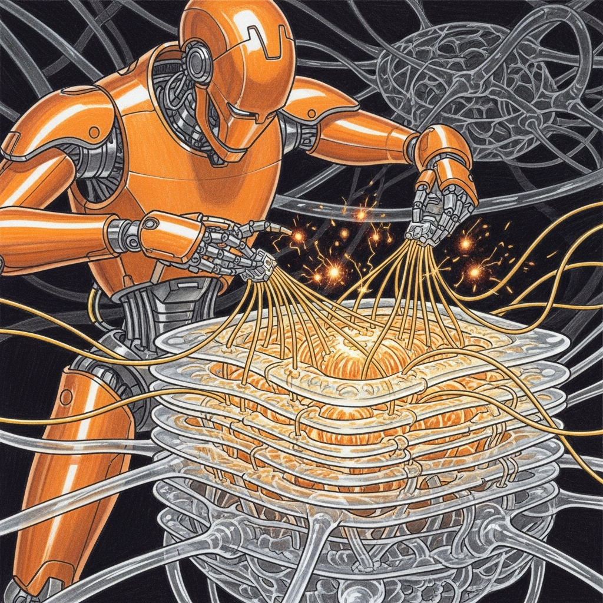
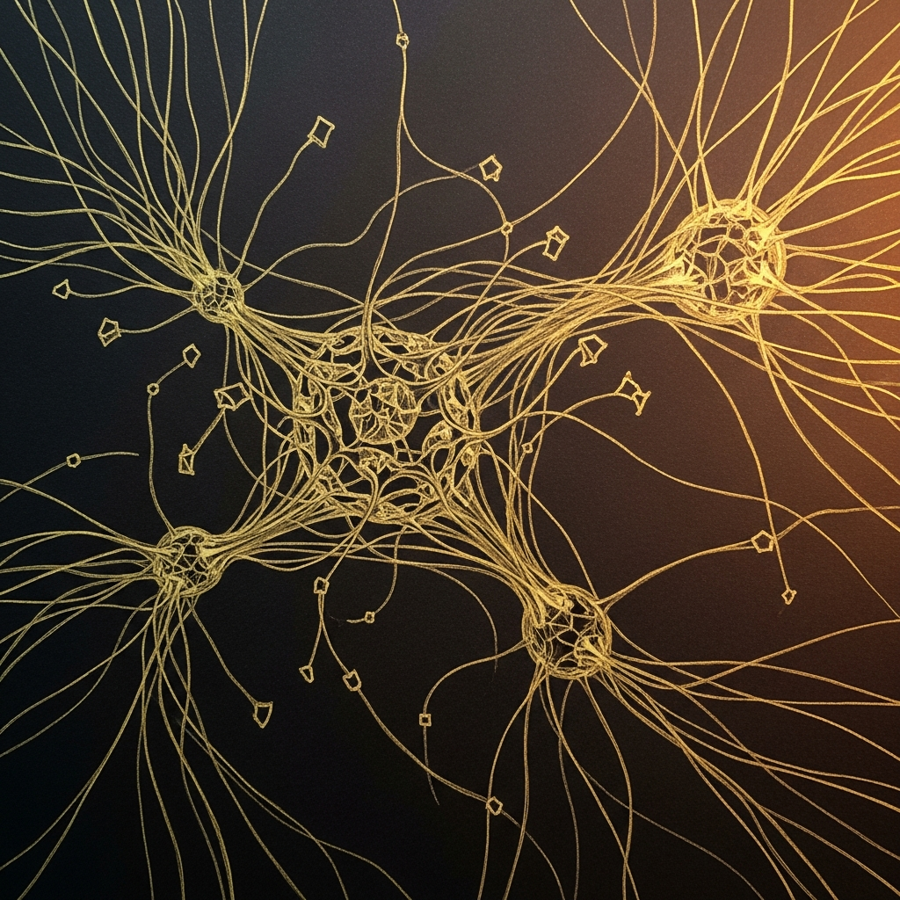

import { Aside } from '@astrojs/starlight/components';



# LoRA in Rust

**Date:** 2026-04-08
**Status:** Implemented, tested, pending lazy-load for 64GB nodes

Running a 27B model through a Python runtime to serve a Jedi Council felt like asking a padawan to carry the Death Star plans. It technically works. You spend the whole time worrying about when it won't. So we built `sanctum-mlx` — a native Rust inference server on `mlx-rs`. One problem: it couldn't load LoRA adapters.

The adapters are the entire point. Without them, the 27B base model is a generalist that has never heard of Yoda, doesn't know port 1337, and would cheerfully tell you that bridge100 is a card game. The LoRA weights are the difference between a language model and a Council member.

Now it can load them. In Rust. Without Python. Without the GIL. Without the 300MB of overhead that comes from asking an interpreted language to do the job of a compiled one.

## The Merge Strategy

Runtime LoRA application — keeping the A and B matrices separate and composing them during every forward pass — would require modifying every linear layer's `forward()`. Elegant in theory. A maintenance nightmare in practice, and a latency tax on every single token.

Instead, we merge at load time:

```
W_merged = W_base + (α/r) × scale × (B^T @ A^T)
```

For quantized models (which is everything on Apple Silicon, because 27 billion parameters don't fit in memory any other way), the pipeline is:

```
Dequantize (int4 → float32)
  → Add LoRA delta
    → Requantize (float32 → int4)
      → Write back to model parameters
```

Think of it as surgery. You open the patient up (dequantize), stitch in the new knowledge (add the LoRA delta), close them back up (requantize), and when they wake up they have no idea anything happened. They just know things they didn't know before. The model doesn't even know it has adapters — they're baked in.

This runs once at startup. Zero runtime overhead. Five seconds on the Mac Mini M4, and then the model is ready to be Yoda for the rest of its uptime.



## Implementation

New file: `sanctum-mlx/src/lora.rs`

| Function | What It Does |
|----------|-------------|
| `load_and_merge()` | Main entry — parses config, loads safetensors, groups A/B pairs, merges |
| `LoraConfig` | Deserializes `adapter_config.json` (rank, alpha, scale, dropout) |
| `MergeStats` | Tracks merged/skipped counts for logging |

The merge handles prefix stripping (`language_model.` from VL checkpoints) and uses `model.update_flattened()` for clean parameter updates through mlx-rs's official API. No unsafe blocks. No pointer arithmetic. The kind of code that compiles on the first try and then you spend twenty minutes suspecting it didn't actually do anything because nothing went wrong.

### V3 Adapter Merge Log

```
LoRA config loaded       rank=64 alpha=128 scale=2.0 effective_scaling=4.0
Adapter safetensors loaded  keys=496
LoRA pairs grouped          pairs=248
LoRA adapter merge complete merged=0 merged_quantized=248 skipped_missing=0
```

248 out of 248 quantized pairs. Zero skipped. The log is boring, which is the highest compliment merge code can receive.

## Portable Metal Builds

The binary embeds a hardcoded path to `mlx.metallib` (the compiled Metal shaders) at compile time. Build it on one machine, copy it to another, and it can't find the shaders. The kind of bug that works perfectly in development and fails in production, which is to say, the most common kind.

**Fix:** `build-release.sh` packages the binary with `mlx.metallib` colocated. MLX's runtime searches the binary's directory first (via `dladdr()`), finding the colocated file before falling back to the hardcoded path.

```bash
./build-release.sh              # Build for current machine
./build-release.sh --deploy mm  # Build + deploy to Mac Mini
./build-release.sh --deploy all # Deploy to all nodes
```

Output: `dist/sanctum-mlx/` containing the binary (17MB) + metallib (122MB). The shader library is seven times larger than the server. Metal has priorities.

<Aside type="note">
The Rust binary OOMs on the 64GB Mac Mini because it loads the full 27B model into memory at once. Python's `mlx_lm.server` uses lazy mmap loading — only touching pages as they're needed. The Mac Mini stays on Python until we implement lazy loading in Rust. The 128GB MBP runs the Rust binary fine, because the answer to most memory problems is "buy more memory," and the answer to the rest is "implement mmap."
</Aside>

## Performance

| Metric | Rust (`sanctum-mlx`) | Python (`mlx_lm.server`) |
|--------|---------------------|-------------------------|
| Inference tok/s | 57 | 57 |
| Startup time | ~1s | ~3s |
| Memory overhead | ~50MB | ~300MB |
| LoRA merge time | 5s | N/A (runtime) |
| Crash recovery | Instant (no GC) | GIL pause risk |

Same tok/s because the Metal GPU is the bottleneck — both runtimes are feeding the same silicon. Rust wins on everything around the inference: startup, memory, determinism. The 250MB of saved overhead doesn't matter much on a 128GB machine, but it matters a great deal on a 64GB machine that's also running LM Studio, Home Assistant, XTTS, and whatever else decided to be important today.

## Tests

27 tests across 3 suites:

| Suite | Tests | Coverage |
|-------|-------|----------|
| Unit (lib) | 16 | Config parsing, LoRA math, quantize roundtrip, real adapter validation |
| E2E integration | 6 | Model load, tokenizer, 248-pair merge, weight hash verification, inference |
| Weight verification | 1 | Hash before/after confirms weights actually changed |

```bash
cd sanctum-mlx && cargo test -- --test-threads=1
```

The `--test-threads=1` matters — parallel Metal GPU tests cause SIGTRAP from resource contention. One at a time, like civilized Jedi. The alternative is watching the GPU throw a tantrum because two tests tried to compile shaders simultaneously, which is entertaining exactly once.

The padawan carried the Death Star plans. It just needed better shoes.
