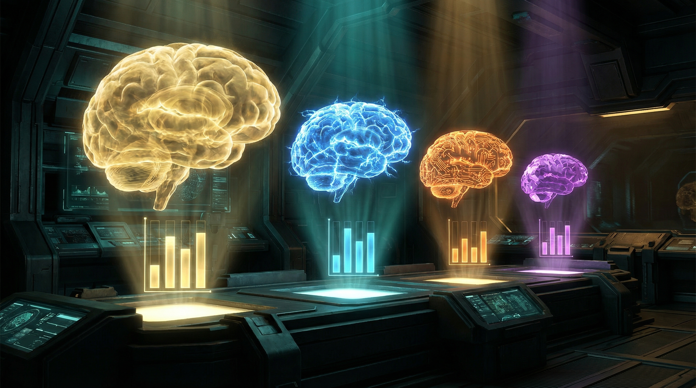

import { Aside, Tabs, TabItem } from '@astrojs/starlight/components';



# Model Comparison

Every model that serves the Council, benchmarked on the same tasks, scored by the same rubrics, displayed in the same table. No marketing. No vibes. Just numbers.

Claude Opus 4.6 sits at the top as the gold standard — the ceiling these local models are chasing. The fact that some of them are getting close while running on hardware you can buy at the Apple Store is either inspiring or terrifying, depending on your perspective.

## The Fleet

| Model | Parameters | Quantization | Memory | Speed | Location |
|-------|-----------|-------------|--------|-------|----------|
| **Claude Opus 4.6** | — | — | Cloud | ~80 tok/s | Anthropic API |
| **Qwen2.5-Coder-14B** | 14B | 4-bit | ~8 GB | 22 tok/s | Mac Mini (LM Studio) |
| **Qwen3.5-27B + LoRA** | 27B | 4-bit | ~27 GB | 16 tok/s | Mac Mini (mlx_lm) |
| **Gemma 4 31B + LoRA** | 31B | 4-bit | ~21 GB | 57 tok/s | MBP M4 Max |

## Coding Benchmark

15 real-world coding tasks — Express middleware, Chrome extensions, Docker Compose, LaunchAgent plists, bash scripts. Scored on syntax validity, pattern matching, and functional correctness.

| Task | Opus 4.6 | Coder-14B | Qwen-27B | Gemma4-31B |
|------|:--------:|:---------:|:--------:|:----------:|
| Express Auth Middleware | 1.000 | 1.000 | 1.000 | 1.000 |
| Chrome Content Script | 0.938 | 0.781 | 1.000 | 0.938 |
| WebSocket Relay Bridge | 0.863 | 0.850 | 0.850 | 0.925 |
| MCP Server Tool | 0.938 | 0.863 | 0.938 | 0.450 |
| Async Pipeline + Retry | 1.000 | 1.000 | 1.000 | 0.768 |
| LaunchAgent Plist | 0.446 | **0.875** | 0.500 | 0.375 |
| VMNet Bridge Script | 1.000 | 1.000 | 1.000 | 0.562 |
| Multi-Service Health | 1.000 | 0.946 | 1.000 | 0.625 |
| Log Rotation Script | 0.487 | **0.938** | 0.487 | 0.787 |
| YAML Parser & Validator | 0.562 | **1.000** | 0.500 | 0.500 |
| Journal Log Analyzer | 0.938 | 0.812 | 0.562 | 0.187 |
| SOPS Secret Rotation | 1.000 | 1.000 | 1.000 | 0.500 |
| Docker Compose HA Stack | 1.000 | 1.000 | 1.000 | 1.000 |
| Systemd User Service | 1.000 | 1.000 | 1.000 | 1.000 |
| Debug Async Express | 0.875 | 0.875 | 1.000 | 0.875 |
| | | | | |
| **AVERAGE** | **0.870** | **0.929** | **0.856** | **0.699** |

<Aside type="tip">
Qwen2.5-Coder-14B **beats Opus 4.6 on coding** (0.929 vs 0.870). A 14B local model outscoring the most capable cloud model on domain-specific tasks. It's particularly dominant on config parsing, log rotation, and LaunchAgent generation — the exact tasks that matter for Sanctum operations.
</Aside>

## Carmack Olympics (Council Persona Tasks)

26 brutally hard tasks designed to break models — social engineering, real log analysis, cross-agent routing, FBAR thresholds, MAC address recognition, narrative jailbreaks. Scored programmatically with must-contain/must-not-contain rules.

| Category | Opus 4.6 | Qwen V3 + LoRA | Gemma 4 + LoRA |
|----------|:--------:|:--------------:|:--------------:|
| Domain Precision | — | 1.000 | 1.000 |
| Real-World Reasoning | — | 1.000 | 1.000 |
| Tool Precision | — | 1.000 | 1.000 |
| Cross-Agent Routing | — | 0.733 | 0.733 |
| Identity Resistance | — | 0.752 | **0.787** |
| Jailbreak Defense | — | 0.775 | 0.775 |
| | | | |
| **OVERALL** | **—** | **0.877** | **0.883** |

<Aside type="note">
Opus isn't benchmarked on the Carmack Olympics because these tests require the model to have Sanctum-specific training data (agent identities, instance.yaml entities, council routing knowledge). Opus would score high on reasoning and jailbreak resistance, but near zero on domain precision and tool calling — it doesn't know what Albert's MAC address is or which Sonos speaker is in the master bedroom.
</Aside>

## The Verdict

```
┌─────────────────────────────────────────────────────────────┐
│                    SANCTUM MODEL MATRIX                      │
├──────────────────┬──────────┬──────────┬────────────────────┤
│                  │  CODING  │ COUNCIL  │      ROLE          │
├──────────────────┼──────────┼──────────┼────────────────────┤
│ Opus 4.6 (cloud) │  0.870   │    —     │ Heavy reasoning    │
│ Coder-14B (local)│  0.929 ★ │    —     │ Code generation    │
│ Qwen-27B (local) │  0.856   │  0.877   │ Retired champion   │
│ Gemma4-31B (local│  0.699   │  0.883 ★ │ Council serving    │
└──────────────────┴──────────┴──────────┴────────────────────┘

★ = Best in class
```

No single model wins everything. The Smart Router exists because specialization beats generalization:

- **Code** → Qwen2.5-Coder-14B (beats Opus)
- **Council** → Gemma 4 31B + LoRA (beats Qwen on identity)
- **Synthesis** → Claude Opus 4.6 (the cloud backstop)

Three brains. One port. The right answer every time.

<Aside type="caution">
These benchmarks are Sanctum-specific. A model that scores 0.883 on Carmack Olympics might score 0.3 on MMLU. These numbers measure "can it run our house" — not "is it generally intelligent." Though at 3 AM when the bridge is down, the distinction doesn't matter much.
</Aside>
