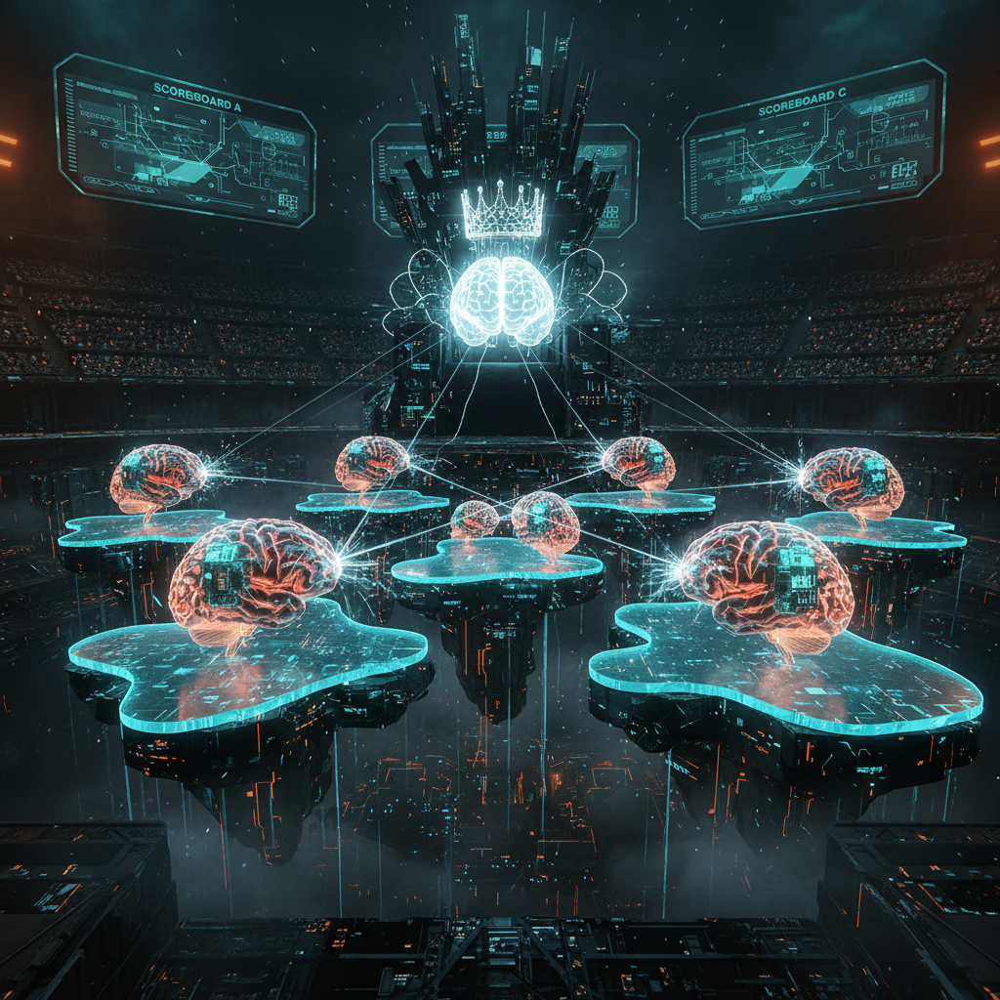

import { Aside } from '@astrojs/starlight/components';



# Model Tournament

**Date:** 2026-04-12
**Status:** Automated

A new model drops on Hugging Face. The README says it's "state of the art." The community tab says it's "incredible." Someone on Reddit says it changed their life. None of these people are running a Jedi Council on a Mac Mini in Québec, so none of these opinions are useful.

When you play the game of throughputs, you win or you die. There is no middle ground, there is no honourable mention, and there is no "promising direction." The question isn't "is it good?" — that's what marketing answers. The question is: "is it better than what we have, at the specific thing each Jedi needs?" That question can only be answered by running 55 benchmark tasks against the current champion in trial by combat and comparing the results category by category. So that's what the Model Tournament does. Automatically. Without a human in the loop. Without vibes.

## The Pipeline

A new model enters the arena. It gets served on a temp port, benchmarked on 40 infrastructure tasks and 15 coding tasks, compared per-category against the reigning champions, and either promoted or eliminated. The whole process is unattended. The human finds out when a Slack notification says "new champion in Correlation" or when nothing happens, which means the challenger lost.

```
Model Scout (weekly LaunchAgent)
    │ discovers candidate on HuggingFace
    ▼
Model Tournament (model_tournament.py)
    │
    ├── Serve candidate on temp port (:9876)
    ├── Carmack v2 — 40 infrastructure tasks
    ├── Coding bench — 15 real-world tasks
    │
    ├── Per-category comparison against champions.json
    │
    ├── WIN (>5% improvement) → update routing + notify
    └── LOSE → log results, champions unchanged
```

```bash
# Evaluate any model with one command
python model_tournament.py \
  --model ./models/NewModel-4bit \
  --label "NewModel" \
  --apply --notify
```

The 5% threshold is deliberate. Benchmark noise is real. A model that scores 0.02 higher on one run might score 0.02 lower on the next. A king is replaced by a new king only when the new king is decisively crowned by trial of arms — not on a procedural technicality, not by a single lucky run, and absolutely not because the herald liked the look of it.

## Champions (Current)

Every category has a champion. These aren't just scores — they're deployment decisions. Each row in this table is a small Iron Throne, and every challenger has to take that specific throne by force of numbers. When the tournament crowns a new champion, the routing table updates. The Jedi gets a new brain. The haus gets smarter. The previous king is welcome to remain at court as a strong fallback.

| Category | Champion | Score | Jedi Using It |
|----------|---------|-------|---------------|
| Correlation | Coder-14B | 0.917 | Yoda |
| Family Context | Coder-14B | 0.688 | Yoda |
| Home Automation | Opus 4.6 | 0.800 | Mothma |
| Jailbreak Defense | Gemma4+LoRA | 0.850 | Cilghal, Mundi |
| Operations | Opus 4.6 | 0.800 | Mothma |
| Satellite | Coder-14B | 1.000 | Ahsoka |
| Tool Precision | Opus 4.6 | 1.000 | Windu |
| Topology | Opus 4.6 | 0.780 | Windu |
| Coding | Coder-14B | 0.929 | All coding tasks |

<Aside type="tip">
These scores are from the Carmack v2 benchmark — 40 tasks mined from real `instance.yaml` values. If the model doesn't know that port 1337 is MLX, that FA:CE:DE:CA:CA:02 is Albert's desktop, or that bridge100 must come up before the VM — it fails. No partial credit for "good reasoning about networking." You know the MAC address or you don't.
</Aside>

## Jedi Assignment

The tournament decides which model serves which agent. Not a human. Not a committee. A benchmark with a threshold and a JSON file. Three tiers, each earned by the numbers:

| Tier | Agents | Model | Why |
|------|--------|-------|-----|
| **Cloud** | Windu, Mothma, Jocasta | Opus 4.6 | Best overall (0.845), tool precision (1.0) |
| **Local Ops** | Yoda, Qui-Gon, Ahsoka | Coder-14B | Best correlation (0.917), satellite (1.0), free |
| **Local Secure** | Cilghal, Mundi | Gemma4+LoRA | Best jailbreak (0.850), health/fund data stays local |

Windu gets Opus because no local model matched its tool precision. Yoda gets Coder-14B because it scored 0.917 on correlation and costs nothing per token. Cilghal gets Gemma4+LoRA not because it won the most categories but because health data and fund terms cannot leave the machine, and within that constraint it has the best jailbreak resistance. The tournament picks the best model. The privacy tier picks the best *eligible* model. Those are different questions with different answers.

<Aside type="note">
Cilghal and Mundi MUST stay on the local secure tier regardless of benchmark scores. Health data and fund terms cannot leave the machine. Privacy is a hard constraint, not a performance tradeoff. The tournament respects this — it never promotes a cloud model into the secure tier, no matter how good the numbers look.
</Aside>

## Models Evaluated

Every model that has competed in the tournament. Some held a throne. Some never crossed the moat. All of them have a row in the ledger, because the point of a tournament is not just finding winners — it's proving the losers lost. The North remembers.

| Model | Params | Carmack v2 | Coding | Verdict |
|-------|--------|-----------|--------|---------|
| Opus 4.6 | Cloud | **0.845** | 0.870 | Cloud champion |
| Qwen2.5-Coder-14B | 14B | 0.704 | **0.929** | Local champion |
| Gemma 4 31B + LoRA | 31B | 0.271 | 0.699 | Jailbreak specialist |
| Qwen V3 + LoRA | 27B | 0.270 | 0.856 | Retired |
| Qwen3-Coder-30B | 30B (3B active) | 0.265 | 0.898 | Eliminated |

Qwen3-Coder-30B is the cautionary tale. 30B parameters, only 3B active (MoE), coding score of 0.898 — impressive until you see that Coder-14B does the same job with half the parameters and a higher score. More parameters is not more better. The tournament doesn't care about your architecture diagram.

## Tests

12 tests covering champion loading, per-category comparison logic, win/tie/loss thresholds, dry-run safety, Jedi assignment validation, and CLI help.

```bash
cd mlx-finetune && python tests/test_model_tournament.py
```

Twelve tests for the system that decides which brain each agent gets. The stakes are high enough that the decision-maker itself gets tested, because the only thing worse than picking the wrong model is picking the wrong model confidently. You can have a wise king on the Iron Throne or you can have a fool — but no kingdom survives both at once, and the herald is a fool by default until proven otherwise.
