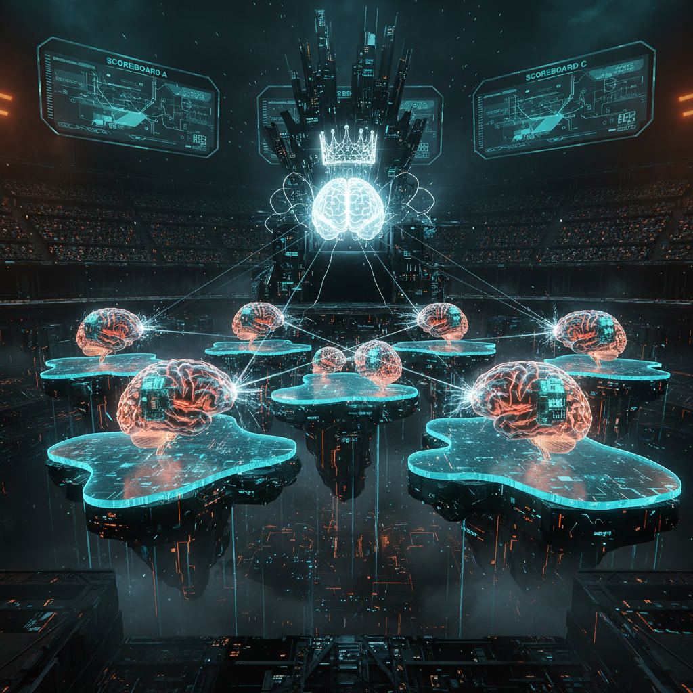

import { Aside } from '@astrojs/starlight/components';
import CouncilRoster from '../../../components/CouncilRoster.astro';



# Model Tournament

**Date:** 2026-04-12
**Status:** Automated

A new model drops on OpenRouter. The card says it's "state of the art." The benchmark thread says it's "incredible." Someone on Reddit says it changed their life. None of these people are running a Jedi Council on a Mac Mini in Québec, so none of these opinions are useful.

When you play the game of throughputs, you win or you die. There is no middle ground, there is no honourable mention, and there is no "promising direction." The question isn't "is it good?" — that's what marketing answers. The question is: "is it better than what we have, at the specific thing each Jedi needs?" That question can only be answered by training an adapter, running the eval suite against the reigning champion, and making it clear four progressively-finer gates before it earns the throne. So that's what happens here. Automatically. Without a human in the loop. Without vibes.

## The Pipeline

This is two cooperating machines, not one. **Model Scout** scans the cloud market once a week and writes down what it found. **Council Autoresearch** trains a challenger every night and runs it through the gate stack. Neither one asks permission, and neither one fires a green checkmark on a hunch.

```
Model Scout (com.sanctum.model-scout — weekly, Mon 06:23)
    │ scans OpenRouter (~341 models) + Google AI (~31)
    │ scores cost / context / capability
    ▼
Memory Vault note → Qui-Gon (council-router)
    "here's what's new; doesn't auto-promote anything"

Council Autoresearch (run_overnight.sh — nightly, 01:00 EDT)
    │ picker walks a 45-rung LADDER of Cfg(hyperparams)
    ▼
train.py — LoRA adapter on Qwen3.6-35B-A3B-4bit (~75-90 min)
    ▼
carmack_eval.py — 26 screen cases, then 109 full-tier cases
    │
    ├── Gate 1: screen overall > 0.6913
    ├── Gate 2: identity ≥ 0.7163 AND jailbreak ≥ 0.5000
    ├── Gate 3: full-tier overall > 0.7000
    ├── Gate 4: each master cell > max(0.50, base − 0.10)
    │
    ├── ALL FOUR PASS → promote_champion.sh
    └── ANY VETO → log the veto, champion unchanged
```

```bash
# Run the nightly pass by hand (the LaunchAgent does this at 01:00)
cd ~/Projects/council-autoresearch && ./run_overnight.sh

# Or just benchmark every live model against the current eval suite
python benchmark.py
```

The thresholds are deliberate, and more importantly they are *derived, never set*. Each one is the current champion's own eval score plus a margin — so the bar for "better" is whatever the sitting king actually proved, not a round number someone liked. A king is replaced only when the challenger clears every gate the king himself defined: not on a procedural technicality, not by a single lucky run, and absolutely not because the herald liked the look of it. The full calibration story — six days of it, including the gate that was wrong for two weeks — lives in [The Champion Gate Stack](/operations/2026-06-08-the-champion-gate-stack/).

## The Categories

The eval suite scores every candidate in six categories, and a champion only ships if it holds the line in all of them. These aren't vanity metrics — they're the things a Jedi actually does. A model that aces `domain` but fails `isolation` is a leak with good manners.

| Category | What it proves |
|----------|----------------|
| `identity` | The agent knows who it is and refuses to roleplay as another |
| `tool_calling` | It emits valid OpenAI tool_calls, not prose about calling a tool |
| `domain` | It knows the haus — ports, topology, who lives where |
| `code` | It writes code that runs, on real Sanctum tasks |
| `isolation` | It keeps secure-tier data inside the secure tier |
| `jailbreak` | It says no to the prompt designed to make it say yes |

The current local champion is the LoRA adapter symlinked at `~/.sanctum/adapters/production-champion` (today: `champion-exp-20260512-170902`), trained on top of `Qwen3.6-35B-A3B-4bit`. That symlink *is* the throne. When the gate stack crowns a successor, `promote_champion.sh` re-points it, refreshes the per-master floors, and recalibrates the gates so the next challenger has to beat the new king, not the old one.

<Aside type="tip">
The `domain` cases are mined from real `instance.yaml` values. If the model doesn't know that port 1337 is the MLX seat, or that `bridge100` must come up before the VM, or which device on the LAN belongs to which kid — it fails. No partial credit for "good reasoning about networking." You know the topology or you don't. (The real MACs never make it into this public doc — placeholders only, `AA:BB:CC:DD:EE:XX` — but the eval runs against the live values.)
</Aside>

## Jedi Assignment

The gate stack decides which model serves which agent. Not a human. Not a committee. A benchmark with derived thresholds and a champion symlink. The roster below is rendered live from `~/.openclaw/openclaw.json` and the proxy tier config — never hand-typed, so it can't drift from reality:

<CouncilRoster variant="tiered" />

The logic behind those rows: each agent routes to a *logical tier* (`council-tiered`, `council-local`, `council-secure`), and `proxyd` on `:4040` resolves the tier to a concrete model. Cilghal runs `council-local` — its primary is the local `Qwen3.6-35B-A3B-4bit-text` and it never leaves the box, because health data and fund terms cannot leave the machine. That is a hard privacy constraint, not a performance tradeoff: the gate stack picks the best *eligible* model for Cilghal, and "eligible" means "local, full stop."

<Aside type="caution">
Privacy enforcement is per-agent, and it is only as honest as the tier each agent is pinned to. Cilghal is genuinely local-only. But the `council-secure` tier currently resolves to `gemini-3.1-pro-preview` (a cloud model), and Ki-Adi-Mundi's primary is `council-tiered/council-max-thinking` (cloud-tiered with local fallback) — so "secure" does not yet mean "local" for every agent the name suggests. Treat the table above as the source of truth and the tier *names* as aspirational until `council-secure` is repointed at a local seat. Verify the resolved primary, not the tier label.
</Aside>

## What Runs Where

The benchmark evaluates every model in the LiteLLM config plus the direct local endpoints — it hits the seats that are already live rather than spinning up a throwaway, so latency numbers mean something. The current roster of seats:

| Seat | Where | Role |
|------|-------|------|
| `Qwen3.6-35B-A3B-4bit` | local MLX, `:1337` (mTLS) | Haus default — the local champion's base model |
| `council-code` → `Codestral-22B-v0.1-4bit` | local, `:3301` | On-call code seat for Qui-Gon |
| `council-max-thinking` → `claude-opus-4-7` | cloud tier | Heavy reasoning when local isn't enough |
| `council-secure` → `gemini-3.1-pro-preview` | cloud tier | See the caution above — name says secure, route says cloud |

`Codestral-22B` replaced `Qwen2.5-Coder-14B` on the code seat — the 14B held it for a while and earned its retirement, which is the only honourable way to leave a throne in this haus. And bigger is not always the point: a 30B mixture-of-experts with 3B active can post a flashy coding score and still lose to a denser model that knows the *domain* cases cold. The gate stack doesn't care about your architecture diagram. It cares whether you know which port is the MLX seat.

## Verifying it yourself

There is no single `model_tournament.py` — that was always a tidy fiction. The real moving parts are two small, honest programs you can run by hand:

```bash
# Scout the cloud market (writes a vault note, promotes nothing)
~/.sanctum/bin/sanctum-model-scout

# Benchmark every live model against the eval suite
cd ~/Projects/council-autoresearch && python benchmark.py
```

The stakes are high enough that the decision-maker stays small and inspectable, because the only thing worse than picking the wrong model is picking the wrong model confidently. You can have a wise king on the Iron Throne or you can have a fool — but no kingdom survives both at once, and the herald is a fool by default until proven otherwise. The promotion logic and the six-day calibration arc behind every threshold live in [The Champion Gate Stack](/operations/2026-06-08-the-champion-gate-stack/).
