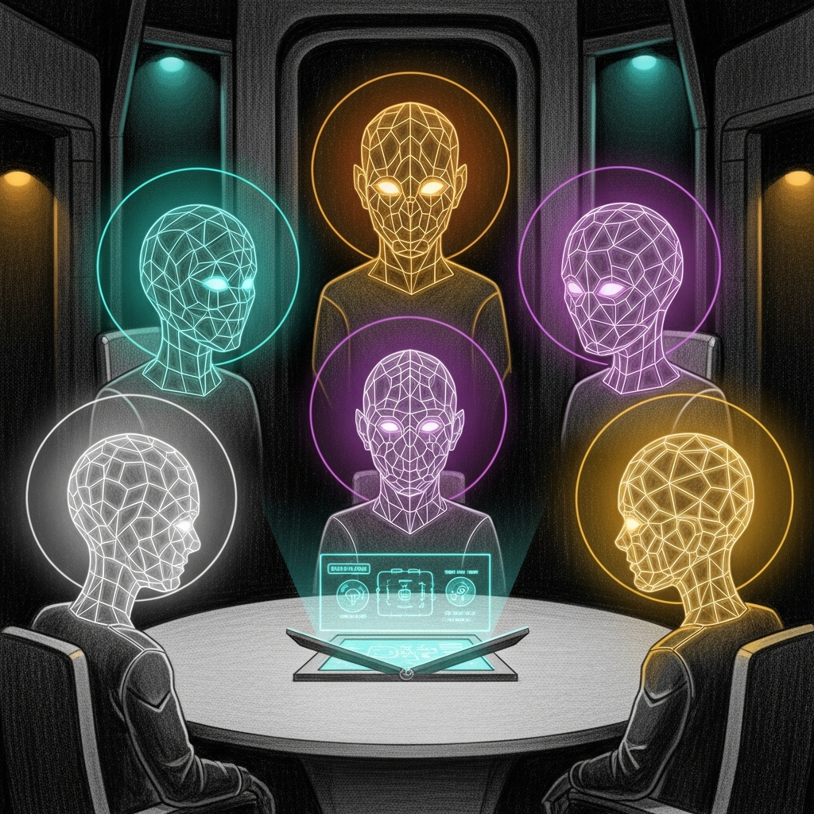

import { Aside } from '@astrojs/starlight/components';



# (Neuro)diversity is Paramount

**Date:** 2026-04-28
**Status:** Doctrine

For most of the Council's life, the five Jedi shared one mind. They had distinct personas — Yoda's measured cadence, Qui-Gon's pragmatic flow, Windu's perimeter-first crispness, Cilghal's calm clinical precision, Mundi's fund-manager economy of words — and they shared exactly one model behind those personas. Asking the Council for a second opinion was asking the same model to roleplay four different opinions of itself, which is approximately as adversarial as asking a mirror.

This page is the doctrine that ended that. **(Neuro)diversity is Paramount.** Every seat runs a different model family, with different training data, different blind spots, and different ways of being wrong. We chose this on purpose. The cost — operational complexity, four upstream APIs to monitor, four sets of latency tails — is the price of getting answers that aren't four flavors of the same answer.

## The bug under the bug

The discovery wasn't planned. While debugging [mlx-lm #1185](https://github.com/ml-explore/mlx-lm/issues/1185), we asked the Council to validate a fix design. All four Jedi agreed the cap-bound fix was sound. The fix turned out to be wrong. The Council had not detected the wrongness because every voice was a different prompt to the same Qwen3.6-35B-A3B backbone. They shared not just architecture but exact weights. Asking them to disagree was asking a single model to argue with itself, politely.

A second-opinion layer that always agrees is not a second-opinion layer. It is a feedback loop with extra steps.

## What changed

As of 2026-04-28, the five seats route to four distinct model families:

| Agent | Model | Provider | Why |
|---|---|---|---|
| **Yoda** (`main`) | Claude Opus 4.7 | Claude Max subscription via `<MINI>:3456` bridge | Premium reasoning for synthesis, council coordination, and the questions where one wrong answer is expensive |
| **Mundi** | Claude Opus 4.7 | same as Yoda | Fund decisions, tax edge cases, financial reasoning that needs to be right the first time |
| **Qui-Gon** | Qwen2.5-Coder-14B | LM Studio on `<MINI>:1234` | Tight, dense code generation; pragmatic infrastructure observations; runs locally on the haus |
| **Windu** | Gemini 3.1 Pro | Google AI Studio (Ultra subscription) | Spatial reasoning is Gemini's strongest discipline — perimeter, network topology, zone maps |
| **Cilghal** | Qwen3.6-35B-A3B-4bit | `sanctum-mlx` on `<MINI>:1337`, mTLS-only | Health data is private. It stays in the haus, on a model the haus controls, behind a certificate it issued itself |

Fallback for every Jedi is the local Qwen3.6 backend. Cloud paths can fail; the local model is always there, on the loopback, behind the same mTLS we use for everything else.

<Aside type="note">
The Qwen3.6 used as fallback is the same model that used to be the entire Council. It's still excellent — just no longer the only voice in the room.
</Aside>

## What this gets you

**Distinct failure modes.** When Opus and Gemini and Coder-14B and Qwen all reach the same answer, that's signal — they failed in different directions and converged anyway. When they disagree, that's also signal — the disagreement is the data. The old Council could only return one of those signals.

**Cost discipline.** Yoda and Mundi route through the Claude Max subscription, not the metered Anthropic API. The bridge at `<MINI>:3456` translates OpenAI-format chat completions into the Max session protocol. Routine Council questions consume zero API credits. Bring-out-the-good-china reasoning happens for the price of the monthly subscription, not per-token.

**Privacy by destination.** Cilghal's health workflow never leaves the haus. The data goes to a model running behind certificates the haus signed, on a port that doesn't accept plain HTTP, on hardware in a basement in Québec. Whatever Apple Health or Withings put in our hands is not on the network of any company we don't already pay.

## What stays the same

The personas don't change. Yoda is still Yoda — the doctrine, the cadence, the SOUL.md. Cilghal still files her morning briefing with the same dry observations. Qui-Gon still notices the things you'd rather he didn't notice about your kubelet. The model is the engine; the persona is the driver.

The interfaces don't change either. `openclaw agent --agent main --message "…"` still works. The Signal channel still works. Home Assistant still triggers Cilghal at 8 AM. Existing integrations didn't notice the swap, which is exactly the point.

## How to verify

```bash
~/Documents/Claude_Code/tools/test-council-routing.sh
```

The script SSH-chains to the VM, invokes each agent, parses the embedded execution trace for the resolved model, and asserts each Jedi reached their assigned model. Five passes means the Council is heterogeneous and routing is healthy. One fail means a backend is down, a key has expired, or a config has drifted — and the script tells you which.

<Aside type="caution">
Running the smoke test ~once a week is a good habit. The cloud paths fail silently sometimes (rate limit hits, billing flips, preview models get deprecated). The script catches drift before the morning briefing notices and reports it as "Yoda sounds different today."
</Aside>

## Why the parenthetical

The principle is **(Neuro)diversity is Paramount** — the parenthetical does double duty on purpose.

The outer reading is **diversity** in the AI sense: distinct architectures, distinct training data, distinct failure modes, distinct ways of being wrong. Different brains in the seats means a real disagreement is possible, which is the whole point of having a Council.

The inner reading is **neurodiversity** in the human sense. The owner of this haus is neurodivergent — ADHD, dyslexia, ASD markers — and Cilghal's whole domain (see [Agent Roles & The Council](./agents.mdx)) is built around scaffolding for that cognitive profile. The same principle that says "different model families think differently" says "different humans think differently." A system designed to support a neurodivergent operator and only return one kind of answer fails at both ends — it is not actually a Council, and it is not actually accommodating. Diversity at the model layer mirrors and serves the diversity at the user layer.

## The principle, plainly

> **A council that always agrees is not a council. It is one mind in five chairs.**

Every system in Sanctum that asks for a second opinion — the Smart Router's escalation tier, the eval harness's adversarial check, the Living Force's incident review committee — should ask it of someone with a different brain. We built the haus to disagree with us when we are wrong. It cannot do that if every voice in the haus is a copy of the same voice.

Pluralism is operational. (Neuro)diversity is paramount.

## See also

- [The Smart Router](./dynamic-model-routing.mdx) — the routing-tier mechanics that make this work
- [Council Router](./council-router.mdx) — universal multi-agent message routing
- [The Jedi Council](./agents.mdx) — the agents themselves, by domain
- [Engineering Discipline](./engineering-discipline.mdx) — why every claim above is backed by a test
