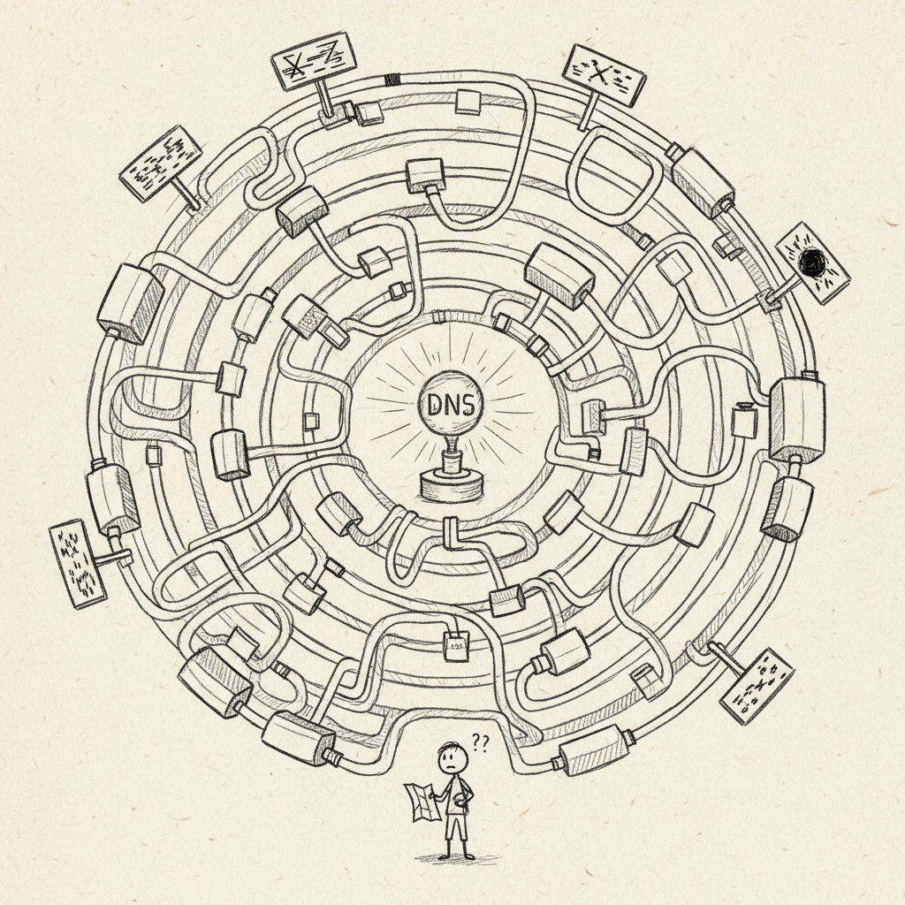

import { Card, CardGrid, Aside, Steps } from '@astrojs/starlight/components';

Sanctum is designed to run across multiple physical locations. A primary **hub** at your main haus coordinates with **satellite** nodes at secondary properties, **mobile** nodes on laptops, and (in the future) **sensor** nodes for lightweight IoT devices. All nodes share a single `instance.yaml` configuration and communicate over Tailscale.



What you're looking at is a multi-site distributed system. The kind of thing a mid-sized company might run across three data centers. Except the data centers are houses, the ops team is one person, and the primary node is next to a coffee maker.

## Node Types

<CardGrid>
  <Card title="Hub" icon="rocket">
    The full-stack primary node. Runs the Mac Mini host with the Ubuntu VM, all AI agents, Home Assistant, inference servers, and the complete service catalog. There is exactly one hub per Sanctum instance.
  </Card>
  <Card title="Satellite" icon="laptop">
    A lighter deployment at a secondary haus. Runs a subset of services (typically a gateway, Home Assistant, and a small local model). Syncs configuration and state with the hub over Tailscale.
  </Card>
  <Card title="Mobile" icon="star">
    A MacBook Pro or similar portable device. Connects to the hub remotely via Tailscale for agent access, SSH, and API calls. Does not run persistent services.
  </Card>
  <Card title="Sensor" icon="setting">
    A future node type for dedicated IoT or monitoring hardware. Planned for low-power devices that report data to the hub without running the full Sanctum stack.
  </Card>
</CardGrid>

## Node Identity

Each node knows who it is through a single-line file at `~/.sanctum/.node_id`:

```bash
# On the hub:
cat ~/.sanctum/.node_id
# manoir

# On the satellite:
cat ~/.sanctum/.node_id
# chalet
```

One file. One word. The machine's entire sense of self lives in a text file smaller than a tweet. And yet if you delete it, everything stops knowing where it is. Identity is fragile -- even for computers.

The identity string must match a key in the `nodes` section of `instance.yaml`. Scripts and services use this to determine which configuration block applies to the current machine.

```bash
source ~/.sanctum/lib/config.sh

NODE=$(sanctum_whoami)                          # "manoir"
TYPE=$(sanctum_node_get "$NODE" type)            # "hub"
IP=$(sanctum_node_get "$NODE" tailscale_ip)      # "100.112.178.25"
```

## Node Definitions in instance.yaml

Every node is declared under the `nodes` key with its network addresses, SSH user, node type, and the list of services it runs:

```yaml
nodes:
  manoir:
    type: hub
    host: 192.168.1.10
    tailscale_ip: 100.112.178.25
    ssh_user: bert
    services:
      - gateway
      - home_assistant
      - dashboard
      - voice_agent
      - lm_studio
      - council_mlx
      - firewalla_bridge
      - cloudflare_tunnel
      - watchdog

  chalet:
    type: satellite
    host: null                     # Set during on-site install
    tailscale_ip: 100.112.203.32
    ssh_user: bert
    services:
      - gateway
      - home_assistant

  macbook:
    type: mobile
    host: null                     # DHCP, varies by network
    tailscale_ip: 100.120.85.55
    ssh_user: bert
    services: []                   # No persistent services
```

### Field Reference

| Field | Required | Description |
|-------|----------|-------------|
| `type` | Yes | One of `hub`, `satellite`, `mobile`, `sensor` |
| `host` | No | LAN IP address. `null` if not on the haus network or DHCP. |
| `tailscale_ip` | Yes | Stable Tailscale IP for cross-network access |
| `ssh_user` | Yes | Username for SSH connections to this node |
| `services` | Yes | List of service keys from `services.*` that this node runs |

## Hub Node

The hub is the authoritative node. It runs every service, hosts the VM with the agent cluster, and is the source that satellites sync from. In organizational terms, this is the head office, the server room, and the IT department -- all running on a machine the size of a hardcover book.

### Hub Responsibilities

- Runs the full AI agent cluster (5 agents on the VM)
- Hosts the command center dashboard
- Manages the Cloudflare tunnel for external access
- Runs inference servers (LM Studio, Council-27B MLX, XTTS)
- Acts as the Git and rsync origin for skill updates
- Stores the canonical copy of `instance.yaml`

### Hub-Only Services

These services only run on the hub and are not deployed to satellites:

| Service | Reason |
|---------|--------|
| Council-27B MLX | Requires Apple Silicon with sufficient memory |
| LM Studio | Large model inference, hub-only hardware |
| Firewalla Bridge | Direct LAN access to the primary router |
| Cloudflare Tunnel | Single ingress point for the instance |
| Orbi Bridge | Direct LAN access to the access point |
| Voice Agent | Tied to local Sonos speakers and XTTS |

## Satellite Node

A satellite is a smaller deployment at a secondary location. It runs a gateway with a lightweight local model and its own Home Assistant instance for location-specific devices.

Think of it as a field office. It can operate independently, make local decisions, and keep the lights on -- but the real horsepower stays at headquarters. The satellite doesn't need five AI agents. It needs to control the heat and not die when the internet goes out.

### Satellite Setup

<Steps>
1. Install macOS on the satellite Mac and join it to Tailscale.
2. Copy the install bundle (synced via iCloud) and run the setup scripts.
3. Set the `.node_id` file to the satellite's name (e.g., `chalet`).
4. Install Docker Desktop and deploy Home Assistant.
5. Install a local model in LM Studio (e.g., Qwen 3.5 3B 4-bit for limited hardware).
6. Configure on-site integrations (cameras, sensors, smart devices).
7. Update the satellite's `host` field in `instance.yaml` on the hub.
</Steps>

<Aside type="caution">
  Steps 6 and 7 require physical presence at the satellite location. You cannot configure Blink cameras or discover Sonos speakers from 200 kilometers away. We tried.
</Aside>

### Satellite Sync

Satellites pull updates from the hub over Tailscale:

```
Hub (manoir)                          Satellite (chalet)
    |                                       |
    +-- instance.yaml  ---- Tailscale ---->  instance.yaml (subset)
    +-- skills repo    ---- Tailscale ---->  skills repo (rsync)
    +-- agent config   ---- Tailscale ---->  agent config
```

<Aside type="tip">
  Satellites operate independently when the Tailscale connection to the hub is unavailable. Local services (Home Assistant, gateway, local model) continue to function offline. The house doesn't stop being a house just because the internet is down. That was a design requirement, not a feature.
</Aside>

## Mobile Node

Mobile nodes are laptops that connect to the Sanctum instance remotely. They do not run persistent services but can SSH into the hub, query agents, and access dashboards over Tailscale.

### Mobile Access Patterns

| Action | Command / URL |
|--------|--------------|
| SSH to hub | `ssh bert@100.112.178.25` |
| SSH to VM | `ssh -J bert@100.112.178.25 ubuntu@10.10.10.10` |
| Dashboard | `http://100.112.178.25:1111` |
| Home Assistant | `https://ha.nepveu.name` (via Cloudflare) |
| Agent query | Via gateway API at `100.112.178.25:1977` |

<Aside>
  The MacBook Pro restricts SSH access to the Thunderbolt interface only. It is reachable via Tailscale IP but does not expose SSH on the general LAN. The laptop has boundaries. Respect them.
</Aside>

## Querying the Topology

Both the shell and TypeScript libraries provide functions for working with the node topology:

```bash
source ~/.sanctum/lib/config.sh

# Who am I?
sanctum_whoami                                    # "manoir"

# Get a field from any node
sanctum_node_get chalet tailscale_ip              # "100.112.203.32"
sanctum_node_get macbook ssh_user                 # "bert"
```

```typescript
import { whoami, nodeGet, getNodesByType } from './lib/config';

const me = whoami();                              // "manoir"
const satellites = getNodesByType('satellite');    // ["chalet"]
const chaletIp = nodeGet('chalet', 'tailscale_ip'); // "100.112.203.32"
```

## Network Diagram

```
                         Tailscale Mesh (tail7c6d11.ts.net)
                    _______________________________________________
                   /                       |                       \
    Hub: manoir                  Satellite: chalet           Mobile: macbook
    100.112.178.25               100.112.203.32              100.120.85.55
         |                             |                          |
    [Mac Mini M4 Pro]            [Mac Mini M1]           [MacBook Pro M4 Max]
    +-- Ubuntu VM                +-- Gateway                    (no services)
    +-- 5 AI Agents              +-- Home Assistant
    +-- Full service catalog     +-- Local LLM (3B)
    +-- Home Assistant
    +-- Inference servers
```

Three machines. Two houses. One tailnet. Zero regrets. Well. Few regrets.

<Aside>
  For details on every service that runs on each node type, see the [Services](/architecture/services/) page. For information about the configuration that drives node behavior, see [Config System](/architecture/config-system/).
</Aside>
