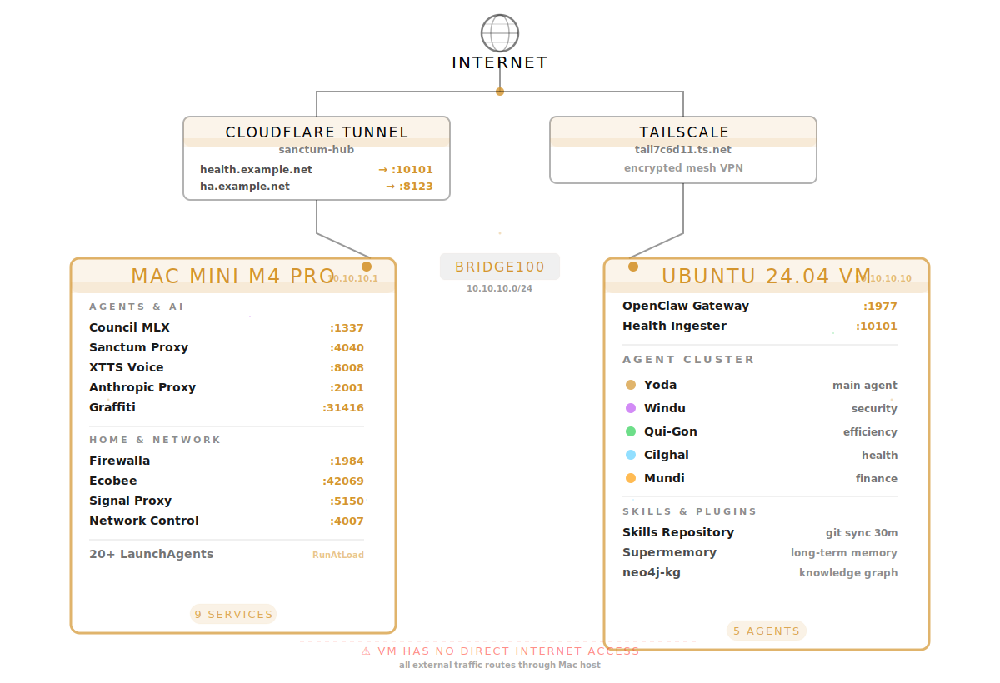

import { Card, CardGrid, Aside, Tabs, TabItem } from '@astrojs/starlight/components';

Sanctum runs on a two-layer architecture: a **Mac Mini host** that manages hardware, networking, and Apple-native services, and an **Ubuntu VM** that runs the AI agent cluster. The two communicate over a private Host-Only network and are managed through a single configuration file.


If you're wondering why anyone would build a distributed intelligence platform on consumer hardware tucked behind a residential ISP in Quebec -- congratulations, you've found the right documentation. Keep reading. The answers won't comfort you.

## System Diagram



Stare at that diagram long enough and two things become clear: first, this is a real system that actually runs a household. Second, no one should have let it get this far. And yet here we are, port 1984 deep, with no intention of stopping.

## Mac Mini Host

The Mac Mini is the always-on hub. It runs macOS with over 20 LaunchAgents that start on boot, a Docker instance for Home Assistant, and several AI inference servers that take advantage of Apple Silicon. It is also, let's be honest, a $1,600 space heater that happens to control the other space heaters.

<CardGrid>
  <Card title="DenchClaw Gateway" icon="rocket">
    The Mac-side agent gateway. Runs Jocasta, the household management agent. Exposes port 19001 for local clients and the Holocron chat interface on port 19001.
  </Card>
  <Card title="Home Assistant" icon="approve-check-circle">
    Docker container with bridge networking. Controls Sonos speakers, lights, and sensors. Accessible at port 8123 locally and via Cloudflare tunnel externally.
  </Card>
  <Card title="AI Inference" icon="star">
    LM Studio (port 1234) serves Qwen 3.5 35B. Council-27B MLX (port 1337) runs a quantized model with per-agent LoRA adapters. XTTS (port 8008) handles text-to-speech on the MPS GPU.
  </Card>
  <Card title="Network Bridges" icon="setting">
    Firewalla bridge (port 1984) proxies commands to the router. Orbi bridge (ports 18080/18085) uses socat to forward traffic to the access point. Both are accessible from the VM.
  </Card>
</CardGrid>

### Boot Sequence

All LaunchAgents use `RunAtLoad: true` and start in this order. Every boot is a small miracle. Twenty-some services waking up in sequence, each one assuming the last one did its job. It works like a row of dominoes -- except some of the dominoes are SSH tunnels and one of them controls your front door.

| Order | Service | What It Does |
|-------|---------|-------------|
| 1 | UTM Autostart | Launches UTM, starts the VM, sets bridge100 IP to 10.10.10.1 |
| 2 | DenchClaw Gateway | Mac agent gateway on port 19001 |
| 3 | Firewalla Bridge | Router API proxy on port 1984 |
| 4 | XTTS TTS Server | Voice synthesis on port 8008 (MPS GPU) |
| 5 | Voice Agent | Yoda voice interface on port 8090 |
| 6 | HA SSH Tunnel | Forwards port 4007 to VM for HA integrations |
| 7 | Council-27B MLX | Local LLM with LoRA adapters on port 1337 |
| 8 | Cloudflare Tunnel | Exposes services via `nepveu.name` subdomains |
| 9 | iCloud Filer | Auto-files documents from iCloud Drive |
| 10 | LiteLLM Proxy | Fallback proxy on port 4040/4001 |
| 11 | Orbi Bridge | Socat bridge to Orbi router |
| 12 | Command Center | Dashboard on port 3001 |
| 13 | Health Center | Health monitoring dashboard |
| 14 | LM Studio | LLM inference server on port 1234 |
| 15 | iCloud Backup | Periodic backup agent |
| 16 | Watchdog | Health checks every 600 seconds, auto-heals via service-doctor |

<Aside type="tip">
  The full LaunchAgent inventory is in the [LaunchAgents reference](/reference/launchagents/). The watchdog monitors all services and can restart most of them automatically -- which it will need to do, because entropy is undefeated.
</Aside>

## Ubuntu VM

The VM is a QEMU guest running Ubuntu 24.04 under UTM with Apple Hypervisor acceleration. It has no direct internet access -- all external communication routes through the Mac host at 10.10.10.1.

This is by design. An air-gapped VM running five AI agents that can only see the outside world through a single bridge interface is either excellent security architecture or the plot of a containment thriller. Possibly both.

### VM Specifications

| Parameter | Value |
|-----------|-------|
| Hypervisor | UTM / QEMU with Apple Hypervisor |
| OS | Ubuntu 24.04 LTS |
| CPU | 8 cores |
| Memory | 12 GB |
| Network | Host-Only (vmnet), bridge100 |
| VM IP | 10.10.10.10 |
| SSH | `ssh openclaw` or `ssh ubuntu@10.10.10.10` |

### Agent Cluster

The VM runs OpenClaw with five specialized agents, each with a distinct role. Yes, someone named their home automation agents after Star Wars characters. No, there was never a serious alternative under consideration.

| Agent | Role | Description |
|-------|------|-------------|
| **Yoda** | Main | Primary household agent. Handles general queries, orchestrates other agents. |
| **Windu** | Security | Network monitoring, threat analysis, Firewalla integration. |
| **Qui-Gon** | Efficiency | Energy optimization, automation suggestions, system performance. |
| **Cilghal** | Health | Family health tracking, genome analysis, supplement recommendations. |
| **Mundi** | Finance | Budget tracking, investment monitoring, expense analysis. |

The gateway runs as a systemd user service (`openclaw-gateway.service`) with a 1.5 GB heap limit. Secrets are SOPS+age encrypted and decrypted at startup via a wrapper script.

## Host-Only Network

The Mac and VM communicate over a private bridge100 interface on the 10.10.10.0/24 subnet. This design keeps the VM completely air-gapped from the internet while allowing full-speed access to Mac services.

```
Mac Mini (10.10.10.1)  <----  bridge100  ---->  VM (10.10.10.10)
```

- **Mac to VM**: Direct SSH, direct access to all VM ports
- **VM to Mac**: Direct access to all Mac ports on 10.10.10.1
- **VM to Internet**: Not possible. The VM relies on the Mac for any external data (synced via rsync, git pull, or API proxies).

<Aside type="caution">
  The bridge100 IP (10.10.10.1) is set by the UTM autostart script using `sudo ifconfig`. A sudoers entry at `/etc/sudoers.d/vmnet-bridge` allows this without a password prompt. If that sudoers file ever disappears, the VM wakes up into a world with no bridge to anywhere. It will handle this about as well as you'd expect.
</Aside>

## External Access

Two mechanisms provide access from outside the local network:

### Cloudflare Tunnel

The `manoir-nepveu` tunnel exposes select services under the `nepveu.name` domain with Cloudflare Zero Trust:

| Subdomain | Target |
|-----------|--------|
| `health.nepveu.name` | `localhost:10101` |
| `ha.nepveu.name` | `localhost:8123` |

### Tailscale

All Sanctum nodes join a shared Tailscale tailnet. This provides encrypted mesh networking for SSH, API access, and inter-node communication without opening any ports on the home router. It's the one piece of infrastructure here that someone else maintains, and that fact brings genuine peace.

## Skills and Plugins

Agents extend their capabilities through skills and plugins:

- **Skills** are executable scripts organized by domain (e.g., `firewalla-toolkit`, `apple-toolkit`, `house-pulse`). They live in a shared Git repository and sync from the Mac to the VM every 30 minutes via cron.
- **Plugins** provide persistent integrations. The current set includes Supermemory (long-term memory) and neo4j-kg (knowledge graph via Graphiti).

<Aside>
  For the full service catalog with ports and LaunchAgent names, see [Services](/architecture/services/). For configuration details, see [Config System](/architecture/config-system/).
</Aside>
