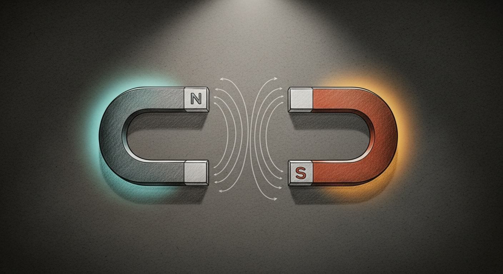

import { Aside } from '@astrojs/starlight/components';

# Polarity

**Date:** 2026-04-30
**Status:** Doctrine

Every load-bearing layer of Sanctum runs paired against its complement. Not redundancy — *opposition*. A single homogeneous voice is a feedback loop in formal wear. Sanctum's reliability comes from refusing to ship one of anything that matters.

## The principle

Two opposites pull a system into balance. One centered force pulls it into orbit. A council of one cannot disagree with itself; a backup with one destination cannot be challenged when it lies; a cloud strategy with one vendor inherits that vendor's outage as its own. Wherever the cost of a silent failure is high, the cure is a counter-force — chosen on purpose, with different failure modes — running at the same time.

This is the same principle as [(Neuro)diversity is Paramount](/architecture/neurodiversity-doctrine/), generalized beyond the Council. The Council taught us the lesson; Polarity is the rule we extracted from it.

## Where Polarity is wired in

| Layer | Polarity | Why it's not redundancy |
|---|---|---|
| Council (5 seats) | Four distinct model families — Claude Opus, Qwen Coder, Gemini Pro, sanctum-mlx — agreeing only by triangulation | Same model arguing with itself produces consensus, not signal |
| Backups (restic) | Local T9 SSD + Google Drive cloud — dual-repo, same encryption key | Local-only loses everything to fire; cloud-only loses everything to a credential leak |
| Cloud LLM stack | Claude (Anthropic) + Gemini (Google) | A provider outage shouldn't take the haus offline; a provider rate-cap shouldn't either |
| Hosts | MBP for dev/validation + Mini for production | Dev work in prod is how surgical edits become outages |
| Bridge auth | CF Access (edge, service token) + HMAC-SHA256 (origin, per-module) | A leaked CF token alone can't post; a leaked HMAC alone can't even reach the bridge |
| Bridge ops loop | Rotator (changes the token) + Canary (verifies the bridge still serves) | The thing that swaps creds and the thing that verifies don't share a code path or a fault |
| Network egress | Bell-bridged uplink + Firewalla-routed LAN | One controls the wire to the world; the other controls who gets to use it |
| Sanctum-mlx serving | Local Qwen3.6 (mTLS, in-haus) + cloud fallbacks (any Jedi) | Health and family data never leave the haus; everything else can ride the cheaper path |

The pattern is the same in every row. The cost of running both is real. The cost of running only one is paid in events that would have been caught if the other half had been alive at the same time.

## When Polarity got skipped — and what it cost

The Council bug under [mlx-lm #1185](https://github.com/ml-explore/mlx-lm/issues/1185) is the canonical example. Five Jedi voted unanimously on a fix that turned out to be wrong, because all five were the same Qwen3.6 backbone in different costumes. The fix shipped, the bug got worse, and the second-opinion layer that was supposed to catch it was a mirror.

The same shape shows up elsewhere whenever we can't articulate the opposite force:

- **iCloud-only backup, pre-2026-04-26.** Restic dual-repo (T9 + gdrive) replaced a single-destination iCloud sync that had been silently producing fresh full copies for months. No verifier, no second destination, no signal until the SSD went 96 % full. The fix wasn't a smarter backup — it was a *paired* one.
- **Single-key SOPS recovery, pre-1Password backup.** The age key on disk was the only path to the encrypted secrets. A disk failure plus a missed restic run would have left the haus locked out of itself. The fix added 1Password as the opposite pole — different storage medium, different access path, same plaintext recoverable from either.

Both fixes look like "we added a backup." They aren't. They added an *opposing* path so the failure of one is detected by the other.

## The Polarity test

Before any new load-bearing piece ships, ask:

1. **What is the opposite force?** The thing whose existence would make this one's silent failure observable.
2. **Does it live now?** Not "could exist" — *does it run today*, on a different code path, different credentials, different fault domain.
3. **If the primary fails silently, what notices?** Name the specific signal — a status file, a log line, a metric — and which alarm it lights.

If any answer is "we'll add it later," the layer isn't ready to be load-bearing. The opposite gets shipped together with the primary, or the primary stays behind.

## What Polarity is not

- **Not active-active redundancy.** Two restic repos with identical content are *complementary destinations*, not parallel writers. Two LLMs voting on the same prompt are *different perspectives*, not failover.
- **Not "just add a second one of the same thing."** Two of the same model is one model with twice the bill. Two of the same provider is one outage with one logo on it. The point is the *difference in failure modes*, not the count.
- **Not symmetric.** Polarity often pairs a cheap-but-noisy thing against an expensive-but-quiet one (canary vs. real upload; cloud Qwen vs. in-haus mTLS Qwen). The pole that's quiet most of the time is still doing the work — until the day it isn't.

## Status

Doctrine since 2026-04-30. The (Neuro)diversity Paramount page is the Council-specific application; this page is the underlying principle. New load-bearing additions to Sanctum reference this page in their PR description and pass the Polarity test before merge.
