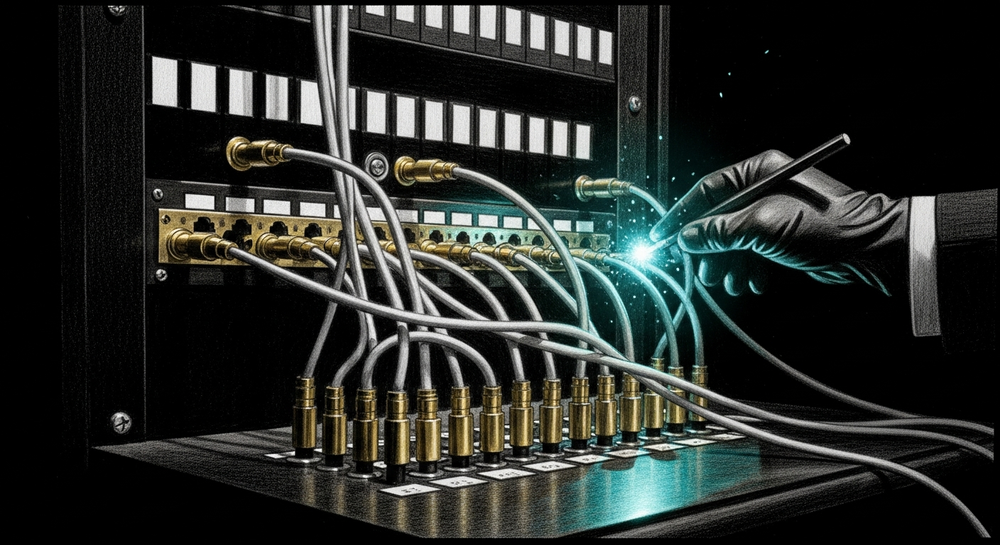

import { Aside } from '@astrojs/starlight/components';

Every port in Sanctum has a number, and most of those numbers mean something — a movie year, a calculator joke, a cry for help. We didn't set out to build a Deadpool-style naming convention into our network topology. It just happened, the way it always does: one engineer picks 1337 for the LLM server, another picks 42069 for the memory store, and suddenly you're maintaining a spreadsheet of cultural references alongside your firewall rules. We leaned in. If the infrastructure is going to be absurd, it should at least be _consistently_ absurd.

## The Deadpool Protocol

**Acceptable forms for a named port:**

- **Palindromes** — 10101 reads the same backwards. The binary-21 joke is the bonus.
- **Pop-culture references** — a release year (1977 = Star Wars), a number from a movie (2001 = HAL), a band album (5150 = Van Halen), a sitcom unit (4077 = M\*A\*S\*H).
- **Numeric puns or math constants** — 31416 ≈ π × 10⁴. The knowledge graph circles back on itself. The number earns its keep.
- **Paired/sequential wit** — 42069/42070: memory-vault and its reranker companion. The gag travels with the pair. One port, one joke, twice the coverage.
- **Upside-down calculator** — 8008. You know what you did.
- **The dry acknowledgment** — for defaults (8123) and sequential allocations (18080), the commentary acknowledges exactly what it is. The humor is in the honesty.

**What is not acceptable:** forcing a cultural reference onto a number that is just doing its job. 3030 is 3030. It is not anything else. The commentary for 3030 says "the port offers no additional commentary." That _is_ the commentary.

**The mandate for new ports:** Any PR introducing a new port must include the gag in the PR description AND add a `# port_lore: <one sentence>` comment to the `port:` field in `~/.sanctum/services/<name>.yaml`. The watchdog schema ignores this comment. The next engineer at 2 AM will not. See CONTRIBUTING.md for the full checklist.

## The catalog

| Port | Service | Host | Codename | Commentary |
|------|---------|------|----------|------------|
| 22 | SSH | VM | — | The one port that doesn't need a personality. |
| 80 | Dench Proxy (disabled) | Mac | Vanity Mirror | Exists solely so someone can type  and feel important. Currently unplugged, like a decorative fireplace. |
| 1111 | Command Center | Mac | Make-A-Wish | 11:11 — you're supposed to close your eyes, not open a socket. |
| 2222 | Health Center | Mac | Twin Twos | The digital twin gets its own pair. Two for the body, two for the system that watches it. |
| 1138 | Voice Agent | Mac | Cell Block 1138 | Reclaimed from the deprecated Neural Link, now keeping Yoda securely imprisoned in a Star Wars sandbox. Briefly drifted to LiveKit's `:8081` default during the April 2026 worker split; reclaimed once the doctrine audit caught it. THX 1138 stays. |
| 1234 | LM Studio | Mac | Password1 | The port equivalent of leaving your key under the mat, except the mat is a 27-billion-parameter model. |
| 1337 | Council MLX | Mac | LEET | Because nothing says elite hacker like a Metal-accelerated language model running inference in a home office. |
| 1969 | Sonos Bridge | Mac | Woodstock | The summer of love, Hendrix, and music in every field. The Sonos bridge puts music in every room — same energy, fewer mud-covered hippies. |
| 1977 | Gateway | Mac + VM | A New Hope | Star Wars release year. The gateway between Mac and VM, which is approximately as fraught as the trench run. |
| 1949 | Sanctum Presence | Mac | Year Before Telescreens | Orwell published 1984 in 1949. The cross-session lock registry tracks who's writing where — before any of them realize they're being watched. Sister-port to Big Brother on 1984. |
| 1984 | Firewalla Bridge | Mac | Big Brother | George Orwell wrote a warning. We turned it into a port number for our firewall bridge. He would have had notes. |
| 2001 | Anthropic Proxy | VM | HAL | A Space Odyssey. I'm sorry, Dave, I'm afraid I can't let you use the cloud models without a budget. |
| 2187 | Living Force (Watchdog) | Mac | Detention Block | Princess Leia's cell number. Where we keep the watchdog that monitors all other prisoners. |
| 2189 | Sanctum Admit | Mac | Detention Block Annex | One cell over from 2187. The Capacity Doctrine controller decides who gets through the gate — admission control for heavy services before they ever touch the cellblock. |
| 3030 | Rewind Dashboard | Mac | No Additional Commentary | The canonical example from the Deadpool Protocol of a port that earns no joke — except now it carries a service. The commentary is the lack of commentary. |
| 3100 | Outline | Mac (Docker) | Page Turner | 3100 — the kind of number that exists because 3000 was taken and someone started incrementing with quiet desperation. |
| 3333 | Dashboard Frontend | Mac | Quad Three | Three threes plus one more for good measure. The Vite-served front end across the wire from 1111's backend. The slot machine pays out in auto-refresh loops. |
| 3344 | Navigator Bridge | Mac | Math Made Comfortable | 33+11=44; 33×100+44=3344. Not a cultural reference — just math made comfortable. The Holocron sidecar that aggregates per-project monitor status. |
| 3355 | Tommy Guardian | Mac | Pinball Wizard | Tommy by The Who. That deaf, dumb, and blind kid sure plays a mean pinball — and the Guardian Spirit of Manoir Nepveu plays the haus by feel. Dawn and dusk patrols, no daylight. |
| 4007 | Network Control | VM | 007 — Licensed to Ping | Network fabric control. The DNS manager with a license to kill NXDOMAIN. Replaces the old 18092 tunnel. |
| 4040 | Sanctum Proxy | Mac | Forty Cal | Sits at the intersection of every request that enters the haus. Named after the .40-caliber round — the proxy that guards the gate carries accordingly. |
| 4077 | Force Flow | Mac | Hawkeye | M\*A\*S\*H 4077th — the field hospital that triaged casualties with gallows humor and a still. Force Flow triages notifications with approximately the same energy. |
| 4078 | SanctumBridge | Mac | The FDA Neighbor | One door down from Force Flow. The port that reads your messages without reading your messages — FDA-privileged proxy so the MCP server doesn't have to be. |
| 5150 | Signal Proxy | VM | Van Halen | Eddie's hottest album and California's code for an involuntary psychiatric hold. Running a messaging proxy on it feels appropriate either way. |
| 7583 | signal-cli TCP | Mac | Asamk's Default | We didn't pick this one — signal-cli did. The streaming JSON-RPC port that the native daemon (`com.sanctum.signal-cli`) uses to push incoming Signal messages out to the VM-side Yoda chat consumer. The dry acknowledgment of a sane upstream default. |
| 8008 | TTS Voice | Mac | Calculator | Flip it upside down. You know what you did. Now it synthesizes speech (Qwen3-TTS via mlx-audio), which is somehow less juvenile. |
| 8009 | STT Voice | Mac | The Listener | Sequential to 8008 Calculator (TTS). The mouth and the ear, traveling as a pair — Yoda speaks on 8008, hears on 8009. The gag travels with the bundle. |
| 8123 | Home Assistant | Mac (Docker) | Default | HA's factory port. Sometimes the most radical act is not changing the default. |
| 8199 | HA Gateway | Mac | The 81xx Neighbor | Sequential allocation in the 81xx block where the Home Assistant family clustered. The Mac-side translation gateway between Sanctum scripts and HA's REST. No deeper joke than that — see also 8123. |
| 8765 | Yoda Orchestrator | Mac | Countdown | 8‑7‑6‑5. The orchestrator that lines up STT (8009), TTS (8008), LiveKit Worker (1138), and LiveKit Server (7880) like a launch director clearing the pad. |
| 8888 | Kiwix | Mac | Lucky Eights | Four eights. Auspicious in Chinese numerology, overkill everywhere else. Houses the offline encyclopedia for when civilization gets patchy. |
| 10101 | Health Ingester | VM | Binary 21 | 10101 in binary is 21 — blackjack. The health ingester always hits, never stands. |
| 18080 | Orbi Bridge (HTTP) | Mac | Orbital-H | 18080: HTTP's older, more paranoid sibling who moved to a five-digit neighborhood to avoid the crowds. |
| 18085 | Orbi Bridge (API) | Mac | Orbital-A | The API counterpart to 18080. Same Orbi, different verb. REST in peace. |
| 21063 | HomeKit Bridge | Mac (Docker) | Siri's Doorbell | Five digits of Apple-adjacent infrastructure. HomeKit wanted a port; it got the one nobody else was using. |
| 30103 | Sanctum Audit (reserved) | Mac | The Bridge Between Bits and Truth | log₁₀(2) ≈ 0.30103 — the bits-per-decimal-digit constant, the exact conversion factor every audit log silently performs when it lets a human read what a machine wrote. Also a palindrome, because the truth reads the same regardless of which end you start at. Reserved pending the promotion of `audit.rs` out of `sanctum-tts` into a standalone daemon. |
| 31416 | Graphiti Server | VM | Pi | 3.1416 — The knowledge graph circles back on itself. Replaces the old 18093. |
| 7880 | LiveKit Server | Mac | Tailscale-Only | LiveKit's canonical default. Bound to Tailscale IP only — what happens in the voice channel stays in the voice channel. 7881 is the RTC TCP companion. |
| 42069 | Memory Vault | Mac | Nice. | The internet's favorite number. We put long-term memory on it because some decisions are permanent. |
| 42070 | Reranker | Mac | Nice+1. | The sequel nobody asked for but everyone needed. Jina v2 reranking on the port directly after memory-vault. The pair ships together. The gag travels with it. |

<Aside type="tip" title="Why 1977 appears on two hosts">
The Gateway runs on both the Mac ( origin) and the VM ( reverse-proxied). Same port, same service, two machines — because the Rebel Alliance also operated out of multiple bases and it worked out fine until Hoth.
</Aside>

<Aside type="note" title="New arrival: 4077 — Force Flow">
The newest addition to the port registry. Force Flow handles notification triage — deciding what deserves your attention and what gets filed under the haus is fine, stop asking. We gave it 4077 because, like the 4077th M\*A\*S\*H, it operates in a permanent state of controlled chaos, sorting the critical from the cosmetic while maintaining a dark sense of humor about the whole situation. Hawkeye Pierce would approve of a system that intercepts alerts about your thermostat with the same gravity as a push notification about your front door.
</Aside>
