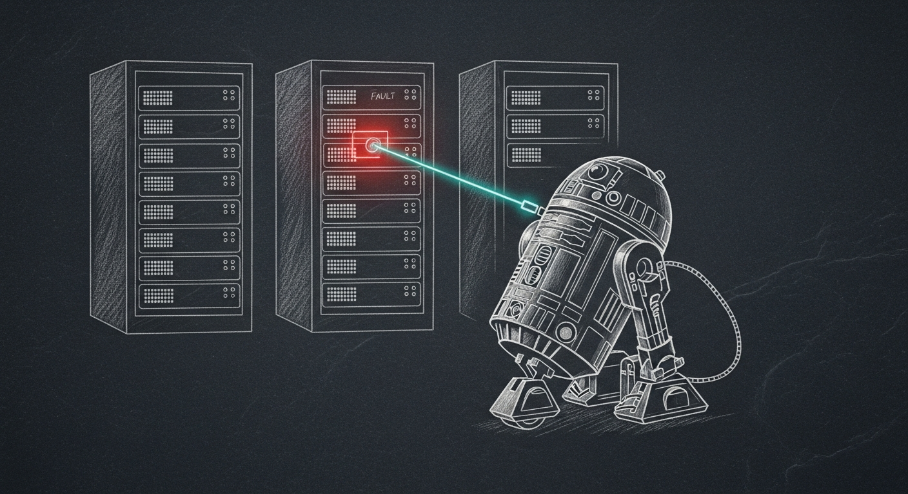

import { Aside, Card, CardGrid } from '@astrojs/starlight/components';




R2D2 sits between the four purpose-built autohealers (OpenRouter key rotation, mlx-drift bootout, SOPS sync, mgmt-key failover) and the human escalation path. Each of those autohealers solves exactly one problem. R2D2 is the generalized dispatcher for the long tail — anything novel-but-bounded that an operator would otherwise repair by hand at 11pm.

The shape is deliberate: **deterministic detectors + LLM-classified notices** feed a small curated registry of named recipes; an eleven-layer safety stack guards every fire; the agent's only mutation surface is a hard-allowlisted set of shell scripts under `~/.sanctum/scripts/r2d2/`. The LLM never gets a shell. It gets a classification head and a recipe pointer.

## Why R2D2 Exists

Three latent problems surfaced in a single day (2026-05-16) that would all have been caught by a generalized auto-fix loop:

1. A Colima LaunchAgent respawned a dead VM for **19 days** after the OrbStack migration retired the workload but not the plist.
2. A merged cathedral binary ran for **30 hours** in production because no one ran `bootout` / `bootstrap` after the build.
3. The vault FTS5 index held **11 rows** for a vault of **2,032 markdown files** — auto-reindex was gated on `count == 0`, never fired.

All three are detectable with one-line probes, safe to fix automatically, and invisible until someone happens to look. The four shipped autohealers each solve one problem; what was missing was a *generalized* dispatcher with a registry of named cures.

## The Eleven-Layer Safety Stack

Every detection — whether from a deterministic detector or from Hermes — passes through the stack below, in order. Any layer can short-circuit to "audit-only" without firing the recipe.

| # | Layer | Mechanism |
|---|---|---|
| 1 | **Kill-switch** | Presence of `~/.sanctum/state/r2d2-disabled` short-circuits every detection. Operator-facing emergency brake. |
| 2 | **Allowlist** | Scripts must resolve under `~/.sanctum/scripts/r2d2/`. Path traversal is blocked even if `recipes.yaml` is tampered with. |
| 3 | **Cooldown** | Same target can't re-fire the same recipe within `cooldown_hours` (1h, 6h, 24h, or 168h depending on blast radius). |
| 4 | **Classifier-only** | Legacy emergency brake at `~/.sanctum/state/r2d2-classifier-only`. Off by default since v0.5. When present, every fire is audit-only. |
| 5 | **Dry-run promotion** | When `dry_run_required: true`, the first detection fires `--dry-run` and writes a promotion entry. The next detection within a 24h window fires for real. |
| 6 | **Hermes extra-dry-run** | LLM-classified detections always pass `--dry-run` regardless of recipe-level setting — the model is less trustworthy than a deterministic detector. |
| 7 | **Recipe-id validation** | If Hermes proposes a `recipe_id` not in the registry, the decision is coerced to `escalate` and the hallucination is audit-logged. |
| 8 | **Cycle bookends** | Each cycle emits `cycle_start` + `cycle_end` rows with a UUID and `duration_s`. Any 10-minute sweep is bisectable without ambiguity. |
| 9 | **Chitti heartbeat** | Cycle end POSTs to chitti's samskara endpoint so peer agents can see R2D2 alive (`{attempts, success_rate, last_seen}`). |
| 10 | **Force Flow critical escalation** | `detector_error`, `missing_detector`, and `decision=exec_error` rows fire a `severity=critical` Force Flow notify in addition to the audit row. Silent failures are prohibited by doctrine. |
| 11 | **Bounded audit log** | `~/.sanctum/logs/r2d2-audit.jsonl` rotates to `.jsonl.1` above 50 MB. Unbounded resources are not bounded. |

<Aside type="note">
Eleven layers between a detection and a deletion. The cost of any single false-positive is at most the cost of moving a file aside or renaming a plist — both reversible. The cost of *not* firing, multiplied across days of stale binaries, drifted Keychain entries, and orphan LaunchAgents, is the slow accumulation that broke unattended operation for years before this drone existed.
</Aside>

## The Recipe Registry

Nine recipes ship at v0.5, each a four-tuple of (detector, script, dry-run policy, cooldown). Adding a tenth is a YAML entry plus a shell script — no code change to the classifier, no privilege escalation surface. The description's first line is what Hermes sees during LLM classification; keep it a one-sentence "fires when X" trigger condition.

| id | severity | Fires when | Action |
|---|---|---|---|
| `retire-orphan-launchagent` | low | A `com.sanctum.*` plist's `Program` path no longer exists on disk | `launchctl bootout` + rename plist to `.retired-YYYY-MM-DD` |
| `reload-service-after-merge` | medium | A launchd-managed `sanctum-rs*` process started before its on-disk binary's mtime | `bootout` + `bootstrap` to pick up the new binary |
| `reindex-stale-fts` | low | The memory-vault FTS5 index has fewer than 50% of the on-disk markdown file count | Move `.vault.db` aside with `.stale-YYYY-MM-DD` suffix; next consumer auto-reindexes |
| `repair-keychain-secret-drift` | medium | A `~/.sanctum/secrets/<name>` value differs from the matching macOS Keychain entry | `security add-generic-password -U` from the secrets file (old value captured to audit log first) |
| `heal-stale-firewalla-dnsmasq` | medium | Force Flow reports a screen-group unblocked but Firewalla's on-disk dnsmasq `policy_*.conf` still NXDOMAINs one of its MACs | Backup → delete redis `policy:N` + zrem `policy_active` + `sudo rm policy_N.conf` → SIGHUP dnsmasq → verify |
| `heal-yoda-warmth` | low | openclaw's silent-reply dist file lost the `YODA-WARMTH-PATCHED` marker (an `npm install` reverted the customization) | Re-run idempotent `yoda-warmth-patch.sh` + restart openclaw-gateway |
| `heal-yoda-warmth-wrapper` | medium | `yoda-chat-consumer` is running but the consumer-side warmth wrapper is missing, empty, or no longer imported | Re-deploy from the in-repo mirror at `Claude_Code/sanctum/yoda-chat/` + restart consumer |
| `heal-openclaw-gateway-config-crashloop` | high | openclaw-gateway is in a sustained crashloop (≥3 restarts in 5 min) due to a Zod schema validation failure on `openclaw.json` | Restore the most recent `.bak-pre-*` / `.bak-broken-*` backup, preserve the broken file, restart, assert active |
| `heal-sanctum-server-secret-leak` | high | A sanctum-managed launchd plist has hardcoded provider secrets (`sk-or-v1-`, `sk-ant-`, `AIzaSy`, `ghp_`, `xoxb-`) in `EnvironmentVariables` | Backup plist, `plutil -remove` the offending env var (only if a `~/.sanctum/secrets/<name>` counterpart exists), `bootout` + `bootstrap`, verify |

The registry is the safety surface. Hermes can never invent a new recipe at runtime — if a notice doesn't match anything in the registry, it gets the `escalate` path. Recipe descriptions are tuned with the classifier in mind: the first line is what the LLM sees.

## Two Ingest Paths

```
        ┌──────────────┐
        │ Cycle every  │
        │ 10 minutes   │
        └──────┬───────┘
               │
   ┌───────────┴───────────┐
   ▼                       ▼
┌─────────────┐    ┌──────────────────┐
│ Deterministic│    │ Force Flow log + │
│ detectors    │    │ chitti samskara  │
│ (one per     │    │ tail past        │
│  recipe)     │    │ bookmark         │
└──────┬──────┘    └────────┬─────────┘
       │                    │
       │                    ▼
       │           ┌──────────────────┐
       │           │ Hermes classify  │
       │           │ (LLM via OR)     │
       │           │ {auto|escalate|  │
       │           │  info}           │
       │           └────────┬─────────┘
       │                    │
       └────────┬───────────┘
                ▼
        ┌──────────────┐
        │ 11-layer     │
        │ safety stack │
        └──────┬───────┘
               │
   ┌───────────┴───────────┐
   ▼                       ▼
┌────────┐          ┌──────────┐
│ Recipe │          │ Audit log│
│ script │          │ + chitti │
│ fires  │          │ + FF     │
└────────┘          └──────────┘
```

- **Path one** — deterministic detectors. One Python function per recipe, returning zero or more `Detection` dataclasses. Cheap, exact, no model spend. Hits the safety stack and either fires the recipe or audit-only-logs the would-fire.
- **Path two** — Hermes ingest. Tails Force Flow log and chitti samskara past a bookmark file, classifies each new line with `nousresearch/hermes-3-llama-3.1-70b` via OpenRouter. Hermes returns one of `{auto:<recipe-id>, escalate:<reason>, info}`. Per-cycle budget capped at 5 classifications × ~$0.0001 ≈ $0.07/day max under full load.

Hermes is optional. Without `R2D2_HERMES=1` in the launchd plist, the LLM ingest layer is skipped entirely and only the four deterministic detectors run.

## Adding A Recipe

Three files, in order:

1. **Detector** — add a `Detection`-returning function to `~/.sanctum/r2d2/classify.py`, then register it in the `DETECTORS` map at the bottom of the file. Skip this step if the signal is unstructured text — Hermes handles those via the registry's `description` field. Detectors must never raise; on any internal error, return an empty list and let the cycle continue.

2. **Script** — add a shell script under `~/.sanctum/scripts/r2d2/`. The first argument is the recipe's `target`; the second argument is `--dry-run` (optional). The script MUST support `--dry-run` cleanly if the recipe sets `dry_run_required: true` — Layer 5 will pass it on the first detection and trust the exit code.

3. **YAML entry** — add a recipe to `~/.sanctum/r2d2/recipes.yaml` with `id`, `description`, `detector`, `script`, `dry_run_required`, `cooldown_hours`, `reversible`, and `severity`. The `description`'s first line is what Hermes sees during classification; keep it a one-sentence "fires when X" trigger condition.

Run `python3 ~/.sanctum/r2d2/classify.py` manually to verify the detector finds what you expect; run the script with `--dry-run` directly to verify the action.

## Forensic Artifacts

Every recipe leaves enough behind to reverse what it did, by hand or by script:

- **`.bak-broken-r2d2-<ts>`** — `heal-openclaw-gateway-config-crashloop` preserves the failing config file before restoring the prior backup. The bad file is renamed, not deleted, so a post-mortem can compare both states.
- **`.bak-pre-*` and `.bak-broken-*`** — openclaw itself writes these on config-rotation; R2D2 reads the most recent one when restoring after a crashloop. The chain is operator-visible at `~/.openclaw/`.
- **`~/.sanctum/firewalla-rescue/<ts>-r2d2-<group>/backup.txt`** — `heal-stale-firewalla-dnsmasq` dumps the redis `policy:N` payload + the on-disk `policy_N.conf` content + the SSH command journal before any deletion. Full reversal is `cat backup.txt | bash`.
- **`~/.sanctum/retired/<label>.plist.bak-r2d2-secret-leak-<ts>`** — `heal-sanctum-server-secret-leak` backs up the offending plist before `plutil -remove` strips the secret env var.
- **`<plist>.retired-YYYY-MM-DD`** — `retire-orphan-launchagent` renames, never deletes. Two-click recovery if the orphan turns out to have been intentional.
- **`<vault>.vault.db.stale-YYYY-MM-DD`** — `reindex-stale-fts` moves the old index aside. The next memory-vault-mcp invocation rebuilds from scratch (Rust binary auto-reindexes on `count == 0`).
- **`~/.sanctum/logs/r2d2-audit.jsonl`** — one row per detection, classification, decision, exec result. Includes the captured-old-value for `repair-keychain-secret-drift` so the prior Keychain entry can be restored verbatim. Rotates at 50 MB.
- **`~/.sanctum/state/r2d2-promotions.json`** — Layer 5's two-cycle promotion ledger. An entry shows that a target has a clean dry-run within the 24-hour window and is eligible for a real fire on the next detection.
- **`~/.openclaw/logs/r2d2.log`** — launchd stdout. One JSON cycle summary per 10-minute cycle: `{kill_switch, classifier_only, cycle_id, detections, fired, skipped, duration_s}`.

## Operating

```bash
# One-shot cycle (skips Hermes by default in manual invocations)
python3 ~/.sanctum/r2d2/classify.py

# Manual cycle with Hermes
R2D2_HERMES=1 python3 ~/.sanctum/r2d2/classify.py

# Audit-log roll-up for the last 24h (or 168 for a week)
python3 ~/.sanctum/r2d2/classify.py --summary
python3 ~/.sanctum/r2d2/classify.py --summary 168

# Soft rollback to classifier-only mode (audit, never fire)
touch ~/.sanctum/state/r2d2-classifier-only

# Hard kill — every detection short-circuits to a no-op-with-audit-row
touch ~/.sanctum/state/r2d2-disabled
```

R2D2 is generative help, not load-bearing. If the plist crashes, nothing breaks — notices keep flowing to Force Flow and chitti exactly as before. Failure mode is "less helpful," not "broken."

## See Also

- Source: `~/.sanctum/r2d2/{classify.py, recipes.yaml, hermes.py}`
- Scripts: `~/.sanctum/scripts/r2d2/`
- Audit log: `~/.sanctum/logs/r2d2-audit.jsonl`
- LaunchAgent: `~/Library/LaunchAgents/com.sanctum.r2d2.plist` (RunAtLoad, StartInterval=600s)
- Field notes: [2026-05-16 — R2D2 Found Eight Things](/operations/2026-05-16-r2d2-found-eight-things/), [2026-05-19 — R2D2 Got Honest](/operations/2026-05-19-r2d2-got-honest/), [2026-05-21 — R2D2 Got Courage](/operations/2026-05-21-r2d2-got-courage/)
