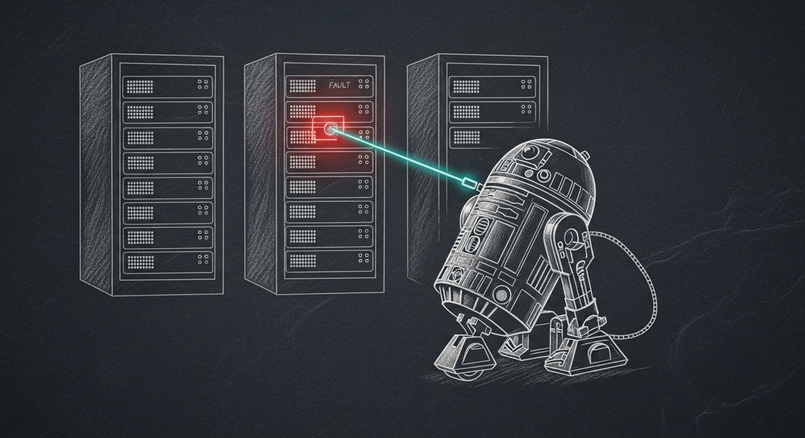

import { Aside, Card, CardGrid } from '@astrojs/starlight/components';




R2D2 sits between the four purpose-built autohealers (OpenRouter key rotation, mlx-drift bootout, SOPS sync, mgmt-key failover) — each solving exactly one problem — and the human escalation path. It is the generalized dispatcher for the long tail: anything novel-but-bounded an operator would otherwise repair by hand at 11pm.

The shape is deliberate: **deterministic detectors + LLM-classified notices** feed a small curated registry of named recipes; an eleven-layer safety stack guards every fire; the agent's only mutation surface is a hard-allowlisted set of shell scripts under `~/.sanctum/scripts/r2d2/`. The LLM never gets a shell — only a classification head and a recipe pointer.

## Why R2D2 Exists

Three latent problems surfaced in a single day (2026-05-16), all catchable by a generalized auto-fix loop:

1. A Colima LaunchAgent respawned a dead VM for **19 days** after the OrbStack migration retired the workload, not the plist.
2. A merged cathedral binary ran for **30 hours** in production because no one ran `bootout`/`bootstrap` after the build.
3. The vault FTS5 index held **11 rows** for **2,032 markdown files** — auto-reindex was gated on `count == 0`, never fired.

All three are detectable with one-line probes, safe to fix automatically, and invisible until someone happens to look — the case for a *generalized* dispatcher with a registry of named cures.

## The Eleven-Layer Safety Stack

Every detection — deterministic or Hermes — passes through the stack below, in order. Any layer can short-circuit to "audit-only" without firing the recipe.

| # | Layer | Mechanism |
|---|---|---|
| 1 | **Kill-switch** | Presence of `~/.sanctum/state/r2d2-disabled` short-circuits every detection. Operator-facing emergency brake. |
| 2 | **Allowlist** | Scripts must resolve under `~/.sanctum/scripts/r2d2/`. Path traversal is blocked even if `recipes.yaml` is tampered with. |
| 3 | **Cooldown** | Same target can't re-fire the same recipe within its `cooldown_hours` (1h, 2h, 6h, 24h, or 168h, scaled to blast radius — weekly for orphan-plist retirement, hourly for a gateway crashloop). |
| 4 | **Classifier-only** | Legacy emergency brake at `~/.sanctum/state/r2d2-classifier-only`. Off by default since v0.5. When present, every fire is audit-only. |
| 5 | **Dry-run promotion** | When `dry_run_required: true`, the first detection fires `--dry-run` and writes a promotion entry. The next detection within a 24h window fires for real. |
| 6 | **Hermes extra-dry-run** | LLM-classified detections always pass `--dry-run` regardless of recipe-level setting — the model is less trustworthy than a deterministic detector. |
| 7 | **Recipe-id validation** | If Hermes proposes a `recipe_id` not in the registry, the decision is coerced to `escalate` and the hallucination is audit-logged. |
| 8 | **Cycle bookends** | Each cycle emits `cycle_start` + `cycle_end` rows with a UUID and `duration_s`. Any 10-minute sweep is bisectable without ambiguity. |
| 9 | **Chitti heartbeat** | Cycle end POSTs to chitti's samskara endpoint (`127.0.0.1:2188/action`) so peer agents see R2D2 alive: `{service: r2d2, pattern: cycle, action: heartbeat, success, evidence}`, where `evidence` carries `cycle=<id> det=<n> fired=<n> hermes=<n> cost_usd=<n> dur=<n>s`. |
| 10 | **Proportional Force Flow escalation** | `detector_error`, `missing_detector`, and `decision=exec_error` rows escalate to Force Flow — but at a severity that reflects *what* failed, so P0/P1 stays crucial, not R2D2's own health. A config/code hiccup (missing detector, detector raised, contract violation) lands at `warn`; only a recipe heal that ran and FAILED on a `high`/`critical` recipe escalates at `error`/`critical` (the thing it guards may be down). A **self-ingest guard** also drops `source=r2d2` lines from the Force Flow tail, so R2D2 never re-classifies its own escalations into a feedback loop. Silent failures are still prohibited — they're just no longer all paged as P0. |
| 11 | **Bounded audit log** | `~/.sanctum/logs/r2d2-audit.jsonl` rotates to `.jsonl.1` above 50 MB. Unbounded resources are not bounded. |

<Aside type="note">
Eleven layers sounds like paranoia until you price the two outcomes. A false positive costs one renamed file — `git revert` and a shrug. A false *negative*, multiplied across days of stale binaries, drifted Keychain, and orphan LaunchAgents nobody looks at, is the quiet rot that broke unattended operation before this droid showed up. The stack is asymmetric on purpose: it would rather do nothing twice than the wrong thing once.
</Aside>

## The Recipe Registry

Thirteen recipes ship, each a four-tuple of (detector, script, dry-run policy, cooldown). Adding one more is a YAML entry plus a shell script — no code change, no privilege escalation surface.

| id | severity | Fires when | Action |
|---|---|---|---|
| `retire-orphan-launchagent` | low | A `com.sanctum.*` plist's `Program` path no longer exists on disk | `launchctl bootout` + rename plist to `.retired-YYYY-MM-DD` |
| `reload-service-after-merge` | medium | A launchd-managed `com.sanctum.*` process started more than 60s before its on-disk binary's mtime (merged + rebuilt, never reloaded) | `bootout` + `bootstrap` to pick up the new binary |
| `reindex-stale-fts` | low | The memory-vault FTS5 index has fewer than 50% of the on-disk markdown file count | Move `.vault.db` aside with `.stale-YYYY-MM-DD` suffix; next consumer auto-reindexes |
| `repair-keychain-secret-drift` | medium | A `~/.sanctum/secrets/<name>` value differs from the matching macOS Keychain entry | `security add-generic-password -U` from the secrets file (old value captured to audit log first) |
| `heal-stale-firewalla-dnsmasq` | medium | Force Flow reports a screen-group unblocked but Firewalla's on-disk dnsmasq `policy_*.conf` still NXDOMAINs one of its MACs | Backup → delete redis `policy:N` + zrem `policy_active` + `sudo rm policy_N.conf` → SIGHUP dnsmasq → verify |
| `heal-yoda-warmth-wrapper` | medium | `yoda-chat-consumer` is running but the consumer-side warmth wrapper is missing, empty, or no longer imported | Re-deploy from the in-repo mirror at `Claude_Code/sanctum/yoda-chat/` + restart consumer |
| `heal-openclaw-gateway-config-crashloop` | high | openclaw-gateway is in a sustained crashloop (≥3 restarts in 5 min) due to a Zod schema validation failure on `openclaw.json` | Restore the most recent `.bak-pre-*` / `.bak-broken-*` backup, preserve the broken file, restart, assert active |
| `heal-sanctum-server-secret-leak` | high | A sanctum-managed launchd plist has hardcoded provider secrets (`sk-or-v1-`, `sk-ant-`, `AIzaSy`, `ghp_`, `xoxb-`) in `EnvironmentVariables` | Backup plist, `plutil -remove` the offending env var (only if a `~/.sanctum/secrets/<name>` counterpart exists), `bootout` + `bootstrap`, verify |
| `heal-sanctum-mlx-codestral-down` | high | `sanctum-mlx-codestral` in a sustained crash-loop (3+ in 5 min) or its log shows repeated model-load / mTLS / Metal failures | Bootout codestral, preserve the broken plist (`.failed` + timestamp), bootstrap `sanctum-mlx-coder` as the Qui-Gon fallback; vault-announces critical |
| `heal-claude-max-proxy-content-flatten` | high | `claude-max-api-proxy`'s dist lost the `content-flatten patch v1` marker (a `pnpm update` regression), so every Yoda reply becomes the literal "[object Object]" | Re-run the idempotent patch script + restart `com.sanctum.claude-max-proxy` |
| `heal-force-flow-bridge` | high | Force Flow's screen-time reconciler gets HTTP 401 from the Mac Firewalla bridge (`127.0.0.1:1984`) — a Lima VM shadowing the port, or token drift | Wrap `force-flow-bridge-sentinel.py --force`: add the lima 1984-ignore guard and drop the guest listener, or rewrite the canonical token from the live bridge |
| `reload-stuck-launchd-service` | medium | The launchd-health-sentinel flags a `com.sanctum/jocasta/openclaw` KeepAlive service as actively crash-looping (running pid, alive under 10 min, non-zero exit) after its intentional-non-zero allowlist | `launchctl kickstart -k` the wedged service + verify a live pid or clean exit. Crash-loops only — never "stuck" timer jobs (they re-run on schedule); heavy/dedicated-healer services (mlx/codestral/gateway/claude-max) excluded |
| `reconcile-cosmetic-plist-drift` | low | `sanctum-plist classify <label>` returns `cosmetic-drift` — the live prod plist differs from its repo copy but every changed line is provably cosmetic (a `--tls-host` marker, a Tailscale IP matching the live one, a JetsamPriority block) | `sanctum-plist reconcile --yes --cosmetic-only` captures prod back into the repo. Double-gated, fail-closed: a `--model`/`--adapter-path` edit classifies as `drift` and pages the human instead |

The registry is the safety surface. Hermes can never invent a new recipe at runtime — if a notice doesn't match anything in the registry, it gets the `escalate` path.

## Ingest Paths

```
        ┌──────────────┐
        │ Cycle every  │
        │ 10 minutes   │
        └──────┬───────┘
               │
   ┌───────────┴───────────┐
   ▼                       ▼
┌─────────────┐    ┌──────────────────┐
│ Deterministic│    │ Force Flow log + │
│ detectors    │    │ chitti samskara  │
│ (one per     │    │ tail past        │
│  recipe)     │    │ bookmark         │
└──────┬──────┘    └────────┬─────────┘
       │                    │
       │                    ▼
       │           ┌──────────────────┐
       │           │ Hermes classify  │
       │           │ (LLM via OR)     │
       │           │ {auto|escalate|  │
       │           │  info}           │
       │           └────────┬─────────┘
       │                    │
       └────────┬───────────┘
                ▼
        ┌──────────────┐
        │ 11-layer     │
        │ safety stack │
        └──────┬───────┘
               │
   ┌───────────┴───────────┐
   ▼                       ▼
┌────────┐          ┌──────────┐
│ Recipe │          │ Audit log│
│ script │          │ + chitti │
│ fires  │          │ + FF     │
└────────┘          └──────────┘
```

- **Path one** — deterministic detectors. One Python function per recipe, returning `Detection` dataclasses. Cheap, exact, no model spend.
- **Path two** — Hermes ingest. Tails Force Flow log and chitti samskara past a bookmark, classifies each new line with `nousresearch/hermes-3-llama-3.1-70b` via OpenRouter, returning `{auto:<recipe-id>, escalate:<reason>, info}`. Capped at 5/cycle × ~$0.0001 ≈ $0.07/day under full load.

Hermes is optional. Without `R2D2_HERMES=1` in the plist, the LLM layer is skipped and only the deterministic detectors run.

## The Vault Path (v0.4)

A third path reads the Memory Vault inbox — the cross-session, cross-agent message bus. It is R2D2's **lowest-trust input**, gated hardest accordingly: roughly ten agents write it, `from:` is self-asserted, bodies are free text that can steer an LLM, and the corpus is dominated by status broadcasts (`STONE 2 ROOT-FIXED`) that read like action requests.

Eligibility is **default-deny**: a message is read only if it carries a `priority: P0|P1|P2` field AND a `to:` addressed to `r2d2`. (`priority:` is new; do not conflate it with the existing `importance:` float relevance score.) A `to: all` broadcast may escalate but never auto-fire. A **new directory reader** scans the inbox and tracks a seen-message-id bookmark — the vault is per-message files, so the byte-offset tailer the Force Flow path uses could not be reused; a message is classified at most once.

Three guards sit before the model. A **vault self-ingest guard** drops R2D2's own posts (`from`/`source` of `r2d2`) before classification — the Force Flow `source=r2d2` guard does not match vault frontmatter, so without this new guard R2D2 would rebuild the self-paging loop the 2026-06-01 note closed. An **injection tripwire** routes any body with imperative-injection markers (`ignore previous`, `fire recipe`, `system:`) straight to escalate with no LLM call. And the action target, when the fire path is later armed, comes only from a machine `resource:` field (`daemon:`/`repo:`/`file:`/`svc:`) confirmed by a deterministic detector — never from prose.

v1 is **escalate-only**: a vault notice is classified by Hermes and escalated, never fired. Vault priority relays one tier down — P0 to Force Flow `p1` (iMessage), P1 to `p2` (signal), P2 to audit-only — so the vault cannot reach the P0 phone-call tier. Two independent gates, both off by default: `R2D2_VAULT=1` (plist env) arms read and escalate; a separate `r2d2-vault-autofire-armed` touch-file is additionally required before any vault-sourced fire (v2), and only for recipes flagged `vault_fireable: true` — a low/medium, reversible, local-only sub-allowlist. High and critical recipes (gateway, mlx, codestral, secret-leak) are escalate-only from the vault forever. The kill-switch and classifier-only files override both. v1 sets `vault_fireable` on zero recipes.

## Adding A Recipe

Three files, in order:

1. **Detector** — add a `Detection`-returning function to `~/.sanctum/r2d2/classify.py` and register it in the `DETECTORS` map. Skip this step if the signal is unstructured text — Hermes handles those via the registry's `description` field. Detectors must never raise; on any internal error, return an empty list and let the cycle continue.

2. **Script** — add a shell script under `~/.sanctum/scripts/r2d2/`. Argument one is the recipe's `target`; argument two is `--dry-run` (optional). The script MUST support `--dry-run` cleanly if the recipe sets `dry_run_required: true` — Layer 5 passes it on the first detection and trusts the exit code.

3. **YAML entry** — add a recipe to `~/.sanctum/r2d2/recipes.yaml` with `id`, `description`, `detector`, `script`, `dry_run_required`, `cooldown_hours`, `reversible`, and `severity`. The `description`'s first line is what Hermes sees during classification; keep it a one-sentence "fires when X" trigger.

Run `python3 ~/.sanctum/r2d2/classify.py` to verify the detector, and the script with `--dry-run` to verify the action.

## Forensic Artifacts

Every recipe leaves enough behind to reverse what it did:

- **`.bak-broken-r2d2-<ts>`** — `heal-openclaw-gateway-config-crashloop` preserves the failing config (renamed, not deleted) before restoring the prior backup, so a post-mortem can compare both.
- **`.bak-pre-*` and `.bak-broken-*`** — openclaw writes these on config-rotation; R2D2 reads the most recent when restoring after a crashloop.
- **`~/.sanctum/firewalla-rescue/<ts>-r2d2-<group>/backup.txt`** — `heal-stale-firewalla-dnsmasq` dumps the redis `policy:N` payload, the `policy_N.conf`, and the SSH journal before any deletion. Full reversal is `cat backup.txt | bash`.
- **`~/.sanctum/retired/<label>.plist.bak-r2d2-secret-leak-<ts>`** — `heal-sanctum-server-secret-leak` backs up the plist before `plutil -remove` strips the secret env var.
- **`<plist>.retired-YYYY-MM-DD`** — `retire-orphan-launchagent` renames, never deletes; reversible if the orphan was intentional.
- **`<vault>.vault.db.stale-YYYY-MM-DD`** — `reindex-stale-fts` moves the old index aside; the next memory-vault-mcp invocation rebuilds it (Rust binary auto-reindexes on `count == 0`).
- **`~/.sanctum/logs/r2d2-audit.jsonl`** — one row per detection, classification, decision, exec result. Includes the captured-old-value for `repair-keychain-secret-drift` so the prior entry restores verbatim. Rotates at 50 MB.
- **`~/.sanctum/state/r2d2-promotions.json`** — Layer 5's two-cycle promotion ledger: a target with a clean dry-run inside the 24-hour window is eligible for a real fire on the next detection.
- **`~/.openclaw/logs/r2d2.log`** — launchd stdout. One JSON summary per cycle: `{kill_switch, classifier_only, cycle_id, detections, fired, skipped, duration_s}`.

## Operating

```bash
# One-shot cycle (skips Hermes by default in manual invocations)
python3 ~/.sanctum/r2d2/classify.py

# Manual cycle with Hermes
R2D2_HERMES=1 python3 ~/.sanctum/r2d2/classify.py

# Audit-log roll-up for the last 24h (or 168 for a week)
python3 ~/.sanctum/r2d2/classify.py --summary
python3 ~/.sanctum/r2d2/classify.py --summary 168

# Soft rollback to classifier-only mode (audit, never fire)
touch ~/.sanctum/state/r2d2-classifier-only

# Hard kill — every detection short-circuits to a no-op-with-audit-row
touch ~/.sanctum/state/r2d2-disabled

# Vault gate 1 — set R2D2_VAULT=1 in the plist to arm vault read + escalate (v1)
#   plutil -insert EnvironmentVariables.R2D2_VAULT -string 1 ~/Library/LaunchAgents/com.sanctum.r2d2.plist
# Vault gate 2 — additionally permits a vault-sourced fire of a vault_fireable recipe (v2)
touch ~/.sanctum/state/r2d2-vault-autofire-armed
```

R2D2 is generative help, not load-bearing. If the plist crashes, notices keep flowing to Force Flow and chitti exactly as before — the failure mode is "less helpful," not "broken."

## See Also

- Source: `~/.sanctum/r2d2/{classify.py, recipes.yaml, hermes.py}`
- Scripts: `~/.sanctum/scripts/r2d2/`
- Audit log: `~/.sanctum/logs/r2d2-audit.jsonl`
- LaunchAgent: `~/Library/LaunchAgents/com.sanctum.r2d2.plist` (RunAtLoad, StartInterval=600s)
- Field notes: [2026-05-16 — R2D2 Found Eight Things](/operations/2026-05-16-r2d2-found-eight-things/), [2026-05-19 — R2D2 Got Honest](/operations/2026-05-19-r2d2-got-honest/), [2026-05-21 — R2D2 Got Courage](/operations/2026-05-21-r2d2-got-courage/), [2026-06-01 — R2D2 Stops Paging Itself](/operations/2026-06-01-r2d2-stops-paging-itself/), [2026-06-06 — R2D2 Reads the Vault](/operations/2026-06-06-r2d2-reads-the-vault/)
- Design: `docs/superpowers/specs/2026-06-05-r2d2-vault-pstar-design.md` (council-blessed, 5 lenses, unanimous SHIP-WITH-FIXES, approach A-then-B)
