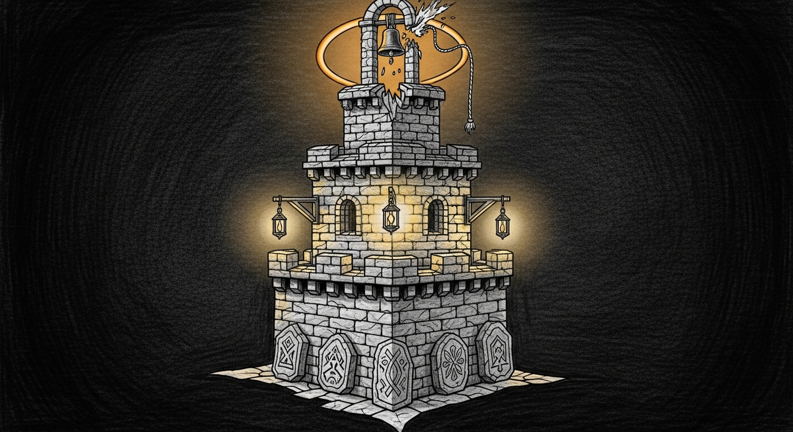

import { Aside, Card, CardGrid } from '@astrojs/starlight/components';

{/* TODO(hero): generate via tools/gen_hero_image.py — prompt: "Pencil sketch of a lighthouse on a rocky shore at dusk, beam sweeping across an empty sea — the keeper invisible inside, the light the only proof anyone is home. Technical pencil sketch, dark background, teal localized accent lighting, clean lines, hand-drawn feel, no text, no words, no letters." Then replace this comment with:  */}

On 2026-05-02 the Mini rebooted before a flight. The post-boot self-test ran four minutes after the kernel came up, fired a single Signal alert noting three failing services, and went quiet. Five days and seventeen hours later — Bert in Palo Alto, asking from a hotel room how the reboot had gone — the answer was: the haus had been down the entire time. Home Assistant had been dead. Its gateway had crashlooped silently, waiting on a container that no longer existed. Two Rust services had been crashlooping behind orphan PIDs from boot. Nothing past that one Signal had paged anyone.

The system was "running" in every sense the launchd CLI cared about. It was also, in the sense Bert cared about, not.

The Reliability Doctrine is what came out of the next forty-eight hours.

## Three Promises

<CardGrid>
  <Card title="You Always Know" icon="approve-check-circle">
    Silence is failure. If a critical service is down, the channel itself doesn't get to be the reason you don't hear about it. Force Flow is the path; an independent watchdog catches the case where Force Flow itself is what's down.
  </Card>
  <Card title="Self-Heal First; Humans Last" icon="rocket">
    Probes detect, failsafes act, runbooks escalate — in that order, with bounded retries between. Bert's iMessage is the last move on the ladder, not the first.
  </Card>
  <Card title="No Phantom Alerts" icon="warning">
    A probe that lies (says HEALTHY while the service is dead) and a probe for a service that no longer exists are the same crime: they teach you to ignore alerts. Both are doctrine violations.
  </Card>
</CardGrid>

## Five Principles

These are the non-negotiables. If a clause anywhere else in the doctrine appears to conflict with a principle, the principle wins; the clause is the bug.

**P1. Every always-alive service must be load-bearing.** If a service can disappear for a week and no one notices, it doesn't belong in the always-alive set. Move it to a cron, retire it, or admit you don't actually need it.

**P2. Every always-alive service must satisfy the four-layer pattern.** Patch + probe + failsafe + runbook. No exceptions. Merge gate.

**P3. Self-heal gets the first move; humans get the last.** Probes detect, failsafes act, runbooks escalate. Bounded retries between every transition.

**P4. Silence is failure — escalation has a ceiling, not just a floor.** A service reported failing once and still failing must escalate again. No "I told you about this five days ago" exemption.

**P5. The escalation channel must outlive its primary path.** Force Flow is the path. The failsafe-to-iMessage watchdog catches the case where Force Flow is the thing that died. Belt and suspenders are not optional when the suspenders are the alert.

## The Four Layers

Every always-alive service satisfies all four. A PR introducing a new service must declare its tier and present its four layers; a PR retiring a service must remove the corresponding probe in the same change.

<CardGrid>
  <Card title="Layer 1 — Patch" icon="seti:c">
    The durable upstream fix. Lives in version control, ships with a regression test that fails before and passes after, gets filed upstream when the bug is upstream. `// works around X` comments without a regression test are debt, not documentation.
  </Card>
  <Card title="Layer 2 — Probe" icon="magnifier">
    Liveness, cadence, and **a contract assertion**. Cadence is tier-proportional: 30s for haus-critical, 60s for council-critical, 5 min for ops-critical. The contract assertion exercises the actual work surface — does the bridge return hosts, does the model serve tokens, does the gateway round-trip a synthetic event. Endpoints that return 200 because the process exists are not probes; they are theater.
  </Card>
  <Card title="Layer 3 — Failsafe" icon="setting">
    The auto-heal action, with bounded retries and closed-loop verification. Three attempts max, exponential backoff, and the same probe must return HEALTHY before any heal counts. Truthy dict ≠ success. Self-healers that detect-and-only-log are a doctrine violation; the haus stayed down for nearly a week behind one of those.
  </Card>
  <Card title="Layer 4 — Runbook" icon="document">
    Both human-readable and machine-executable. Every runbook is a markdown page in `docs/doctrine/runbooks/` *and* a `tools/runbook/<service>.sh` with `--dry-run` and `--apply` modes. CI lints both forms stay in sync. Every runbook is drilled at least once per quarter; failed drill = doctrine bug, file a fix.
  </Card>
</CardGrid>

## State Grammar

Every probe emits one of four states in structured form. Force Flow routes on these:

| State | Meaning | Triggers |
|---|---|---|
| `HEALTHY` | Liveness ✓, cadence ✓, contract ✓ | No action |
| `DRIFT` | Liveness ✓ but readiness or contract divergent | Failsafe (drift correction) |
| `FAILED` | Liveness or contract failing; retries available | Failsafe (auto-heal) |
| `BLOCKED` | Failsafe exhausted, or external dependency wedged | Human escalation per channel grammar |

The state machine is small enough to memorize. `HEALTHY ⇄ DRIFT`. `HEALTHY → FAILED → HEALTHY|BLOCKED`. `DRIFT → BLOCKED`. `BLOCKED → human via runbook → HEALTHY`.

## Channel Grammar

Severity maps to channel by tier, not by service:

| Severity | Channel | Latency |
|---|---|---|
| **P0** | iMessage + Yoda phone call | Minutes |
| **P1** | iMessage | Tens of minutes |
| **P2** | Signal (or 07:00 EDT digest if quiet hours) | Hours |

Heal-then-escalate is multi-stage. P0 services that go FAILED for two minutes get a first heal attempt; for five minutes, a second plus a Signal heads-up; for ten minutes, an iMessage and a phone call. P1 and P2 use longer fuses but the same shape: try to fix it first, escalate when persistence proves the system can't fix itself.

P0 alerts override quiet hours, always. The haus does not wait until morning.

## Why This Class of Doctrine Exists

The doctrine isn't novel — its parts are well-known reliability patterns from SRE practice and military doctrine. What's specific to Sanctum is the *commitment* to apply all four layers to every always-alive service, and to treat silence as a failure mode equal in severity to a crash.

Without this commitment, what happens is what happened on 2026-04-27: a maintenance window stops a container, no commit retires the service, the post-boot self-test fires one alert at the next reboot, the gateway daemon crashlooooooops politely on the missing container, the self-healer faithfully detects the problem every thirty minutes, and nobody hears anything. Five days later the lights still come on because someone happened to ask.

This doctrine makes that exact failure structurally impossible. The patch is in code; the probe carries a contract assertion; the failsafe actually heals and verifies; the runbook is drilled. And if the channel itself dies, an independent watchdog catches it.

The lighthouse keeper is invisible inside. The light is the only proof anyone is home. Doctrine v1 is the keeper's standing order: keep the light on, and if you can't, scream loud enough that someone can.

<Aside type="note">
The internal version of this doctrine — service inventory, per-service four-layer audit, wave plan, council records — lives in the operations repo. This page is the public charter. Both versions move together; one cannot drift without the other.
</Aside>
