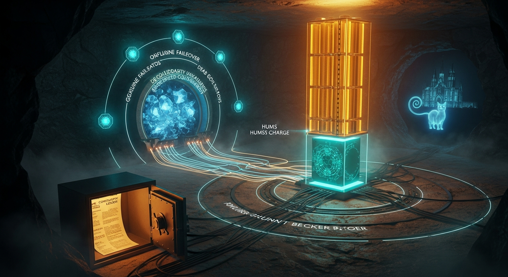
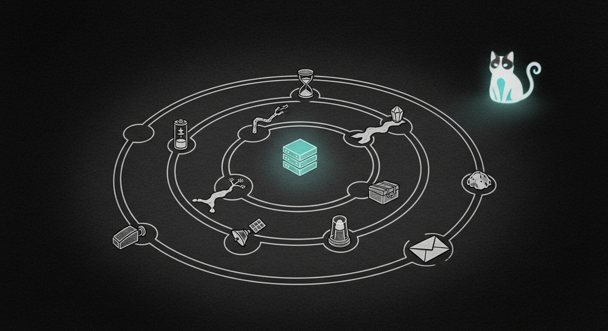

import { Aside } from '@astrojs/starlight/components';

The grid dies at 3 a.m. in a January ice storm. The Mini keeps thinking — for a while. Every doctrine before this one quietly assumed that morning never comes: that the lights stay on, that a cloud seat is one handshake away, that a human will notice the red dashboard. On a bad enough day — grid down, uplink dead, HuggingFace gone, operator unreachable, Montreal a no-go — each of those is a single point of failure nobody was watching.

The Resilience Doctrine removes those assumptions: seven small, fail-safe, mostly-dormant pieces, each giving the haus a sense it lacked — of its power, its uplink, its mortality, and its seed. None acts irreversibly unless two independent gates agree, and most ship **disarmed by design**, logging exactly what they *would* do so the first real action is never a surprise.

## The seven pieces

| Piece | Daemon / tool | Cadence | What it gives the haus |
|---|---|---|---|
| Power-sense + graceful shutdown | `com.sanctum.power` | 20s loop | a sense of grid-vs-battery; a clean halt before the cell dies |
| Operator dead-man's-switch | `com.sanctum.deadman` | every 6h | a sense of its own mortality — a bell, never a gavel |
| WAN sentinel | `com.sanctum.wan-sentinel` | every 60s | a sense of its uplink; auto-flip to local seats |
| Offline-mode failover | `sanctum-offline` | manual | re-point every cloud seat onto the cathedral, reversibly |
| R2 break-glass backup | `sanctum-r2-breakglass` | daily | a geo-redundant rebuild seed on free-tier Cloudflare R2 |
| Cold model-weights archive | `sanctum-cold-archive` | manual | a cold, integrity-verified copy of the kyber |
| Continuity paper layer | `~/.sanctum/continuity/` | paper | a floor that needs no power |

## A sense of its own power

The EcoFlow Delta 3 Max Plus backing the Mini passes mains *through*, so macOS only ever sees "AC Power" — blind to grid-vs-battery. `sanctum-power.py` (`com.sanctum.power`, `KeepAlive`, 20s `POLL_INTERVAL`) gives the haus that missing sense, reading state-of-charge over the EcoFlow IoT Open API (`GET https://api-e.ecoflow.com/iot-open/sign/device/quota/all`, HMAC-SHA256 signed).

The state machine is `GRID → BATTERY → CRITICAL` (thresholds `WARN_SOC=40`, `CRITICAL_SOC=25`, `SHUTDOWN_SOC=15`, env-overridable). The destructive halt — the most-gated action in the campaign — needs four conditions at once:

| Halt gate | Condition |
|---|---|
| State | `CRITICAL` (SoC ≤ `SHUTDOWN_SOC`) |
| Below-shutdown debounce | sustained past `SHUTDOWN_DEBOUNCE` (60s) |
| Off-mains debounce | sustained past `ON_BATTERY_DEBOUNCE` (45s) |
| Armed | `POWER_ARMED` is true |

The shutdown is a bounded ordered sequence — quiesce the cathedral, stop the proxyd writers (`signal-cli`), `limactl stop` the VM, `sync`, `shutdown -h now` — each step timeout-bounded, so a hung step is skipped and the run always reaches the protective `sync` and halt. `pmset` is corroboration only — under pass-through it always reads "AC Power," so it never vetoes the EcoFlow sensor.

<Aside type="caution" title="A blind read never powers off the haus">
With no EcoFlow keys in `~/.sanctum/secrets/`, `classify()` returns `UNKNOWN` and `evaluate()` does an explicit `pass` — silent by design. A genuinely blind *sensor* (an API/network failure) pages `error`/`blind`; an *unprovisioned* one does not page at all, and off-mains with an unreadable SoC returns `UNKNOWN` rather than act blind.
</Aside>

## A sense of its own uplink

Nothing watched the WAN, so a dead uplink used to be noticed only when a cloud council call hung mid-answer. `sanctum-wan-sentinel.py` (`com.sanctum.wan-sentinel.plist`, one tick every 60s) closes that. It TCP-probes three anchors on three operators — Cloudflare `1.1.1.1:443`, Google `8.8.8.8:53`, Quad9 `9.9.9.9:443` — plus a real recursive resolve of `one.one.one.one`. Verdict is UP if *any* signal succeeds, so no one provider's bad day reads as a WAN loss (a RST counts as UP — the packet still round-tripped).

The clever part is the WAN-vs-LAN distinction, made via the default gateway: a blackout plus a *reachable* gateway means `WAN_DOWN` (uplink dead, LAN fine); an *unreachable* gateway means `LAN_DOWN`; an unreadable gateway means `UNKNOWN`, which holds the prior state. A down verdict needs a 2-cycle debounce; recovery is trusted immediately. When armed (`SANCTUM_WAN_AUTO_OFFLINE` in `{1,true,yes}`) and `WAN_DOWN`, it calls `sanctum-offline on`; on `LAN_DOWN` it pages only — local seats cannot help an islanded box.

## A sense of where to think when the cloud is gone

`sanctum-offline` is the hands the WAN sentinel reaches for — a *manual, reversible* toggle, not a daemon. It snapshots the live proxyd config (`~/.sanctum/sanctum-proxy/config.yaml`) to `config.online-snapshot.yaml`, atomically rewrites every cloud seat and the fallback graph onto the cathedral (`qwen3.6-35b-a3b-4bit` at `https://127.0.0.1:1337`, mtls); proxyd hot-reloads on the change — no restart. The code seat (Devstral on `:3301`) is already local and is left untouched; `off` restores the snapshot bytes verbatim, then deletes it.

A "cloud" seat is one whose provider is `openrouter` or whose api_base carries `:3456` (claude) or `:6543` (gemini). Rather than half-migrate, it refuses:

| Refusal | Why |
|---|---|
| exit 5 | generated config *still* references a cloud backend |
| exit 4 | a snapshot already exists with live cloud refs — won't clobber the true online seed |
| exit 2 | live config missing or unparseable (`off` also refuses a bad snapshot) |

It does *not* health-probe the local backends — it audits config text, not silicon — so a down cathedral still toggles green, then answers nothing.

## A sense of its own mortality

Every key in the haus gates on Bert; if he becomes unavailable, the Sanctum is a black box the family cannot open. `sanctum-deadman.py` (`com.sanctum.deadman`, `StartInterval` 21600s ≈ 6h) closes that gap. Bert proves liveness with `sanctum-alive` (weekly is plenty); any beat resets the ladder to LIVE, silence climbs it:

| Tier | Days silent | What fires |
|---|---|---|
| LIVE | beat fresh | nothing |
| REMIND | 3d | self-reminder to Bert (`warn`) |
| CHALLENGE | 6d | out-of-band liveness challenge (`critical`) |
| ALERT | 9d | louder; executor heads-up is **staged, not sent** (`critical`) |
| FLAG | 12d | raise `deadman-PRESUMED-ABSENT.flag` + audit bundle (`critical`) |

It is a bell, not a gavel: notify-only, never auto-contacting family — the flag itself says "This is NOT proof. Follow the Letter of Instruction." Liveness is not gated on power or WAN; a missed beat with everything else up still climbs. The audit at `~/.sanctum/state/deadman-audit.jsonl` is append-only (`UF_APPEND`). An alternate `--cancel-code` channel resets the ladder when the CLI is out of reach; that code lives **only** on a gitignored paper card in the fire-safe — never quoted here.

## A sense of its own seed

Two cold layers survive Montreal itself. **`sanctum-r2-breakglass`** ships the minimal rebuild seed — secrets, certs, runbooks, scripts, sentinels, SOPS keys, memory — via restic to a free-tier Cloudflare R2 bucket (`sanctum-breakglass`), client-side encrypted with the same keychain passphrase (`sanctum-backup-key`) as every other sanctum repo. Sized to fit R2's free 10 GB ceiling (~135 MB raw, well under 1 GB after dedup), it alerts past `FREE_TIER_WARN_GB=8`; a companion `sanctum-r2-mint` provisions and SigV4-verifies the S3 creds. The full 25 GB restic repo deliberately stays off R2 — it lives on the T9 SSD and Google Drive.

**`sanctum-cold-archive`** copies the kyber itself — the model weights [the Castellan](./the-castellan.mdx) guards in normal times. `sanctum-backup.sh` excludes them as "re-downloadable" — but in a HuggingFace-down world they are not, and the council goes mute. This tool tars each cached model (`~/.cache/huggingface/hub`, `~/.cache/lm-studio/models`) through `zstd -19`, optionally `age`-encrypts it, and records a sha256 in `MANIFEST.json` so `--verify` can prove every archive later. It is resumable and never mutates its sources.

## The floor that needs no power

Under all of it is `~/.sanctum/continuity/` — a printed, secret-free kit in the fire-safe: a Letter of Instruction (whose Section 4 *is* the data-recovery procedure), a family one-pager, a service-restart cheatsheet, blank ICE medical cards, and a wartime doctrine. Every credential is a *pointer* (a 1Password item name, a keychain service name), never a value. The one secret-bearing document, the dead-man cancel card, is paper-only and gitignored — never quoted, photographed, or committed.

The wartime doctrine codifies the rails the whole campaign obeys (Council ruling, 2026-06-19): there is **no** automated wipe, and if one were ever built it must require **two hands**, a **cooldown** to abort, **default to safe** on uncertainty, and **never fire on ambiguity**.

## Dormant by design — what arms each piece

Most pieces ship inert. The gate is always a credential or a flag only Bert should set, so nothing acts until he says so.

| Piece | Dormant state | What arms it |
|---|---|---|
| `sanctum-power` | no EcoFlow keys → `UNKNOWN`, silent | `ecoflow-{access-key,secret-key,sn}` in `~/.sanctum/secrets/` |
| `sanctum-power` halt | logs the plan, never halts | `POWER_ARMED` in `{1,true,yes}` |
| `sanctum-wan-sentinel` | logs `disarmed:page-only` | `SANCTUM_WAN_AUTO_OFFLINE` in `{1,true,yes}` + `sanctum-offline` present |
| `sanctum-r2-breakglass` | logs "DORMANT", exits 0 | R2 creds in keychain via `sanctum-r2-mint` |
| `sanctum-cold-archive` | dry-run only | `COLD_ARCHIVE_DEST` on a mounted, writable drive |
| continuity kit | `[FILL-IN]` placeholders | Bert hand-fills the paper templates |

## How it composes into resilience

The honest version: the haus is *ready to be made ready*. The reflexes are built, exercised by zero-network self-test fixtures, and wired to [Force Flow](./force-flow.mdx) (`http://127.0.0.1:4077/notify`) — but most ship disarmed, and several stay dormant until Bert provisions a credential or a drive only he should hold. That is the doctrine, not a gap — the same fail-safe instinct [the Capacity Doctrine](./capacity-doctrine.mdx) applies to RAM: a reflex you cannot trust to *fail safe* is worse than none, and family contact stays human-gated by council non-negotiable.

What changed is the floor. Before this campaign every one of those failure modes was silent; now each has a sense, a sentinel, and a printed page in a fire-safe that survives even the loss of the box holding everything else.

## See Also

- [The Capacity Doctrine](./capacity-doctrine.mdx) — the same fail-safe instinct, applied to RAM
- [Force Flow](./force-flow.mdx) — the alert bus every piece pages through
- [The Castellan](./the-castellan.mdx) — kernel-as-arbiter keeper of the kyber
- [Drift Sentinel](../operations/drift-sentinel.mdx) — Windu's silent-failure watcher, hardened in this campaign
