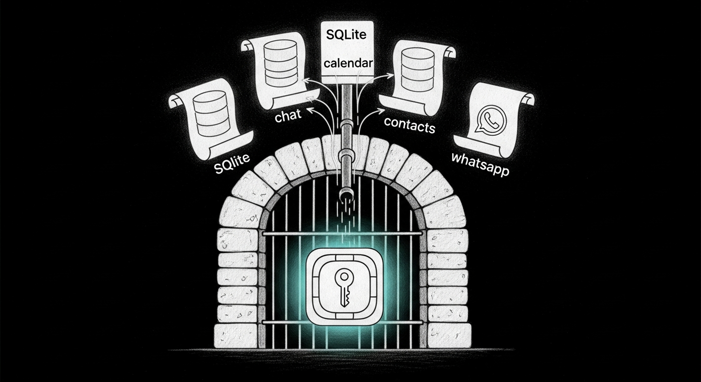

import { Aside } from '@astrojs/starlight/components';



There's a class of macOS databases that nothing should ever need to touch directly — `chat.db`, `Calendar.sqlitedb`, `ChatStorage.sqlite`, `AddressBook-v22.abcddb`. Apple's TCC framework guards them behind Full Disk Access, the most powerful single grant on the system. Granting FDA to your terminal is a rite of passage and, like every rite of passage, the kind of thing you eventually stop questioning. SanctumBridge is the answer to "why are we granting FDA to terminal at all?"

It's a single `.app` bundle running on `127.0.0.1:4078` whose entire job is to read four SQLite files and answer `POST /bridge/query` over loopback HTTP. Every other process — Jocasta, the council agents, Yoda's tool calls — gets to be FDA-clean. They just speak HTTP to the bridge.

## Why a `.app` bundle and not a script

TCC attaches Full Disk Access to a *signed code identity*. Granting FDA to `Terminal.app` extends to every shell child it spawns — but that scope is wider than it looks and easily lost when the shell host changes (iTerm vs Terminal vs a `tmux` reattach). An app bundle with its own `CFBundleIdentifier` carries its own TCC entry, so the grant survives reboots, shell reorganizations, and Homebrew updates that swap node versions.

The bundle is a 50-line C launcher (`launcher/main.c`) that `posix_spawn`s Node against `Resources/bridge/server.js`. The launcher is intentionally minimal and statically targeted — it links only `libSystem` + `Foundation` so its code identity stays stable across Apple silicon updates.

## API

```http
POST /bridge/query
Content-Type: application/json

{"db": "imessage|whatsapp|contacts|calendar", "sql": "...", "params": []}
```

Returns `{"rows": [...], "count": N, "elapsed_ms": M}` or `{"error": "..."}`. SELECT and PRAGMA only — anything that mutates data is rejected at the server, not at the database. The bridge is read-only by construction.

```http
GET /health
```

Returns `{"status": "ok", "service": "sanctum-bridge", "version": "1.0", "port": <n>, "started_at": "<iso>", "uptime_s": <n>, "pid": <n>}`.

<Aside type="note">
  Write operations — sending iMessages, creating Notes, scheduling Calendar events — still use the AppleScript/osascript pipeline directly. The bridge is read-only. If you need to send a PagerDuty text at 3 AM, that still goes through `osascript`, not HTTP.
</Aside>

## Resolved databases

| `db` | Path |
|------|------|
| `imessage` | `~/Library/Messages/chat.db` |
| `whatsapp` | `~/Library/Group Containers/group.net.whatsapp.WhatsApp.shared/ChatStorage.sqlite` |
| `calendar` | `~/Library/Group Containers/group.com.apple.calendar/Calendar.sqlitedb` |
| `contacts` | the **largest** `~/Library/Application Support/AddressBook/Sources/<uuid>/AddressBook-v22.abcddb` |

The contacts resolver picks by file size on purpose. macOS keeps one folder per address book account (iCloud, On My Mac, etc); most are 2-record stubs and the iCloud one is the 7,500-record real source. Picking the first folder lexically, which is what the original implementation did, silently returned the stub on every machine where iCloud Contacts was enabled. That bug was fixed 2026-04-28 and the contacts resolver is now load-bearing in the [Yoda truth-telling chain](/architecture/jocasta-mcp/) — a 2-record contacts table looks like an empty result, which the model would then need to *not* fabricate around.

## Calendar is special

The on-disk `Calendar.sqlitedb` on macOS Sequoia (15) and Tahoe (16) is a stale stub containing only birthday master records, all dated 2006-01-01. The live event store routes through the EventKit XPC service. Jocasta-mcp solves this with a separate Swift bridge (`~/.sanctum/bin/jocasta-eventkit`) that calls `EKEventStore.predicateForEvents` — SanctumBridge isn't involved in the calendar path on modern macOS, even though it can technically open `Calendar.sqlitedb`. Querying `calendar` through the bridge will return the 2006 birthday slice. That's deliberately noisy: the freshness defect lives in Apple's storage layer, not in the bridge, and we'd rather a hard wrong answer than a soft fabrication.

## Source

[`Ogilthorp3/sanctum-bridge`](https://github.com/Ogilthorp3/sanctum-bridge) — `make build` produces the `.app` bundle from `launcher/main.c` and `bridge/server.js`. `make install` drops it into `~/Applications/`. Bundle ID stays `ai.openclaw.denchclaw` so the existing TCC FDA grant carries across rebuilds.

The repo was reconstructed 2026-04-28 from the live deployed bundle. The original source had been inline-edited into the `.app` and never committed — the running binary on the Mac Mini was the only artifact, not on either Mac's filesystem, in any restic snapshot, on any external drive, or in any Trash. The launcher was reverse-engineered from its 7-string `strings(1)` output and the legacy bash launcher (preserved as `launcher/SanctumBridge.bash.legacy`); the `bridge/server.js` is the live production code with the contacts-resolver fix folded in.

The bundle is also now in the restic backup paths (`~/Backups/sanctum-backup.sh`) so a future inline-edit incident has somewhere to recover from.

## Configuration

The bridge reads `SANCTUM_BRIDGE_PORT` from the environment (default `4078`). The LaunchAgent at `~/Library/LaunchAgents/com.sanctum.bridge.plist` doesn't hardcode the port — it shells out through `~/.sanctum/bin/sanctum-bridge.sh`, which resolves the port via `sanctum_get services.sanctum_bridge.port` from `~/.sanctum/instance.yaml`. Single source of truth, doctrine-clean.

The jocasta-mcp client side mirrors this: `SANCTUM_BRIDGE_URL` is set by `~/.sanctum/bin/jocasta-mcp-stdio.sh` from the same YAML key. Changing the port is one edit to `instance.yaml`, then `launchctl kickstart -k` and the openclaw-gateway restart — no plist edits, no source code changes.

## DenchClaw, briefly

The bundle ID `ai.openclaw.denchclaw` is a fossil. The Mac-side stack was called DenchClaw for a few months in early 2026 before the Sanctum rename — Judi Dench as M, running operations from headquarters while Bond is in the field, while the agents are deployed across the infrastructure. The bundle ID was kept stable across the rename because changing it invalidates the TCC grant, and re-prompting for FDA on every reboot is the kind of thing Bert refuses to live with.
