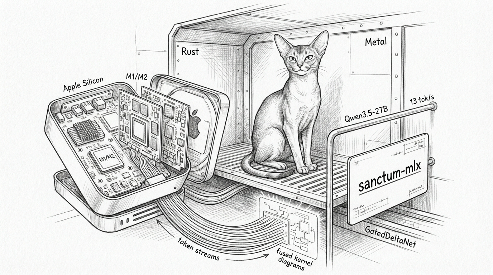

import { Card, CardGrid, Aside, Tabs, TabItem } from '@astrojs/starlight/components';



There was a time when the Council's local inference ran through `mlx_lm.server` — a Python process that loaded a model, accepted HTTP requests, and generated tokens. It worked. It was fine. And then we looked at the profiler and realized 40% of the wall clock was spent in Python overhead, garbage collection, and the seven layers of abstraction between "give me a token" and the actual GPU computation.

So we did what any reasonable person would do: we rewrote the entire inference stack in Rust, implemented a GatedDeltaNet state-space model from scratch, wrote a custom Metal GPU kernel, and shipped it as a single binary that starts in 3 seconds and decodes at 13 tokens per second.

This is sanctum-mlx v0.2.0. It has no Python dependency. It has no regrets.

## Architecture

```
[Client] → 127.0.0.1:11337
    ↓
[sanctum-mlx (Rust/axum)]
  ├─ Direct model loading: Qwen3.5 safetensors → mlx-rs Model
  ├─ 4-bit quantized inference: QuantizedLinear with group_size=64
  ├─ Fused Metal kernel: GatedDeltaNet SSM scan in one GPU dispatch
  ├─ Zero-copy GQA: kernel handles head expansion internally
  ├─ SSE streaming: token-by-token via axum Sse + tokio mpsc
  ├─ Non-streaming: block_in_place for GPU compute
  ├─ EOS tokens: [248046, 248044]
  └─ system_fingerprint: sanctum-mlx-0.2.0-native-arm64
```

The server is an axum HTTP service that exposes an OpenAI-compatible `/v1/chat/completions` endpoint. It loads the Qwen3.5-27B-4bit model directly from safetensors files into mlx-rs arrays, builds the full model graph in Rust, and runs inference on the Metal GPU without ever touching Python, NumPy, or the existential dread of `pip install`.

## The Model: Qwen3.5-27B-4bit

Qwen3.5 is a hybrid architecture — 64 decoder layers split between two attention mechanisms:

| Component | Count | Description |
|-----------|-------|-------------|
| Linear Attention (GatedDeltaNet) | 48 layers | Recurrent SSM with gated delta updates. O(1) memory per token. |
| Full Attention (Qwen3NextAttention) | 16 layers | Standard multi-head attention with a twist: 2x Q projection split into queries + sigmoid gate. |

<Aside type="tip">
The linear attention layers are what make this model fast at long sequences — they maintain a fixed-size recurrent state instead of a growing KV cache. The full attention layers provide the pattern-matching capability that SSMs alone can't quite deliver. It's a best-of-both-worlds design, assuming your world includes writing custom Metal kernels.
</Aside>

### Key Dimensions

| Parameter | Value |
|-----------|-------|
| hidden_size | 5120 |
| head_dim | 256 |
| num_attention_heads | 24 |
| num_kv_heads | 4 |
| linear_key_heads | 16 |
| linear_value_heads | 48 |
| linear_key_head_dim | 128 |
| linear_value_head_dim | 128 |
| Quantization | 4-bit, group_size=64 |

## Performance Optimizations (v0.2.0)

Four optimizations took decode throughput from ~9 tok/s to ~13 tok/s — a 45% improvement. John Carmack would probably find another 45%, but he's busy with other things.

### 1. Fused Metal Kernel for GatedDeltaNet SSM

The GatedDeltaNet recurrent scan was originally implemented as a Rust loop over timesteps, issuing separate MLX operations for each step: decay, matrix multiply, delta update, output projection. Each operation meant a separate Metal kernel dispatch, a separate synchronization point, and a separate opportunity for the GPU to wonder why it was born.

The fused kernel (`metal_kernels.rs`) replaces this with a single Metal dispatch that processes all timesteps in one GPU launch. It uses SIMD group reductions (`simd_sum`) for the Dk-dimension dot products and keeps the recurrent state in thread-local registers.

```
Grid: (32, Dv, B*Hv)    Threadgroup: (32, 4, 1)
```

Each threadgroup tile handles one (batch, value_head, dv_slice) and loops over all timesteps internally. The Dk dimension is distributed across 32 SIMD lanes with `simd_sum` for horizontal reduction.

<Aside type="caution">
The fused kernel requires `Dk % 32 == 0` for SIMD alignment. Qwen3.5's `Dk=128` satisfies this. For models with non-aligned dimensions, the server falls back to the Rust per-timestep loop automatically.
</Aside>

### 2. Zero-Copy GQA in the Kernel

Grouped Query Attention maps 16 key heads to 48 value heads (3x expansion). The naive approach broadcasts and reshapes — allocating a new contiguous buffer every forward pass. The fused Metal kernel handles the mapping internally via `hk_idx = hv_idx / (Hv / Hk)`, reading directly from the original 16-head Q/K tensors. No broadcast, no reshape, no allocation.

### 3. Eval Cadence Tuning

MLX uses lazy evaluation — operations build a computation graph that only executes when you call `eval()`. The cadence matters:

| Mode | Before | After | Rationale |
|------|--------|-------|-----------|
| Streaming | Every 4 tokens | Every 8 tokens | Halves GPU sync overhead. Adds ~80ms latency at 13 tok/s — imperceptible in chat. |
| Non-streaming | Every 32 tokens | Every 64 tokens | Larger graph batches for throughput. The GPU prefers big meals. |

### 4. Pre-computed Normalization Constants

Q/K RMS normalization uses a `ones_weight` vector and scale factors (`inv_scale²` for Q, `inv_scale` for K). Previously allocated fresh each forward call — 48 layers × 2 arrays × every token = a lot of unnecessary allocation. Now computed once at model construction and cached in the struct.

## Testing

The server ships with a comprehensive e2e test suite:

| Metric | Value |
|--------|-------|
| Unit tests | 20/20 |
| E2E tests | 34/34 |
| Phases | 10 (build, health, deep health, models, non-stream, stream, errors, multi-turn, content arrays, shutdown) |

The test script (`test_e2e_sanctum_mlx.sh`) supports `--skip-build` for rapid iteration and covers the full OpenAI-compatible API surface including error handling and graceful SIGTERM shutdown.

## Performance Baseline (M4 Pro 128GB, 2026-04-02)

| Metric | v0.1.0 (Rust loop) | v0.2.0 (fused kernel) |
|--------|--------------------|-----------------------|
| Prefill | ~5 tok/s | ~5 tok/s |
| Decode | ~9 tok/s | ~13 tok/s |
| Model load | ~3s | ~3s |
| Binary size | ~4.2 MB | ~4.2 MB |

The prefill speed is unchanged because it's dominated by the initial matrix multiplications through 64 quantized layers — the SSM scan is a small fraction of that cost. Decode is where the fused kernel shines, because the recurrent scan becomes the bottleneck when you're generating one token at a time.

## File Map

| File | Description |
|------|-------------|
| `sanctum-mlx/src/main.rs` | CLI (clap), axum routes, server setup |
| `sanctum-mlx/src/server.rs` | Inference pipeline, SSE streaming, prompt formatting |
| `mlx-rs/mlx-lm/src/models/qwen3_5.rs` | Full Qwen3.5 model: LinearAttention (GatedDeltaNet), FullAttention (gated Q), quantized loading |
| `mlx-rs/mlx-lm/src/metal_kernels.rs` | Fused Metal GPU kernel + safe FFI wrappers |
| `sanctum-mlx/test_e2e_sanctum_mlx.sh` | 34-test e2e suite, 10 phases |
