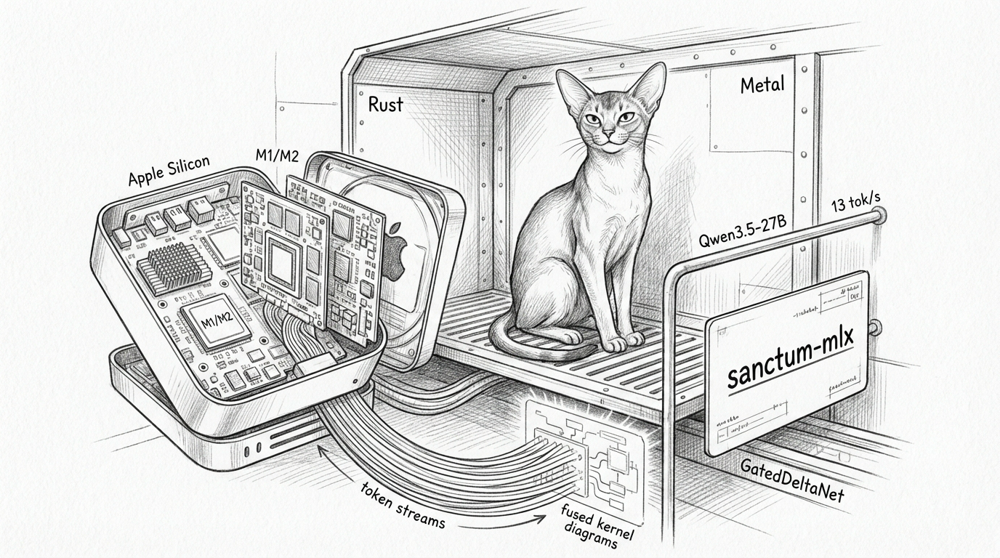

import { Card, CardGrid, Aside, Tabs, TabItem } from '@astrojs/starlight/components';



There was a time when the Council's local inference ran through `mlx_lm.server`, a Python process that loaded a model and generated tokens. It worked. It was fine. Then the profiler showed 40% of the wall clock going to Python overhead, garbage collection, and the seven layers between "give me a token" and the actual GPU math.

So we did the unreasonable thing: rewrote the stack in Rust, implemented a GatedDeltaNet state-space model from scratch, wrote custom Metal kernels, and shipped a pair of binaries that start in 3 seconds and decode at 36–48 tokens per second. This is sanctum-mlx, the **cathedral fork**, on Apple Silicon Metal. No Python dependency. No regrets.

## Cathedral fork — current state

The active inference layer is the cathedral fork at `~/Projects/sanctum-rs-cathedral/services/sanctum-mlx/`; the original `sanctum-rs/services/sanctum-mlx/` tree is deprecated, archival-only. Production drives two seats out of one binary:

| Binary | Port | Model | Role |
|--------|------|-------|------|
| `sanctum-mlx` | mTLS `:1337` | Qwen3.6-35B-A3B-4bit (MoE, model_type `qwen3_5_moe`) plus a Qwen3.6-27B-4bit secondary via dual-residency | Council seats (yoda, mothma, windu, cilghal, mundi, jocasta, quigon) |
| `sanctum-mlx` (label `com.sanctum.mlx-devstral-rust`) | `:3301` | Devstral-Small-2-24B-Instruct-2512-4bit | Coder seat + Qui-Gon's code path |

The seats differ in exactly the ways their threat models differ:

| Seat | Manifest gate | Binds | Listener |
|------|---------------|-------|----------|
| Council `:1337` | ed25519-signed (`ed25519` over `shasum -a 256`) | loopback, the Mini's Tailscale IP, bridge100 `10.10.10.1` (Lima VM path) | mTLS-only (`--no-plain`) — no plain-HTTP or bearer path left to bypass |
| Devstral `:3301` | plain SHA-256 (no `.sig` shipped for it yet) | loopback only, `127.0.0.1:3301` | local by design; the VM and MBP reach it through the council router, not directly |
| **Ahsoka satellite `:1338` (chalet)** | optional (warn-only until signed) | loopback `127.0.0.1:1338` | **plain HTTP** for openclaw; Qwen2.5-7B-Instruct-4bit via **qwen2** path; runs as user `sanctum` |

The satellite seat is the same binary family (`sanctum-mlx` + colocated `mlx.metallib`), not a third fork. Field note: [Ahsoka cathedral on the edge](/operations/2026-08-07-ahsoka-cathedral-on-the-edge/).

A disaster fallback, `com.sanctum.mlx-py-fallback`, sits promote-only on `:8901` — the same Qwen3.6-35B-A3B-4bit as `:1337` but an independent Python mlx-lm stack, so a corrupt or missing Rust binary (which kills both seats, since they share one binary file) still leaves a different-stack server able to take over at full parity. It is not always-warm: a resident 35B would sit ~20 GB on top of the live Rust 35B and push the 64 GB Mini deep into swap, so `council-integrity-check` promotes it only on unrecoverable Rust-binary failure — booting the broken agent to free RAM, then kickstarting the Python seat. Transient failover is handled a layer up, in proxyd routing (`council-mlx` to `council-code` to `claude-cli-offline`). Both Rust seats run under launchd (`com.sanctum.mlx`, `com.sanctum.mlx-devstral-rust`) with KeepAlive, load weights from disk, and never bind `0.0.0.0`.

The `sanctum-server` smart router on `:8900` ([Smart Router Cathedral](/architecture/smart-router-cathedral/)) fronts both binaries with four backends (`council-secure`, `coder`, `spatial`, `cloud`) and five tiers of defense: breaker, budget, latency EMA, quality detectors. Retired plumbing — the old `:1338` coder seat, the socat `:1234` bridges, all of LM Studio — is in the file map below.

## Inside the server

The request path never leaves Rust and Metal:

```
[Client] → mTLS handshake → 127.0.0.1:1337  (council, mTLS-only)
    ↓
[sanctum-mlx (Rust/axum)]
  ├─ Manifest gate: ed25519 sig + SHA-256 verify before bind
  ├─ Loader dispatch by model_type → Qwen3.5MoE / Qwen2 / Qwen3.5 / Mistral
  ├─ 4-bit quantized inference: QuantizedLinear group_size=64
  ├─ Fused Metal kernels: SDPA-dequant-V, Phase 1A QKV, Phase 1B Gate+Up
  ├─ Prompt cache pool with LCP matching (T_q ≥ 2 invariant)
  ├─ PLD self-speculation (cascading ngram lookup in prompt)
  ├─ Zero-copy GQA in the SDPA kernel
  ├─ Multimodal: vision tower for Qwen3.5-VL canary
  ├─ SSE streaming + non-streaming completions
  └─ /metrics (Prometheus), client-cert auth — mTLS-only, no plain/bearer listener
```

The server exposes an OpenAI-compatible `/v1/chat/completions` endpoint, hot-swaps LoRA adapters (quantized + batched-quantized + 3-D `switch_mlp` for the MoE expert grids), and loads models straight from safetensors into mlx-rs arrays. The full graph runs on the Metal GPU without ever touching Python, NumPy, or the existential dread of `pip install`. It dispatches on the checkpoint's `model_type`:

| `model_type` | Status | Notes |
|--------------|--------|-------|
| `qwen3_5_moe` | Production | Qwen3.6-35B-A3B-4bit MoE on `:1337`. Native multimodal (vision canary live 2026-05-10). |
| `qwen2` | Retired | Was Qwen2.5-Coder-14B-Instruct-4bit on `:1338` (YaRN factor=4 RoPE scaling). Retired 2026-06-07; the coder role moved to Codestral-22B-v0.1-4bit on `:3301`. |
| `qwen3_5` (dense) | Reference | The original v0.2.0 27B-4bit path. Still in the loader; not the current production champion. |
| `mistral` | Production | Devstral-Small-2-24B-Instruct-2512-4bit (Mistral-arch dense, text-only) on `:3301`. The `"mistral"` arm rebuilds the dense `ModelInput` from the shared fields — no linear-attention/SSM slots. |
| Mixtral (sparse MoE) | Not yet supported | The loader handles dense `mistral` but has no Mixtral expert-grid arm yet. Any other `model_type` is refused outright with a message naming the four it does load. |

Two cross-request tricks keep it fast and honest:

| Trick | Detail |
|-------|--------|
| LCP prompt-cache reuse | Matched on longest common prefix, capped at `len - 2` so the suffix is always `T_q ≥ 2` — MLX's decode- and prefill-kernel SDPA diverge when the suffix is exactly one token, giving byte-different responses to byte-identical prompts; the two-token margin makes the cache byte-identical (commit `0123773`) |
| PLD self-speculation | On by default on `:1337` via `SANCTUM_MLX_PLD_MAX_LOOKUP=5` and `SANCTUM_MLX_PLD_NGRAM_SIZE=3`; uses the prompt as its own draft model — no second model, no `flash-attn` wheel-build dance. Devstral sets no PLD env vars, so the coder seat runs the code default |

The fusion work that got the throughput here is tracked as shipped phases:

| Feature | Status | Effect |
|---------|--------|--------|
| Phase 1A — FusedQKVProj | Shipped 2026-05-13 (commit `8da9d33`, branch `feat/cathedral-fused-qkv`) | 24.1 → 36.3 tok/s freeform on coder, after fixing a `split_sections` view-aliasing bug — split returns non-contiguous views with non-zero offsets, downstream reshape→RoPE silently reads wrong bytes. `+ zero` makes the contiguous copy. |
| Phase 1B — FusedGateUpProj | Merged 2026-05-14 (PR #16, commit `f92d44e`) | Coder essay throughput reached ~48 tok/s. Same `+ zero` discipline; `mlx_contiguous` / `mlx_copy` are NOT substitutes. |
| Phase 2 — Fused RoPE Metal kernel | Designed, not shipped (branch `feat/cathedral-phase2-fused-rope @ 6378408`) | MSL kernel is correct in isolation, but MLX's lazy graph doesn't auto-track custom-kernel outputs; the eval barrier costs more than the two saved launches. Waiting on an upstream MLX fix. |
| Per-MoE-expert fusion (planned for 35B) | Pending | Carry-forward of Phase 1A/1B onto `qwen3_5_moe`: per-expert MLP fusion instead of monolithic gate+up. |

## The model: Qwen3.5-27B-4bit (and others)

Qwen3.5 is a hybrid architecture — 64 decoder layers split between two attention mechanisms:

| Component | Count | Description |
|-----------|-------|-------------|
| Linear Attention (GatedDeltaNet) | 48 layers | Recurrent SSM with gated delta updates. O(1) memory per token. |
| Full Attention (Qwen3NextAttention) | 16 layers | Standard multi-head attention with a twist: 2x Q projection split into queries + sigmoid gate. |

<Aside type="tip">
The linear-attention layers make this model fast at long sequences — a fixed-size recurrent state instead of a growing KV cache — and the full-attention layers provide the pattern-matching SSMs alone can't deliver. Best-of-both-worlds, assuming your world includes writing custom Metal kernels.
</Aside>

| Parameter | Value |
|-----------|-------|
| hidden_size | 5120 |
| head_dim | 256 |
| num_attention_heads | 24 |
| num_kv_heads | 4 |
| linear_key_heads | 16 |
| linear_value_heads | 48 |
| linear_key_head_dim | 128 |
| linear_value_head_dim | 128 |
| Quantization | 4-bit, group_size=64 |

## Six optimizations, ~9 to ~75 tok/s

Six changes took decode throughput from ~9 tok/s to ~75 tok/s on the same hardware — the first four GatedDeltaNet-shaped wins from the v0.2.0 cutover, the last two the late-April push that closed the TurboQuant tax and bounded MLX's buffer cache. John Carmack ([Carmack Optimization](/architecture/carmack-optimization/)) would probably find another 21%, but he's busy.

| # | Optimization | Mechanism | Win |
|---|--------------|-----------|-----|
| 1 | Fused Metal kernel for the GatedDeltaNet SSM (`metal_kernels.rs`) | One Metal dispatch processes all timesteps in a single GPU launch — was a Rust loop issuing a separate dispatch/sync per timestep; SIMD-group `simd_sum` reductions over the Dk dot products, recurrent state in thread-local registers | decode ~9 → ~13 tok/s |
| 2 | Zero-copy GQA in the kernel | 16 key heads → 48 value heads mapped internally via `hk_idx = hv_idx / (Hv / Hk)`, reading the original 16-head Q/K — no broadcast, reshape, or allocation | no per-pass V buffer |
| 3 | Eval-cadence tuning | MLX is lazily evaluated; the graph executes on `eval()`, so the sync interval is a knob (see table) | halves GPU sync overhead |
| 4 | Pre-computed normalization constants | Q/K RMS-norm `ones_weight` + scale factors (`inv_scale²` for Q, `inv_scale` for K) computed once at model construction and cached, not fresh per call (was 48 layers × 2 arrays × every token) | fewer allocations |
| 5 | Fused attention with inline V dequant (`sdpa_dequant_v`) | One threadgroup per `(batch, query head, query position)`; 32 threads cooperate on D via `simd_sum`; online (FlashAttention) softmax in fp32; causal mask via additive `-INF` bias, template-specialized so decode compiles the branch away. Routes through a new `KeyValueCache::fused_attention` trait method; when the cache opts in, `FullAttention::forward` skips full-V re-materialization for decode AND prefill | +21.2% |
| 6 | Metal memory caps + inter-request cache drain | Plist caps Metal; `mlx_clear_cache` (wrapped as `mlx_rs::memory::clear_cache()`) drains the cache at the end of both the sync and SSE chat handlers | bounded RAM |

The fused SSM kernel tiles the work so each threadgroup handles one `(batch, value_head, dv_slice)`, loops all timesteps internally, and spreads Dk across 32 SIMD lanes:

```
Grid: (32, Dv, B*Hv)    Threadgroup: (32, 4, 1)
```

<Aside type="caution">
The fused kernel requires `Dk % 32 == 0` for SIMD alignment. Qwen3.5's `Dk=128` satisfies this. For models with non-aligned dimensions, the server falls back to the Rust per-timestep loop automatically.
</Aside>

Eval cadence trades a sliver of latency for throughput:

| Mode | Before | After | Rationale |
|------|--------|-------|-----------|
| Streaming | Every 4 tokens | Every 8 tokens | Halves GPU sync overhead. Adds ~80ms latency at 13 tok/s — imperceptible in chat. |
| Non-streaming | Every 32 tokens | Every 64 tokens | Larger graph batches for throughput. The GPU prefers big meals. |

Optimization 5 hurt to get right. Slice 1 of TurboQuant rebuilt the entire dequantized V tensor every decode step on the CPU — `O(T²)` work and a forced GPU sync per layer. The replacement, `sdpa_dequant_v` (in [`turboquant/attention_kernel.rs`](https://github.com/Ogilthorp3/sanctum-rs/blob/main/services/sanctum-mlx/src/turboquant/attention_kernel.rs)), takes Q + materialized K + the compressed V state (indices, scales, zeros) and runs SDPA with V dequantized inline in registers — no full V tensor ever materializes:

```
Grid: (32, 1, B*H_q*L_q)   Threadgroup: (32, 1, 1)
```

| Config | Mean tok/s | vs Slice 1 |
|--------|-----------|-----------|
| no TurboQuant | 79.42 | — |
| Slice 1 (CPU K+V) | 62.38 | baseline |
| Slice 4a-final (plain K + fused V) | 75.64 | +21.2% |

Keys-plain is an empirical choice: at our context lengths, dropping key compression saves the CPU round-trip without surrendering meaningful memory (~4 MB/layer of bf16 K is nothing on 64 GB). The full pivot story lives in [TurboQuant KV Compression](/architecture/turboquant-kv-compression/). *(Bench: MBP M4 Max, 3 × 8 × 100 tokens, vanilla MoE.)*

Optimization 6 fixed memory pressure. The Mini sat at 31.7 GB of 32 GB swap with 85 MB free pages — not a leak, just MLX's buffer cache ratcheting up across thousands of requests, unbounded:

```
# 27B-era caps (this 2026-04-24 push):
--metal-cache-limit-mb 1024 --metal-memory-limit-mb 40960 --metal-wired-limit-mb 24576
# without these, MLX's cache limit was effectively 65 GB (the whole machine)

# live 35B champion caps:
--metal-memory-limit-mb 28672 --metal-wired-limit-mb 18432   # cache limit still 1024
```

| Steady state | 27B-era (2026-04-24) | live 35B champion |
|--------------|----------------------|-------------------|
| Wired | ~13 GB (weights + warm experts) | more resident weight |
| Free pages | 1.3 GB | — |
| Swap | shrank 32 GB → 9.2 GB once pressure eased | ~28.7 GB, ~27.5 GB used |

The bounding logic is the same win; the constants moved with the model. macOS shrinking the swap file on its own was the clearest signal it took.

## The April 2026 cutover

For a while, sanctum-mlx was a science project: it loaded models, ran the forward pass, produced valid tensors — it just wasn't the thing answering your questions. Production still routed through the Python `mlx_lm.server` that sanctum-server babysat. April 2026 is when we flipped the switch. Four pieces landed in one push:

| Piece | What it does |
|-------|--------------|
| LoRA merge at load | `AppState::load` calls `lora::load_and_merge` when `--adapter-path` is supplied. Quantized path dequantizes → adds the delta → requantizes at `group_size=64, bits=4`; non-quantized just adds. `AdapterInfo { name, rank, alpha, merged_pairs }` rides the app state and surfaces in `system_fingerprint`. |
| Full sampling pipeline | A `sampling` module replaces the single-temp `qwen3_5::sample()`: repetition penalty → top-p nucleus → temperature → argmax or categorical. `RecentTokens` is a bounded dedup-aware ring buffer; OpenAI `stop` is string-or-array; a `StopSeqBuffer` carries max-stop-length bytes across SSE batches so a stop split across the 8-token flush still trips. |
| Custom decode loop | `sampling::decode` drives `Model::forward` with a `Control::Continue`/`Stop` callback that batches token IDs. Replaces `qwen3_5::Generate` so `top_p` and `repetition_penalty` actually affect logits without patching vendored mlx-lm. |
| Multimodal config | The production `mlx-community/Qwen3.5-27B-4bit` checkpoint is the VL variant — `text_config` nests the text-model fields. `get_qwen3_5_model_args` flattens `text_config` into the root before deserializing; root-level keys win on conflict. |

The production cutover itself was a 65-second blue-green swap at 2026-04-17 21:36 local — 63 of those seconds were Metal loading 27 billion 4-bit parameters into the GPU, the other two were `launchctl`.

| Change | Detail |
|--------|--------|
| Python wrapper unloaded | `com.sanctum.server-mlx.plist` (wrapper on `mlx_lm.server`) off |
| Rust binary loaded | `com.sanctum.mlx.plist` on `:1337`, `KeepAlive=true`, `LimitLoadToSessionType=Aqua`, `ThrottleInterval=30` |
| Guardian rewrite | `council-guardian.sh` now uses `launchctl kickstart -k gui/<uid>/$ACTIVE_AGENT`; rollback = flip `ACTIVE_AGENT` back to `com.sanctum.server-mlx` |
| Guardian probe latency | ~870 ms → ~485 ms (a ping, not a generation — but a faster ping) |

At cutover we hit 7/10 byte-exact on the smoke battery at `temperature=0`; the remaining three differ only in single-word synonyms — bf16 ULP drift after ~100 characters, argmax identical for the first ~40 tokens on every prompt. Rollback is one line, and `server-mlx.plist` is the escape hatch, not legacy debt — kept until the 24-hour watch is clean and a week of guardian probes match the Python era's 100%:

```bash
launchctl unload ~/Library/LaunchAgents/com.sanctum.mlx.plist && \
  launchctl load ~/Library/LaunchAgents/com.sanctum.server-mlx.plist
```

## The bugs that made it work

These took the longest to find and shortest to fix. Load a Qwen3.5-27B base model, send one prompt, and sanctum-mlx produced a few coherent tokens then collapsed into `"Hello, and the 190/ / 190/ / …"`. The tokenization, the special tokens, the sampler, the weights — all right. And yet. Five bugs stood between the science project and production:

| Symptom | Root cause | Fix |
|---------|-----------|-----|
| First tokens coherent, then a `190/ /` loop | The 48 GatedDeltaNet SSM layers carried no state across forward calls — only the 16 full-attention layers had a KV cache, so every `L=1` decode step ran with a fresh zero SSM state `h ∈ ℝ^{B × H_v × D_v × D_k}` and a zero-padded depthwise causal `Conv1d`; the amnesiac layers cascaded garbage until greedy decode locked on a self-reinforcing token | `forward_with_cache(&mut self, x, cache)` threads a `LinearAttentionState`; `None` = prefill, `Some` = decode continuation; `ModelInput` gained `ssm_cache`; the old `Module::forward(&Array)` delegates with `None` |
| Segfault in `mlx_array_data_bfloat16` | `Array::deep_clone()` on unevaluated lazy tensors — the buffer pointer is null until `eval()`; the no-op branches of `sample`/`apply_top_p`/`apply_repetition_penalty` cloned prefill logits before they materialized | Pass `&Array` through every stage, materialize only when a transform runs; a fast path for `temp=0` + no rep-penalty goes straight to argmax with zero intermediate Arrays |
| Degenerate token loops | Missing `<think>…</think>` prompt prefix — Python runs `--chat-template-args {"enable_thinking": false}`, emitting `<\|im_start\|>assistant\n<think>\n\n</think>\n\n`; we sent only `<\|im_start\|>assistant\n` | `messages_to_prompt` now matches production exactly |
| Parity stuck 4/10 at `temperature=0` | `FullAttention` saw an empty `cache` Vec, fell through to the no-cache branch, and silently recomputed keys/values every decode step | A `C: Default` trait bound + `(0..self.layers.len()).map(|_| Some(C::default())).collect()` at the top of `forward()` — parity jumped 4/10 → 7/10 |
| Every decode step corrupted, `exp(0)=1` collapsing the GatedDeltaNet decay | Field named `a_log`; the `ModuleParameters` derive uses `stringify!(field)` for checkpoint lookup and Qwen's safetensors key is `A_log` — lowercase silently mismatched | Rename `a_log` → `A_log` (the software equivalent of losing a year to a missing semicolon) |

The state struct threads two things through the decode loop:

```rust
pub struct LinearAttentionState {
    /// GatedDeltaNet matrix memory: h[t] = state * g + k * ((v − state@k) * beta)
    pub ssm_state: Array,     // [B, num_value_heads, value_head_dim, key_head_dim]
    /// Previous (conv_kernel_dim - 1) raw QKV projections.
    pub conv_buffer: Array,   // [B, K-1, qkv_dim]
}
```

The correctness test is short and brutal: a full prefill of `L=6` must equal a prefill of `L=5` plus one decode step through the cache.

```rust
let y_full = la.forward_with_cache(&x6, &mut None)?;
la.forward_with_cache(&x5, &mut cache)?;
let y_step = la.forward_with_cache(&x1, &mut cache)?;
assert!(max_abs_diff(&y_full.last(), &y_step) < 1e-3);   // 6th-position output matches both ways
```

On the real model, `"Say hello."` went from the `190/ /` loop to `"Hello! How can I help you today? …"`. Python `mlx_lm.server` emits EOS at "today?" — a ~50-token drift that is numerical-parity refinement, not a correctness bug.

## The firewall ambush

Localhost worked. The guardian worked. Every probe from the MacBook Pro over Tailscale got `curl: (56) Recv failure: Connection reset by peer`. The `socketfilterfw` ruleset had silently added the unsigned Rust binary to the BLOCK list — probably during an earlier shadow test, when the Application Firewall popup went unanswered at the Mini's screen. Localhost bypassed the filter, so every developer probe looked fine.

```bash
# Diagnose
/usr/libexec/ApplicationFirewall/socketfilterfw --getappblocked \
  /Users/neo/Projects/sanctum-rs/target/release/sanctum-mlx
# → "Incoming connection to ... is blocked."

# Fix (one-shot, requires sudo)
sudo /usr/libexec/ApplicationFirewall/socketfilterfw --unblockapp \
  /Users/neo/Projects/sanctum-rs/target/release/sanctum-mlx
```

This bites once per binary path: a rebuild at the same path keeps the rule, a moved binary starts default-deny again. Python `mlx_lm.server` never hit it — its executable was `Python.app`, allow-listed for decades. Rust binaries from `cargo build --release` are ad-hoc-signed (`codesign -dv` shows `Signature=adhoc`) and enjoy no such privilege.

## The guardian that ate itself

The rewritten guardian passed every test, then the Sanctum Olympics benchmark hit the Mini with 512-token prompts and the guardian decided the server was dead. It wasn't. sanctum-mlx serializes Metal inference — one GPU context, one kernel graph at a time — so a `POST /v1/chat/completions` health probe with `max_tokens=2` queued behind a `max_tokens=512` request in flight, timed out after 20 seconds, and the guardian read that as "hung" and ran `launchctl kickstart -k`. Three restarts in eight minutes; none necessary, all outages.

```bash
# Before — queues behind in-flight inference under load
URL="http://127.0.0.1:1337/v1/chat/completions"
curl -X POST "$URL" -d '{"messages":[{"role":"user","content":"ping"}],"max_tokens":2}'

# After — GET, ~25 ms, bypasses the inference queue
URL="http://127.0.0.1:1337/v1/models"
curl "$URL"
```

The fix probes `GET /v1/models` (~25 ms regardless of load, because it never touches the model graph), tightens the timeout from 20s to 10s, and loosens `FAILS_BEFORE_RESTART` from 2 to 3. If the graph goes sideways while HTTP stays alive, this probe won't catch it — a separate, slower monitor covers that.

<Aside type="caution">
The second-order lesson: a monitor that shares a queue with the thing it monitors can become the failure it's meant to detect. For any single-resource server — Metal context, GIL, mutex-guarded state — the health probe must live on a different code path than the work.
</Aside>

## Latency and testing

Warm-up on the first request after a plist load is ~15 s (Metal context + kernel JIT). After that, latency is flat until the KV cache grows past the working-set window — at which point the linear-attention recurrent state keeps memory bounded instead of the usual quadratic heartburn at the 32K mark.

| Workload | Latency | Throughput |
|----------|---------|-----------|
| Guardian ping (`max_tokens=2`) | ~450 ms | — |
| Short chat (`max_tokens=8`, warm) | ~520 ms | ~15 tok/s |
| Paragraph (`max_tokens=80`) | ~4.2 s | ~13 tok/s |

The M4 Pro 128GB baseline (2026-04-02): the fused kernel roughly doubled decode while leaving prefill flat, because prefill is dominated by matrix multiplications through 64 quantized layers, not the SSM scan.

| Metric | v0.1.0 (Rust loop) | v0.2.0 (fused kernel) |
|--------|--------------------|-----------------------|
| Prefill | ~5 tok/s | ~5 tok/s |
| Decode | ~9 tok/s | ~13 tok/s |
| Model load | ~3s | ~3s |
| Binary size | ~4.2 MB | ~4.2 MB |

The e2e suite ships alongside: `test_e2e_sanctum_mlx.sh` supports `--skip-build` and covers the full OpenAI-compatible surface, error handling and graceful SIGTERM shutdown included.

| Metric | Value |
|--------|-------|
| Unit tests (sampling + server + lora + turboquant) | 74/74 |
| SSM cache tests (`prefill`, `decode`, `full == prefill+decode`) | 3/3 |
| E2E tests | 34/34 |
| Phases | 10 (build, health, deep health, models, non-stream, stream, errors, multi-turn, content arrays, shutdown) |

<Aside type="caution">
Run unit tests serialized: `just test-mlx` (or `cargo test -p sanctum-mlx -- --test-threads=1`). Parallel tests that touch Metal trigger `AGXG16XFamilyCommandBuffer` encoder collisions and abort the suite with SIGABRT. Not our bug, but our problem.
</Aside>

## Hardening: from B+ to A+

With the binary live, the gap was operational: nobody would notice if the server answered wrong but still returned 200, if a hand-edited plist drifted from the repo, or if a corrupted weights file served a bad token. Successive passes closed those gaps until "military-grade" was earned — observable, survivable, verifiable, identity-gated:

| Layer | Mechanism |
|-------|-----------|
| Guardian | `council-guardian`, every 60s, `GET /v1/models` — proves HTTP is alive, nothing more |
| Canary | `council-canary`, every 10 min, POSTs "What is 2+2? Respond with only the number." Response must contain `4`; two consecutive misses alert Force Flow `/notify` (the pipe signal-health uses), 30-min cooldown; it never restarts (guardian owns that) |
| Drift | `council-drift`, hourly, SHA-256-compares every deployed plist/script/manifest against canonical copies in `services/sanctum-mlx/deploy/` in the Mini's `sanctum-rs` checkout; checks the Application Firewall state and asserts every expected agent is loaded; drift → level=error log + Force Flow alert. `deploy-sanctum-mlx.sh verify` runs it interactively |
| Deploy | `scripts/deploy-sanctum-mlx.sh` — `install` idempotent (SHA-compare each artifact), `upgrade` (native arm64 + Metal rebuild, MBP-shadow pre-flight, `unload+load` not `kickstart -k`, post-flight chat probe, auto-rollback), `rollback` → `com.sanctum.server-mlx` |
| Weight manifest | `manifest.rs` reads a coreutils `shasum -a 256` manifest (`services/sanctum-mlx/deploy/qwen35-27b-4bit.manifest.sha256`), rayon-parallel-hashes files under `--model`, refuses to bind on mismatch; 6 unit tests; 10.5 s for 9 files / 16 GB on the Mini's NVMe; startup ~27 s → ~38 s |
| ed25519 signature | Detached ed25519 signature over the manifest bytes, verified before the hashes. Signing key on the MBP at `~/.ssh/sanctum-manifest-signing.key` (0600, not in repo); 32-byte verify key `services/sanctum-mlx/deploy/manifest-pubkey.ed25519` and 64-byte sig `...manifest.sha256.sig` are committed. `sign_manifest` CLI (`keygen`/`sign`/`verify`); a tamper test reproduces `Verification equation was not satisfied` |
| Bind restriction | `--host` is repeatable, default single `127.0.0.1`; non-loopback bind failures are non-fatal (Tailscale flaps at boot), loopback is required; `is_unspecified()` also counts as loopback so the MBP shadow's `0.0.0.0:8902` passes the start guard |
| Bearer auth (retired) | `auth.rs` axum middleware, `127.0.0.1`/`::1` bypass else `Authorization: Bearer <token>`, constant-time compare via `subtle`; token at `/Users/neo/.sanctum/secrets/council-mlx.token` (0600, 64 bytes of `secrets.token_hex(32)`), `--auth-token-file`, fail-closed 401, `SANCTUM_MLX_DISABLE_AUTH=1` to opt out. Rode along during the mTLS transition, retired with the plain listener |
| Off-box watchers | On the MBP: `com.sanctum.council-canary-offbox` (chat probe via Tailscale, every 10 min) + `com.sanctum.council-drift-offbox` (`deploy-sanctum-mlx.sh verify` hourly against the Mini). Alert is `osascript 'display notification'` with a "Submarine" sound — Force Flow is deliberately not used, since the premise is the Mini might be dead |
| Hardened runtime | `scripts/codesign-sanctum-mlx.sh` re-signs with `--options runtime` + only `com.apple.security.cs.allow-jit` (Metal's W^X shader pages); `codesign -dv` shows `flags=0x10002(adhoc,runtime)`; no `disable-library-validation` |
| Developer ID + notarization | Identity `Developer ID Application: Bertrand Nepveu (GJ994MN2YF)`, full three-link Apple chain, `flags=0x10000(runtime)`. ASC API key `.p8` at `~/.keys/holocron-notary/AuthKey_PLACEHLDR0.p8`; `notarytool store-credentials sanctum` stashes it in keychain. Submission IDs: MBP `00000000-0000-0000-0000-000000000004`, Mini `00000000-0000-0000-0000-000000000005`, both `Ready for distribution` |
| Prometheus `/metrics` | `src/metrics.rs` — RED metrics + inference token counters (see below); reachable only over the mTLS socket now |
| HA failover | `HttpProxyBackend` holds a `Vec<String>`; `generate` tries primary then each fallback on connect-failure/5xx, bails on 4xx, and stays on a URL once a stream starts; `BackendDef.fallback_urls` in `instance.yaml`; `health_check` is "healthy if ANY url responds" |
| Parity smoke | `com.sanctum.council-parity-smoke`, 03:00 nightly, 10 fixed prompts at `temperature=0` vs known-good substrings in `parity-smoke.json`; more than 1/10 failures fires Force Flow. Initial prod run 10/10, ~60 s |
| mTLS | `src/mtls.rs` + `scripts/mtls-gen-certs.sh`; PKI at `~/.sanctum/certs/`; per-client certs give cryptographic identity (the CN lands in audit logs), individually revocable without re-issuing everyone |

One wrinkle: CLI Mach-O binaries can't be stapled, so Gatekeeper fetches the ticket online on first run; the authoritative proof lives in `~/.openclaw/logs/notarization-<id>.log`. SSH codesigning on the Mini needs a one-time keychain ACL, or `codesign` gets `errSecInternalComponent`:

```bash
security set-key-partition-list -S apple-tool:,apple:,codesign:,unsigned: \
  -s -k <login-pw> ~/Library/Keychains/login.keychain-db
```

The Prometheus series and the router fallback config, for whoever wires the dashboard:

```
sanctum_mlx_http_requests_total{route,method,status}          counter
sanctum_mlx_http_duration_seconds{route,method,status}        histogram (5 ms – 180 s)
sanctum_mlx_http_inflight_requests                            gauge
sanctum_mlx_inference_requests_total{stop_reason}             counter
sanctum_mlx_inference_{completion,prompt}_tokens_total        counters
sanctum_mlx_inference_duration_seconds                        histogram
sanctum_mlx_inference_tokens_per_sec                          histogram (0.5 – 96 tok/s)
sanctum_mlx_inference_completion_tokens                       histogram (1 – 4096 tokens)
sanctum_mlx_startup_seconds{phase="manifest_verify"|"model_load"}   histogram
sanctum_mlx_model_loaded                                      gauge (0/1)
```

```yaml
council-secure:
  url: http://127.0.0.1:1337/v1
  fallback_urls:
    - http://100.0.0.55:8902/v1  # MBP shadow via Tailscale
  api_key_env: COUNCIL_API_KEY
```

```
certs/
├── ca.crt, ca.key              self-signed EC P-256 CA (5-year validity)
├── server.crt, server.key      server cert, SAN'd for every address sanctum-mlx binds
└── clients/
    ├── guardian.{crt,key}       per-client cert, CN=<client-name>
    ├── canary.{crt,key}
    ├── drift.{crt,key}
    ├── parity-smoke.{crt,key}
    ├── sanctum-server.{crt,key}
    └── council-offbox.{crt,key}
```

Verified cross-machine: a `curl` from the MBP to `https://100.0.0.25:1338/v1/chat/completions` (with `--cacert ca.crt` plus the `sanctum-server` client cert and key) returned `"2 + 2 equals"` in 1.84 s; without a client cert the handshake is rejected at layer-4 with rustls reason 1116. The migration is done: the plain listener is gone, mTLS on `:1337`.

## Still open

None of these block day-to-day operation — they're the layers that keep you boring when boring is what you want.

| Still open | What it needs |
|------------|---------------|
| The 3/10 bf16 ULP parity gap at `temperature=0` | An fp32 accumulator in the fused Metal kernel, or reduction-order surgery / selective fp32 promotions |
| Parity smoke battery inside GitHub Actions CI | A self-hosted arm64 runner — GitHub's can't drive Metal (the nightly cron covers it off-CI for now) |
| True HA (multi-node council) | Active-passive or load-balanced across Mini + MBP |
| Zero-downtime blue-green | A Caddy front-proxy hot-swapping a `:1337`/`:1338` pair |

## File map

All paths are in the cathedral fork at `~/Projects/sanctum-rs-cathedral/`. The original `~/Projects/sanctum-rs/services/sanctum-mlx/` tree is deprecated and archival-only — anything new lands in the cathedral.

| File | Description |
|------|-------------|
| `services/sanctum-mlx/src/main.rs` | CLI (clap), axum routes, server setup, manifest gate before Metal load |
| `services/sanctum-mlx/src/server.rs` | Inference pipeline, SSE streaming, ChatML prompt formatting, `StopSeqBuffer`, `sampling_params_from_request` |
| `services/sanctum-mlx/src/loaded_model.rs` | Loader dispatch by `model_type` (qwen3_5_moe / qwen2 / qwen3_5 / mistral); PLD orchestration; LCP cache reuse |
| `services/sanctum-mlx/src/sampling.rs` | Full sampling pipeline: `SamplingParams`, `RecentTokens` ring buffer, `apply_repetition_penalty`, `apply_top_p`, `sample`, callback-based `decode` |
| `services/sanctum-mlx/src/lora.rs` | LoRA adapter merge (quantized + batched-quantized + 3-D `switch_mlp` for MoE experts) |
| `services/sanctum-mlx/src/manifest.rs` | Ed25519-signed SHA-256 weight manifest verify, rayon-parallel; refuses to bind on mismatch |
| `services/sanctum-mlx/src/turboquant/` | 4-bit value cache + fused Metal `sdpa_dequant_v` kernel (Slice 4a-final: plain K + fused V) |
| `services/sanctum-mlx/src/multimodal/` and `src/vision/` | Vision tower for Qwen3.5-VL multimodal canary |
| `services/sanctum-mlx/src/mtls.rs` | rustls server + per-client cert auth, CA at `~/.sanctum/certs/ca.crt` |
| `services/sanctum-mlx/src/metrics.rs` | Prometheus recorder, RED metrics, inference token counters |
| `services/sanctum-mlx/deploy/` | Versioned plist + guardian + canary + drift agents; canonical copies for drift check |
| `services/sanctum-mlx/test_e2e_sanctum_mlx.sh` | End-to-end mTLS canary battery |
| `~/Library/LaunchAgents/com.sanctum.mlx.plist` | Council `:1337` runtime config — mTLS-only (`--no-plain`, `--tls-host` ×3), `SANCTUM_MLX_FUSED_QKV=1`, `FUSED_MLP=1`, PLD env vars, prewarm file, ed25519-signed manifest paths |
| `~/Library/LaunchAgents/com.sanctum.mlx-devstral-rust.plist` | Coder `:3301` runtime config (Devstral-Small-2-24B-Instruct-2512-4bit) — `--host 127.0.0.1` loopback-only, plain SHA-256 manifest (no `.sig`), no PLD env vars |
| `~/Library/LaunchAgents/com.sanctum.mlx-coder.plist` | RETIRED 2026-06-07 — was the coder `:1338` runtime config (`YARN` factor=4, fused QKV/MLP, same PLD knobs); removed when the coder role moved to Codestral |
| `~/Library/LaunchAgents/com.sanctum.coder-plain-bridge.plist` | RETIRED 2026-06-07 — was the `socat` plain-HTTP `:1234` → mTLS `:1338` shim for legacy callers; gone with the LM Studio decommission |
| `~/Library/LaunchAgents/com.sanctum.lmstudio-bridge.plist` | RETIRED — the orphan `socat` LISTEN `10.0.0.1:1234` → `127.0.0.1:1234` (dead backend) that outlived the LM Studio decommission; now unloaded, and `:1234` is closed |

The achievement is boring: 27 billion 4-bit parameters answering on a 64 GB Mac Mini, zero Python in the request path, and enough hardening around it that nobody has to think about it.
