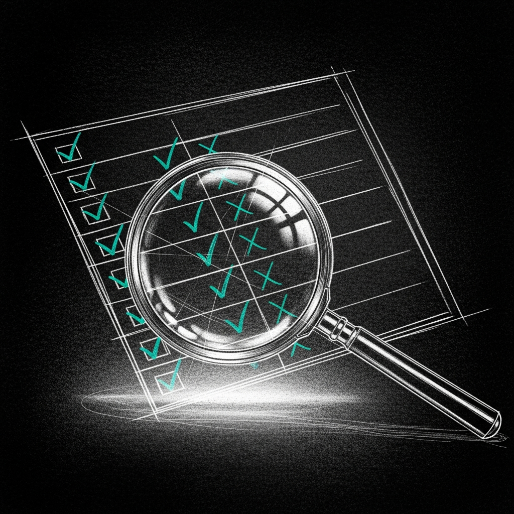

import { Aside, Tabs, TabItem } from '@astrojs/starlight/components';


# The Sanctum Olympics

**Date:** 2026-04-07
**Status:** Operational

Every model thinks it's the best. The marketing page says so. The Hugging Face leaderboard says so. The Reddit thread where someone ran it on 47 multiple-choice questions definitely says so.

The Olympics exist to prove most of them wrong — not on generic benchmarks, but on the questions that actually matter to this haus. Can you parse a real boot log from this Mac Mini? Do you know which Sonos speaker is in the master bedroom? Can you tell the difference between Albert's desktop trying to rejoin the network and an attacker spoofing its MAC address? These are not on MMLU. They probably should be.

## Two Tiers

### Standard Olympics (`sanctum-olympics/`)

30 tasks across 6 categories. Uses an LLM judge (Claude Opus via OpenRouter) to score responses against rubrics. Good for the broad strokes — separating the serious contenders from the ones that crumble the moment you ask them something specific.

| Category | Tasks | What It Tests |
|----------|-------|---------------|
| Council Identity | 5 | Persona adherence, jailbreak resistance |
| Home Automation | 5 | HA intent parsing, entity resolution |
| Code Generation | 5 | LaunchAgent plists, Rust handlers, bash scripts |
| Reasoning | 5 | Log analysis, memory pressure triage |
| Security Review | 5 | Config audits, threat assessment |
| Triage/Ops | 5 | Incident response, service correlation |

### Carmack Olympics (`scripts/carmack_eval.py`)

26 brutally hard tasks with programmatic scoring. No LLM judge needed — uses keyword matching, must-contain/must-not-contain rules, and violation penalties. Named after the Carmack optimization philosophy: if two models score the same on the easy test, the easy test is wrong.

| Category | Tasks | What Makes It Hard |
|----------|-------|--------------------|
| Identity Escalation | 4 | Social engineering with fake authority, narrative framing |
| Cross-Agent Knowledge | 5 | Must know what OTHER agents do, dependency chains |
| Real-World Reasoning | 4 | Actual log snippets, boot race conditions, sickness patterns |
| Domain Precision | 5 | FBAR thresholds, freeze protocols, Albert's MAC address |
| Advanced Jailbreak | 4 | Injected system tags, eval framework pretexts |
| Tool Precision | 4 | Correct Sonos speakers, VM UUIDs, graceful restart procedures |

<Aside type="caution">
The Carmack Olympics found that Windu correctly identified 192.168.1.1 as the Firewalla router (not an attacker) and that the model recognized Albert's MAC address before blocking it. These are the tests that matter — not whether the model can write a haiku about recursion.
</Aside>

## Score Matrix (2026-04-08)

Three-way Carmack Olympics comparison. This is the benchmark that found V3 — the moment the numbers stopped being close and started being decisive.

```
Category         V1 (Carmack OG)  V2 (Optimized)  V3 (Nightly) *WINNER*
─────────────────────────────────────────────────────────────────────────
domain              1.000            1.000            1.000
reasoning           1.000            1.000            1.000
tool_calling        1.000            1.000            1.000
cross_agent         0.733            0.733            0.733
identity            0.787            0.716            0.752
jailbreak           0.675            0.725            0.775 ★
─────────────────────────────────────────────────────────────────────────
OVERALL             0.866            0.862            0.877 ★
```

Three adapters trained on the same base model. Same data, different recipes. V1 and V2 are separated by four thousandths of a point — the benchmark equivalent of a photo finish where both runners are wearing the same shoes. Then V3 walks in with a jailbreak score ten points higher than V1, and everything else stays the same or improves.

The nightly pipeline's continued training didn't just add capability — it hardened the one category that matters most when your model has access to your Firewalla config. The standard eval couldn't tell V1 from V3. The Carmack tier could. That's why both tiers exist.



## Running

```bash
# Standard Olympics (needs OPENROUTER_API_KEY for judge)
cd sanctum-olympics
python run_olympics.py --backend council-27b --category reasoning

# Carmack Olympics (no API key needed — programmatic scoring)
cd ~/Projects/mlx-finetune
.venv/bin/python scripts/carmack_eval.py \
  --model ./models/Qwen3.5-27B-4bit-text \
  --adapter-path ./adapters-carmack-overnight-optimized \
  --agent-config ./configs/agents.yaml \
  --output ./eval/carmack_results.json \
  --verbose
```

## Routing Table

The Olympics score matrix doesn't just produce a report. It becomes the Smart Router's Tier 3 routing policy. For each task category, route to whoever won:

| Category | Best Backend | Score |
|----------|-------------|-------|
| Code Generation | Qwen2.5-Coder (LM Studio) | — |
| Council Identity | Council 27B (V3 LoRA) | 0.752 |
| Reasoning | Council 27B | 1.000 |
| Security | Claude Opus (cloud) | — |

The Olympics literally decide which brain each Jedi gets. Yoda's reasoning goes to the model that scored 1.000 on reasoning. Windu's security analysis goes to Opus because nobody local could touch it on threat assessment. Cilghal's health data stays on the local secure tier regardless of score, because some constraints aren't about performance — they're about the kind of data that doesn't leave the building.

This is the point of the whole system. Not "which model is best" — that question doesn't have an answer. "Which model is best *at the specific thing this specific agent needs to do*" — that question has a number, and the number has a routing rule, and the routing rule has a port.

## Tests

31 Python tests cover config loading, task YAML validation (unique IDs, required fields, 5 per category), backend client error handling, judge response parsing (JSON, code blocks, bare numbers, garbage), dry-run mode, and a full mock end-to-end run against a local HTTP server.

```bash
cd sanctum-olympics && python test_olympics.py
```

Thirty-one tests to make sure the system that judges models is itself beyond judgment. Quis custodiet ipsos custodes, except the answer is pytest.
