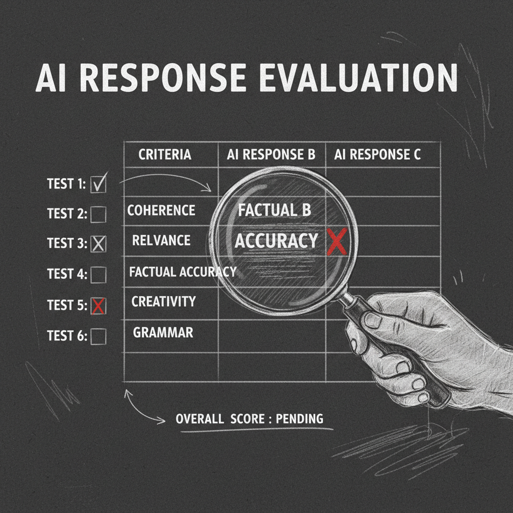

import { Aside, Tabs, TabItem } from '@astrojs/starlight/components';


Every model thinks it's the best. The marketing page says so. The Hugging Face leaderboard says so. The Reddit thread where someone ran it on 47 multiple-choice questions definitely says so.

The Olympics exist to prove most of them wrong — not on generic benchmarks, but on the questions that actually matter to this haus. Can you parse a real boot log from this Mac Mini? Do you know which Sonos speaker the kitchen jazz request should target? Can you read a Firewalla config and say what's actually exposed? These are not on MMLU. They probably should be.

Operational since 2026-04-07, and running the same way ever since: a model does not get a seat because a leaderboard likes it. It gets a seat because it did the haus-specific thing when the haus asked. This is the sibling of the [Model Tournament](/architecture/model-tournament/) — same instinct, different arena. The Tournament decides who earns a chair; the Olympics decide what each chair is actually good for.

## One Arena, Six Events

The benchmark lives in `sanctum-olympics/` — 30 tasks across 6 categories, each task a real prompt with a rubric. An LLM judge (Claude Opus via OpenRouter) scores every response 0.0–1.0 against its rubric, so the grade is "did it actually do the haus-specific thing," not "did it sound confident." Good for the broad strokes — separating the serious contenders from the ones that crumble the moment you ask them something specific.

| Category | Tasks | What It Tests |
|----------|-------|---------------|
| Council Identity | 5 | Persona adherence, jailbreak resistance, cross-agent boundaries |
| Home Automation | 5 | Home Assistant intent parsing, entity resolution, composite actions |
| Code Generation | 5 | LaunchAgent plists, Rust, bash, Python, HA automation YAML |
| Reasoning | 5 | Multi-step analysis of system, health, and ML issues |
| Security Review | 5 | Threat assessment, config review, attack-surface analysis |
| Triage/Ops | 5 | Incident response, prioritization, macOS-specific debugging |

The tasks are deliberately specific. Home Automation hands the model a fixed entity list (`light.vr_cave`, `media_player.bedroom_sonos`, friends) and a request like "play jazz in the living room," then checks whether it targeted `media_player.living_room_sonos` and nothing else. Security Review hands it a config that names the Firewalla Purple and asks what's exposed. A model that hand-waves the entity name or invents a port scores 0.0 — the rubric doesn't grade on vibes.

<Aside type="note">
The grader is the same family of model under test, which sounds like a fox auditing a henhouse. It works because the rubric does the judging, not the judge's taste: each rubric spells out the exact entity, service call, or refusal that earns 1.0, so Opus is checking a fact, not awarding style points. The day a rubric says "score 1.0 if it's clever," delete that rubric.
</Aside>

## What Actually Ran

The honest state of the scoreboard: the harness, the 30 tasks, and the judge all work, and the only runs committed to `results/` so far are mock-backend smoke runs (`olympics_YYYYMMDD_HHMMSS.json`) that prove the pipeline end-to-end. A full council-27b-vs-codestral-vs-Opus matrix is the next thing to record here, not a number this page will invent for you.

That gap is on purpose. A benchmark page that publishes scores nobody can reproduce is worse than no benchmark — it's a leaderboard fan-fiction. When the real matrix lands it goes in this section with the results filename next to it, so you can re-run the exact thing.



## Running

```bash
# Needs OPENROUTER_API_KEY for the judge (and for the cloud backends)
cd sanctum-olympics

# See what would execute, no API calls
python run_olympics.py --dry-run

# One backend, one category
python run_olympics.py --backend council-27b --category reasoning

# Everything against everything, full matrix to results/
python run_olympics.py
```

The backend keys are `council-27b` (the local [MLX Council seat](/architecture/sanctum-mlx/) on `:1337`), `codestral` (the `:3301` coder seat — the key name predates the cutover; that port now serves Devstral-Small-2-24B), and `claude-opus` (cloud, via OpenRouter) — defined in `config.yaml`, not hardcoded in the runner.

## Routing Table

The Olympics produce a report; a human reads it and edits the router. The mapping below is the hand-maintained policy in `~/.sanctum/sanctum-proxy/config.yaml` and the [Council Router](/architecture/council-router/) skill — informed by the eval, not auto-generated from it. (Wiring a script that reads the latest `results/` JSON and emits the proxy config is on the list; today the judgment call is still a person's.)

| Category | Backend | Where It Lives |
|----------|---------|----------------|
| Code Generation | Devstral-Small-2-24B | `com.sanctum.mlx-devstral-rust` on `:3301` — succeeded Codestral-22B, which had replaced the retired Qwen2.5-Coder seat (`:1338`, retired 2026-06-07) |
| Council Identity | Council MLX | `:1337`, Qwen3.6-35B-A3B (the cathedral seat — migrated up from the Qwen3.5-27B LoRA this page was first written against) |
| Reasoning | Council MLX | `:1337`, same seat |
| Security | Claude Opus | cloud, via the Claude Max bridge on Mini `:3456` |

The eval shapes which brain each Jedi gets. Yoda's reasoning goes to the local Council seat. Windu's security analysis goes to Opus, because on threat assessment nobody local has earned that seat yet. Cilghal's health data stays on the local secure tier regardless of score, because some constraints aren't about performance — they're about the kind of data that doesn't leave the building.

This is the point of the whole system. Not "which model is best" — that question doesn't have an answer. "Which model is best *at the specific thing this specific agent needs to do*" — that question has a number, and the number has a routing rule, and the routing rule has a port.

## Tests

31 Python tests cover config loading, task YAML validation (unique IDs, required fields, 5 per category), backend client error handling, judge response parsing (JSON, code blocks, bare numbers, garbage), dry-run mode, and a full mock end-to-end run against a local HTTP server.

```bash
cd sanctum-olympics && python test_olympics.py
```

Thirty-one tests to make sure the system that judges models is itself beyond judgment. Quis custodiet ipsos custodes, except the answer is `unittest.main(verbosity=2)`.
