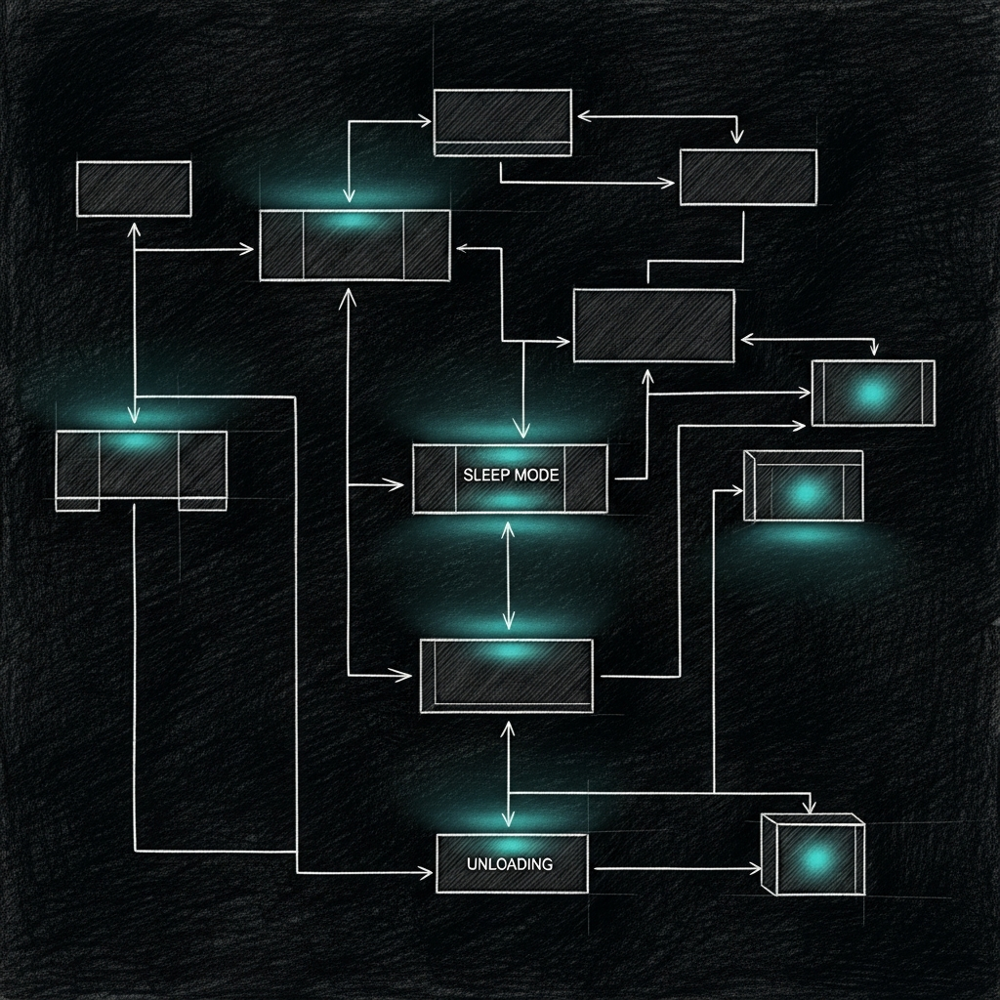

import { Aside, Card, CardGrid, Steps, Tabs, TabItem } from '@astrojs/starlight/components';

When you run a 31-Billion parameter council model alongside a 14-Billion parameter infrastructure coder, you don't have the luxury of memory leaks. Initially, we used three separate Python scripts to monitor memory, pause Docker, and unload idle models. It technically worked, but using an interpreted language to protect a system from memory exhaustion is like hiring an arsonist as a fire marshal. Python itself was part of the problem.

So we rewrote the entire triage suite in Rust.

## How It Works

`sanctum-triage` is a single native Rust binary running as `com.sanctum.triage.plist`. It uses the `tokio` asynchronous runtime to manage three concurrent operational loops, communicating directly with the macOS kernel via `sysinfo`.

<Steps>
1. **The Triage Loop** — Every 30 seconds, it evaluates the `kern.memorystatus_level` and Swap usage.
2. **The Docker Sleeper** — Every 5 minutes, it checks `docker inspect` for idle containers and halts them.
3. **The MLX Idle Manager** — A TCP proxy on `10.10.10.1:1337` that spawns the 31B Council model on demand and kills it after 5 minutes of silence.
</Steps>

## Memory Thresholds

The triage loop operates on a strict multi-tier escalation policy. If the Mac Mini crosses these thresholds, the daemon takes action to preserve core stability.

### Level 1: Apple Bloat Purge
**Trigger:** Free RAM < 30% OR Swap > 15GB

The daemon quietly terminates non-essential Apple background services (Hydra, Siri, Apple Intelligence components). This is the gentle nudge to macOS to stop hoarding RAM for features we aren't using.

### Level 2: Heavy Model Unload
**Trigger:** Free RAM < 20% OR Swap > 20GB

The daemon interacts with the LM Studio HTTP API to aggressively unload massive local models (35B+ parameters). It also terminates lower-priority Sanctum services to reclaim memory.

### Level 3: Emergency Purge
**Trigger:** Free RAM < 10% OR Swap > 30GB

When the system is actively drowning, the daemon triggers a `sudo purge` to flush disk caches. 

<Aside type="note">
**The Mail App Exemption**
In earlier versions, the emergency purge included `killall Mail`. This caused unnecessary friction when the 31B model was loaded. We explicitly raised the swap threshold to 30GB and removed the Mail app from the kill list. Your inbox is safe.
</Aside>

## The MLX Idle Manager

The most significant performance gain in the Rust rewrite was embedding the idle manager directly into the daemon as an asynchronous TCP proxy.

Instead of keeping the massive `Gemma-4-31B` model loaded in RAM 24/7, the Rust proxy binds to `10.10.10.1:1337`. When the Council initiates a connection, the daemon instantly spawns the `mlx_lm.server` process, proxies the bytes transparently to an internal port, and monitors the traffic.

If the socket sees no data for 300 seconds, `sanctum-triage` issues a `SIGKILL` to the MLX server, instantly returning ~20GB of Unified Memory back to the OS.

## Why Rust?

The previous Python implementation required spinning up interpreter threads, pulling in `psutil`, and occasionally leaking memory while trying to prevent memory leaks. The Rust binary compiles down to a few megabytes, consumes virtually zero CPU while sleeping, and guarantees memory safety. 

In the Sanctum architecture, any process that decides whether other processes get to live must be native, deterministic, and infallible. Rust was the only option.
