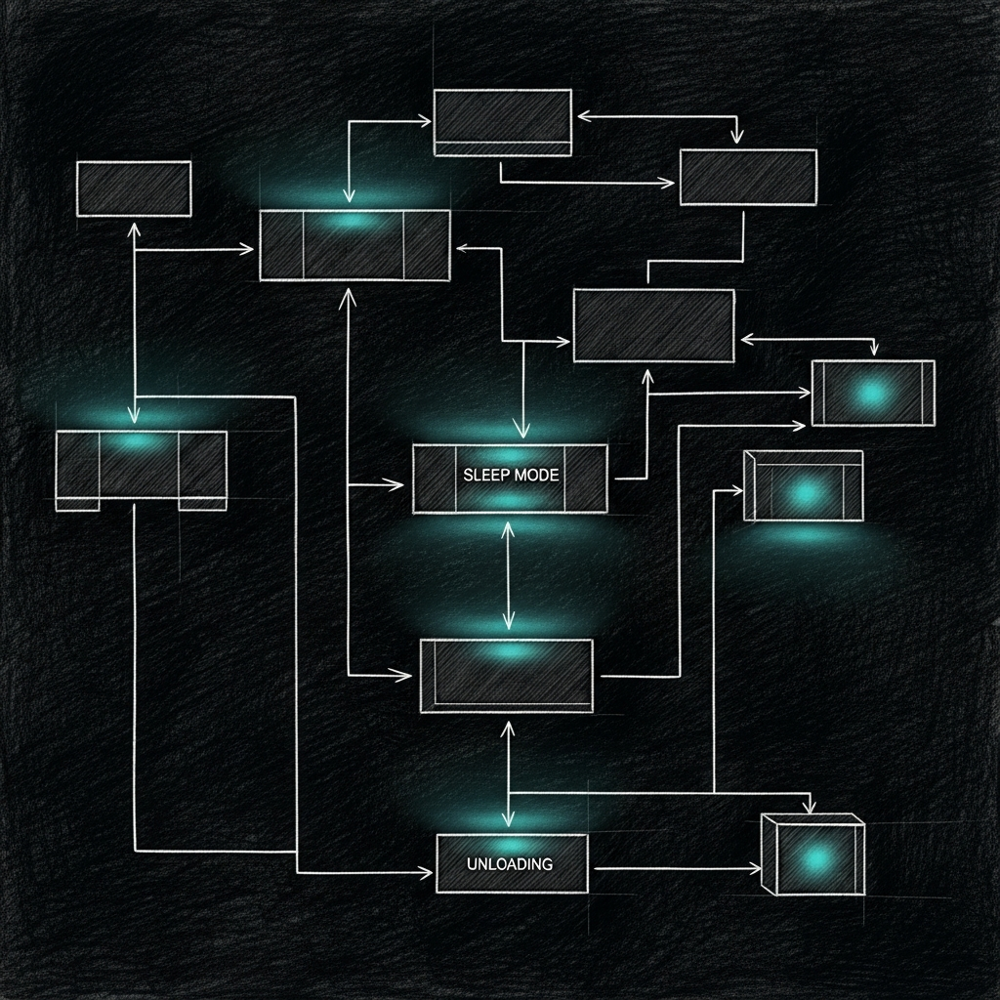

import { Aside, Card, CardGrid, Steps, Tabs, TabItem } from '@astrojs/starlight/components';

When you run a 35B-parameter council model (Qwen3.6-35B-A3B) alongside a Devstral-Small-2-24B coder seat, you don't have the luxury of memory leaks. Initially, we used three separate Python scripts to monitor memory, pause Docker, and unload idle models. It technically worked, but using an interpreted language to protect a system from memory exhaustion is like hiring an arsonist as a fire marshal. Python itself was part of the problem.

So we rewrote the entire triage suite in Rust.

## How It Works

`sanctum-triage` is a single native Rust binary running as `com.sanctum.triage`. It uses the `tokio` asynchronous runtime to `join!` two concurrent operational loops, reading memory state through the `sysinfo` crate.

<Steps>
1. **The Triage Loop** — Every 30 seconds, it evaluates available-vs-total RAM as a percentage (via `sysinfo`) and swap usage, then escalates through the tiers below.
2. **The Docker Sleeper** — Every 5 minutes, it checks `docker inspect` for idle containers and halts them.
</Steps>

A third loop — the MLX Idle Manager — was the original design but was retired on 2026-04-23; see [The MLX Idle Manager](#the-mlx-idle-manager) for what replaced it.

## Memory Thresholds

The triage loop operates on a strict multi-tier escalation policy. If the Mac Mini crosses these thresholds, the daemon takes action to preserve core stability.

### Level 1: Apple Bloat Purge
**Trigger:** Free RAM &lt; 30% OR Swap &gt; 15GB

The daemon quietly terminates non-essential Apple background services (Hydra, Siri, Apple Intelligence components). This is the gentle nudge to macOS to stop hoarding RAM for features we aren't using.

### Level 2: Heavy Model Unload
**Trigger:** Free RAM &lt; 20% OR Swap &gt; 20GB

The daemon sorts the evictable services by priority and SIGTERMs the lowest-priority listener it can spare, stopping the moment free RAM climbs back over 25%. It deliberately does **not** touch `sanctum-mlx`: the heavy 35B council seat is Cilghal-immutable, so the daemon leaves the inference servers alone and frees memory from everything around them.

The real pressure-arbiter for the heavy seat is `castellan` (the capacity-doctrine controller on `:2189`, inheriting the surface from the retired `sanctum-admit`). It owns the SIGSTOP / SIGCONT side and refuses to stop any Cilghal-immutable service; `castellan-deadman` SIGCONTs every stopped PID if castellan's heartbeat ever goes stale. sanctum-triage does not yet call castellan's admission protocol — coordinating the two is tracked work, not shipped behaviour.

<Aside type="caution">
**The LM Studio ghost call**
Before the cathedral cutover, Level 2 also POSTed the LM Studio HTTP API to unload models. That call is still in the binary, still firing at every HIGH PRESSURE — but LM Studio is retired and nothing listens on `:1234`, so it times out into the void. A dead branch protecting a dead server. It needs deleting.
</Aside>

### Level 3: Emergency Purge
**Trigger:** Free RAM &lt; 10% OR Swap &gt; 30GB

When the system is actively drowning, the daemon logs `CRITICAL ... would purge (disabled)` — and stops there. The `sudo purge` itself was disabled on 2026-04-23: under real memory pressure it froze the Mini for 30-plus seconds, dropped SSH and Tailscale, and made recovery harder than the problem it was meant to solve. The threshold still fires and still alarms; re-enabling the purge would route through Force Flow so a human authorises the freeze. Automatic is unacceptable.

<Aside type="note">
**The Mail App Exemption**
In earlier versions, the emergency purge included `killall Mail`. This caused unnecessary friction when the 35B model was loaded. We explicitly raised the swap threshold to 30GB and removed the Mail app from the kill list. Your inbox is safe.
</Aside>

## The MLX Idle Manager

The idle-manager pattern (an async TCP proxy that spawns the inference process on demand, kills it after N seconds of socket silence) was the original Rust-rewrite design. Production has since superseded it with the **cathedral fork's KeepAlive model**: `sanctum-mlx` (Council, `:1337`, mTLS) and `com.sanctum.mlx-devstral-rust` (the Devstral-Small-2-24B coder seat, `:3301`) stay resident, Metal-cache caps bound their resident set, and `castellan` handles real OOM pressure with SIGSTOP-then-resume — never SIGKILL on the inference servers, because SIGKILL would corrupt the KV cache. `sanctum-mlx` is even flagged Cilghal-immutable, so castellan refuses to stop it at all and frees memory from its neighbours instead. (The standalone pressure-valve daemon that used to own this was retired 2026-05-29 when castellan absorbed the role; the original coder seat `sanctum-mlx-coder` on `:1338` was retired 2026-06-07 and the port is now free.)

The idle-spawn-and-kill flow remains in `sanctum-idle` (vendored in `sanctum-rs/services/sanctum-idle/`) as a reference implementation for future low-traffic models. For the current production workload, paying the ~60 s Metal-cold-start tax on every cold inference dwarfs the memory savings.

## Why Rust?

The previous Python implementation required spinning up interpreter threads, pulling in `psutil`, and occasionally leaking memory while trying to prevent memory leaks. The Rust binary compiles down to a few megabytes, consumes virtually zero CPU while sleeping, and guarantees memory safety. 

In the Sanctum architecture, any process that decides whether other processes get to live must be native, deterministic, and infallible. Rust was the only option.
