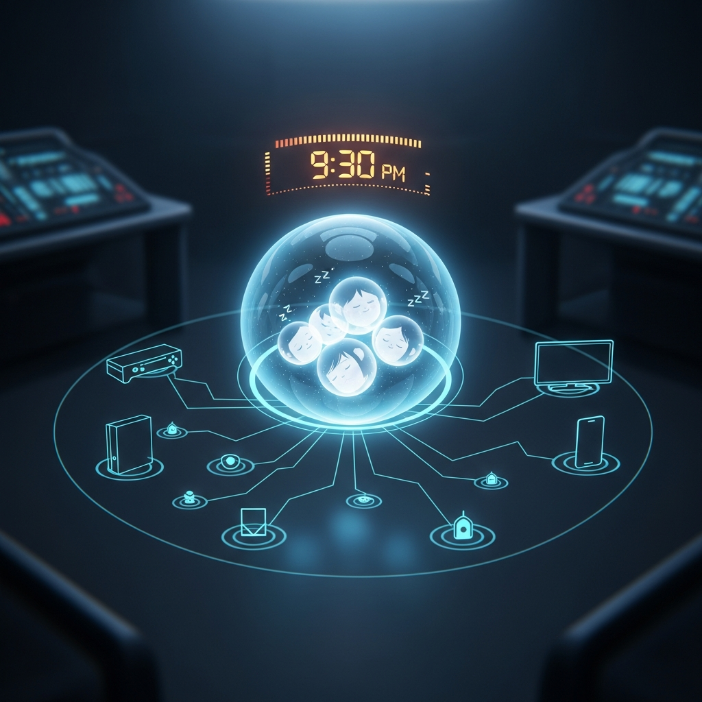
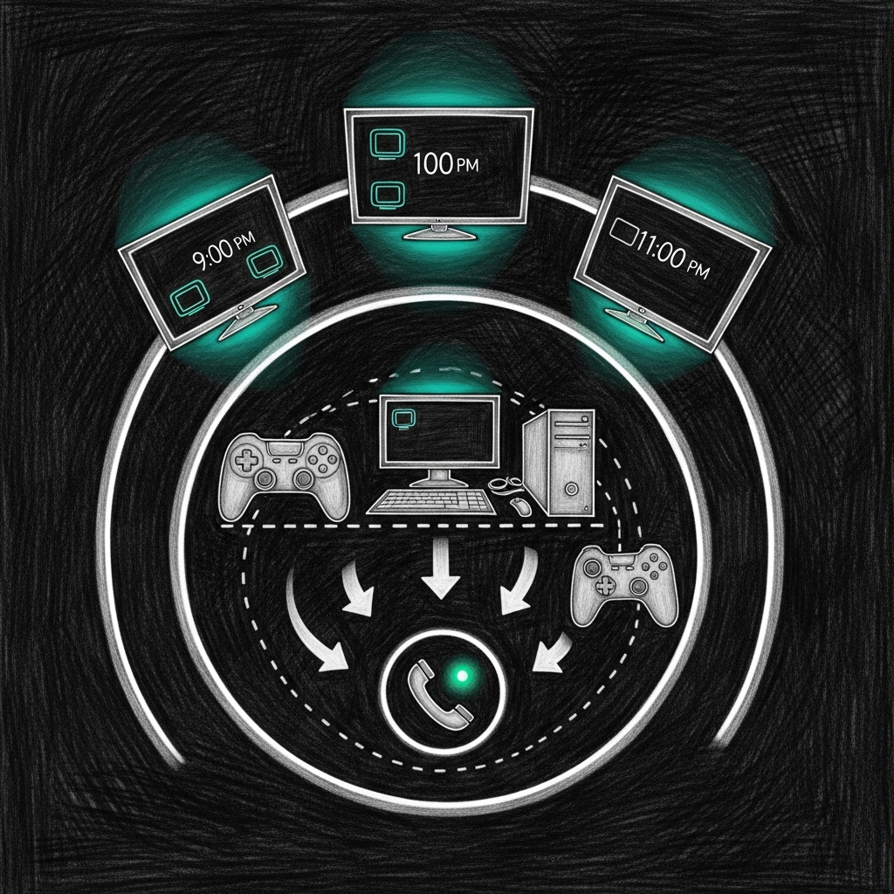

import { Aside } from '@astrojs/starlight/components';



Every parental control app on the market assumes you can install something on the device you want to control. That assumption is wrong roughly four times: the PS5, the Apple TV, the grandmother's iPad, and whatever Android tablet your kid's friend brought over for a sleepover. MDM profiles are invasive, device-specific, and one factory reset away from irrelevant.

Screen Time takes a different approach. It runs inside [Force Flow](/architecture/force-flow/) on port 4077 and enforces curfews at the network level via Firewalla. No agent on the device. No MDM profile. No app to uninstall. If it has a MAC address and it's on your WiFi, it follows the rules of the haus.

The key insight that makes this work: **phone presence equals consciousness**. If Albert's iPhone is on WiFi, Albert is awake. If the phone drops off for 10 minutes, Albert is in bed. This one heuristic drives the entire shared-device enforcement model. It is not sophisticated. It is correct roughly 98% of the time, which is better than asking a 12-year-old to self-report.

## Enforcement Model



Three tiers, because not every screen is the same screen.

### Tier 1: Personal Apple Devices

**Not blocked.** Apple's built-in Screen Time handles Albert's iPhone and iPad. Doubling up with network-level blocking would create conflicts and confuse the device-level reporting that Andreanne actually checks. Leave Apple to Apple.

### Tier 2: Shared Gaming Devices

**Presence-based blocking.** The PS5, VRVANA-PC, and shared consoles are blocked when Albert's phone is detected on WiFi past curfew. Once his phone has been off the network for 10 minutes, the system assumes he's in bed and unblocks the devices -- so Bert and Andreanne can use them without filing a support ticket with their own haus.

### Tier 3: Screens (TVs and PCs)

**Hard curfew.** Apple TVs and the main PC get a fixed cutoff. But the Apple TV in the living room doubles as the HomeKit hub, so this tier uses service-level blocking: Netflix, YouTube, Disney+ get blocked. Bell Fibe TV and HomeKit traffic are preserved. The haus doesn't stop being smart just because it's bedtime.

<Aside type="caution">
Service-level blocking depends on Firewalla's domain-group rules. If Netflix rotates CDN domains faster than the block list updates, you'll get brief windows of access. This is a known tradeoff of not running a full proxy. In practice, a 12-year-old navigating CDN rotation at 11 PM deserves the access.
</Aside>

## Schedule Intelligence

Three schedule tiers, resolved in priority order by `_get_effective_schedule()`:

| Priority | Schedule | Curfew | Source |
|----------|----------|--------|--------|
| 1 (highest) | Quebec school holiday | 23:00 | `holidays.yaml` |
| 2 | Weekend (Fri/Sat night) | 23:00 | Day-of-week check |
| 3 (default) | Weekday | 21:30 | Default config |

Holiday detection uses a curated `holidays.yaml` with Quebec school calendar dates -- semaine de relache, Noel, summer break. The file is maintained manually because Quebec's school calendar is published as a PDF, which is exactly the kind of government decision this system was built to route around.

<Aside type="tip">
Weekend detection: Friday is `weekday() == 4`, Saturday is `weekday() == 5`. Sunday night is a weekday night. This matches "the night before a school day" logic, not calendar weekends. If Albert is arguing that Sunday is technically the weekend, he is technically correct and operationally irrelevant.
</Aside>

## Gradual Wind-Down

Curfew isn't a cliff -- it's a slope. Three phases, each with a French Sonos announcement:

| Offset | Action | Sonos Message |
|--------|--------|---------------|
| -30 min | Social media blocked (TikTok, Instagram, Snapchat, YouTube) | "Albert, les reseaux sociaux sont fermes. 30 minutes avant le couvre-feu." |
| -15 min | Gaming blocked (Steam, PSN, Xbox Live, Epic) | "Albert, les jeux sont fermes. 15 minutes." |
| 0 min | Everything blocked (full curfew) | "Couvre-feu. Bonne nuit." |

The `service_categories` config in `devices.yaml` defines which domains belong to which category. Adding a new service is one YAML entry, not a code change.

## Smart Features

### Homework Mode

`POST /screen/homework` activates a focused mode: gaming, social media, and streaming are blocked. Educational sites, Google Workspace, and reference tools remain open. Triggered manually via PWA, Siri shortcut, or Home Assistant. Deactivates automatically after 2 hours or via `DELETE /screen/homework`.

### Earned Credits

Albert can earn screen time extensions by doing real things in the real world:

| Preset | Duration | Description |
|--------|----------|-------------|
| `chores` | 30 min | Haus tasks verified by parent |
| `devoirs` | 30 min | Homework completion |
| `lecture` | 30 min | Reading (physical book, not a screen) |
| `exercise` | 30 min | Physical activity |

Credits are capped at **90 minutes per day**. They accumulate via `POST /screen/credit` and are consumed via `POST /screen/credit/redeem`. Unused credits do not roll over. This is a parental control system, not a loyalty program.

### Guest Device Handling

New devices on the network are auto-discovered via ARP scanning and classified by OUI (manufacturer) lookup. Unknown devices get haus rules applied immediately. Parents approve or remove guests via the PWA. Guest permissions expire after 24 hours.

MAC randomization detection: if a device with a locally-administered MAC bit appears and no known device has disconnected, it's flagged as a potential randomized address. Not bulletproof, but it catches the obvious cases.

### Weekly Digest

Every **Sunday at 6 PM**, a digest is sent via Signal and push notification. Contents: average bedtime for the week, number of overrides, credits earned and redeemed, any guest device activity. It's the parental equivalent of a sprint retrospective, except the sprint is "did the 12-year-old go to bed on time."

## Interfaces

Screen Time exposes four interfaces because every family member interacts with the haus differently.

### PWA (http://force.home/pwa/)

Progressive Web App served directly from Force Flow. iOS standalone mode (Add to Home Screen), dark OLED theme, French UI. All features accessible: override, homework mode, credits, guest management, schedule view. Resolves via local DNS -- no Tailscale required when home.

### Home Assistant

Full integration in `packages/screen_time.yaml`:
- **REST commands** for all actions (override, homework, credit)
- **Sensors** for curfew state, active blocks, phone presence
- **Lovelace card** with current status, quick actions, schedule display
- **Automations** for wind-down triggers and Sonos announcements

### iOS Shortcuts (6 Siri Shortcuts)

| Shortcut | Action |
|----------|--------|
| "Mode devoirs" | Activate homework mode |
| "Fin devoirs" | Deactivate homework mode |
| "Credit corvees" | Grant chores credit |
| "Credit lecture" | Grant reading credit |
| "Prolonger 30 min" | 30-minute curfew extension |
| "Couvre-feu maintenant" | Immediate full curfew |

All shortcuts route through Tailscale to `http://100.0.0.25:4077`. French invocations. Works from any family member's iPhone via "Hey Siri."

### Holocron Panel

Native React component in the-holocron Electron app. Glass-morphism card with Framer Motion transitions. Moon icon in the nav bar. Displays: curfew countdown ring, phone presence indicator, quick action buttons, weekly schedule, per-screen status. Designed to match the Holocron's existing dark aesthetic without looking like a corporate parental control dashboard.

## API Reference

All endpoints on port 4077 under the `/screen` prefix.

| Method | Path | Description |
|--------|------|-------------|
| GET | `/screen/status` | Current curfew state, active blocks, phone presence |
| POST | `/screen/override` | Temporary curfew override (duration in minutes) |
| POST | `/screen/block` | Manually block a device by MAC |
| POST | `/screen/unblock` | Manually unblock a device by MAC |
| GET | `/screen/report` | Usage report (daily/weekly/custom range) |
| GET | `/screen/devices` | All known devices and their current state |
| POST | `/screen/assign` | Assign a device to a family member |
| POST | `/screen/reload` | Reload config from devices.yaml |
| GET | `/screen/schedule` | Current effective schedule and next transition |
| POST | `/screen/homework` | Activate homework mode |
| GET | `/screen/homework/status` | Homework mode state and remaining time |
| DELETE | `/screen/homework` | Deactivate homework mode |
| POST | `/screen/credit` | Grant earned credit (preset + optional note) |
| GET | `/screen/credits` | Credit balance and history for today |
| POST | `/screen/credit/redeem` | Redeem accumulated credits |
| GET | `/screen/digest` | Generate digest on demand (also sent weekly) |
| GET | `/screen/guests` | List detected guest devices |
| POST | `/screen/guest/approve` | Approve a guest device |
| DELETE | `/screen/guest/remove` | Remove a guest device |
| GET | `/pwa/` | PWA index |
| GET | `/pwa/{filename}` | PWA static assets |
| GET | `/pwa/manifest.json` | PWA manifest |
| GET | `/pwa/sw.js` | PWA service worker |

<Aside type="note">
All mutation endpoints require the `X-Screen-Token` header. The token lives in `devices.yaml` under `api_token`. This is not OAuth. This is a family in Quebec. The threat model is a 12-year-old with curl, not a nation-state.
</Aside>

## Configuration

The entire system is driven by `~/.sanctum/screen-time/devices.yaml`:

```yaml
family:
  - name: Albert
    role: child
    phone_mac: "FA:CE:DE:CA:CA:01"      # Presence detection anchor
    curfew_enabled: true

  - name: Bert
    role: parent
    phone_mac: "FA:CE:DE:CA:CA:02"

  - name: Andreanne
    role: parent
    phone_mac: "FA:CE:DE:CA:CA:03"

  - name: Lise Phenix
    role: grandparent
    phone_mac: "FA:CE:DE:CA:CA:04"
    curfew_enabled: false                 # Grand-maman goes to bed when she wants

shared_devices:
  - name: PS5
    mac: "FA:CE:DE:CA:CA:10"
    tier: gaming                          # Presence-based blocking
    bound_to: Albert

  - name: VRVANA-PC
    mac: "FA:CE:DE:CA:CA:11"
    tier: gaming
    bound_to: Albert

screens:
  - name: Living Room Apple TV
    mac: "FA:CE:DE:CA:CA:20"
    tier: screen
    is_homekit_hub: true                  # Service-mode: block streaming, keep HomeKit
    hard_curfew: "22:00"

service_categories:
  social:
    - tiktok.com
    - instagram.com
    - snapchat.com
    - youtube.com
  gaming:
    - store.steampowered.com
    - playstation.net
    - xboxlive.com
    - epicgames.com
  streaming:
    - netflix.com
    - disneyplus.com
    - primevideo.com

credits:
  presets:
    chores: 30
    devoirs: 30
    lecture: 30
    exercise: 30
  daily_cap_minutes: 90
  rollover: false

guest_rules:
  auto_apply_house_rules: true
  require_parent_approval: true
  expiry_hours: 24

api_token: "redacted-but-you-get-the-idea"
```

## Troubleshooting

### "Device didn't block"

Two blocking modes exist and they fail differently:

- **Soft pause** (service-level): Firewalla domain-group rules. Check that the domain list in `service_categories` is current. Some services use CDN domains that rotate. `nslookup` from the device to verify what it's resolving.
- **Hard block** (MAC-level): Direct Firewalla device quarantine. If this fails, the Firewalla API token may have expired, or the device MAC changed (see: MAC randomization). Check `~/.sanctum/screen-time/usage.db` for the last known MAC.

### "URL doesn't resolve" (force.home)

Three DNS layers in the haus, and they don't always agree:

| Layer | Resolver | Where it applies |
|-------|----------|-----------------|
| Firewalla DNS | Network-wide | All devices on WiFi |
| Tailscale MagicDNS | Tailnet only | Devices with Tailscale installed |
| `/etc/hosts` | Per-machine | Mac Mini, dev machines |

If `force.home` works on the Mac but not on an iPhone, the Firewalla DNS override for `force.home` is missing. Add it via Firewalla app > DNS > Local DNS Records.

### "Wrong schedule applied"

Check in this order:

1. **Holiday calendar**: `holidays.yaml` might have a stale entry or missing date. Holidays take highest priority -- if today is flagged as a holiday, weekend/weekday logic is irrelevant.
2. **Weekend detection**: Remember, Friday night (`weekday() == 4`) and Saturday night (`weekday() == 5`) are weekends. Sunday night is a school night. The code uses the night-of, not the next-morning calendar day.
3. **Manual override**: An active override (via PWA or API) supersedes all schedule logic. Check `GET /screen/status` for `override_active: true`.

## Architecture Decisions

### Why Python, Not Rust

Screen Time is a control plane, not a data plane. It makes one API call to Firewalla every few minutes to toggle a rule. It does not process packets, route traffic, or handle any load that would justify the compilation overhead of Rust. The [sanctum-proxy](/architecture/proxy/) is Rust because it handles thousands of requests per second. Screen Time handles dozens of requests per day. Python with a 1700-line module inside Force Flow is the right tool.

### Why Not Apple MDM

MDM (Mobile Device Management) is the "enterprise" answer to parental controls. It's also:

- **Invasive**: Full device management profile. Visible to the child. Creates an adversarial dynamic.
- **Platform-locked**: Doesn't touch the PS5, the PC, or grandma's Android tablet.
- **Fragile**: One "Remove Profile" tap and it's gone. Network-level enforcement has no uninstall button.
- **Overkill**: We need bedtime enforcement and homework mode, not remote wipe and app whitelisting.

Apple Screen Time on personal devices + Firewalla at the network layer covers every device in the haus without installing anything on any of them. The only software that runs is on the Mac Mini, which is the one machine in the building that no 12-year-old has the SSH key to.

<Aside type="tip">
The entire Screen Time engine is one file: `~/.sanctum/force-flow/screen_time.py` (1715 lines). Config at `~/.sanctum/screen-time/devices.yaml`. Database at `~/.sanctum/screen-time/usage.db`. If you're debugging, that's three files. Not a microservice mesh. Three files.
</Aside>

## Service Details

| Property | Value |
|----------|-------|
| Port | 4077 (shared with Force Flow) |
| Engine | `~/.sanctum/force-flow/screen_time.py` |
| Config | `~/.sanctum/screen-time/devices.yaml` |
| Holidays | `~/.sanctum/screen-time/holidays.yaml` |
| Database | `~/.sanctum/screen-time/usage.db` |
| PWA | `~/.sanctum/screen-time/pwa/` |
| HA Package | `~/.openclaw/homeassistant/packages/screen_time.yaml` |
| Holocron | `~/Projects/the-holocron/src/renderer/components/ScreenTimePanel.tsx` |
| Digest | Sunday 18:00 via Signal + push |
