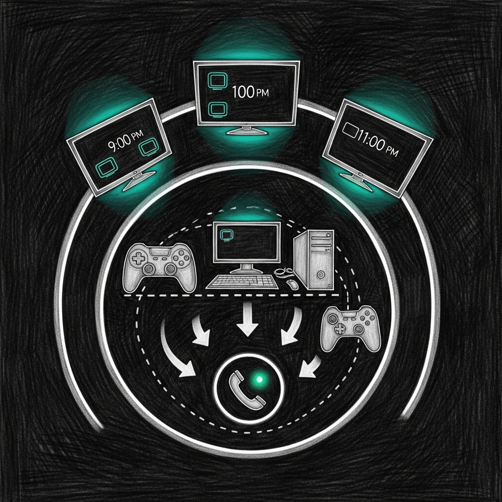

import { Aside } from '@astrojs/starlight/components';


Every parental control app assumes you can install something on the device you want to control. Kids uninstall things. That assumption fails at the PS5, the Apple TV, the grandmother's iPad, and whatever tablet a sleepover guest brought. Haus-control runs inside [Force Flow](/architecture/force-flow/) on port 4077 and starts from the opposite premise: **the network is the only authority that can't be uninstalled**. If a MAC address exists on the haus WiFi, Firewalla can pause it or block services on it.

v4 keeps that premise and adds what it was missing: an explicit ladder for the screens the network can't fully see, holds that cannot outlive their author's memory, and budgets that follow the child instead of the device.

## The v4 Enforcement Ladder



Three rungs, chosen per screen by one rule: the cheapest layer that actually reaches it.

| Rung | Reaches | Mechanism | Confirmed by |
|------|---------|-----------|--------------|
| **Network** | anything with a MAC on the haus WiFi | Firewalla pause / service-level DNS blocks | Firewalla policy read-back |
| **Mirror** | platform accounts that travel off the WiFi (iOS, Switch, Xbox/PS, Steam, Quest) | platform-native parental controls, kept in step via the mirror pages | manual re-check, on a cadence |
| **Agent** | Windows PCs | Rust agent, server-authoritative clock | agent heartbeat |

Network first, because it has no uninstall button. Mirrors where the device leaves the haus: each mirror page ([Apple iOS](/parents-guide/mirrors/apple-ios/), [Nintendo Switch](/parents-guide/mirrors/nintendo-switch/), [Xbox & PlayStation](/parents-guide/mirrors/xbox-playstation/), [Steam](/parents-guide/mirrors/steam/), [Meta Quest](/parents-guide/mirrors/meta-quest/)) walks the platform's own steps under the platform's own titles, and every one ends with the same stale-mirror paragraph — a mirror nobody re-checks stops being enforcement and becomes surveillance. The agent rung exists for exactly one platform, covered below.

### The network rung: three tiers

| Tier | Policy | Why |
|------|--------|-----|
| 1 — personal Apple devices | **Not blocked.** Apple Screen Time handles them, kept honest via the iOS mirror page | doubling up with network blocks confuses the reporting a parent actually checks — leave Apple to Apple |
| 2 — shared gaming consoles | **Hard curfew** at the earliest active child curfew, unblock at wake | phone-presence gating was tried and retired: a charging phone kept the PS5 blocked all night, airplane mode unblocked everything; presence now feeds the weekly digest, not enforcement |
| 3 — screens (TVs, PCs) | **Hard curfew with service precision** — per-screen schedules, `mode: services` where needed | the HomeKit-hub Apple TV blocks streaming while HomeKit and Bell Fibe stay alive |

The haus doesn't stop being smart just because it's bedtime.

## Holds With Mandatory Expiry

v3 shipped a landmine: a manual Block Now was sticky. It survived engine restarts and quietly suppressed the morning wake-unblock; one child's PC stayed dark for two days before anyone connected the dead machine to a button pressed the week before. v4 retires the class, not just the bug. Every hold is a *(who, until)* pair:

| Rule | v4 behavior |
|------|-------------|
| Manual block | expires at next wake by default — nothing blocks forever |
| Pause | requires a **who** and a **duration**; maximum is *jusqu'au réveil* (that child's wake time, never past it) |
| Override | capped at 120 minutes |
| Every hold | displays its owner and its expiry, in the PWA and the Holocron panel alike |

The most dangerous state in a parental-control system is the one nobody remembers creating.

## Per-Child Budgets

New in v4: time budgets metered at the network, by category, summed **per child across every device**. Ninety minutes of YouTube is ninety minutes whether it arrived through the iPad, the TV, or the PC. This is the whitespace the whole market leaves open:

| Product | Budget unit |
|---------|-------------|
| Google Family Link | per-device |
| Nintendo parental controls | per-console |
| Firewalla, native | no budgets at all |
| Haus-control v4 | per-child, across all devices |

Budgets ship in **shadow mode** — log-only until a parent arms them, so the family sees a week of honest numbers before anything enforces. The industry meters the thing instead of the child because things are easier to count; the children worked out the difference years ago and simply rotate devices. Parent walkthrough: [Budgets](/parents-guide/budgets/).

## Honest Enforcement

A block is not a block until the box confirms it. Every action closes the loop: haus-control reads the policy back from Firewalla, and on failure the UI shows **red — never a fake green** inferred from a 200 response. The doctrine was paid for: [the closed-loop edition](/operations/screen-time-enforcement/) documents the nights the engine logged `BLOCKED` while an Apple TV streamed Netflix. A system that lies about doing its job is worse than none, because it also spends your credibility at breakfast.

Identity for that loop is the **MAC**, not the Firewalla display name. Renaming a screen (or a phone) only updates labels and aliases — it cannot drop a device out of curfew. The full identity ladder (rotation, pins, unknown-during-curfew, rename aliases) lives under [Device Identity](/operations/device-identity/).

## The Windows Agent

The one rung that needs software on the device is the platform that gives parents the least: a Windows gaming PC. The v4 agent is a small Rust binary with two commitments. A **server-authoritative clock**: the schedule's time comes from manoir, not the machine, because rolling the local clock back is the oldest trick on the platform. And a **24-hour fail-safe**: lose the server for a full day and the agent stands down rather than keep enforcing stale rules — a rule enforced past its author's intent is the sticky-block bug in a trench coat. The local clock belongs to the child; bedtime does not.

## Schedule Intelligence

Four schedule tiers, resolved in priority order by `_get_effective_schedule()`:

| Priority | Schedule | Curfew | Wake | Source |
|----------|----------|--------|------|--------|
| 1 (highest) | Study mode | 21:00 | 07:00 | Operator opt-in, expires `study_mode.until` |
| 2 | Quebec school holiday | 23:00 | 09:00 | `holidays.yaml` |
| 3 | Weekend (Fri/Sat night) | 23:00 | 09:00 | Day-of-week check |
| 4 (default) | Weekday | 21:30 | 07:00 | Default config |

Study mode outranks holiday and weekend — a Friday night during finals is still a 9 PM Friday night — and expires on its own date. The holiday file is hand-maintained because Quebec publishes its school calendar as a PDF, exactly the kind of government decision this system was built to route around. Sunday is a school night; kids arguing it's technically the weekend are technically correct and operationally irrelevant.

## Gradual Wind-Down

Curfew is a slope, not a cliff:

| Offset | Action |
|--------|--------|
| -30 min | Social media blocked (TikTok, Instagram, Snapchat, Discord, Reddit) |
| -15 min | Gaming blocked (Steam, Epic, Roblox, Minecraft, Fortnite) |
| 0 min | Everything blocked (full curfew) |

Wind-down blocks are batch-cleaned at wake — no orphaned DNS rules. On QoS-capable boxes the last 30 minutes throttle to 1 Mbit: YouTube buffers into oblivion, iMessage still works, and the kid *chooses* to stop — the whole point. The throttle lifts on override and ships off by default: throttling a child's internet is a parent's decision, not a vendor default.

## Smart Features

**Homework mode** (`POST /screen/homework`) blocks gaming, social, and streaming — block-list-only, no allowlist to maintain — and self-deactivates after 2 hours. **Guest devices** are auto-discovered via ARP, get haus rules immediately, and expire after 24 hours. The **weekly digest** (Sunday 18:00, Signal + push) names names: average bedtime, overrides, credits, and a per-kid top-3 app line from the box's app tracker.

**Earned credits** let a kid buy screen time with the real world:

| Preset | Duration |
|--------|----------|
| Tâches ménagères | 15 min |
| Devoirs | 30 min |
| Lecture | 20 min |
| Exercice | 15 min |

Presets are French because the family is; homework pays more than chores because the incentives should. Credits cap at 90 minutes per day and don't roll over. This is a parental control system, not a loyalty program.

## Enforcement Resilience

Four layers, each bought with an incident:

| Layer | Defense | The incident that bought it |
|-------|---------|-----------------------------|
| 1 | Persisted block state (SQLite) | a 3 AM restart forgot the morning unblock |
| 2 | SSH iptables fallback | the box API returned "invalid policy" for every rule ID |
| 3 | Daily idempotent safety-net unblock | lost state, now caught within 30 seconds |
| 4 | Closed-loop reconciler + conf-gen sentinel: tri-state policy read-back, fail-closed escalation after a 20-minute grace, fresh-MAC canary with an mtime guard | the box wedged silently while the engine logged success |

The full narrative — including the iCloud-Private-Address multi-MAC trap that made one partial failure cost 2.5 hours of Netflix — lives in [the closed-loop edition](/operations/screen-time-enforcement/) and the vault runbook `firewalla-confgen-wedge.md`.

## Interfaces

| Interface | Details |
|-----------|---------|
| PWA | `http://force.home/pwa/` — iOS standalone, dark OLED theme, French UI |
| Home Assistant | `packages/screen_time.yaml` — REST commands, sensors, homework toggle sync |
| Siri shortcuts | 6 French invocations ("Mode devoirs", "Prolonger 30 min", "Couvre-feu maintenant"...) via Tailscale MagicDNS |
| Holocron panel | `ScreenTimePanel.tsx` — countdown ring, holds with owner + expiry, quick actions |

Shortcuts route to the MagicDNS name (`http://manoir.local:4077` here), never a `100.0.0.x` literal. A Siri shortcut that 404s at bedtime helps no one.

## API Reference

All endpoints on port 4077 under the `/screen` prefix.

| Method | Path | Description |
|--------|------|-------------|
| GET | `/screen/status` | Current curfew state, active holds (owner + expiry), presence |
| POST | `/screen/override` | Temporary override (duration in minutes, cap 120) |
| POST | `/screen/block` | Manual block by MAC — expires at next wake by default |
| POST | `/screen/unblock` | Manual unblock by MAC |
| GET | `/screen/report` | Usage report (daily/weekly/custom range) |
| GET | `/screen/devices` | All known devices and their current state |
| POST | `/screen/assign` | Assign a device to a family member |
| POST | `/screen/reload` | Reload config from devices.yaml |
| GET | `/screen/schedule` | Current effective schedule and next transition |
| POST | `/screen/homework` | Activate (`action:start`) or deactivate (`action:stop`) homework mode |
| GET | `/screen/homework/status` | Homework mode state and remaining time |
| POST | `/screen/credit` | Grant earned credit (preset + optional note) |
| GET | `/screen/credits` | Credit balance and history for today |
| POST | `/screen/credit/redeem` | Redeem accumulated credits |
| GET | `/screen/digest` | Generate digest on demand (also sent weekly) |
| GET | `/screen/guests` | List detected guest devices |
| POST | `/screen/guest/approve` | Approve a guest device |
| DELETE | `/screen/guest/remove` | Remove a guest device |
| GET | `/pwa/` | PWA index and static assets |

<Aside type="note">
Every `/screen/*` path — reads included — passes the `screen_auth_guard` middleware: loopback trusted, everyone else carries `Authorization: Bearer <token>` (constant-time compare, sourced from env or `~/.sanctum/secrets/screen-control-token`, never `devices.yaml`). This is not OAuth. This is a family in Quebec. The threat model is a 12-year-old with curl, not a nation-state.
</Aside>

## Configuration

Everything is driven by `~/.sanctum/screen-time/devices.yaml` — name-keyed maps, four-layer schedules, service slugs the bridge resolves to domains:

```yaml
family:
  kid1:
    role: child
    schedule:
      study_mode: { enabled: true, curfew: "21:00", wake: "07:00", until: "2026-06-25" }
      weekday:    { curfew: "21:30", wake: "07:00" }
      weekend:    { curfew: "23:00", wake: "09:00" }
      holiday:    { curfew: "23:00", wake: "09:00" }
    phone_mac: "FA:CE:DE:CA:CA:01"
    winddown:
      enabled: true
      phases:
        - { offset_minutes: -30, block_categories: [social] }
        - { offset_minutes: -15, block_categories: [gaming] }
        - { offset_minutes:   0, block_categories: [all] }
  parent1:
    role: parent
    phone_mac: "FA:CE:DE:CA:CA:02"

shared_devices:
  ps5: { name: "PS5", mac: "FA:CE:DE:CA:CA:10" }

screens:
  first_floor_appletv:
    name: "First Floor Apple TV"
    mode: services                        # block streaming, keep HomeKit alive
    blocked_services: [netflix, youtube, disney, crave, twitch]
    schedule:
      weekday: { curfew: "22:00", wake: "10:00" }
    macs: ["FA:CE:DE:CA:CA:20", "FA:CE:DE:CA:CA:21"]

service_categories:                       # slugs, not domains — bridge maps them
  social:    [tiktok, instagram, snapchat, discord, reddit]
  gaming:    [steam, epicgames, roblox, minecraft, fortnite]
  streaming: [netflix, youtube, disney, crave, twitch]

credits:
  enabled: true
  max_daily_minutes: 90

guest_rules:
  enabled: true
  auto_apply_curfew: true
  curfew: "22:00"
  wake: "07:00"
  expire_hours: 24
```

The control token is **not** in this file — a config the whole family can read is the wrong place for the one secret that gates the API. Parent-facing debugging: [Parents' Guide troubleshooting](/parents-guide/troubleshooting/). Operator-depth failure modes: [the closed-loop edition](/operations/screen-time-enforcement/).

## Architecture Decisions

**Why Python, not Rust.** Haus-control is a control plane, not a data plane: it wakes every 30 seconds to compare intent against the box and toggle a handful of rules. The [sanctum-proxy](/architecture/proxy/) is Rust because it handles thousands of requests per second; haus-control toggles a few rules a minute. The one Rust piece is the Windows agent, because it lives on hostile territory.

**Why not Apple MDM.** Invasive, platform-locked (no PS5, no PC), and one "Remove Profile" tap from irrelevant. Apple Screen Time on personal devices plus Firewalla at the network layer covers every device in the haus without installing anything the kids can find — except one Rust agent on one PC, which is exactly why it doesn't trust the clock it sits next to.

<Aside type="tip">
The engine is one file: `~/.sanctum/force-flow/screen_time.py`. Config, database, and PWA under `~/.sanctum/screen-time/`. The bridge at `~/.openclaw/firewalla-bridge.js`. If you're debugging, that's four files. Not a microservice mesh. Four files.
</Aside>

## Service Details

| Property | Value |
|----------|-------|
| Port | 4077 (shared with Force Flow) |
| Engine | `~/.sanctum/force-flow/screen_time.py` |
| Bridge | `~/.openclaw/firewalla-bridge.js` (port 1984) |
| Config | `~/.sanctum/screen-time/devices.yaml` |
| Holidays | `~/.sanctum/screen-time/holidays.yaml` |
| Database | `~/.sanctum/screen-time/usage.db` |
| PWA | `~/.sanctum/screen-time/pwa/` |
| HA Package | `~/.openclaw/homeassistant/packages/screen_time.yaml` |
| Holocron | `~/Projects/the-holocron/src/renderer/components/ScreenTimePanel.tsx` |
| Export | `~/.sanctum/scripts/firewalla-export.sh` / `firewalla-import.sh` |
| Digest | Sunday 18:00 via Signal + push |

That is the whole system: four files, one box, and a promise that every hold expires. The hard part was never the toggling of DNS rules — it was building something a twelve-year-old respects and a parent trusts, on the same WiFi, at the same 21:30. The network doesn't negotiate. Bedtime, most nights, still tries.
