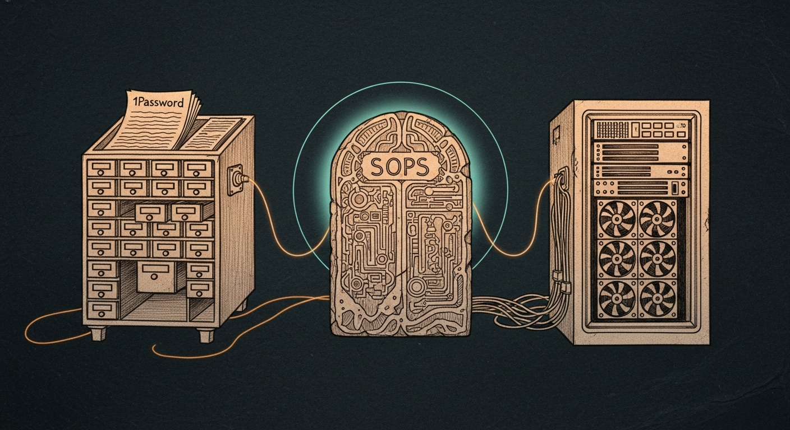

import { Aside, Card, CardGrid } from '@astrojs/starlight/components';



On 2026-04-29 the agents on the VM stopped working. The signs were subtle — `claude-code` claiming the API key was invalid, the Firewalla bridge returning 401 every fourth request — and the silence had been compounding for twenty-four hours. The cause was a `git merge` from the day before that left literal `<<<<<<< HEAD` markers inside the SOPS-encrypted secrets file. Every agent had been failing to load secrets at startup. None of them had a way to say so.

That afternoon we built the Secrets Trifecta. Not a new architecture — a *named* one, with clean rules, a live status indicator, and a small set of automated processes that make the failure mode that bit us impossible to repeat.

## Two Stores Plus One Cache

The trifecta has three layers. Calling them three stores is a useful approximation that turns out to be wrong.

<CardGrid>
  <Card title="1Password Private — Source of Truth" icon="seti:lock">
    The human's daily driver. Touch ID, audit log, search, multi-device. When a provider rotates a key, the new value lands here first. Every other layer is derived from this one. Items are named `Manoir - <Service>` so the catalog stays grep-able.
  </Card>
  <Card title="VM SOPS — Agent-Authoritative Copy" icon="document">
    `~/.openclaw/secrets.enc.yaml` on the airgapped VM. Agents read it once at startup via `sops-start.sh`. They cannot reach 1Password from inside the airgap, so SOPS is not optional for them — it is the runtime surface. Encrypted at rest with an age key whose master copy lives in the Mini's keychain and the 1Password vault.
  </Card>
  <Card title="Mini Keychain — Hot Cache" icon="rocket">
    `~/Library/Keychains/login.keychain-db`, account `sanctum`. Mini-side tools (the openrouter CLI, the domain-ops handler, the Force Flow daemon) read it for speed: a keychain lookup is around forty milliseconds; an `op read` is closer to one second. The Keychain is not a store — it is a derivative cache that auto-rebuilds from 1Password on demand.
  </Card>
</CardGrid>

The reframe matters. Before this design pass, the Mini Keychain felt like a third independent store. The mental load was real: where does the canonical value live? Three places? Which one wins on conflict? Once you accept the keychain as a cache, the answer becomes routine. 1Password wins. The cache rebuilds. The architecture stops humming with anxiety.

## The Daily Flow

```
                ┌─────────────────────┐
                │ 1Password Private   │ ← rotations happen here
                │ (Touch ID + audit)  │   SOURCE OF TRUTH
                └──────────┬──────────┘
                           │ sync.py auto-mirrors
              ┌────────────┴────────────┐
              ▼                         ▼
      ┌──────────────┐          ┌──────────────────┐
      │  VM SOPS     │          │  Mini Keychain   │
      │  (agents)    │          │  (Mini-tool      │
      │              │          │   hot cache)     │
      └──────────────┘          └──────────────────┘
        STORE                     CACHE
```

Two LaunchAgents on the MBP keep this honest:

| Agent | Cadence | Purpose |
|---|---|---|
| `com.sanctum.secrets-sync-drift-check` | Daily 09:30 | Runs `sync.py apply --yes --notify`. Reads 1Password for each cross-tier secret, compares against SOPS and Keychain, writes any drift, posts a Force Flow alert if changes were made or any write failed. Auto-heal, not just auto-detect. |
| `com.sanctum.secrets-doctor` | Every 4h | Runs `doctor.py --notify`. Probes the operational dependencies — Tailscale reach, Aqua-context keychain bridge, VM SOPS readability, 1Password CLI integration — and alerts BEFORE the next sync hits the same wall. Catches operational rot ahead of data drift. |

A SwiftBar plugin in the menu bar shows live status: green when all ten manifest entries are in sync, yellow when a check found drift mid-flux, red when something errored, white when the daily check is more than thirty hours stale. One click reveals the last check timestamp, today's writes, and four actions: run the check now, force a resync, open the audit log, open this handbook.

The user does not need to remember the system exists. That was the whole goal.

## The Manifest

Ten cross-tier entries, declared in `tools/secret-rotator/providers.yaml` under `sync_mirrors`:

| Tier | Count | Examples |
|---|---|---|
| Cross-tier (all three layers) | 7 | anthropic, gemini, openrouter, xai, gateway, firewalla_bridge, cloudflare_tunnel |
| SOPS-only (split format) | 2 | ionos_api_prefix, ionos_api_secret |
| Keychain-only (computed) | 1 | ionos_api_key_combined — concatenated `prefix.secret` for tools that consume IONOS_API_KEY as one env var |

Each entry has a `name`, an `op` field naming the 1Password item title, an optional `sops` key, an optional `kc` keychain service, and an optional `combine` format string when the value is computed from multiple 1Password items. Adding a new cross-tier secret is a YAML edit, not a code change.

## Failure Modes — and Why They Are Routine Now

<CardGrid>
  <Card title="Lost Mini Keychain" icon="warning">
    Severity: low. The cache rebuilds itself on the next sync.py apply. The wrapper at `~/.sanctum/scripts/sanctum-secret` falls back to `op read` if a tool requests a value that is not yet warmed.
  </Card>
  <Card title="Lost SOPS file or age key" icon="warning">
    Severity: high but recoverable. SOPS backups exist as `.bak-sync-*` next to the live file (sync.py writes one before every change). The age key has two backup locations: Mini keychain entry `age-openclaw-key`, and 1Password item `SanctumBridge — age private key (master)`.
  </Card>
  <Card title="Lost 1Password access" icon="warning">
    Severity: high. The runtime keeps working — agents have SOPS, Mini tools have Keychain — until rotations are needed. Recover via 1Password's emergency kit. Do not wipe the vault: its values are still authoritative even when locked out.
  </Card>
  <Card title="Lost Mini hardware entirely" icon="warning">
    Severity: medium. Time Machine restores the keychain. New Mini installs sanctum-secret + age key; sync.py apply rebuilds the keychain from 1Password. The runbook lives in `docs/secrets-handbook.md` for the line-by-line steps.
  </Card>
</CardGrid>

Six scenarios are documented. The worst — losing 1Password and the age key simultaneously — is the only one that requires re-minting credentials at every provider, and the architecture is designed so this requires losing both the Mac's secure-enclave-protected biometric chain and the printed emergency kit at the same time. The design stops short of impossible. It stops well short of casual.

## The Doctrine

Three rules that earn the trifecta its name:

1. **Rotate in 1Password. Always.** No exceptions. Other layers are derived. If you find yourself editing SOPS by hand, stop and rotate in 1Password instead — sync.py will propagate.
2. **Auto-apply silently from the source of truth.** The cron path skips the human prompt. Asking the human to be in a loop they don't need to be in is fear shaped as friction. Interactive `apply` still confirms; the daily plist does not.
3. **Vigilance against the silence of failure.** The doctor probe runs more often than the data sync because operational rot kills before data drift does. The Tailscale auth that quietly expires at 3am should fire a Force Flow alert by 7, not surface as a sync failure at 9:30.

The trifecta is small on purpose. Every secret that passes through it passes through this discipline. Every secret that does not is a secret we have decided is rare enough to handle by hand — and a future cleanup pass will probably absorb most of those into the manifest too.

## Where the Work Continues

The current state is shippable, audited, council-reviewed, and end-to-end tested. The next two improvements are documented but not yet built:

- **Phase 6: extend the manifest to all Mini-only secrets** — the deepgram keys, the SanctumBridge integrations, the Cloudflare account tokens. They're in 1Password and the Keychain today, but synchronized by hand. Cilghal voted for this on 2026-04-29; the cost is mostly tedium, not invention.
- **Phase 7: phased migration toward eliminating the Keychain layer** — Mini tools could read 1Password directly via `op read`. The wrapper at `~/.sanctum/scripts/sanctum-secret` already implements this fallback path. The path is mechanical; the trigger is the moment the Keychain's speed advantage stops outweighing its conceptual cost.

Neither is urgent. The trifecta as built passes the bar set on 2026-04-29: the user does not have to remember it exists. That is the only test that matters.
